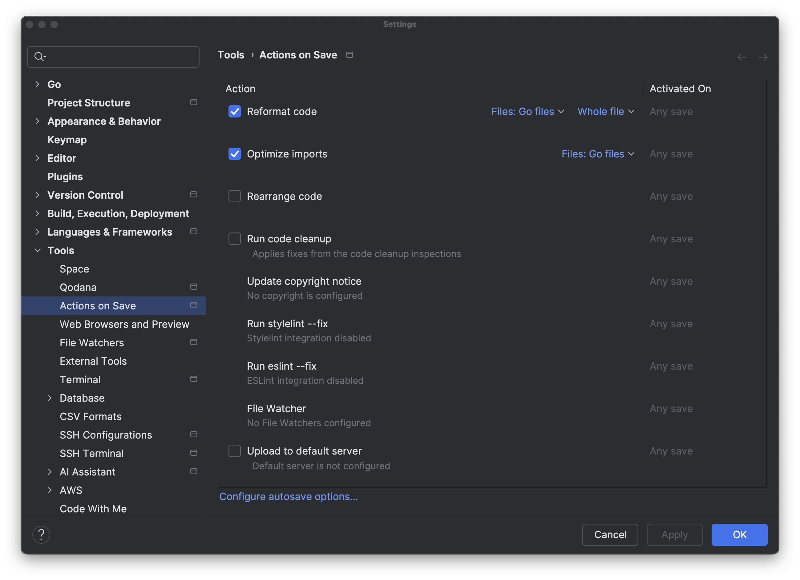

If you want to perform tasks on save, you can now use the _Actions on save_ feature to reformat the source code, optimize imports, rearrange it, run cleanup, or even upload it to a specified sever.

Turn on the actions you want to perform on save in the **Settings/Preferences | Tools | Actions on Save** section of the IDE.
