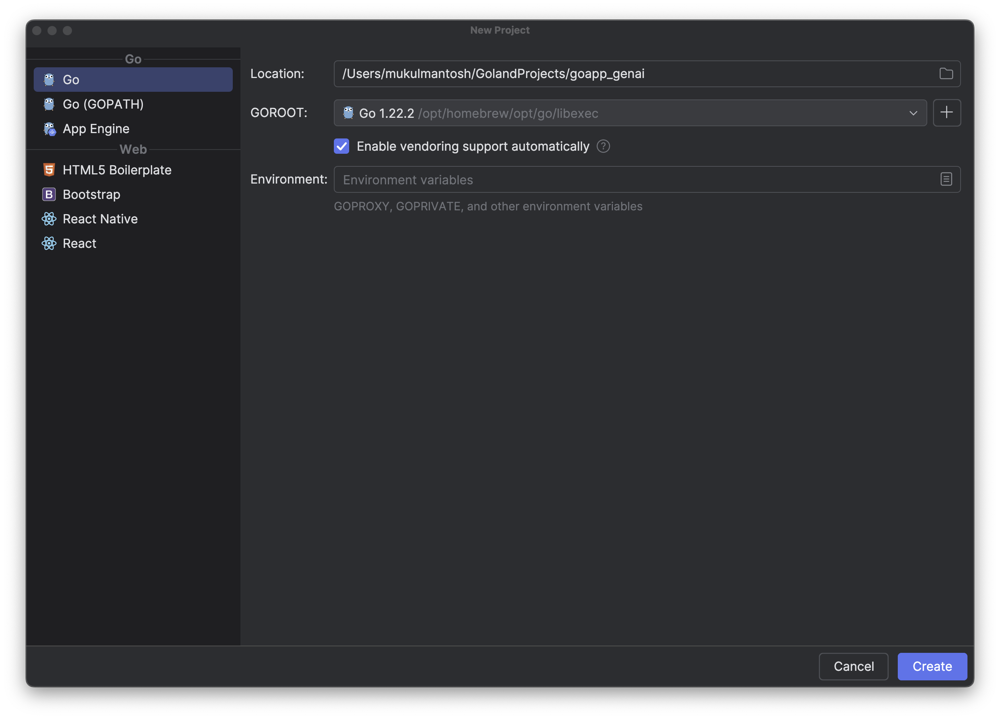
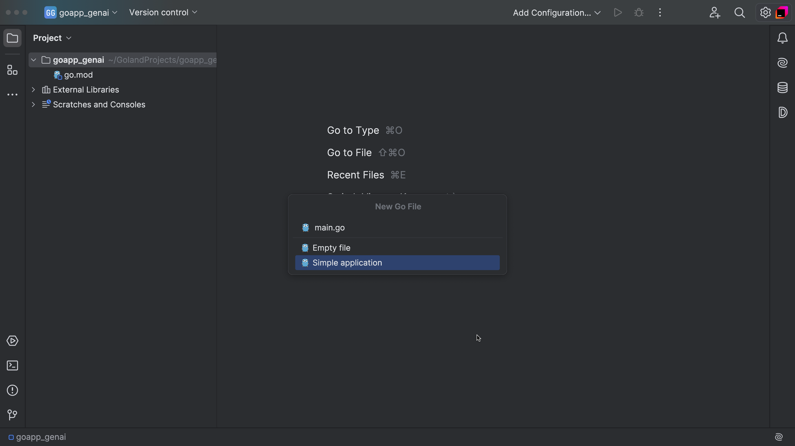
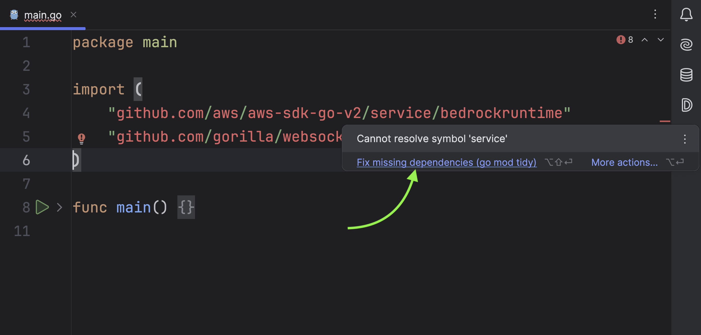
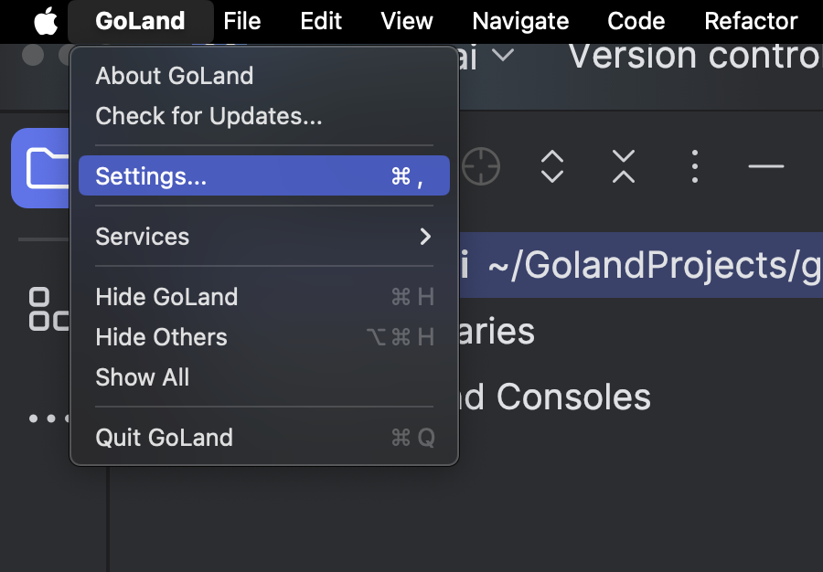
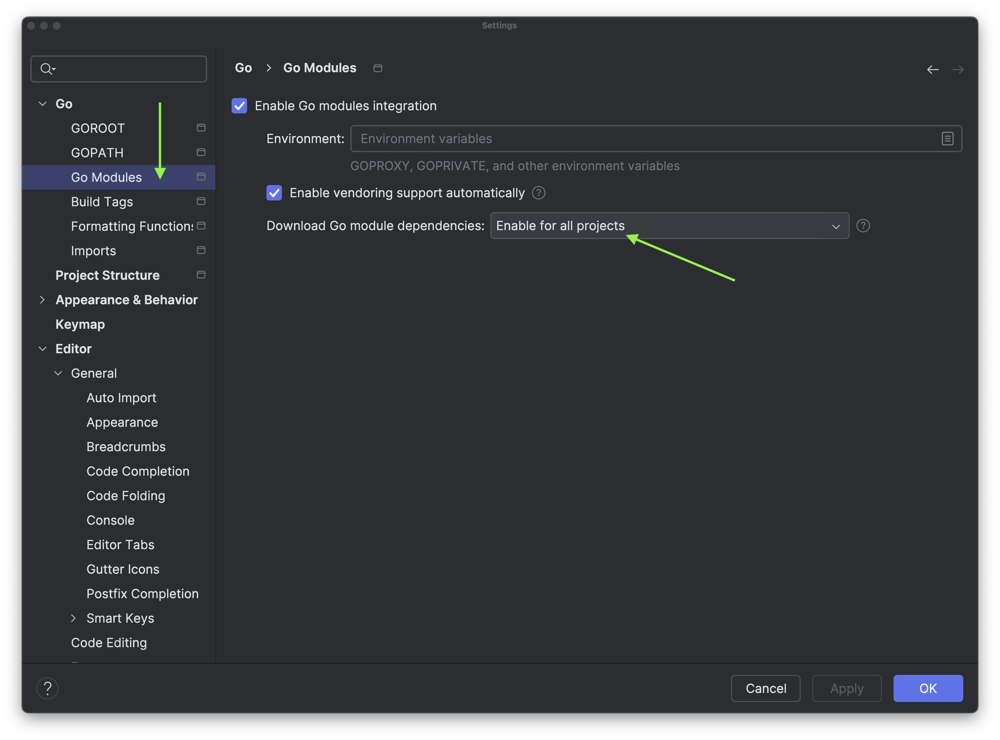
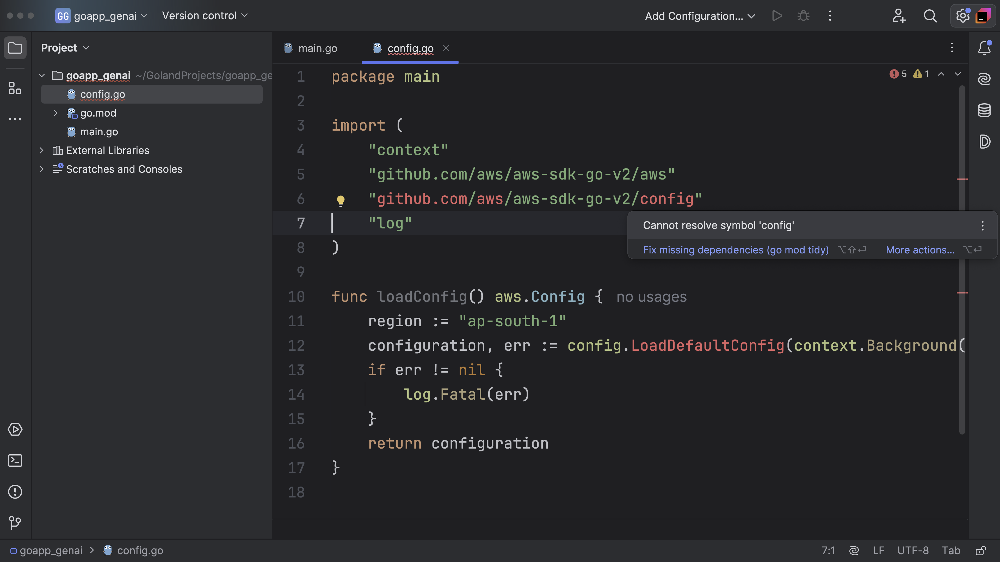
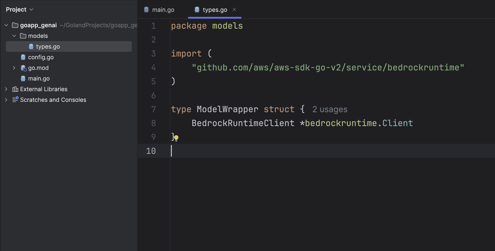
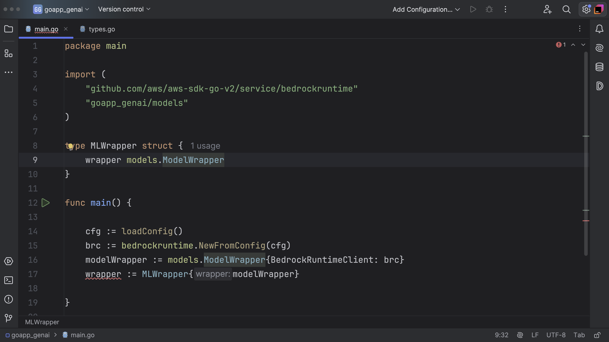

## Creating a new project

In this section we will focus on writing our backend. Let's start first by opening [GoLand](https://www.jetbrains.com/go/).

I will provide the project name as **goapp_genai**. You are free to choose any other name you want and then click **Create**.



Create **main.go** in your project root.



### Installing Packages

We need to install two packages which we are going to use throughout this project.

- Implementing [WebSockets](https://en.wikipedia.org/wiki/WebSocket), for that I will be using the Gorilla Websocket library.
- AWS Bedrock [SDK](https://docs.aws.amazon.com/bedrock/latest/APIReference/welcome.html) for Go

Place the import statements at the top of the file, and you can see the text color has changed to red, that means this package doesn't exist in the system and GoLand prompts you to install it.

```go
import (
	"github.com/aws/aws-sdk-go-v2/service/bedrockruntime"
	"github.com/gorilla/websocket"
)
```




You can even control whether the packages should be installed automatically or you have to do it manually.

Go to GoLand — _[Settings](https://www.jetbrains.com/help/go/system-settings.html)_





## Business Logic

### Loading Configuration

We will first begin by writing the config function.

Create the config.go file under the project root.

The `loadConfig` function is used to load the AWS configuration.

> NOTE: The region is hard-coded to `ap-south-1`. You're free to choose the region which is suitable for your business requirement. I recommend using it as an environment variable.



`config.go`

```go
package main

import (
	"context"
	"github.com/aws/aws-sdk-go-v2/aws"
	"github.com/aws/aws-sdk-go-v2/config"
	"log"
)

func loadConfig() aws.Config {
	region := "ap-south-1"
	configuration, err := config.LoadDefaultConfig(context.Background(), config.WithRegion(region))
	if err != nil {
		log.Fatal(err)
	}
	return configuration
}
```

### Model Wrapper

Create a directory called `models` and followed by a new file named `types.go` where we are going to define a new struct called `ModelWrapper`.



In brief, `ModelWrapper` serves as a container for a `BedrockRuntimeClient` instance, which allows the client to be passed around and used in different parts of the code while keeping the code organized and clean.

```go
package models

import (
	"github.com/aws/aws-sdk-go-v2/service/bedrockruntime"
)

type ModelWrapper struct {
	BedrockRuntimeClient *bedrockruntime.Client
}
```

Next, open `main.go` and add create the following struct.



```go
type MLWrapper struct {
	wrapper models.ModelWrapper
}

func main() {

	cfg := loadConfig()
	brc := bedrockruntime.NewFromConfig(cfg)
	modelWrapper := models.ModelWrapper{BedrockRuntimeClient: brc}
	wrapper := MLWrapper{modelWrapper}

}
```

The `modelWrapper` is an instance of the `ModelWrapper` struct. Also, it is initializing its `BedrockRuntimeClient` field with the `brc` object, which is an instance of a bedrock runtime client.

`wrapper` is an instance of `MLWrapper` that encapsulates the `modelWrapper` instance.

```go
	modelWrapper := models.ModelWrapper{BedrockRuntimeClient: brc}
	wrapper := MLWrapper{modelWrapper}
```

In the next section, we will focus on interacting with the ML models.
