## Cleaning Stuff

First, let's remove the changes which we are not going to use in our application.

Remove `assets`, `App.css` and `index.css`.


Clean everything from `App.jsx`. Check the image below, you will get the idea.


Remove `index.css` from `main.jsx`.


Add these two logos in your `public` directory. You can download them from my [repo](https://github.com/mukulmantosh/bedrock_ui/tree/master/public).


Update `index.html` with your new favicon and title.


Now, we are good to go ahead.

## Development Time

Let's begin first by opening `App.jsx`.

The `App` is a functional React component. It returns some JSX, a syntax similar to HTML, used to define UI structures in React. When rendered, `App` displays a section with a title "AWS Bedrock with Go" inside a div. The `hero`, `hero-body`, and `title` are CSS class names used to style these elements, and these are actually coming from [Bulma](https://bulma.io/). So, make sure to import bulma at the top.


Next, we are going to set a new background image.

Create a new file `BackgroundImage.module.css` under `src/styles/modules`.

> When CSS files end with `.module.css`, they're using a feature called [CSS Modules](https://github.com/css-modules/css-modules). CSS Modules use local scope to avoid style conflicts across different project parts, allowing component-scoped styling.


Update `App.jsx` with the new styling to apply the background.


### Creating Components

We will be creating multiple components. Let's start first with showing AI-related logos in our UI.

You need to place new images under `public/images`. Download these images from my [repo](https://github.com/mukulmantosh/bedrock_ui/tree/master/public/images).


Next, create a new directory called `components` under `src`, followed up with a new file `AILogoComponent.jsx`.


In this component we are displaying a layout containing four logos.

```jsx
import AnthropicLogo from "/images/Anthropic_logo.svg";
import LlamaLogo from "/images/llama.png";
import AI21Logo from "/images/ai21.png";
import MistralAiLogo from "/images/mistral_ai.png";

function AILogoComponent() {
	return (
		<div className="columns is-mobile mt-6">
			<div className="column"></div>
			<div className="column">
				<div className="card">
					<div className="card-image">
						<figure className="image is-4by3">
							
						</figure>
					</div>
				</div>
			</div>
			<div className="column">
				<div className="card">
					<div className="card-image">
						<figure className="image is-4by2">
							
						</figure>
					</div>
				</div>
				<div className="card">
					<div className="card-image">
						<figure className="image is-4by2">
							
						</figure>
					</div>
				</div>
				<div className="card">
					<div className="card-image">
						<figure className="image is-4by2">
							
						</figure>
					</div>
				</div>
			</div>
			<div className="column"></div>
		</div>
	);
}

export default AILogoComponent;
```

We need to import the above component in our `App` component.


This is the current state of our UI. Well, you can play around and come up with your own creativity.


Now, we will create one part named `AIComponent` which is going to our core component of our application. Inside `AIComponent` we will be creating multiple subcomponents that will be part of it.


We need to import `AIComponent` inside `App.jsx`.


Before we proceed with creating multiple smaller components, we need to implement a custom hook that will serve as the core of the application and handle everything.

### WebSockets

Create a new directory under `src` and name it `hooks`.

Under `hooks` create a new file called `useWebSocket.js`.

> In React, [custom hooks](https://react.dev/learn/reusing-logic-with-custom-hooks) are named with a "use" prefix as a convention to signify that they adhere to the rules of hooks.


`useWebSocket` is a custom hook for connecting to a `WebSocket` server, and managing state relevant to that connection in a React application.

```jsx
import { useState, useEffect } from "react";

const WEBSOCKET_URL = "ws://localhost:8080/ws/model";
const MODEL_ONLINE = { text: "Model Online", label: "has-text-success" };
const MODEL_OFFLINE = { text: "Model Offline", label: "has-text-danger" };
const availableModels = ["llama3", "anthropic"];

function useWebSocket() {
	const [connectionStatus, setConnectionStatus] = useState(MODEL_OFFLINE);
	const [isStreaming, setIsStreaming] = useState(false);
	const [message, setMessage] = useState("");
	const [webSocket, setWebSocket] = useState(null);
	const [textValue, setTextValue] = useState(""); // textarea
	const [selectedOption, setSelectedOption] = useState(availableModels[0]);

	const initializeWebSocketHandlers = (webSocket) => {
		webSocket.onmessage = (event) => {
			if (isStreaming) {
				setMessage((prevState) => prevState + event.data + "\n"); // Append streaming text
			} else {
				setMessage(event.data + "\n");
			}
		};

		webSocket.onopen = () => {
			setConnectionStatus(MODEL_ONLINE);
			console.log("WebSocket Connected! | Model ->" + selectedOption);
		};
	};

	useEffect(() => {
		const webSocketURL = `${WEBSOCKET_URL}?streaming=${isStreaming}&model=${selectedOption}`;
		const webSocketInstance = new WebSocket(webSocketURL);
		setWebSocket(webSocketInstance);
		initializeWebSocketHandlers(webSocketInstance);

		// cleanup
		return () => {
			webSocketInstance.close();
			setWebSocket(null);
			setConnectionStatus(MODEL_OFFLINE);
			setMessage("");
		};
	}, [selectedOption, isStreaming]);

	const sendMessage = () => {
		if (webSocket) {
			// clear messages
			clearMessages();
			webSocket.send(textValue);
		}
	};

	const clearMessages = () => {
		setMessage("");
	};

	const handleStreamChange = (e) => {
		setMessage("");
		setIsStreaming(e.target.checked);
	};

	const handleDropdownChange = (event) => {
		console.log(event.target.value);
		setSelectedOption(event.target.value);
	};

	return {
		connectionStatus,
		selectedOption,
		textValue,
		setTextValue,
		message,
		isStreaming,
		availableModels,
		sendMessage,
		handleStreamChange,
		handleDropdownChange,
	};
}

export default useWebSocket;
```

Let's break it down.

We are going to create some constants that will be used throughout the hook.

- `WEBSOCKET_URL`
- `MODEL_ONLINE`
- `MODEL_OFFLINE`
- `availableModels`

`useState` is a React Hook that lets you add [state variable](https://react.dev/learn/state-a-components-memory) to your components. The following state variables were created:

- `connectionStatus`: This is indicating whether the WebSocket connection to the model is online or offline.
- `isStreaming`: Maintains whether the data being received is streaming or not.
  message: Stores the message received from the WebSocket.
- `webSocket`: Stores the Websocket instance.
- `textValue`: The value from a textarea, which can be sent as a message over the WebSocket.
- `selectedOption`: Keeps track of the selected model from `availableModels`.

`initializeWebSocketHandlers()`: A function that sets up listeners for the WebSocket. On receiving a message, the function either appends data or resets the message. The function sets `MODEL_ONLINE` once the connection is open.

`useEffect`: This is a Hook in React that lets you perform side effects in function components. In this useEffect, a WebSocket instance is created with the `webSocketURL` and the connection handlers are initialized. When the `selectedOption` or `isStreaming` state changes, this hook runs again as they are dependencies.

The `cleanup` function, returned by `useEffect`, runs before the component is removed from the UI to prevent memory leaks. This is where the `WebSocket` instance is closed, and all the state variables are reset to their initial values.

`sendMessage()`: Sends the `textValue` over the WebSocket if the webSocket instance exists and clears the messages.

`clearMessages()`: Clear all the messages received.

`handleStreamChange()`: handles the changes in streaming state. It clears existing messages and alters the `isStreaming` state.

`handleDropdownChange()`: It logs the selected model and updates the `selectedOption`.

The hook then finally returns an object containing all the state variables and functions so that they might be used by the calling component.

### Sub-Components

Now, we will be handling multiple subcomponents. All the files will be placed under `components` directory.

- Let's begin first by creating `AIModel.jsx`.

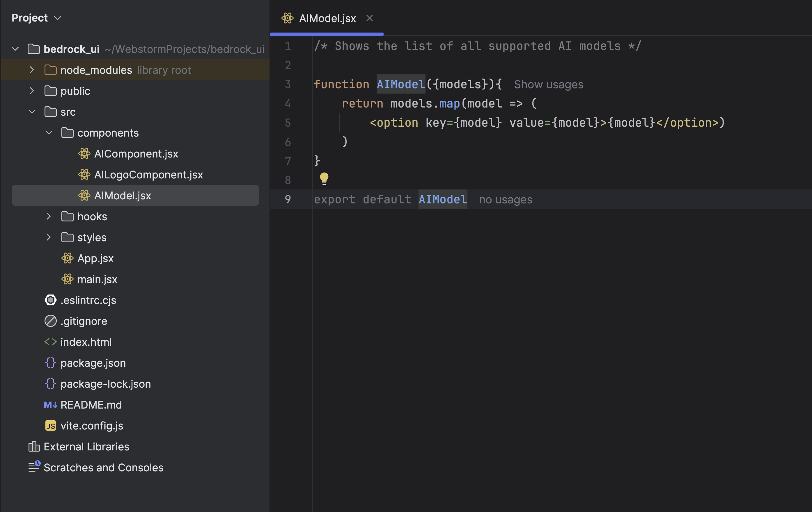

```jsx
function AIModel({ models }) {
	return models.map((model) => (
		<option key={model} value={model}>
			{model}
		</option>
	));
}

export default AIModel;
```

In UI, it's going to render options with `llama3` and `anthropic`.

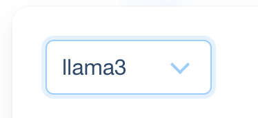

- Create a new file `ConnectionStatus.jsx`.

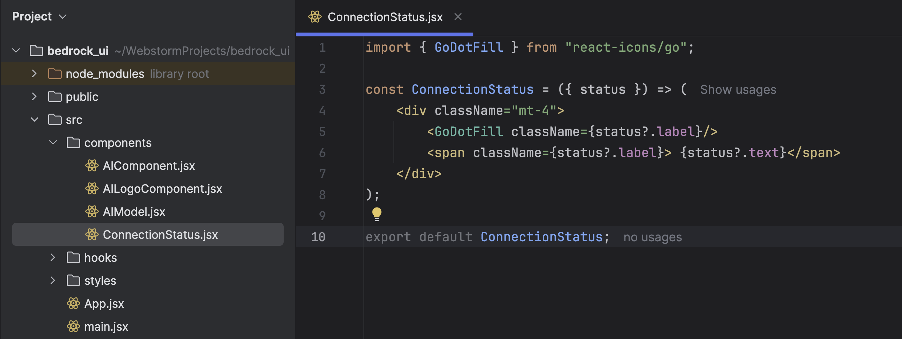

The text changes based on the websocket connectivity. If there is an active connection, it will say `Model Online` else `Model Offline`.

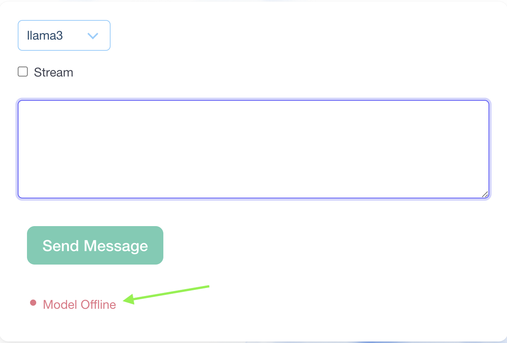

```jsx
import { GoDotFill } from "react-icons/go";

const ConnectionStatus = ({ status }) => (
	<div className="mt-4">
		<GoDotFill className={status?.label} />
		<span className={status?.label}> {status?.text}</span>
	</div>
);

export default ConnectionStatus;
```

Create a new file `SendMessage.jsx`.

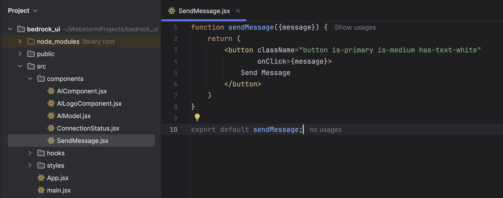

```jsx
function sendMessage({ message }) {
	return (
		<button
			className="button is-primary is-medium has-text-white"
			onClick={message}
		>
			Send Message
		</button>
	);
}

export default sendMessage;
```

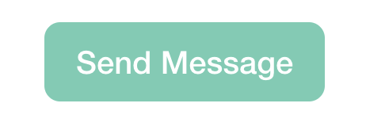

Create a new file `StreamCheckbox.jsx`.

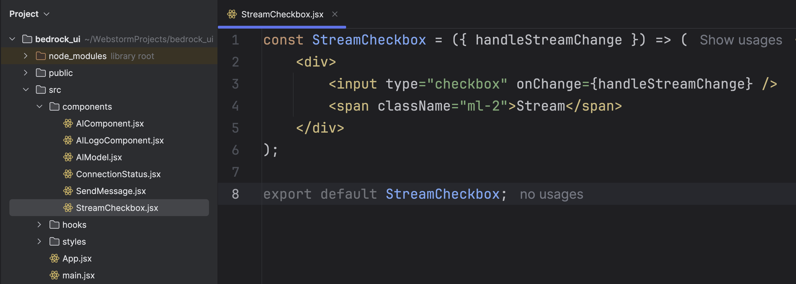

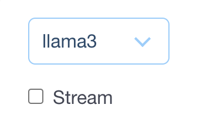

```jsx
const StreamCheckbox = ({ handleStreamChange }) => (
	<div>
		<input type="checkbox" onChange={handleStreamChange} />
		<span className="ml-2">Stream</span>
	</div>
);

export default StreamCheckbox;
```

Create a new file `TextArea.jsx`.

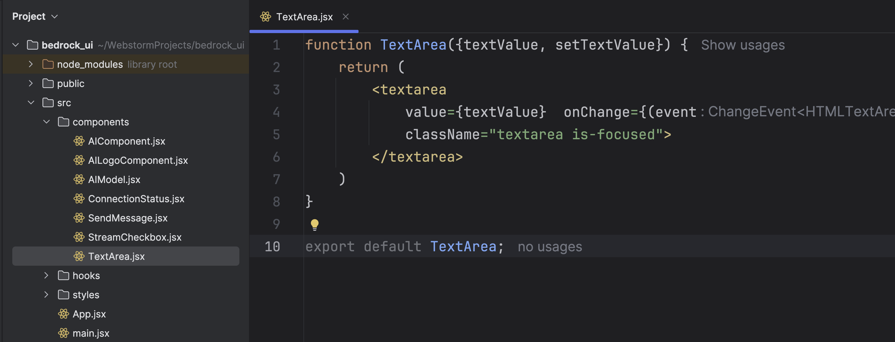

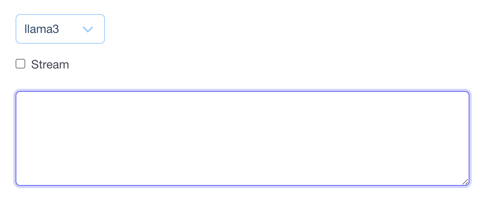

```jsx
function TextArea({ textValue, setTextValue }) {
	return (
		<textarea
			value={textValue}
			onChange={(event) => setTextValue(event.target.value)}
			className="textarea is-focused"
		></textarea>
	);
}

export default TextArea;
```

Create a new file `AIResponse.jsx`.


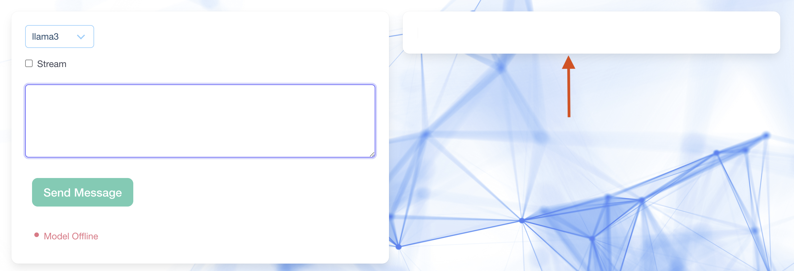

```jsx
import { ReactTyped } from "react-typed";

function AIResponse({ streaming, message, className }) {
	const streamingOutput = <p className={className}>{message}</p>;
	const nonStreamingOutput = (
		<ReactTyped className={className} strings={[message]} typeSpeed={10} />
	);

	return <div>{streaming ? streamingOutput : nonStreamingOutput}</div>;
}
export default AIResponse;
```

## Stitching Together

Come back to our main component `AIComponent.jsx` and do the necessary imports the state-related variables.

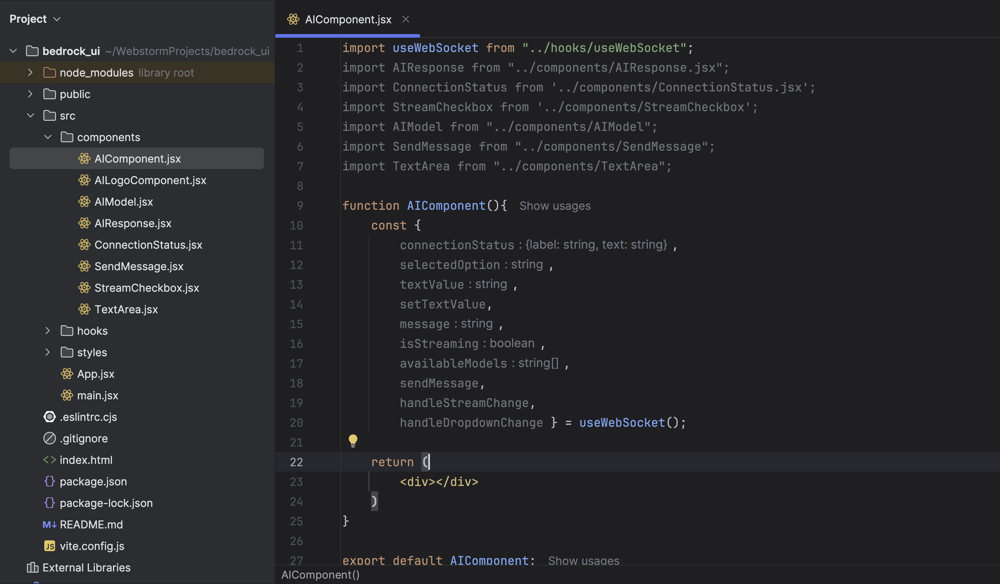

```jsx
import useWebSocket from "../hooks/useWebSocket";
import AIResponse from "../components/AIResponse.jsx";
import ConnectionStatus from "../components/ConnectionStatus.jsx";
import StreamCheckbox from "../components/StreamCheckbox";
import AIModel from "../components/AIModel";
import SendMessage from "../components/SendMessage";
import TextArea from "../components/TextArea";

function AIComponent() {
	const {
		connectionStatus,
		selectedOption,
		textValue,
		setTextValue,
		message,
		isStreaming,
		availableModels,
		sendMessage,
		handleStreamChange,
		handleDropdownChange,
	} = useWebSocket();

	return <div></div>;
}

export default AIComponent;
```

Let's now add the UI elements.

```jsx
import useWebSocket from "../hooks/useWebSocket";
import AIResponse from "../components/AIResponse.jsx";
import ConnectionStatus from "../components/ConnectionStatus.jsx";
import StreamCheckbox from "../components/StreamCheckbox";
import AIModel from "../components/AIModel";
import SendMessage from "../components/SendMessage";
import TextArea from "../components/TextArea";

function AIComponent() {
	const {
		connectionStatus,
		selectedOption,
		textValue,
		setTextValue,
		message,
		isStreaming,
		availableModels,
		sendMessage,
		handleStreamChange,
		handleDropdownChange,
	} = useWebSocket();

	return (
		<div>
			<div className="container">
				<div className="columns">
					<div className="column is-6">
						<div className="card">
							<div className="card-content">
								<div className="select is-info mb-4">
									<select
										value={selectedOption}
										onChange={handleDropdownChange}
									>
										<AIModel models={availableModels} />
									</select>
								</div>

								<div className="columns">
									<div className="column">
										<StreamCheckbox handleStreamChange={handleStreamChange} />
									</div>
								</div>

								<div className="columns">
									<div className="column">
										<TextArea
											textValue={textValue}
											setTextValue={setTextValue}
										/>
									</div>
								</div>
								<div className="colums">
									<div className="column">
										<SendMessage message={sendMessage} />
									</div>
									<div className="column">
										<ConnectionStatus status={connectionStatus} />
									</div>
								</div>
							</div>
						</div>
					</div>
					<div className="column is-6">
						<div className="card">
							<div className="card-content">
								<AIResponse
									message={message}
									className="subtitle has-text-grey typing-text"
									streaming={isStreaming}
								/>
							</div>
						</div>
					</div>
				</div>
			</div>
		</div>
	);
}

export default AIComponent;
```

Once done, save and restart the server. This is how the complete UI will look.


<video width="1366" height="768" controls>
  <source src="./images/final.webm" type="video/webm">
  Your browser does not support the video tag.
</video>
