## Cleaning Stuff

First, let's remove the changes which we are not going to use in our application.

Remove `assets`, `App.css` and `index.css`.

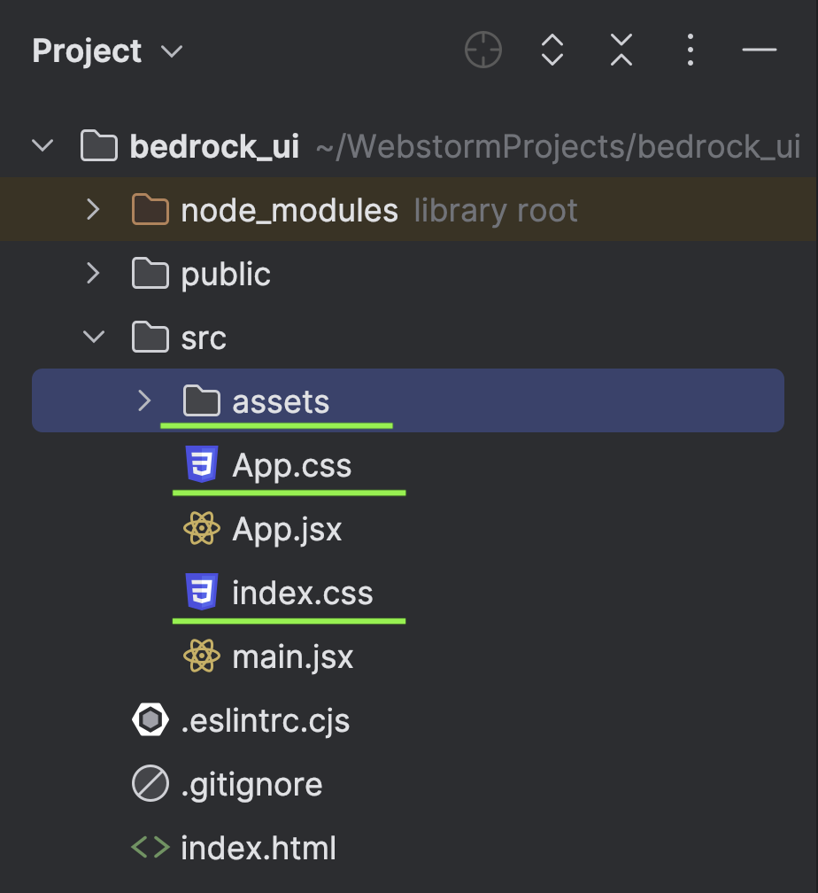

Clean everything from `App.jsx`. Check the image below, you will get the idea.

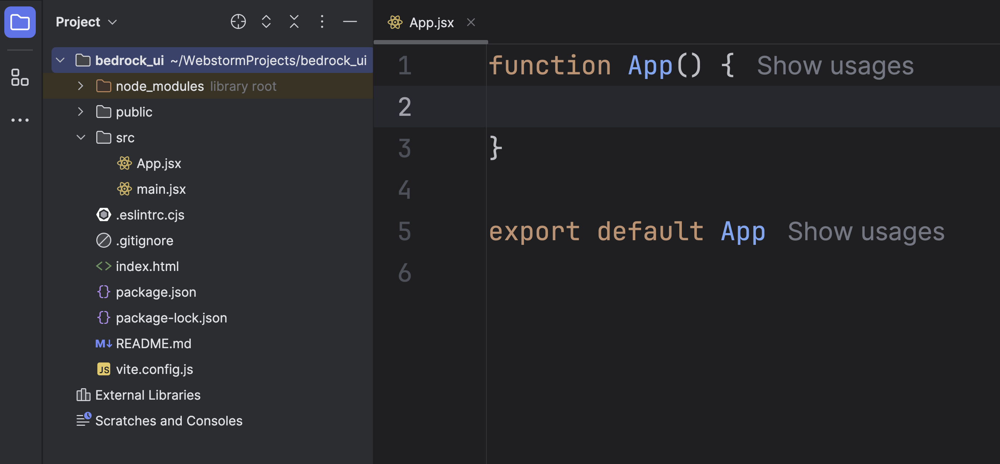

Remove `index.css` from `main.jsx`.

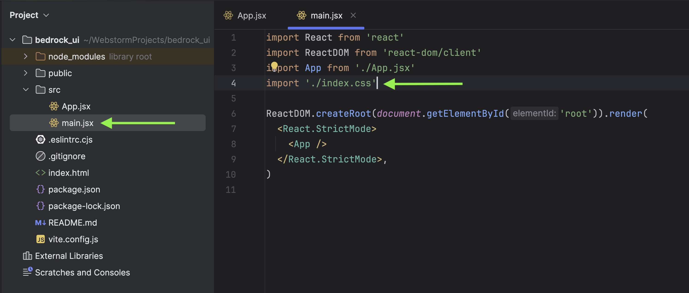

Add these two logos in your `public` directory. You can download them from my [repo](https://github.com/mukulmantosh/bedrock_ui/tree/master/public).

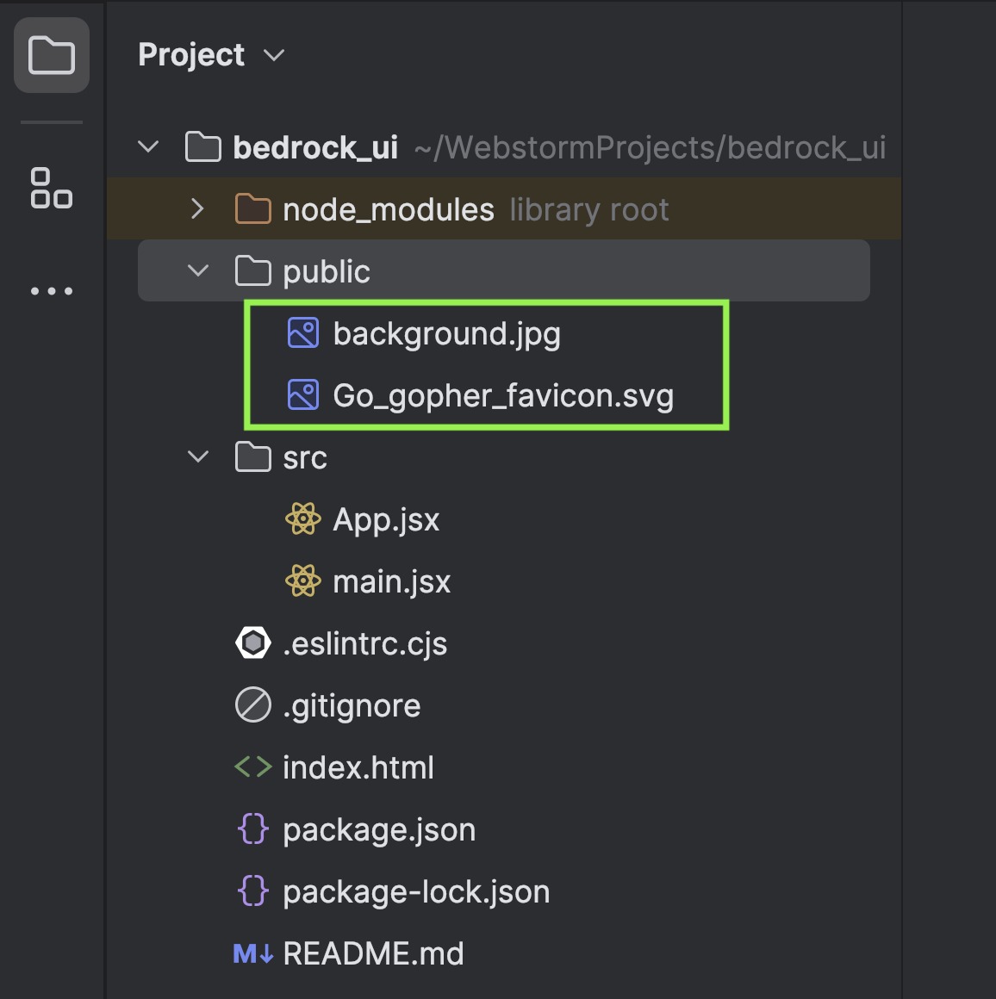

Update `index.html` with your new favicon and title.

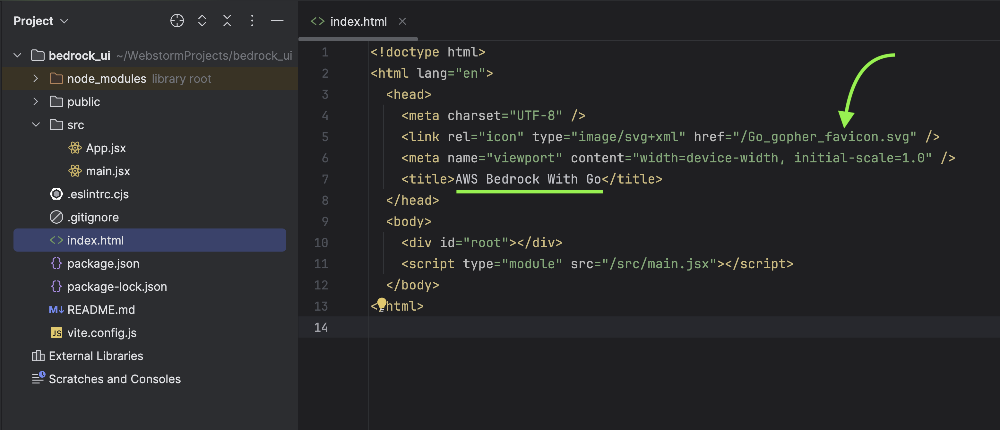

Now, we are good to go ahead.

## Development Time

Let's begin first by opening `App.jsx`.

The `App` is a functional React component. It returns some JSX, a syntax similar to HTML, used to define UI structures in React. When rendered, `App` displays a section with a title "AWS Bedrock with Go" inside a div. The `hero`, `hero-body`, and `title` are CSS class names used to style these elements, and these are actually coming from [Bulma](https://bulma.io/). So, make sure to import bulma at the top.

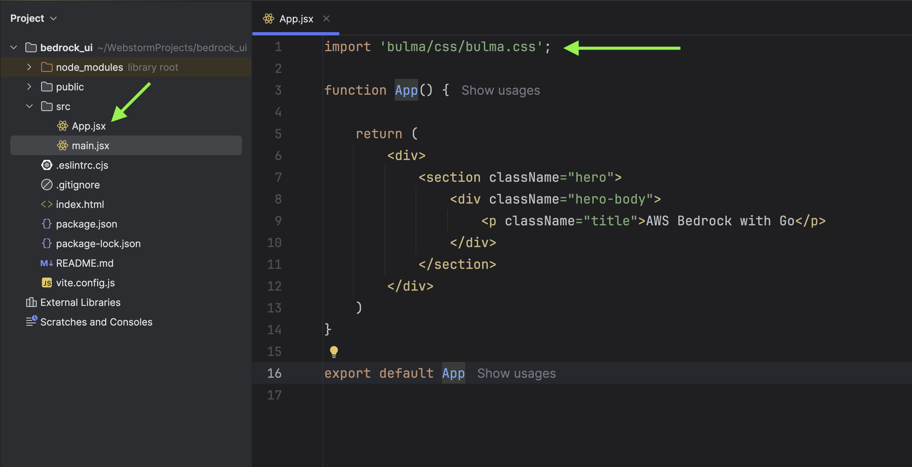

Next, we are going to set a new background image.

Create a new file `BackgroundImage.module.css` under `src/styles/modules`.

> When CSS files end with `.module.css`, they're using a feature called [CSS Modules](https://github.com/css-modules/css-modules). CSS Modules use local scope to avoid style conflicts across different project parts, allowing component-scoped styling.


Update `App.jsx` with the new styling to apply the background.

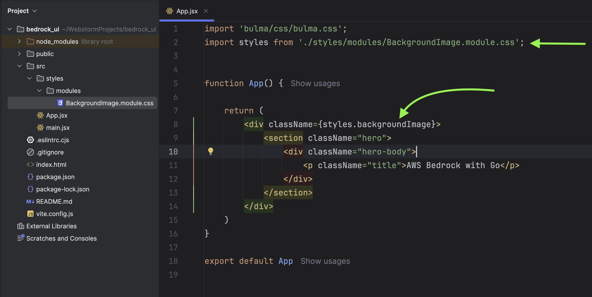

### Creating Components

We will be creating multiple components. Let's start first with showing AI-related logos in our UI.

You need to place new images under `public/images`. Download these images from my [repo](https://github.com/mukulmantosh/bedrock_ui/tree/master/public/images).

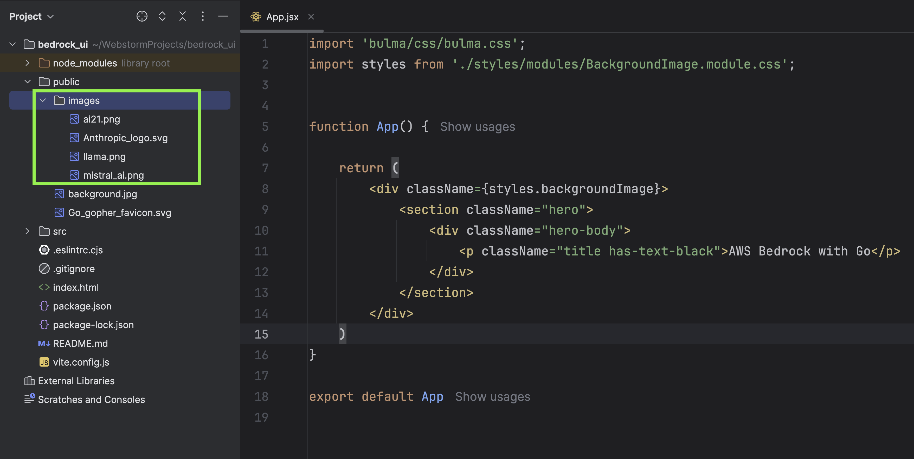

Next, create a new directory called `components` under `src`, followed up with a new file `AILogoComponent.jsx`.

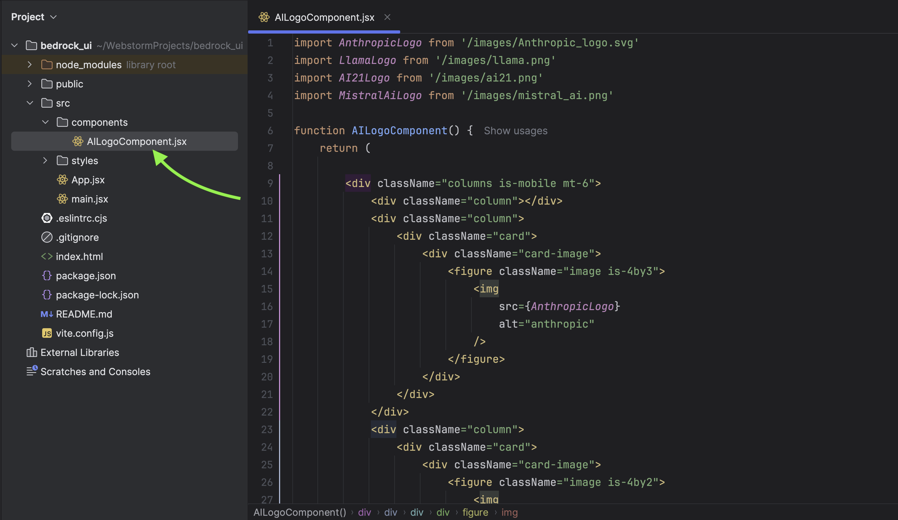

In this component we are displaying a layout containing four logos.

```jsx
import AnthropicLogo from "/images/Anthropic_logo.svg";
import LlamaLogo from "/images/llama.png";
import AI21Logo from "/images/ai21.png";
import MistralAiLogo from "/images/mistral_ai.png";

function AILogoComponent() {
	return (
		<div className="columns is-mobile mt-6">
			<div className="column"></div>
			<div className="column">
				<div className="card">
					<div className="card-image">
						<figure className="image is-4by3">
							
						</figure>
					</div>
				</div>
			</div>
			<div className="column">
				<div className="card">
					<div className="card-image">
						<figure className="image is-4by2">
							
						</figure>
					</div>
				</div>
				<div className="card">
					<div className="card-image">
						<figure className="image is-4by2">
							
						</figure>
					</div>
				</div>
				<div className="card">
					<div className="card-image">
						<figure className="image is-4by2">
							
						</figure>
					</div>
				</div>
			</div>
			<div className="column"></div>
		</div>
	);
}

export default AILogoComponent;
```

We need to import the above component in our `App` component.

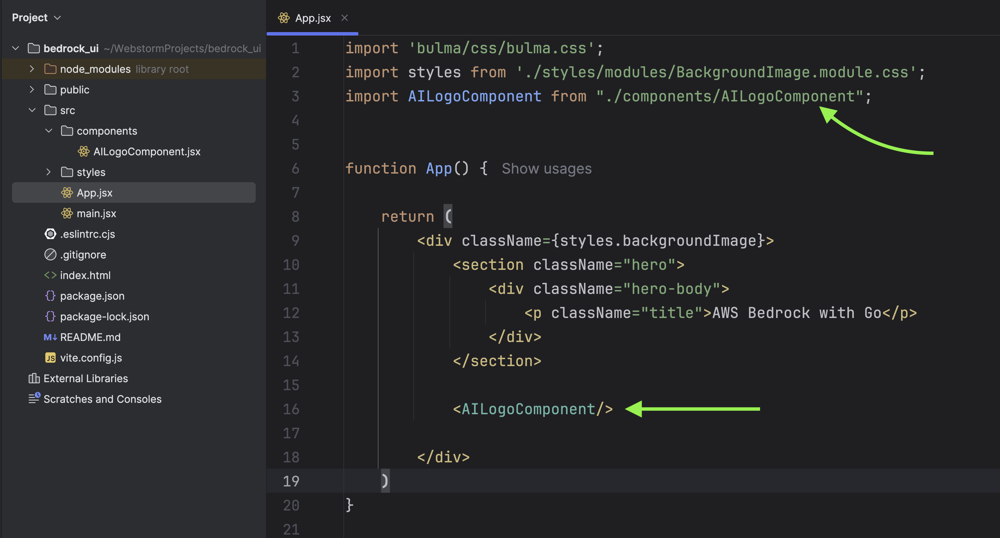

This is the current state of our UI. Well, you can play around and come up with your own creativity.

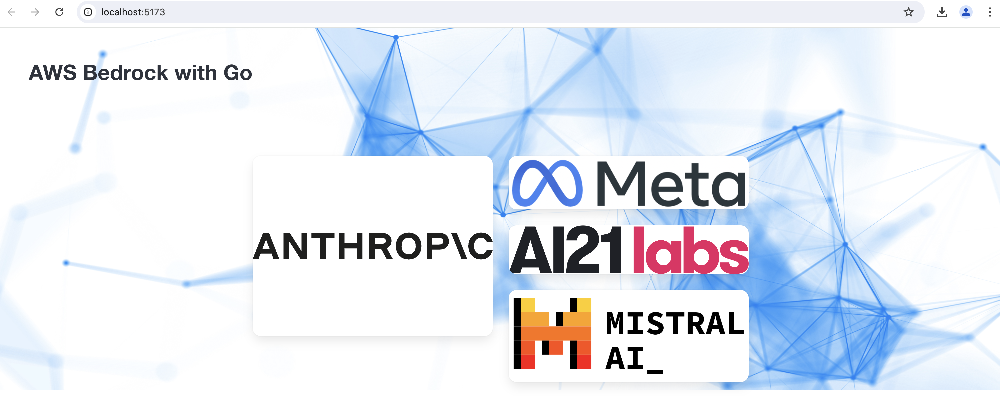

Now, we will create one part named `AIComponent` which is going to our core component of our application. Inside `AIComponent` we will be creating multiple subcomponents that will be part of it.

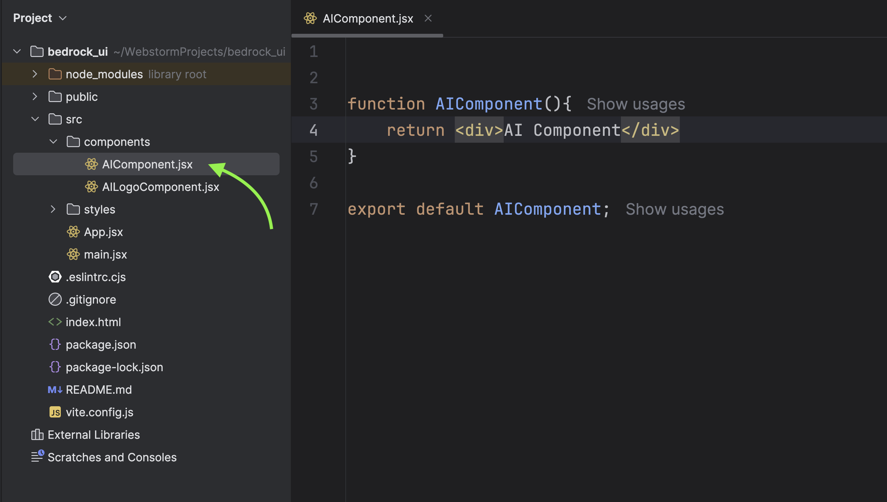

We need to import `AIComponent` inside `App.jsx`.

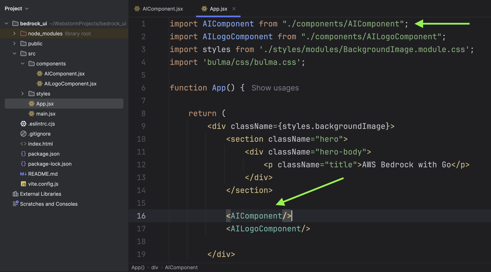

Before we proceed with creating multiple smaller components, we need to implement a custom hook that will serve as the core of the application and handle everything.

### WebSockets

Create a new directory under `src` and name it `hooks`.

Under `hooks` create a new file called `useWebSocket.js`.

> In React, [custom hooks](https://react.dev/learn/reusing-logic-with-custom-hooks) are named with a "use" prefix as a convention to signify that they adhere to the rules of hooks.

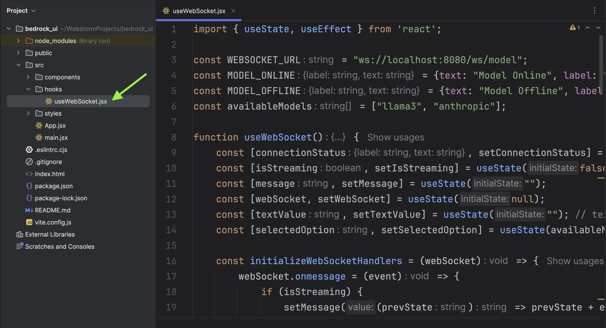

```jsx
import { useState, useEffect } from "react";

const WEBSOCKET_URL = "ws://localhost:8080/ws/model";
const MODEL_ONLINE = { text: "Model Online", label: "has-text-success" };
const MODEL_OFFLINE = { text: "Model Offline", label: "has-text-danger" };
const availableModels = ["llama3", "anthropic"];

function useWebSocket() {
	const [connectionStatus, setConnectionStatus] = useState(MODEL_OFFLINE);
	const [isStreaming, setIsStreaming] = useState(false);
	const [message, setMessage] = useState("");
	const [webSocket, setWebSocket] = useState(null);
	const [textValue, setTextValue] = useState(""); // textarea
	const [selectedOption, setSelectedOption] = useState(availableModels[0]);

	const initializeWebSocketHandlers = (webSocket) => {
		webSocket.onmessage = (event) => {
			if (isStreaming) {
				setMessage((prevState) => prevState + event.data + "\n"); // Append streaming text
			} else {
				setMessage(event.data + "\n");
			}
		};

		webSocket.onopen = () => {
			setConnectionStatus(MODEL_ONLINE);
			console.log("WebSocket Connected! | Model ->" + selectedOption);
		};
	};

	useEffect(() => {
		const webSocketURL = `${WEBSOCKET_URL}?streaming=${isStreaming}&model=${selectedOption}`;
		const webSocketInstance = new WebSocket(webSocketURL);
		setWebSocket(webSocketInstance);
		initializeWebSocketHandlers(webSocketInstance);

		// cleanup
		return () => {
			webSocketInstance.close();
			setWebSocket(null);
			setConnectionStatus(MODEL_OFFLINE);
			setMessage("");
		};
	}, [selectedOption, isStreaming]);

	const sendMessage = () => {
		if (webSocket) {
			// clear messages
			clearMessages();
			webSocket.send(textValue);
		}
	};

	const clearMessages = () => {
		setMessage("");
	};

	const handleStreamChange = (e) => {
		setMessage("");
		setIsStreaming(e.target.checked);
	};

	const handleDropdownChange = (event) => {
		console.log(event.target.value);
		setSelectedOption(event.target.value);
	};

	return {
		connectionStatus,
		selectedOption,
		textValue,
		setTextValue,
		message,
		isStreaming,
		availableModels,
		sendMessage,
		handleStreamChange,
		handleDropdownChange,
	};
}

export default useWebSocket;
```

Let's break it down.

The provided JavaScript code contains a custom hook for connecting to a WebSocket server, and managing state relevant to that connection in a React application. Here's a breakdown of what the code is doing:

Initial setup: Some constants (WEBSOCKET_URL, MODEL_ONLINE, MODEL_OFFLINE, availableModels) are declared, these are used throughout the hook.

useState is a React Hook that lets you add React state to function components. Following state variables were created:

connectionStatus: This indicating whether the WebSocket connection to the model is online or offline.
isStreaming: Maintains whether the data being received is streaming or not.
message: Stores the message received from the WebSocket.
webSocket: Stores the Websocket instance.
textValue: The value from a textarea, which can be sent as a message over the WebSocket.
selectedOption: Keeps track of the selected model from availableModels.

initializeWebSocketHandlers(): A function that sets up listeners for the WebSocket. On receiving a message, the function either appends data or resets the message. The function sets MODEL_ONLINE once connection is open.

useEffect: This is a Hook in React that lets you perform side effects in function components. In this useEffect, a WebSocket instance is created with the webSocketURL and the connection handlers are initialized. When the selectedOption or isStreaming state changes, this hook runs again as they are dependencies.

The cleanup function, returned by useEffect, runs before the component is removed from the UI to prevent memory leaks. This is where the WebSocket instance is closed, and all the state variables are reset to their initial values.

sendMessage(): Sends the textValue over the WebSocket if the webSocket instance exists and clears the messages.

clearMessages(): Clear all the messages received.

handleStreamChange(): handles the changes in streaming state. It clears existing messages and alters the isStreaming state.

handleDropdownChange(): It logs selected model and update the selectedOption.

The hook then finally returns an object containing all the state variables and functions so that they might be used by the calling component.

The hook is exported as a default export, which could be imported in another module and assigned whatever name is desired.
