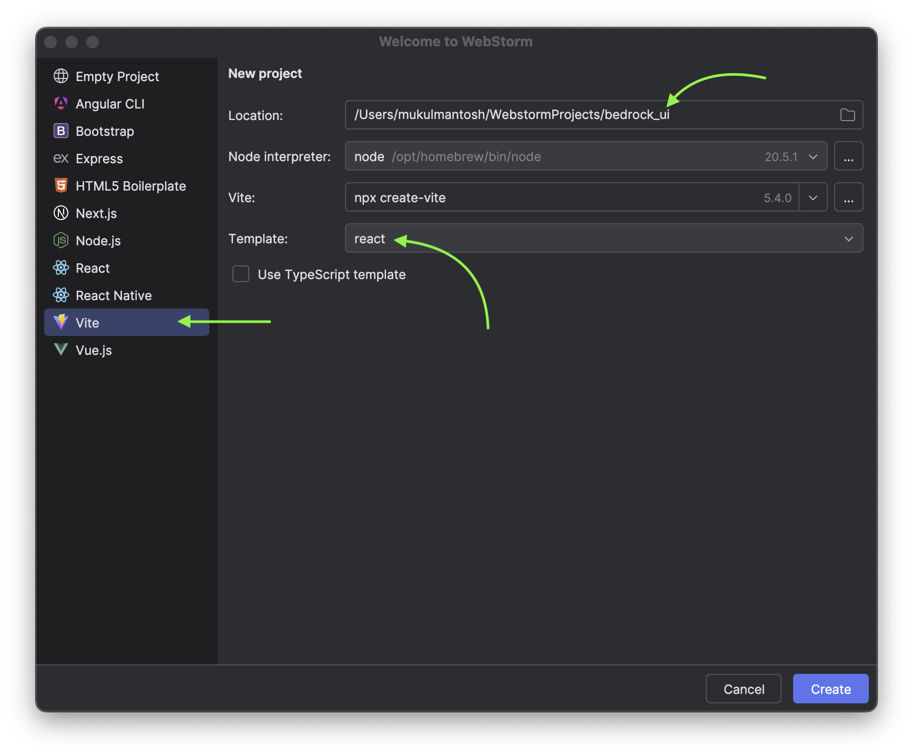
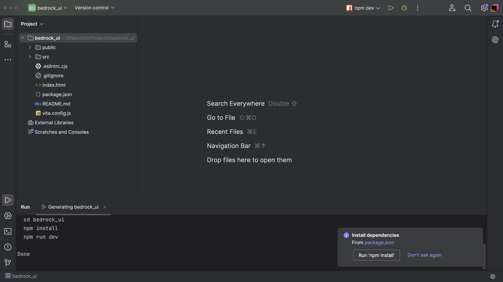
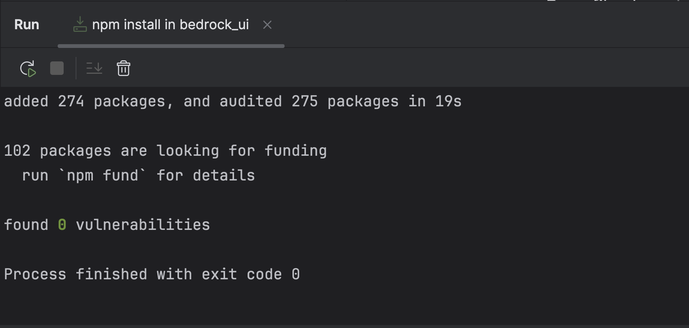
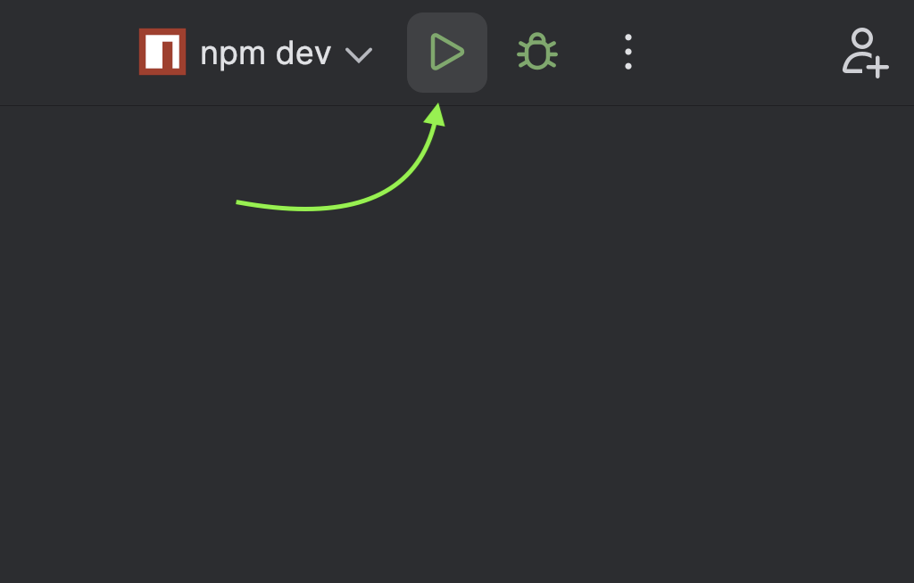
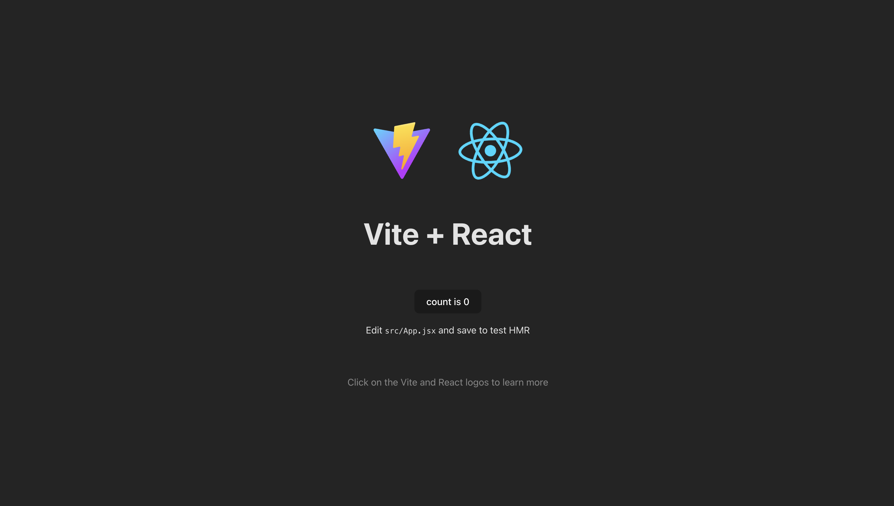
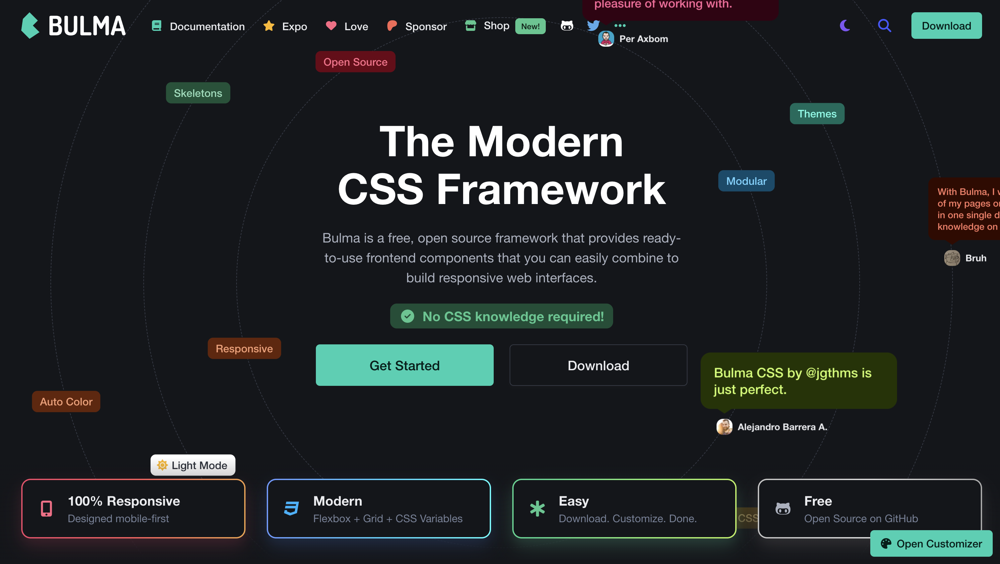
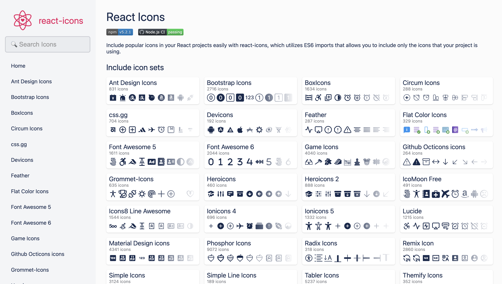
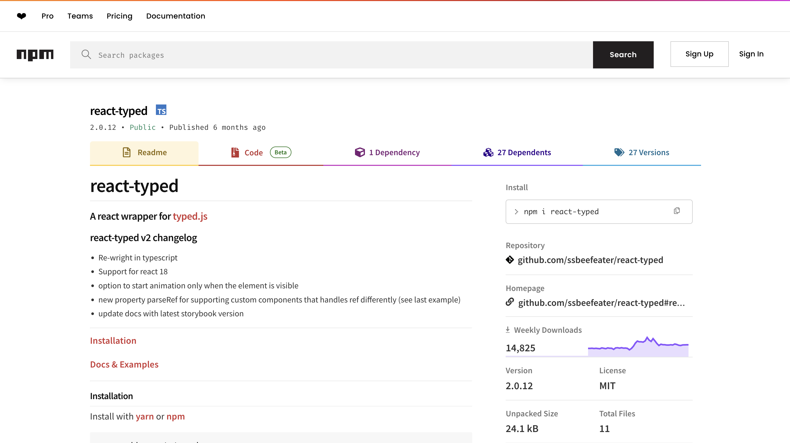
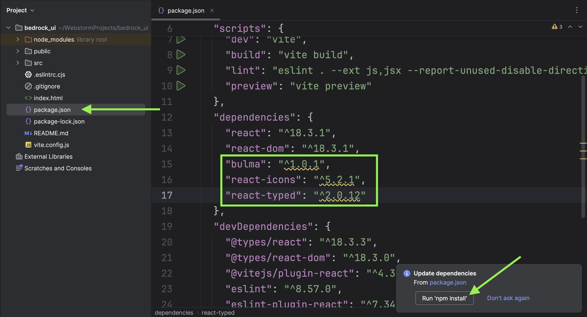

> Before we proceed, I want to mention that this section of the tutorial is entirely optional. We'll be developing our application using [React](https://react.dev/), so it's assumed that you have some familiarity with it, as we won't be covering it in detail. Developing in React is not mandatory; you can choose whether to use it or implement these concepts with the framework you prefer.

## Project Setup

Let's begin our journey. Open WebStorm.

Click —> **Vite** —> Choose **Template** as react and provide a name to your project. I am going with **bedrock_ui**. Once done, click **Create**.

[Vite](https://vitejs.dev/) is a next-generation frontend tooling developed by [Evan You](https://evanyou.me/), the author of Vue.js. It aims to provide a faster and more efficient development experience compared to older tools like Create React App.

You will observe a popup appearing at the right bottom to Install dependencies. Go ahead and click **Run 'npm install'**.

All packages are installed. Let's go ahead and start the server.

Click on ▶️ to run the server.

The application is running on [localhost:5173](http://localhost:5173/).

This is how the default UI appears when you load it for the first time.

## Installing Packages

### [Bulma](https://bulma.io/)

Modern CSS Framework

### [React Icons](https://react-icons.github.io/react-icons/)

Include popular icons in your React projects easily with react-icons.

### [react-typed](https://www.npmjs.com/package/react-typed)

A React wrapper for `typed.js`

Open `package.json` and add the following lines under the `dependencies`. After completing the changes, save them, and WebStorm will prompt you to install the necessary packages.

The next section is quite important as we completely focus on building the application.
