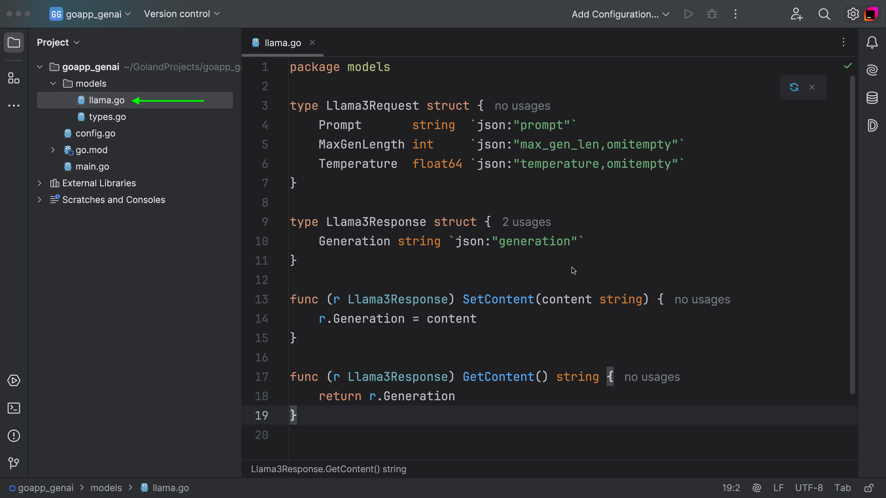
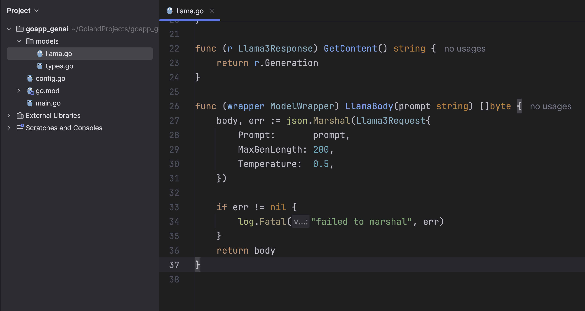
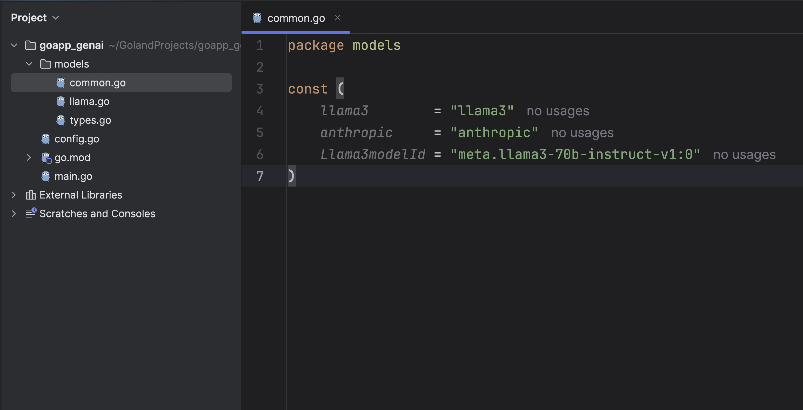
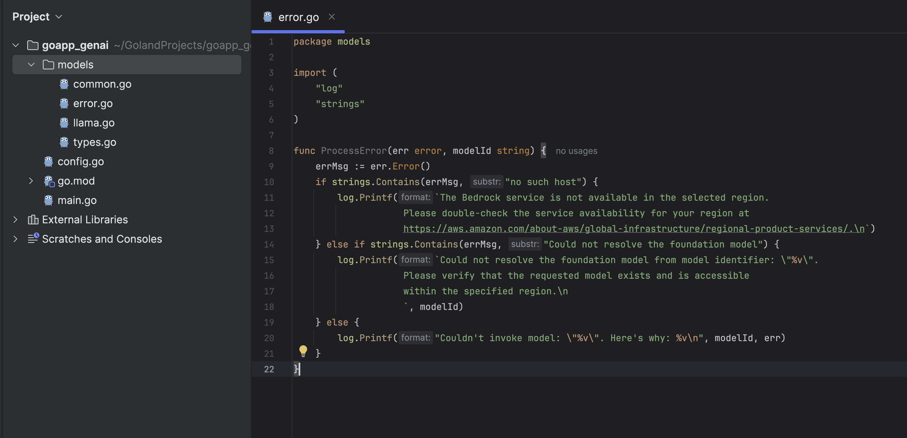
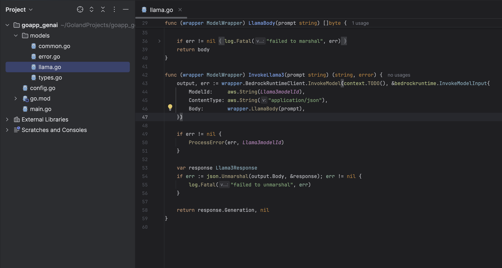
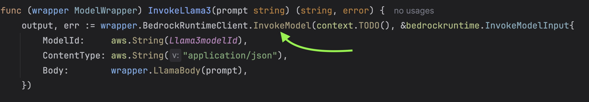
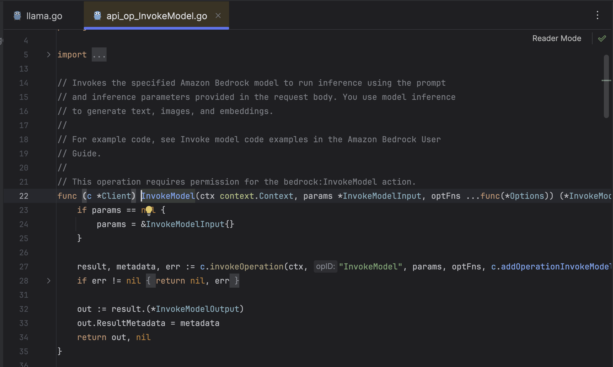

In this section we will be only implementing two models. You are free to experiment with other models.

- Llama3
- Anthropic

Well, there are a lot of models supported MistralAI, StabilityAI, etc. If you are interested in knowing more about the supported models, please check the following [link](https://docs.aws.amazon.com/bedrock/latest/userguide/models-supported.html).

The implementation will be divided into two parts.

- **Streaming** — In this scenario, the SDK transmits the model response in segments, and we will directly stream this segmented data via WebSocket.
- **Non-Streaming** — In this scenario, the model sends the complete response, causing a short delay before we receive and subsequently push the information through WebSocket.

## Llama3

For this tutorial, we will be using Llama 3 70B Instruct.


This is what Meta has to say about LLama3.

> With Llama 3, we set out to build the best open models that are on par with the best proprietary models available today. We wanted to address developer feedback to increase the overall helpfulness of Llama 3 and are doing so while continuing to play a leading role on responsible use and deployment of LLMs. We are embracing the open source ethos of releasing early and often to enable the community to get access to these models while they are still in development. The text-based models we are releasing today are the first in the Llama 3 collection of models. Our goal in the near future is to make Llama 3 multilingual and multimodal, have longer context, and continue to improve overall performance across core LLM capabilities such as reasoning and coding.

- Read more: [Introducing Meta Llama 3 - The most capable openly available LLM to date](https://ai.meta.com/blog/meta-llama-3/)

### Non-Streaming

Let's first begin by implementing the non-streaming way to interact with Llama3.

First thing is to create a file under `models` and name it `llama.go`.



```go

type Llama3Request struct {
	Prompt       string  `json:"prompt"`
	MaxGenLength int     `json:"max_gen_len,omitempty"`
	Temperature  float64 `json:"temperature,omitempty"`
}

type Llama3Response struct {
	Generation string `json:"generation"`
}

func (r Llama3Response) SetContent(content string) {
	r.Generation = content
}

func (r Llama3Response) GetContent() string {
	return r.Generation
}
```

In this code we are defining two struct types, `Llama3Request` and `Llama3Response`, alongside two methods `SetContent` and `GetContent` on the `Llama3Response` struct type.

The `Llama3Request` holds three parameters.

- **Prompt** — The prompt which you pass to the model.
- **MaxGenLength** — Maximum number of tokens used in the response. Default is 512 and maximum allowed 2048.
- **Temperature** — Used for randomness. Default to 0.5 and maximum allowed 1.

> Read more: [Supported Inference Parameters for Meta Llama models](https://docs.aws.amazon.com/bedrock/latest/userguide/model-parameters-meta.html)



Inside the `LlamaBody` method, an instance of the `Llama3Request` struct is created and populated with the `prompt` string, along with specified values for `MaxGenLength` and `Temperature`.
This `Llama3Request` instance is then converted to a JSON-formatted byte array with the `json.Marshal` function.

```go
func (wrapper ModelWrapper) LlamaBody(prompt string) []byte {
	body, err := json.Marshal(Llama3Request{
		Prompt:       prompt,
		MaxGenLength: 200,
		Temperature:  0.5,
	})

	if err != nil {
		log.Fatal("failed to marshal", err)
	}
	return body
}
```

Next, I will be creating some basic utility functions and constants that will be generic across the application.

First create a file named `common.go` under models.



```go
package models

const (
	llama3        = "llama3"
	anthropic     = "anthropic"
	Llama3modelId = "meta.llama3-70b-instruct-v1:0"
)

```

Next, `error.go`



```go
package models

import (
	"log"
	"strings"
)

func ProcessError(err error, modelId string) {
	errMsg := err.Error()
	if strings.Contains(errMsg, "no such host") {
		log.Printf(`The Bedrock service is not available in the selected region.
                    Please double-check the service availability for your region at
                    https://aws.amazon.com/about-aws/global-infrastructure/regional-product-services/.\n`)
	} else if strings.Contains(errMsg, "Could not resolve the foundation model") {
		log.Printf(`Could not resolve the foundation model from model identifier: \"%v\".
                    Please verify that the requested model exists and is accessible
                    within the specified region.\n
                    `, modelId)
	} else {
		log.Printf("Couldn't invoke model: \"%v\". Here's why: %v\n", modelId, err)
	}
}

```

Resume back to `llama.go` where we will be defining our last function `InvokeLlama3`.



This method takes a string argument and attempts to invoke a model in the AWS Bedrock runtime. The `prompt` string is marshalled into JSON format and included in the request. If an error occurs during the invocation, it is processed and logged. If the invocation is successful, the method unmarshals the JSON response into a `Llama3Response` struct and returns its `Generation` field.

The request structure for the model is prepared by `LlamaBody()` and any errors during the process are handled by `ProcessError()` function and finally the response from the model invoked is stored in the `Llama3Response` struct.

```go
func (wrapper ModelWrapper) InvokeLlama3(prompt string) (string, error) {
	output, err := wrapper.BedrockRuntimeClient.InvokeModel(context.TODO(), &bedrockruntime.InvokeModelInput{
		ModelId:     aws.String(Llama3modelId),
		ContentType: aws.String("application/json"),
		Body:        wrapper.LlamaBody(prompt),
	})

	if err != nil {
		ProcessError(err, Llama3modelId)
	}

	var response Llama3Response
	if err := json.Unmarshal(output.Body, &response); err != nil {
		log.Fatal("failed to unmarshal", err)
	}

	return response.Generation, nil
}

```

In this whole process the `ModelWrapper` struct which has the `BedrockRuntimeClient.InvokeModel` is used to perform actions.




