In this section we will be working with Anthropic. This section is quite similar to the previous one, implementing streaming and non-streaming features.

Anthropic has multiple types of models supported like Claude 3 Sonnet, 3.5 Sonnet, Opus and Haiku. You can check over [here](https://docs.aws.amazon.com/bedrock/latest/userguide/model-parameters-claude.html) the inference parameters and code examples.

## Anthropic Haiku

For this tutorial, we will be using Anthropic Haiku.

> _Haiku is the fastest and most cost-effective model on the market for its intelligence category. It can read an information and data dense research paper on arXiv (~10k tokens) with charts and graphs in less than three seconds._


Read more: [Claude 3 Haiku: our fastest model yet](https://www.anthropic.com/news/claude-3-haiku)

_Claude consists of a family of large language models that enable you to balance intelligence, speed, and cost._

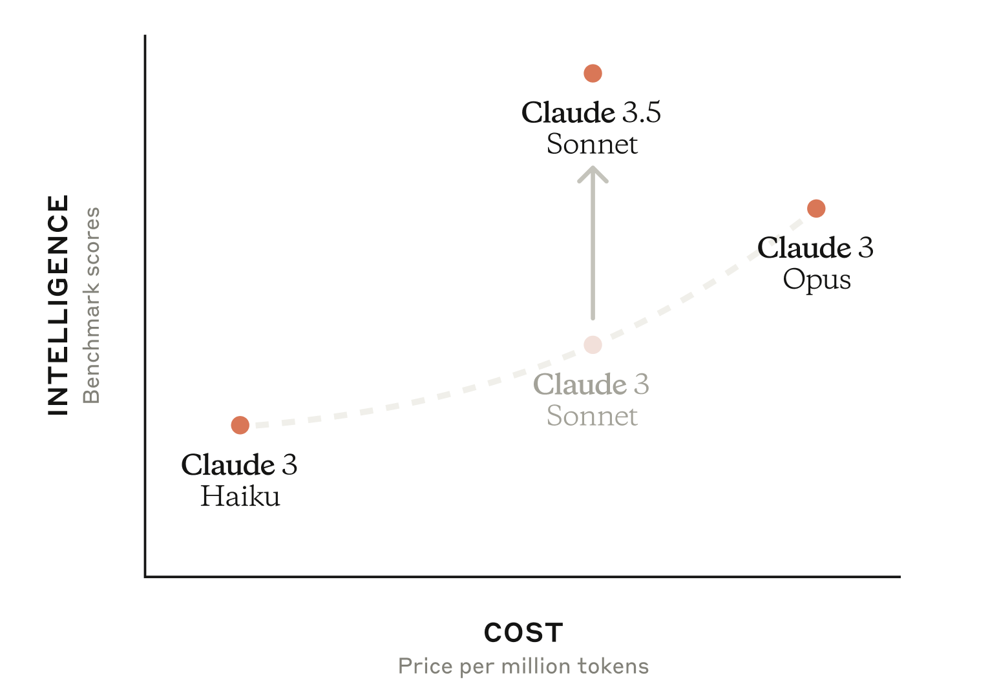

## Non-Streaming

Let's first begin by implementing the non-streaming way to interact with Anthropic.

First thing is to create a file under `models` and name it `anthropic.go`.

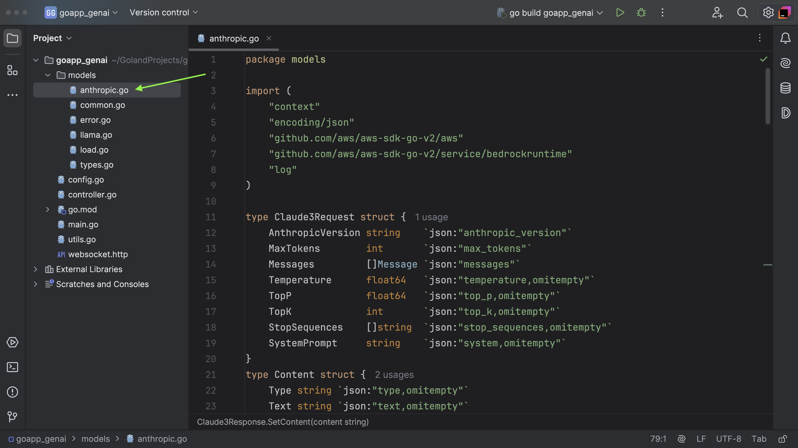

```go
package models

type Claude3Request struct {
	AnthropicVersion string    `json:"anthropic_version"`
	MaxTokens        int       `json:"max_tokens"`
	Messages         []Message `json:"messages"`
	Temperature      float64   `json:"temperature,omitempty"`
	TopP             float64   `json:"top_p,omitempty"`
	TopK             int       `json:"top_k,omitempty"`
	StopSequences    []string  `json:"stop_sequences,omitempty"`
	SystemPrompt     string    `json:"system,omitempty"`
}
type Content struct {
	Type string `json:"type,omitempty"`
	Text string `json:"text,omitempty"`
}
type Message struct {
	Role    string    `json:"role,omitempty"`
	Content []Content `json:"content,omitempty"`
}

type Claude3Response struct {
	ID              string            `json:"id,omitempty"`
	Model           string            `json:"model,omitempty"`
	Type            string            `json:"type,omitempty"`
	Role            string            `json:"role,omitempty"`
	ResponseContent []ResponseContent `json:"content,omitempty"`
	StopReason      string            `json:"stop_reason,omitempty"`
	StopSequence    string            `json:"stop_sequence,omitempty"`
	Usage           Usage             `json:"usage,omitempty"`
}
type ResponseContent struct {
	Type string `json:"type,omitempty"`
	Text string `json:"text,omitempty"`
}
type Usage struct {
	InputTokens  int `json:"input_tokens,omitempty"`
	OutputTokens int `json:"output_tokens,omitempty"`
}

type PartialResponse struct {
	Type    string                 `json:"type"`
	Message PartialResponseMessage `json:"message,omitempty"`
	Index   int                    `json:"index,omitempty"`
	Delta   Delta                  `json:"delta,omitempty"`
	Usage   PartialResponseUsage   `json:"usage,omitempty"`
}

type PartialResponseMessage struct {
	ID           string               `json:"id,omitempty"`
	Type         string               `json:"type,omitempty"`
	Role         string               `json:"role,omitempty"`
	Content      []interface{}        `json:"content,omitempty"`
	Model        string               `json:"model,omitempty"`
	StopReason   string               `json:"stop_reason,omitempty"`
	StopSequence interface{}          `json:"stop_sequence,omitempty"`
	Usage        PartialResponseUsage `json:"usage,omitempty"`
}

type PartialResponseUsage struct {
	InputTokens  int `json:"input_tokens,omitempty"`
	OutputTokens int `json:"output_tokens,omitempty"`
}

type Delta struct {
	Type       string `json:"type,omitempty"`
	Text       string `json:"text,omitempty"`
	StopReason string `json:"stop_reason,omitempty"`
}

func (r Claude3Response) SetContent(content string) {
	r.ResponseContent[0].Text = content
}
func (r Claude3Response) GetContent() string {
	return r.ResponseContent[0].Text
}

```

Let's break it down.

The `Claude3Request` struct is used to send request to Claude Haiku API.

- **AnthropicVersion** — A string indicating the version of the Anthropic API. The value must be `bedrock-2023-05-31`.
- **MaxTokens** — The maximum number of tokens to generate before stopping.
- **Messages** — An array of input messages.
- **Temperature** — The amount of randomness injected into the response.
- **TopP** — In nucleus sampling, Anthropic Claude computes the cumulative distribution over all the options for each subsequent token in decreasing probability order and cuts it off once it reaches a particular probability specified by `top_p`. You should alter either `temperature` or `top_p`, but not both.
- **TopK** — Only sample from the top K options for each subsequent token.
- **StopSequences** — Custom text sequences that cause the model to stop generating.
- **SystemPrompt** — A system prompt is a way of providing context and instructions to Anthropic Claude, such as specifying a particular goal or role.

I don't want to get into more details. As everything is mentioned in the official documentation.

For reference, you can check out the [Claude Messages API](https://docs.aws.amazon.com/bedrock/latest/userguide/model-parameters-anthropic-claude-messages.html) and Anthropic API [Docs](https://docs.anthropic.com/en/api/getting-started).

Invoking from the CLI.

```bash
aws bedrock-runtime invoke-model \
--model-id anthropic.claude-3-haiku-20240307-v1:0 \
--body "{\"messages\":[{\"role\":\"user\",\"content\":[{\"type\":\"text\",\"text\":\"Hello\\nHello! How can I assist you today?\"}]}],\"anthropic_version\":\"bedrock-2023-05-31\",\"max_tokens\":2000,\"temperature\":1,\"top_k\":250,\"top_p\":0.999,\"stop_sequences\":[\"\\n\\nHuman:\"]}" \
--cli-binary-format raw-in-base64-out \
--region ap-south-1 \
invoke-model-output.txt
```

The sample payload will give you clarity about the above Go structs which we created.

```json
{
	"messages": [
		{
			"role": "user",
			"content": [
				{
					"type": "text",
					"text": "Hello Hello! How can I assist you today?"
				}
			]
		}
	],
	"anthropic_version": "bedrock-2023-05-31",
	"max_tokens": 2000,
	"temperature": 1,
	"top_k": 250,
	"top_p": 0.999,
	"stop_sequences": ["Human:"]
}
```

Moving ahead, we need to create a new function named `AnthropicBody`. I believe now you can relate this function with the above JSON.

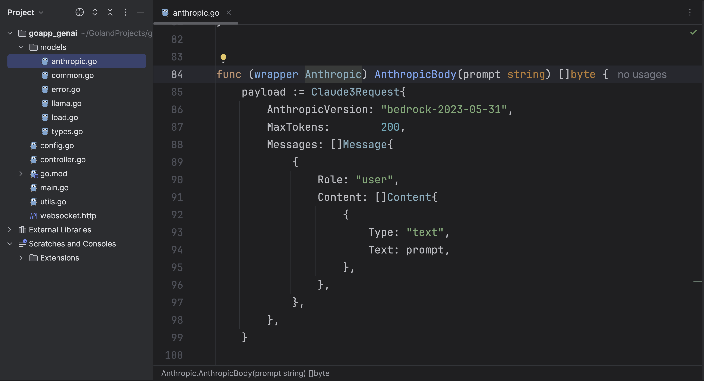

This function accepts user-provided prompt and followed up with creating a new `Claude3Request` and framing the payload based on API specification and finally returning JSON byte slice.

```go
func (wrapper Anthropic) AnthropicBody(prompt string) []byte {
	payload := Claude3Request{
		AnthropicVersion: "bedrock-2023-05-31",
		MaxTokens:        200,
		Messages: []Message{
			{
				Role: "user",
				Content: []Content{
					{
						Type: "text",
						Text: prompt,
					},
				},
			},
		},
	}

	body, err := json.Marshal(payload)
	if err != nil {
		log.Fatal(err)
	}
	return body
}

```

Moving forward, lets implemented the `Invoke` method, which is similar to the `llama3`.


This function wraps the behavior of invoking a model using `BedrockRuntimeClient`. First, it calls `AnthropicBody` to prepare the input body. The model is then invoked using the AWS client with a `ModelId` and `ContentType` specified within `InvokeModelInput`. If the model invocation fails, a fatal error will be logged.

```go
func (wrapper Anthropic) Invoke() (string, error) {
	body := wrapper.AnthropicBody(wrapper.prompt)

	output, err := wrapper.bedrock.BedrockRuntimeClient.InvokeModel(context.TODO(), &bedrockruntime.InvokeModelInput{
		ModelId:     aws.String(claudeV3ModelID),
		ContentType: aws.String("application/json"),
		Body:        body,
	})
	if err != nil {
		log.Fatal(err)
	}

	var resp Claude3Response

	err = json.Unmarshal(output.Body, &resp)

	if err != nil {
		log.Fatal(err)
	}

	return resp.ResponseContent[0].Text, nil
}

```

Now, move on to add the missing logic.So, earlier we have handled the `llama3`, now it's time for Anthropic.

Move to `load.go` file and look for the switch case in the `LoadModel` function.

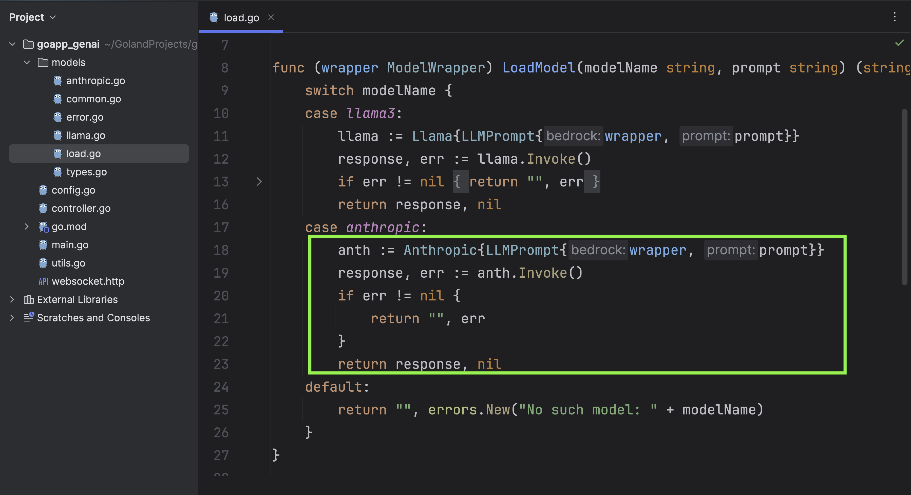

It is quite similar to what we did before. If receive the model name as anthropic from WebSocket, then we invoke the respective model.

```go
	case anthropic:
		anth := Anthropic{LLMPrompt{wrapper, prompt}}
		response, err := anth.Invoke()
		if err != nil {
			return "", err
		}
		return response, nil
```

Well, we are all set. As you know, in the previous we have already generalized our `controller` which can invoke the model dynamically, as we pass the model name through query params.

Now, go ahead and start your server.

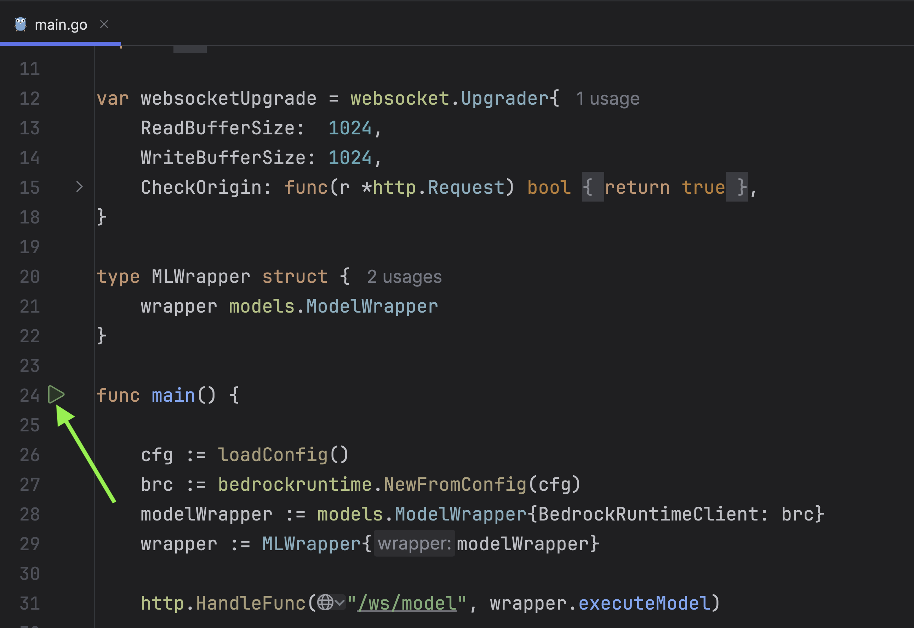

Next, open `websocket.http` file which we created earlier and pass `model=anthropic` and `streaming=0` because we are working on the non-streaming part.

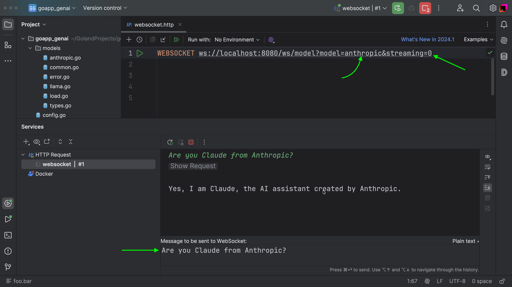

WooHoo! It worked. You will observe the response time is quite faster compared to `llama3`. But we can observe more speed once we implement the streaming part. Let's go ahead.

## Streaming

Open `anthropic.go` file and create a new function `Stream()`.

This is similar to what we did for `llama3`.

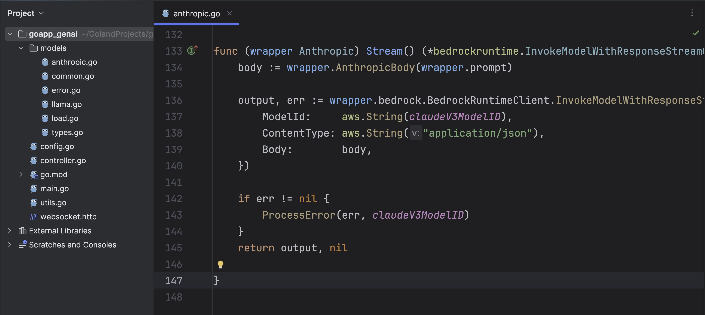

This function is attached to the `Anthropic` struct. It prepares a JSON payload with the `AnthropicBody()` function and sends a request to `BedrockRuntimeClient.InvokeModelWithResponseStream`. If any errors occur during the model invocation, they're processed for more meaningful error messages with the `ProcessError()` function and if everything is working as per expectation, then it returns the response stream.

```go
func (wrapper Anthropic) Stream() (*bedrockruntime.InvokeModelWithResponseStreamOutput, error) {
	body := wrapper.AnthropicBody(wrapper.prompt)

	output, err := wrapper.bedrock.BedrockRuntimeClient.InvokeModelWithResponseStream(context.TODO(), &bedrockruntime.InvokeModelWithResponseStreamInput{
		ModelId:     aws.String(claudeV3ModelID),
		ContentType: aws.String("application/json"),
		Body:        body,
	})

	if err != nil {
		ProcessError(err, claudeV3ModelID)
	}
	return output, nil

}

```

Moving forward, update the `LoadStreamingModel` function in `load.go`.

As you can see we have already handled the `llama3`. Now the switch condition will tackle anthropic as well.

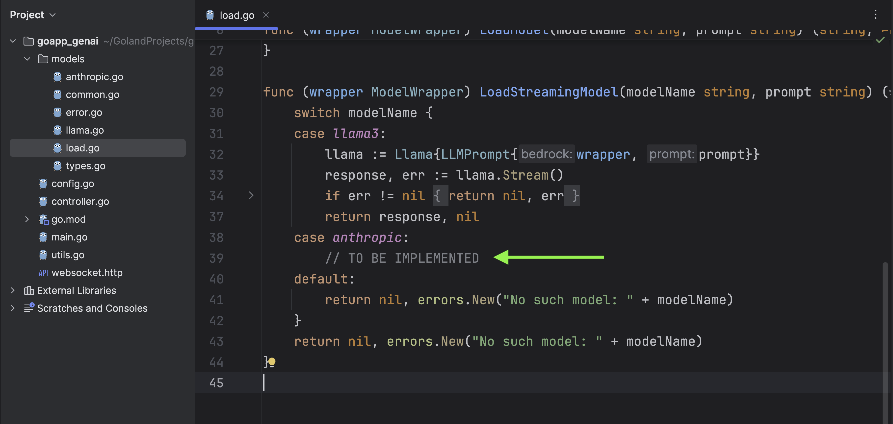

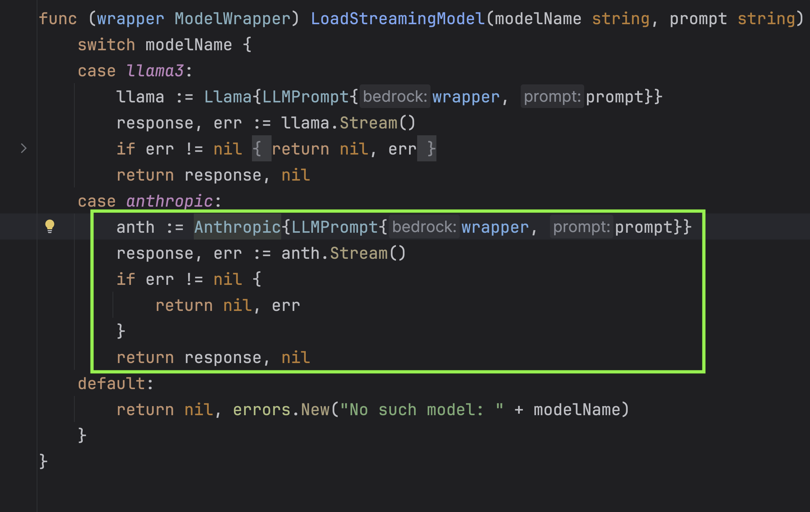

The code snippet is part of a function that handles loading and calling different models based on their names. In this specific case, when the model name is `anthropic`, an `Anthropic` object is created, and its `Stream` method is called, which tries to invoke the model and returns a streamed response.

```go
		anth := Anthropic{LLMPrompt{wrapper, prompt}}
		response, err := anth.Stream()
		if err != nil {
			return nil, err
		}
		return response, nil
```

Moving further, we need to create a new function `ProcessAnthropicStreamingOutput` in `anthropic.go`.

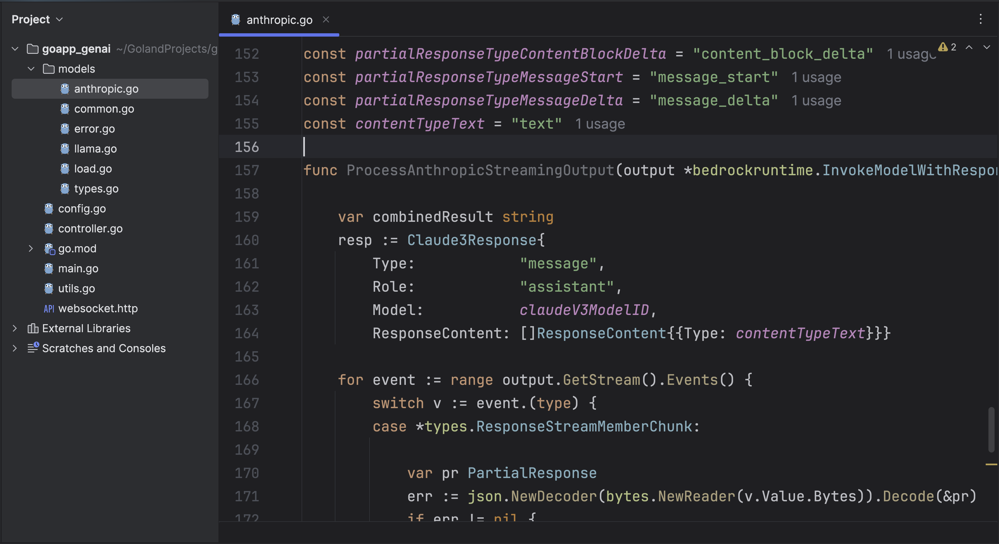

```go
ResponseContent := []ResponseContent{\{Type: contentTypeText}}}

```

The provided Go code is for a function ProcessAnthropicStreamingOutput that processes a streaming output from an invoked model. The model's represented by output, a pointer to InvokeModelWithResponseStreamOutput, while handler is a function that handles each part of the output stream.

Before processing the stream's events, the function creates a Claude3Response struct which will hold the response content's elements. This data is pre-populated with some pre-defined values.

The function then enters a loop that runs for each event in the model's response stream. It uses a type switch to determine the event type and handle it accordingly:

For \*types.ResponseStreamMemberChunk types, it attempts to decode the chunk into a PartialResponse struct. If the response type is partialResponseTypeContentBlockDelta, the handler function is called with the current context and the decoded text as a byte slice. The decoded text is then appended to the combinedResult string. If the response type is partialResponseTypeMessageStart, some fields in the Claude3Response struct are populated using the partial response. And if the response type is partialResponseTypeMessageDelta, again some fields in the Claude3Response struct are updated. If any error occurred during the decoding process or if the partial response type is not recognized, the function returns an error.

For\*types.UnknownUnionMember types, an error is returned with a message that includes the unknown tag.
For all other event types, an error is returned indicating that the union type is unknown or nil.
If the function processes all the events without returning an error, it finishes by returning nil, indicating the processing was successful.

The helper function StreamingOutputHandler used in this function takes a context.Context and a byte slice as input and returns an error. The actual implementation of this function in the real code would provide additional context to its functionality.

The various constant and struct types referenced in the code are predefined types and constant values that must be understood in the context of the entire codebase they are part of. They are used for setting values, decoding JSON and generally structuring the data flow in this function.

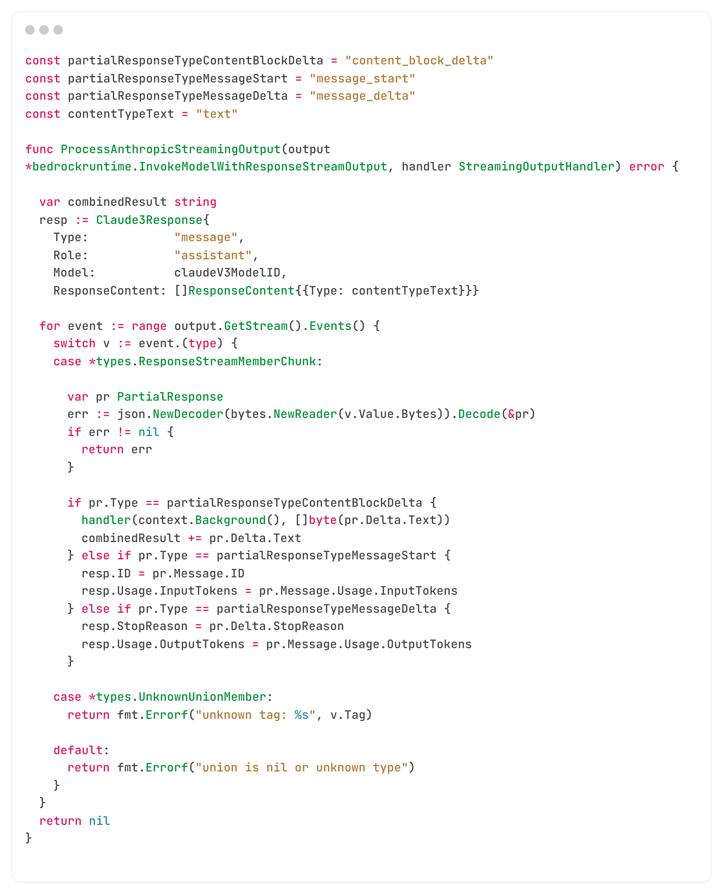

Coming next the last part

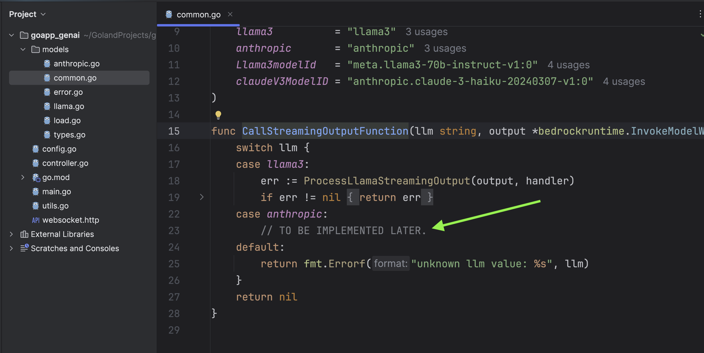

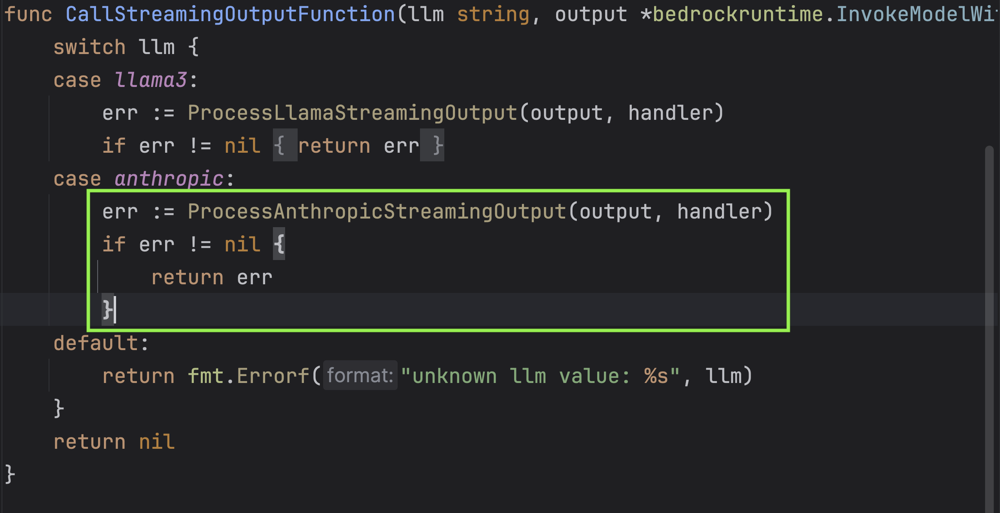

```go
func CallStreamingOutputFunction(llm string, output *bedrockruntime.InvokeModelWithResponseStreamOutput, handler StreamingOutputHandler) error {
	switch llm {
	case llama3:
		err := ProcessLlamaStreamingOutput(output, handler)
		if err != nil {
			return err
		}
	case anthropic:
		err := ProcessAnthropicStreamingOutput(output, handler)
		if err != nil {
			return err
		}
	default:
		return fmt.Errorf("unknown llm value: %s", llm)
	}
	return nil
}
```

Let's test it out.

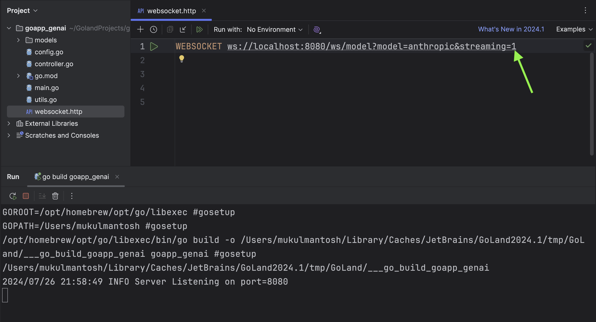

<video width="1366" height="768" controls>
  <source src="./images/anthropic_streaming.webm" type="video/webm">
  Your browser does not support the video tag.
</video>
