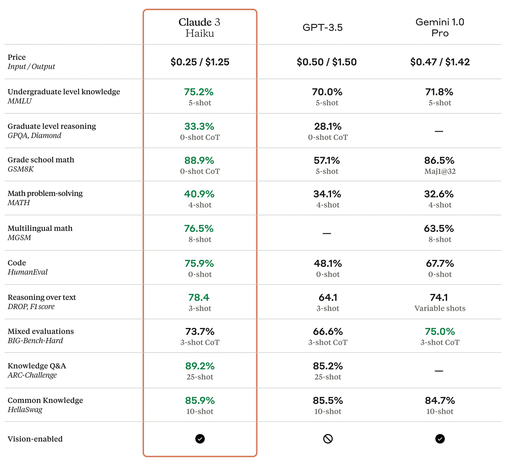

In this section we will be working with Anthropic. This section is quite similar to the previous one, implementing streaming and non-streaming features.

Anthropic has multiple types of models supported like Claude 3 Sonnet, 3.5 Sonnet, Opus and Haiku. You can check over [here](https://docs.aws.amazon.com/bedrock/latest/userguide/model-parameters-claude.html) the inference parameters and code examples.

## Anthropic Haiku

For this tutorial, we will be using Anthropic Haiku.

According to Anthropic.

> _Haiku is the fastest and most cost-effective model on the market for its intelligence category. It can read an information and data dense research paper on arXiv (~10k tokens) with charts and graphs in less than three seconds._

