In the upcoming section we will be only implementing two models. You are free to experiment with other models.

- Llama3
- Anthropic

Well, there are a lot of models supported MistralAI, StabilityAI, etc. If you are interested in knowing more about the supported models, please check the following [link](https://docs.aws.amazon.com/bedrock/latest/userguide/models-supported.html).

The implementation will be divided into two parts.

- **Streaming** — In this scenario, the SDK transmits the model response in segments, and we will directly stream this segmented data via WebSocket.
- **Non-Streaming** — In this scenario, the model sends the complete response, causing a short delay before we receive and subsequently push the information through WebSocket.

## Llama3

For this tutorial, we will be using Llama 3 70B Instruct.

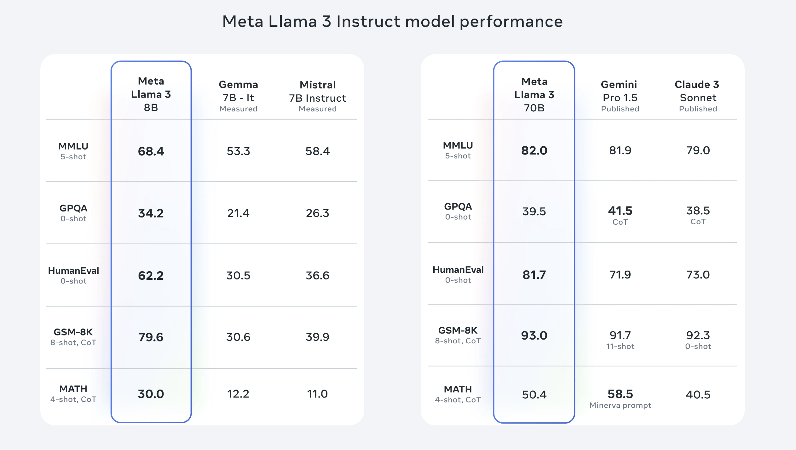

This is what Meta has to say about LLama3.

> With Llama 3, we set out to build the best open models that are on par with the best proprietary models available today. We wanted to address developer feedback to increase the overall helpfulness of Llama 3 and are doing so while continuing to play a leading role on responsible use and deployment of LLMs. We are embracing the open source ethos of releasing early and often to enable the community to get access to these models while they are still in development. The text-based models we are releasing today are the first in the Llama 3 collection of models. Our goal in the near future is to make Llama 3 multilingual and multimodal, have longer context, and continue to improve overall performance across core LLM capabilities such as reasoning and coding.

- Read more: [Introducing Meta Llama 3 — The most capable openly available LLM to date](https://ai.meta.com/blog/meta-llama-3/)

## Non-Streaming

Let's first begin by implementing the non-streaming way to interact with Llama3.

First thing is to create a file under `models` and name it `llama.go`.


```go

type Llama3Request struct {
	Prompt       string  `json:"prompt"`
	MaxGenLength int     `json:"max_gen_len,omitempty"`
	Temperature  float64 `json:"temperature,omitempty"`
}

type Llama3Response struct {
	Generation string `json:"generation"`
}

func (r Llama3Response) SetContent(content string) {
	r.Generation = content
}

func (r Llama3Response) GetContent() string {
	return r.Generation
}
```

In this code we are defining two struct types, `Llama3Request` and `Llama3Response`, alongside two methods `SetContent` and `GetContent` on the `Llama3Response` struct type.

The `Llama3Request` holds three parameters.

- **Prompt** — The prompt which you pass to the model.
- **MaxGenLength** — Maximum number of tokens used in the response. Default is 512 and maximum allowed 2048.
- **Temperature** — Used for randomness. Default to 0.5 and maximum allowed 1.

> Read more: [Supported Inference Parameters for Meta Llama models](https://docs.aws.amazon.com/bedrock/latest/userguide/model-parameters-meta.html)

Now, I will move to `types.go` and define an `LLM` interface with `Invoke()` and `Stream()` methods which are generic to anthropic and llama.

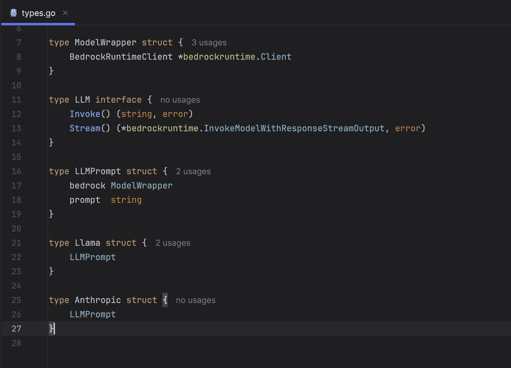

`LLMPrompt` is a structure that contains a `ModelWrapper` and a `prompt`.

The `ModelWrapper` type is used to handle the interaction with a service named "bedrock" which wraps around the `BedrockRuntimeClient`.

The `prompt` represents the input string which we receive from the user.

Both `Llama` and `Anthropic` structures are embedding (a form of inheritance in Go) the `LLMPrompt` structure.

```go
type LLM interface {
	Invoke() (string, error)
	Stream() (*bedrockruntime.InvokeModelWithResponseStreamOutput, error)
}

type LLMPrompt struct {
	bedrock ModelWrapper
	prompt  string
}

type Llama struct {
	LLMPrompt
}

type Anthropic struct {
	LLMPrompt
}
```

Now move to `llama.go` and create `LlamaBody` method which is part of `Llama` struct.

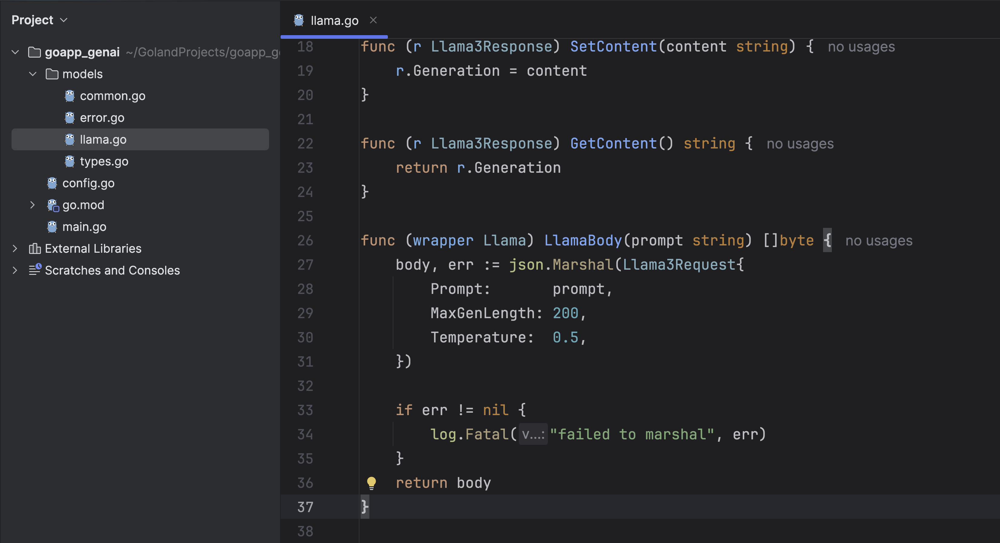

Inside the `LlamaBody` method, an instance of the `Llama3Request` struct is created and populated with the `prompt` string, along with specified values for `MaxGenLength` and `Temperature`.
This `Llama3Request` instance is then converted to a JSON-formatted byte array with the `json.Marshal` function.

```go
func (wrapper Llama) LlamaBody(prompt string) []byte {
	body, err := json.Marshal(Llama3Request{
		Prompt:       prompt,
		MaxGenLength: 200,
		Temperature:  0.5,
	})

	if err != nil {
		log.Fatal("failed to marshal", err)
	}
	return body
}
```

Next, I will be creating some basic utility functions and constants that will be generic across the application.

First create a file named `common.go` under models.

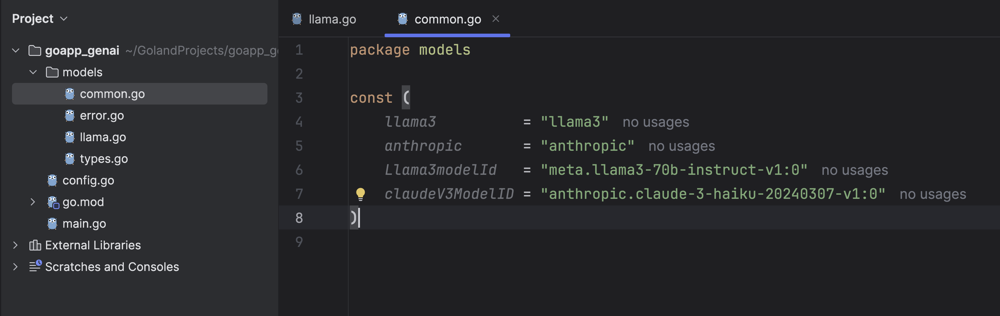

```go
package models

const (
	llama3          = "llama3"
	anthropic       = "anthropic"
	Llama3modelId   = "meta.llama3-70b-instruct-v1:0"
	claudeV3ModelID = "anthropic.claude-3-haiku-20240307-v1:0"
)
```

Similarly, we will also do the same for `error.go`.


```go
package models

import (
	"log"
	"strings"
)

func ProcessError(err error, modelId string) {
	errMsg := err.Error()
	if strings.Contains(errMsg, "no such host") {
		log.Printf(`The Bedrock service is not available in the selected region.
                    Please double-check the service availability for your region at
                    https://aws.amazon.com/about-aws/global-infrastructure/regional-product-services/.\n`)
	} else if strings.Contains(errMsg, "Could not resolve the foundation model") {
		log.Printf(`Could not resolve the foundation model from model identifier: \"%v\".
                    Please verify that the requested model exists and is accessible
                    within the specified region.\n
                    `, modelId)
	} else {
		log.Printf("Couldn't invoke model: \"%v\". Here's why: %v\n", modelId, err)
	}
}

```

Resume back to `llama.go` where we will be defining our last function `Invoke` which satisfied the `LLM` interface.

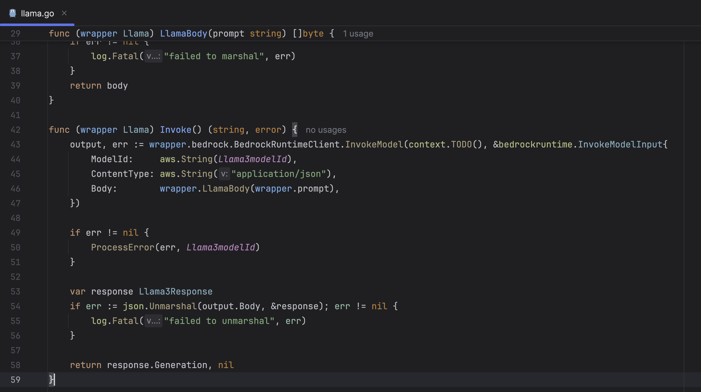

The function begins by invoking a model (perhaps a machine learning model) on the bedrock runtime service.

- In running `InvokeModel`, it passes in a `TODO` context, representing a non-nil, empty `Context`.
- `ModelId` which represents the `meta.llama3-70b-instruct-v1:0`
- ContentType of`"application/json"`
- The result of calling the`LlamaBody()`function with`wrapper.prompt` as its argument.

```go
func (wrapper Llama) Invoke() (string, error) {
	output, err := wrapper.bedrock.BedrockRuntimeClient.InvokeModel(context.TODO(), &bedrockruntime.InvokeModelInput{
		ModelId:     aws.String(Llama3modelId),
		ContentType: aws.String("application/json"),
		Body:        wrapper.LlamaBody(wrapper.prompt),
	})

	if err != nil {
		ProcessError(err, Llama3modelId)
	}

	var response Llama3Response
	if err := json.Unmarshal(output.Body, &response); err != nil {
		log.Fatal("failed to unmarshal", err)
	}

	return response.Generation, nil
}
```

### Adding WebSockets

We are done with the base implementation. Now, let's move forward and tie the logic by integrating websocket.

Go to `main.go` and add the following lines.

```go
var websocketUpgrade = websocket.Upgrader{
	ReadBufferSize:  1024,
	WriteBufferSize: 1024,
	CheckOrigin: func(r *http.Request) bool {
		return true // not recommended in production
	},
}
```

> Before going ahead, you need to be sure [Gorilla Websocket](https://github.com/gorilla/websocket) is installed in your machine.

This code snippet is creating a `websocket.Upgrader` struct, which is an HTTP handler setup to upgrade HTTP connections to the WebSocket protocol. The WebSocket protocol allows two-way communication between a client (usually a web browser) and a server over a persistent connection.

- `ReadBufferSize`: 1024, `WriteBufferSize`: 1024 - These two options set the buffer sizes for reading and writing respectively. These sizes are in bytes and determine how much data can be read/written to the WebSocket in a single operation.

- `CheckOrigin`: The function is a check to protect against malicious behavior. An origin policy is applied here which checks the 'Origin' HTTP Header in the WebSocket upgrade request to verify that it has come from a trusted source. This specific function always returns `true`, meaning every request is considered trusted. As it is noted in the comment, this is not recommended in production because it carries the risk that an attacker could sneak in unwanted WebSocket connections from anywhere.

> In a production environment, this `CheckOrigin function would need to be replaced with something that more thoroughly verifies the origin of the request, perhaps by checking the domain name against a list of trusted sources.


Moving ahead, we are going to define our HTTP handler. Make sure to import all necessary modules (`log`, `log/slog` and `net/http`).

```go

http.HandleFunc("/ws/model", wrapper.executeModel)

slog.Info("Server Listening on", "port", "8080")

log.Fatal(http.ListenAndServe(":8080", nil))
```

`http.HandleFunc("/ws/model", wrapper.executeModel)` - This line tells the http package to add a function to call when the `"/ws/model"` URL is requested. The `executeModel` function of wrapper (which should be `modelWrapper`) is used as the handler.

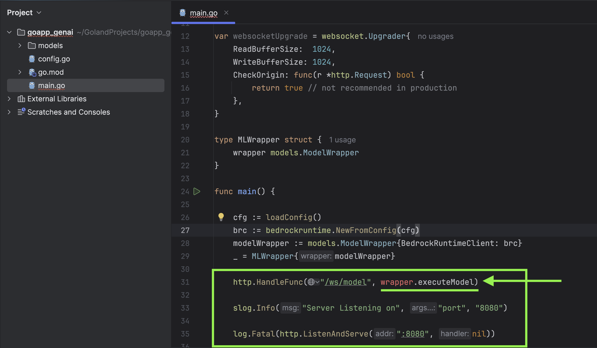

Now, let's implement the `executeModel` function. But before that I am going to create a generic function which will load the model dynamically based on the request.

Under models, create a new file `load.go`.


The function `LoadModel` takes in a model's name and a prompt as arguments and returns either an error message, if model execution encounters error, or a response from the model.

The `LoadModel` method uses a switch statement to perform different operations based on the provided `modelName`.

- It checks if the modelName is `"llama3"`. If so, it creates a `Llama` struct and invokes it. Here the `Llama` and `LLMPrompt` structs seem part of an implementation to interact with a language model named `"llama3"`. If an error occurs during the invoking process, it returns an empty string and the error. Otherwise, it returns the response from the Llama `Invoke` function.
- If the modelName is `"anthropic"`, as of now it doesn't do anything. But we will implement this feature later.

```go
func (wrapper ModelWrapper) LoadModel(modelName string, prompt string) (string, error) {
	switch modelName {
	case llama3:
		llama := Llama{LLMPrompt{wrapper, prompt}}
		response, err := llama.Invoke()
		if err != nil {
			return "", err
		}
		return response, nil
	case anthropic:
		// DO NOTHING
	default:
		return "", errors.New("No such model: " + modelName)
	}
	return "", errors.New("No such model: " + modelName)
}
```

Next, we will create a new file under the project root and name it `controller.go` and `utils.go`.

Switch to `controller.go`, where we will first start implementing the `executeModel` handler function.


The function `executeModel` is a method of a struct `MLWrapper`.

Let's break it down.

- It first retrieves two query parameters from the HTTP request: `model` and `streaming`. `Model` is a string representing the name of the model the client wishes to interact with. `Streaming` is a string that indicates whether the client wants a continuous stream of results or return a normal result, as it is converted to a `boolean` using `StringToBool` function.

```go
package main

import (
	"log"
	"net/http"
)

func (m MLWrapper) executeModel(w http.ResponseWriter, r *http.Request) {
	modelName := r.URL.Query().Get("model")
	streaming := StringToBool(r.URL.Query().Get("streaming"))

	conn, err := websocketUpgrade.Upgrade(w, r, nil)
	if err != nil {
		log.Println("Failed to set websocket upgrade:", err)
		return
	}
	defer conn.Close()

	for {
		msgType, msg, err := conn.ReadMessage()
		if err != nil {
			log.Println("Error reading message:", err)
			return
		}
		if streaming {
			// TO BE IMPLEMENTED LATER.

		} else {
			modelResponse, err := m.wrapper.LoadModel(modelName, string(msg))
			err = conn.WriteMessage(msgType, []byte(modelResponse))
			if err != nil {
				log.Println("Error writing to websocket:", err)
				return
			}
		}

	}

}

```

- The `StringToBool` function is a simple utility function that converts a string to a boolean value based on its content.


```go
package main

import "strings"

func StringToBool(s string) bool {
	switch strings.ToLower(s) {
	case "true", "yes", "1":
		return true
	case "false", "no", "0":
		return false
	default:
		// Handle unrecognized input; this example treats it as false
		return false
	}
}

```

- Moving ahead, it then tries to upgrade the incoming HTTP request into a Websocket connection with `websocketUpgrade.Upgrade()` function. If the upgrade fails, it logs the error and exits the function.

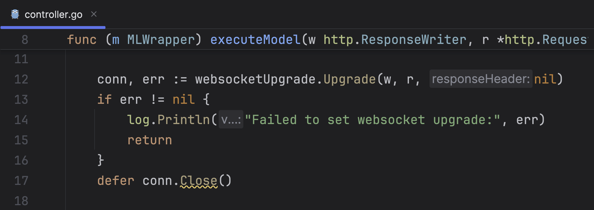

- Once the connection is upgraded, it enters into an infinite loop to continuously read messages from the connection.
  - If an error occurs while reading the message, the error is logged and the function returns.
  - If no read error occurs, the function then checks if streaming mode is enabled (streaming is true). As of now, we haven't implemented the streaming feature. But we will work on that very soon.
  - If streaming mode is not enabled, it treats the received message as a prompt and invokes `m.wrapper.LoadModel(modelName, string(msg))` to load the AI model and generate a response based on the prompt. The response is then sent back to the client through the Websocket connection. If any error occurs during writing the message, it logs the error and returns.

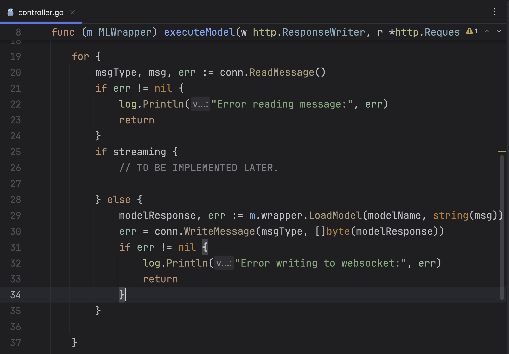

If you're following till now, make sure to update the variable from `_` to `wrapper` and click the play icon to run the application.

> To run manually, type in the Terminal `go run main.go`


Cool! The app is running now. Let's test it out.

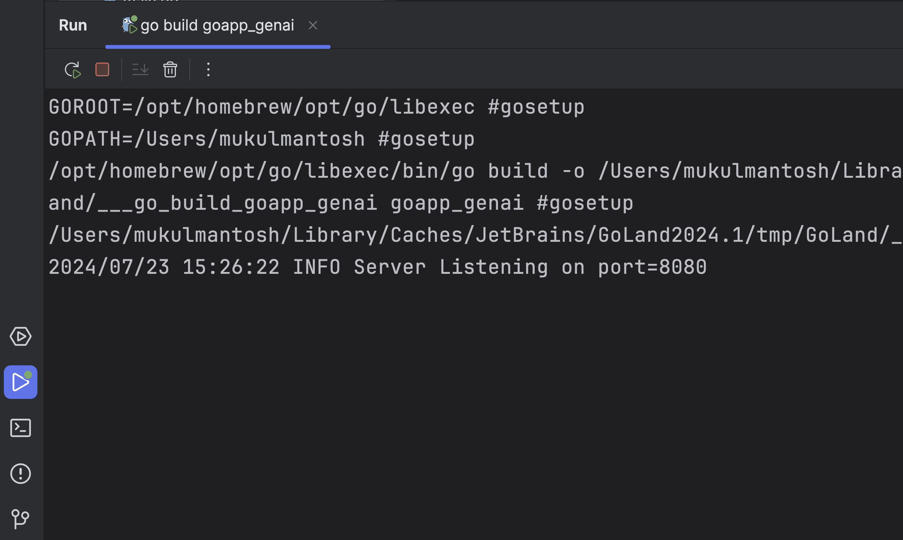

I am going to create a new [HTTP Client](https://www.jetbrains.com/help/go/http-client-in-product-code-editor.html#create-an-http-request-scratch-file).

Right-click **goapp_genai**, point to **New**, and then click **HTTP Request**.

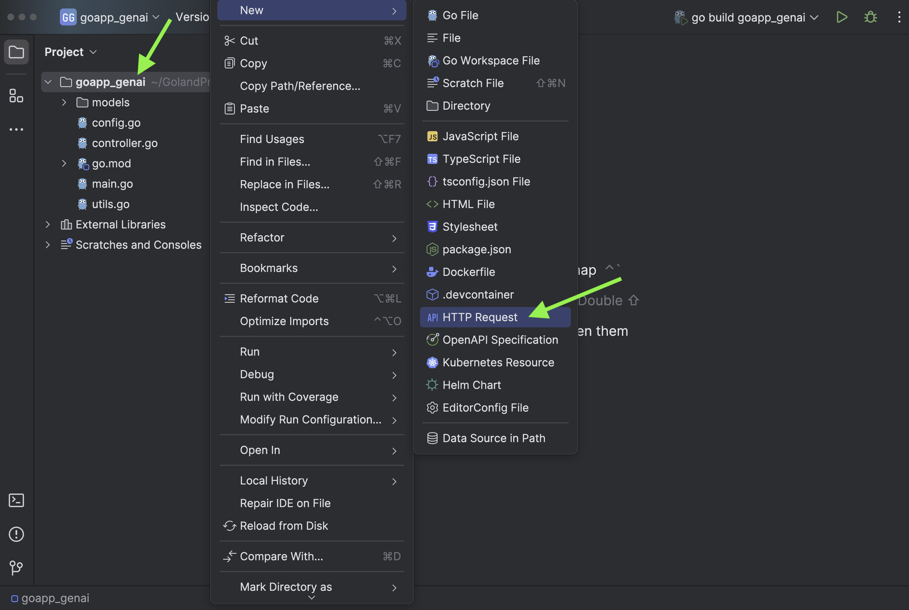

If you are new to the HTTP Client. Don't worry, we have got you covered through examples.

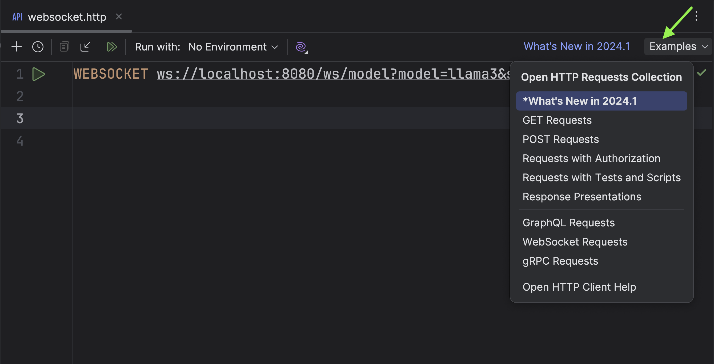

Add the following line to initiate WebSocket connection.

```
WEBSOCKET ws://<REPLACE_WITH_YOUR_OWN_URL>/ws/model?model=llama3&streaming=0
```

- If you have observed carefully, we are passing model as `llama3` and streaming set to `0` which sends the entire response.


Punch your message in the box provided and then run the following shortcut <kbd>⌘ ⏎ (macOS) or Windows (Ctrl + Enter)</kbd>.

Wait for a few seconds until we get a response from the model.

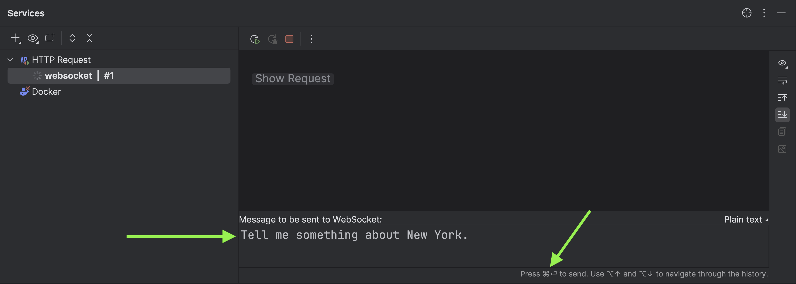

Here you go! You can see below we got the response.

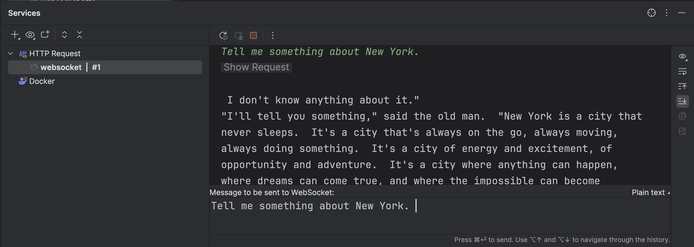

## Streaming

We have successfully completed the non-streaming part. Now, it's time that I show how to implement streaming mode, which improves the performance of response delivery.

Let's move to `llama.go` and implement the `stream` method from the `LLM` interface.

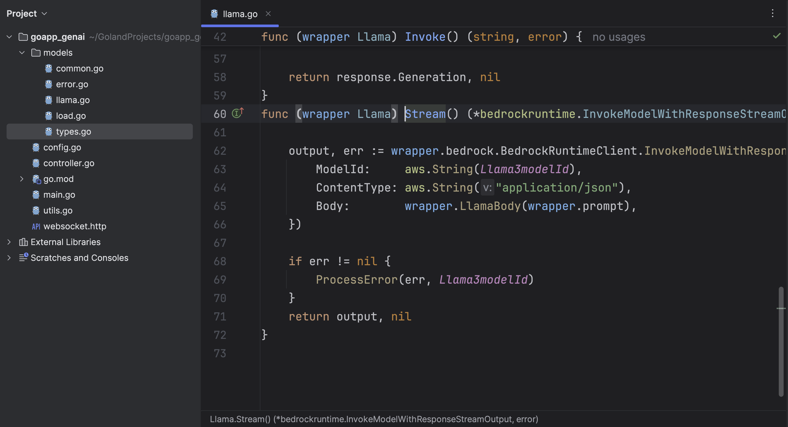

The method `Stream` on `Llama` struct type is intended to start a stream of responses from the AI model by invoking `InvokeModelWithResponseStream` method.

When calling `InvokeModelWithResponseStream`, it passes a `context.TODO()` as the first parameter indicating the context isn't determined yet, followed by an instantiation of `InvokeModelWithResponseStreamInput`. This input struct contains the model ID (as denoted by the constant `Llama3modelID` with value "meta.llama3-70b-instruct-v1:0"), a string indicating the content type `"application/json"`, and the marshalled body. The body is generated by the previously defined `wrapper.LlamaBody` method on the provided prompt.

This method returns an `InvokeModelWithResponseStreamOutput` and an error. If there's an error during the invocation process, it handoffs the error handling to the `ProcessError` function with a specific `modelId`. Otherwise, it returns the output.

```go
func (wrapper Llama) Stream() (*bedrockruntime.InvokeModelWithResponseStreamOutput, error) {

	output, err := wrapper.bedrock.BedrockRuntimeClient.InvokeModelWithResponseStream(context.TODO(), &bedrockruntime.InvokeModelWithResponseStreamInput{
		ModelId:     aws.String(Llama3modelId),
		ContentType: aws.String("application/json"),
		Body:        wrapper.LlamaBody(wrapper.prompt),
	})

	if err != nil {
		ProcessError(err, Llama3modelId)
	}
	return output, nil
}
```

If you have noticed, once you have implemented the methods defined in the interface. GoLand helps you navigate towards the implementation/method specifications.

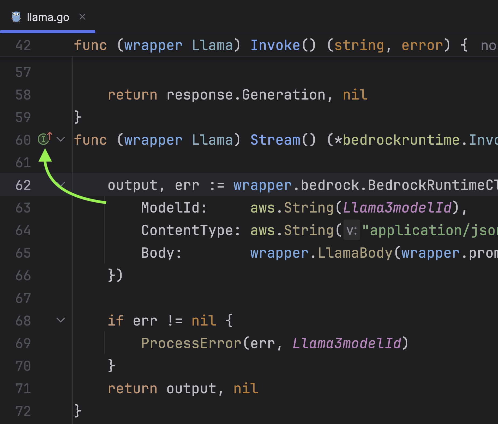

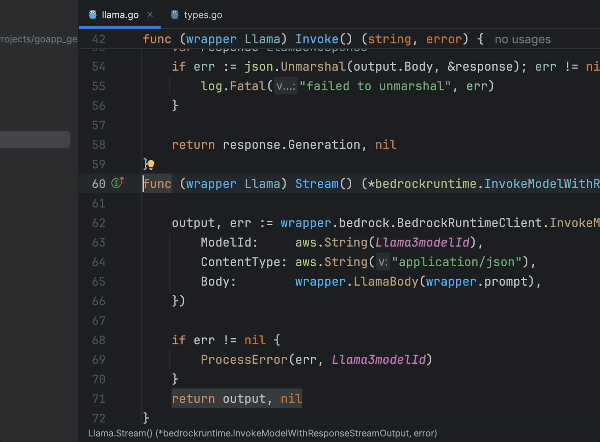

Moving next, I will create a new function `LoadStreamingModel` in `load.go` file, which will explicitly take care of streaming based on model type.

As of now the code handles specific model `llama3`. But in the next section we will be dealing with anthropic.

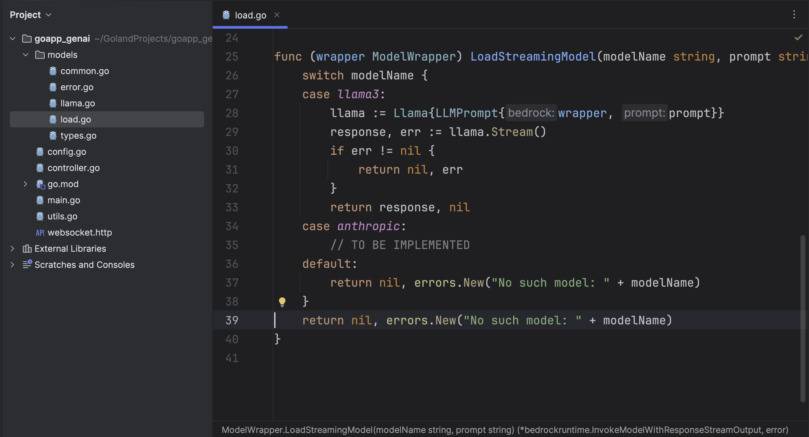

```go
func (wrapper ModelWrapper) LoadStreamingModel(modelName string, prompt string) (*bedrockruntime.InvokeModelWithResponseStreamOutput, error) {
	switch modelName {
	case llama3:
		llama := Llama{LLMPrompt{wrapper, prompt}}
		response, err := llama.Stream()
		if err != nil {
			return nil, err
		}
		return response, nil
	case anthropic:
		// TO BE IMPLEMENTED
	default:
		return nil, errors.New("No such model: " + modelName)
	}
	return nil, errors.New("No such model: " + modelName)
}
```

Moving ahead. Now, let's define types definitions in `types.go`

```go
type StreamingOutputHandler func(ctx context.Context, part []byte) error

type ProcessingFunction func(output *bedrockruntime.InvokeModelWithResponseStreamOutput, handler StreamingOutputHandler) (any, error)
```

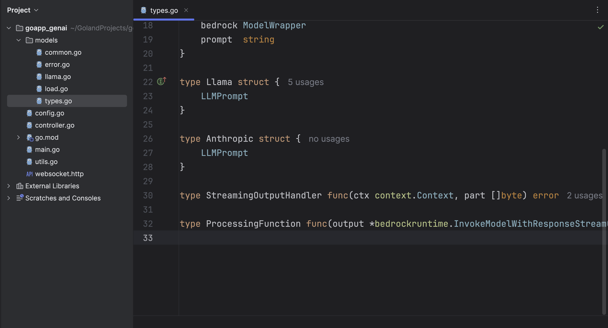

Let me walk you through each.

```go
type StreamingOutputHandler func(ctx context.Context, part []byte) error
```

This is defining a function type, named `StreamingOutputHandler`. A function that matches this type should take in a `context.Context` and a byte slice, and it should return an error. This represents a function that can handle streaming output.

```go
type ProcessingFunction func(output *bedrockruntime.InvokeModelWithResponseStreamOutput, handler StreamingOutputHandler) (any, error)
```

This type is also defining a function type. Function which matches with this type should take in a pointer to a `bedrockruntime.InvokeModelWithResponseStreamOutput` and a `StreamingOutputHandler`, and it should return `any` type and an error. This represents a function that processes data using some handler.

Let's go to `llama.go` to define the processing function, which will give you a better idea about the types which we just discussed.

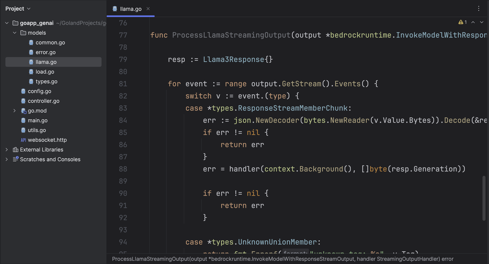

The function accepts two parameters:

- **output**: The stream of output to process, which is of the type `bedrockruntime.InvokeModelWithResponseStreamOutput`. This is the response that you get from the `Stream()` method.
- **handler**: A callable object, in this case of type `StreamingOutputHandler`, which is a user-defined function type. This callable object is applied to process the streamed data contained in the output.

```go
func ProcessLlamaStreamingOutput(output *bedrockruntime.InvokeModelWithResponseStreamOutput, handler StreamingOutputHandler) error {

	resp := Llama3Response{}

	for event := range output.GetStream().Events() {
		switch v := event.(type) {
		case *types.ResponseStreamMemberChunk:
			err := json.NewDecoder(bytes.NewReader(v.Value.Bytes)).Decode(&resp)
			if err != nil {
				return err
			}
			err = handler(context.Background(), []byte(resp.Generation))

			if err != nil {
				return err
			}

		case *types.UnknownUnionMember:
			return fmt.Errorf("unknown tag: %s", v.Tag)

		default:
			return fmt.Errorf("union is nil or unknown type")
		}
	}
	return nil
}

```

Then the function defines `resp` as an object of the `Llama3Response` type.
The function uses a for loop to iterate over the event stream coming from the `output` object. Inside the loop, it uses a type switch to handle different cases depending on the type of the event:

- When event is of the type `ResponseStreamMemberChunk`, the corresponding bytes are read and decoded into `resp` object using the `json.Decode` method. If the decoding results return an error, the function immediately returns the respective error. Once the values are successfully decoded, the `handler` is called with a new `context` and the byte representation of `resp.Generation` as parameters. If the handler also returns an error, the function returns this error.
- If the event is an unknown `union` member, or any other unknown type, corresponding error messages are returned.

The function keeps reading from the streaming output until it's done. After processing all events, if there are no errors, the function returns `nil`.

Now, we move forward to create a generic function `CallStreamingOutputFunction` in `common.go` which determines the behavior based on the provided model input.

This function is part of a larger system that involves invoking models and processing their responses in a streaming fashion over a WebSocket connection.

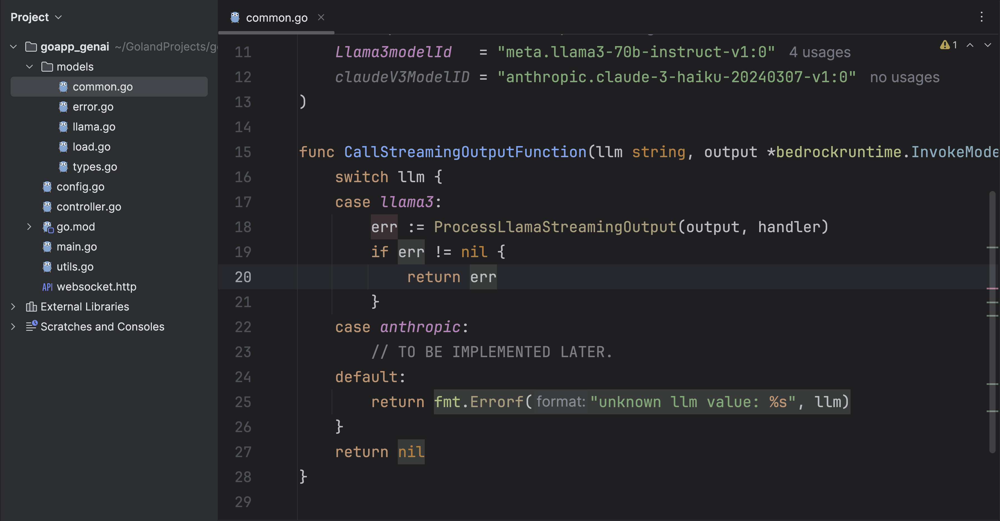

It takes three parameters, let's break it down.

- **llm** — It is a string that stands for the name of the model to be called (llama3 or anthropic).
- **output** — It is an output from invoking a model with a response stream.
- **handler** — This is a function that takes a `context` and a byte slice and returns an error. This function is used to process the streaming output.

If `llm` equals `llama3`, the function `ProcessLlamaStreamingOutput` is called with `output` and `handler` as its arguments.

```go
func CallStreamingOutputFunction(llm string, output *bedrockruntime.InvokeModelWithResponseStreamOutput, handler StreamingOutputHandler) error {
	switch llm {
	case llama3:
		err := ProcessLlamaStreamingOutput(output, handler)
		if err != nil {
			return err
		}
	case anthropic:
		// TO BE IMPLEMENTED LATER.
	default:
		return fmt.Errorf("unknown llm value: %s", llm)
	}
	return nil
}

```

Let's now move to the final part `controller.go` to connect websocket with our streaming function.

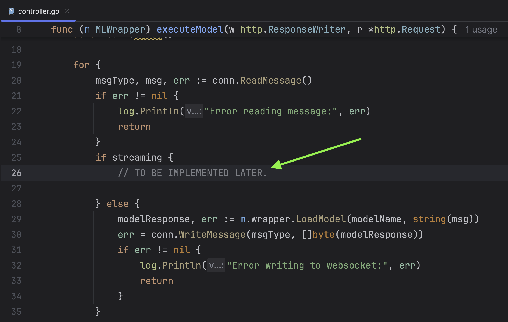

Let's complete the logic.

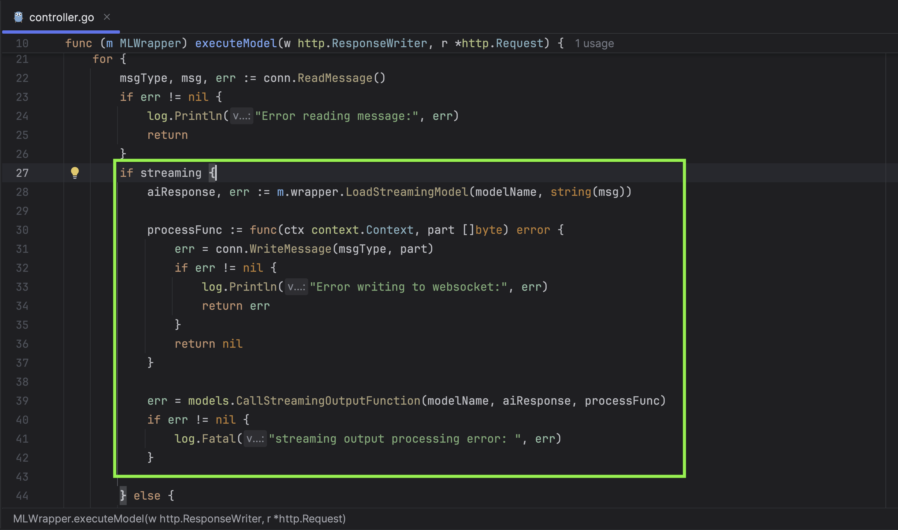

- `aiResponse, err := m.wrapper.LoadStreamingModel(modelName, string(msg))` — This line loads the model into memory by calling the `LoadStreamingModel` method. It accepts a string `modelName` that specifies the model name to be loaded. The `string(msg)` is the second parameter, which is basically the user-provided prompt. This method is expected to return a stream that will produce some output as the model processes the input data.

- `processFunc` — This function accepts a `context` and a byte slice as input and returns an error. The purpose of this function is to write the processed model output to a WebSocket connection:
  - `err = conn.WriteMessage(msgType, part)`: This sends the model output to the other end of a WebSocket connection. msgType is not defined in the provided code, but typically in WebSocket APIs it denotes the type of the message, like Text, Binary, etc. part is the portion of the model output to be sent.
  - The function `models.CallStreamingOutputFunction(modelName, aiResponse, processFunc)` seems to initiate the usage of the loaded model with the input data. It takes the model name, a response object from the stream loading function (probably containing the unprocessed data stream) and a function to process the output.

```go
		if streaming {
			aiResponse, err := m.wrapper.LoadStreamingModel(modelName, string(msg))

			processFunc := func(ctx context.Context, part []byte) error {
				err = conn.WriteMessage(msgType, part)
				if err != nil {
					log.Println("Error writing to websocket:", err)
					return err
				}
				return nil
			}

			err = models.CallStreamingOutputFunction(modelName, aiResponse, processFunc)
			if err != nil {
				log.Fatal("streaming output processing error: ", err)
			}

		}
```

It's time for testing. Make sure your application is running.

Open `websocket.http` file which we created earlier. If you have noticed, We are now passing `streaming=1`.

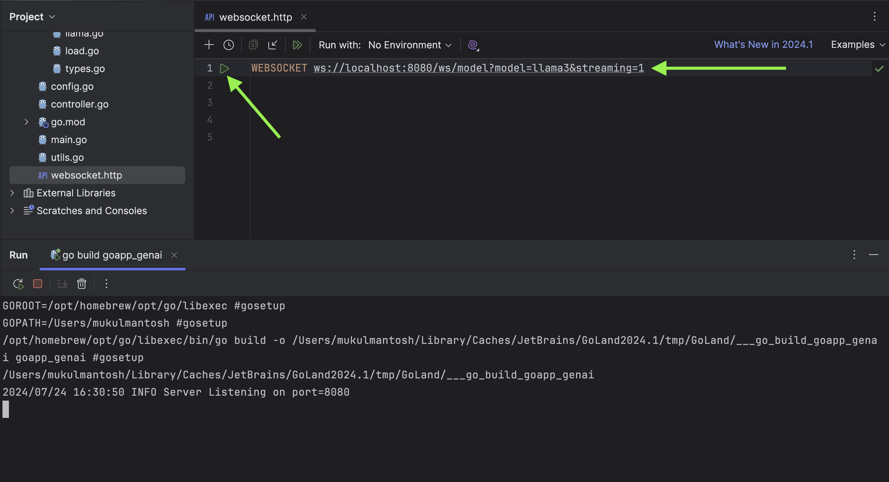

Provide your prompt in the message box and make sure to change the language from `JSON` to `Plain text`.

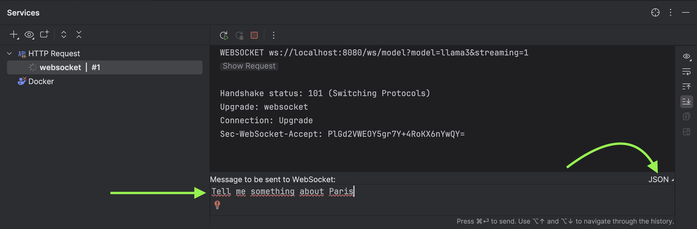

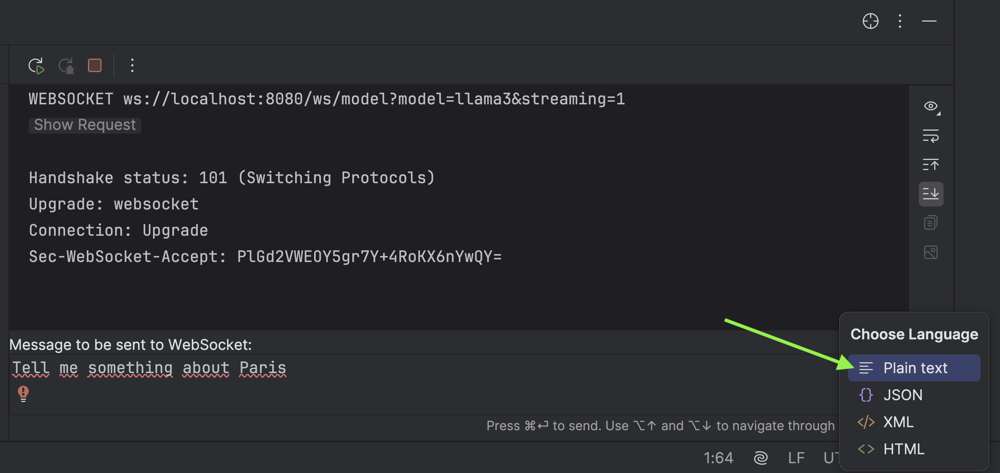

Yay! At last, the streaming is functioning properly. No need to be concerned if the output appears on a new line—we'll be developing a custom UI in React to manage that.

<video width="1366" height="768" controls>
  <source src="./images/streaming_1.webm" type="video/webm">
  Your browser does not support the video tag.
</video>

In the next section we will look into integrating Anthropic. The good part is that we have made most functionality generic. So, we just need to focus on the core business logic.
