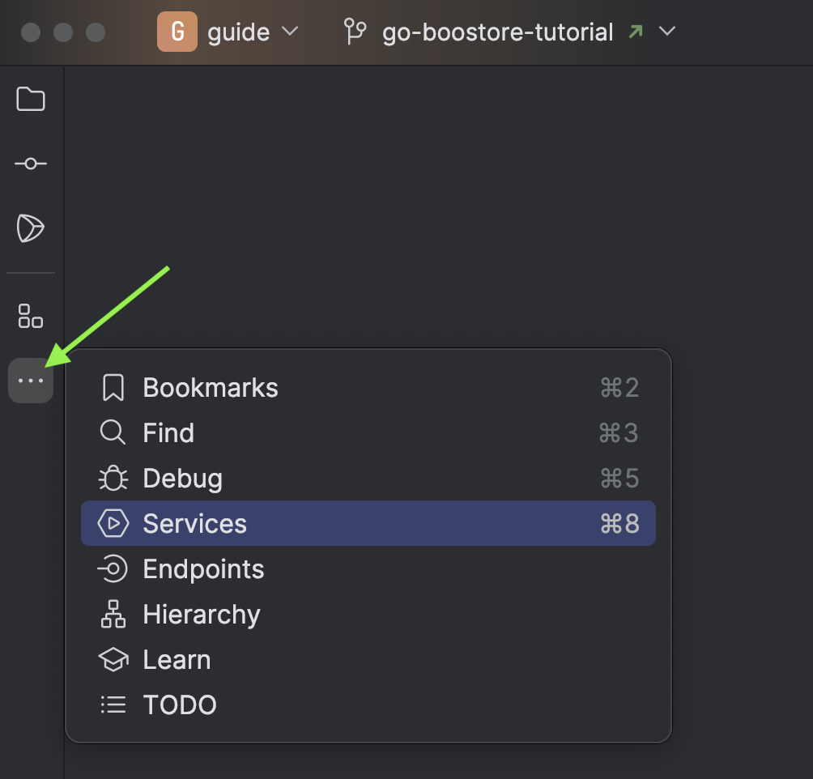
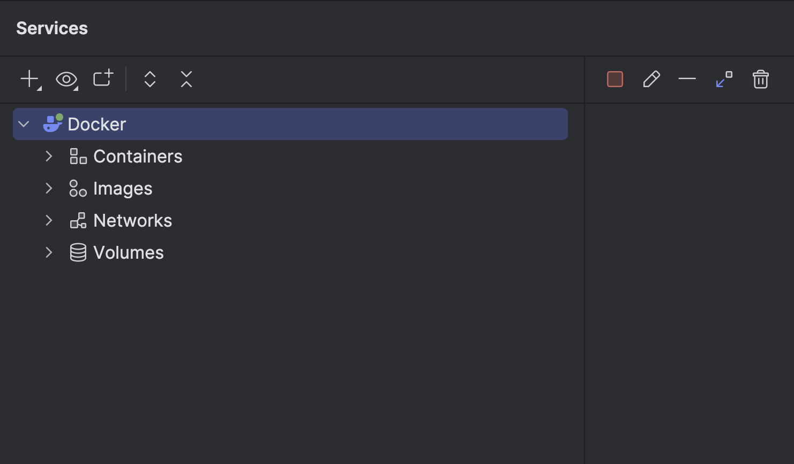
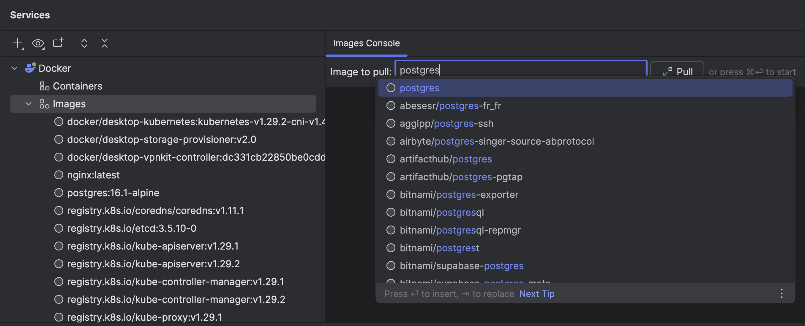
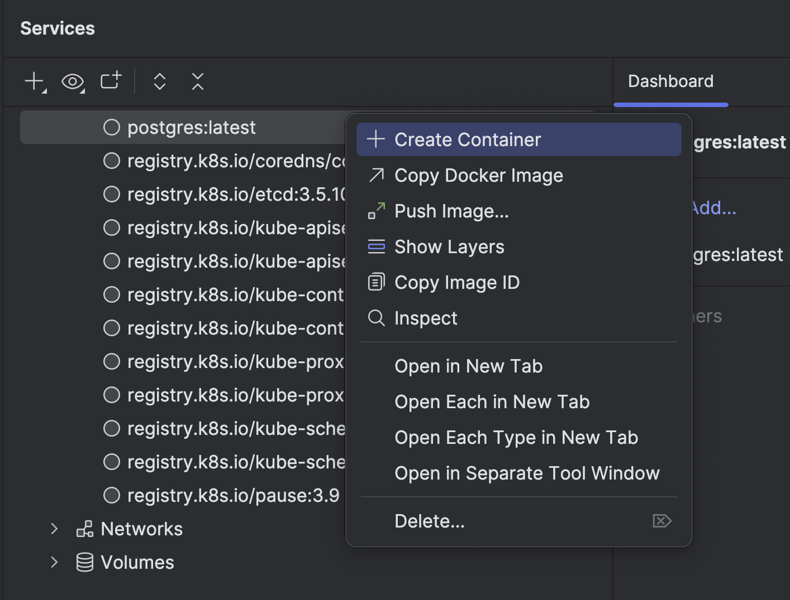
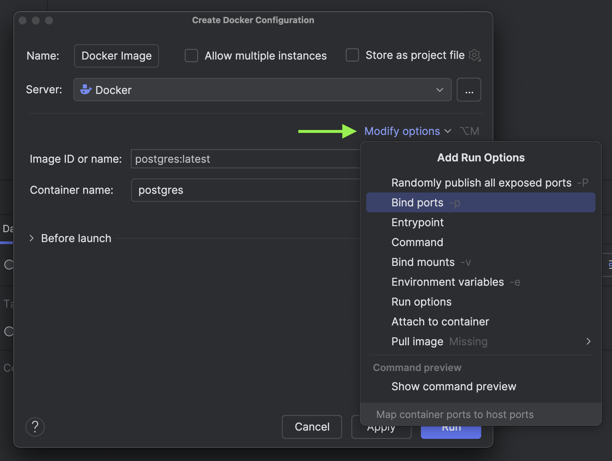
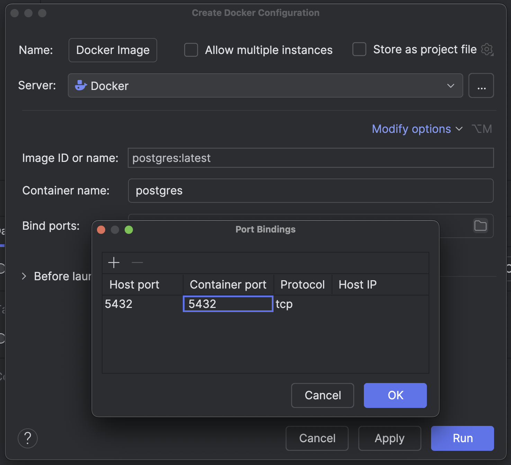
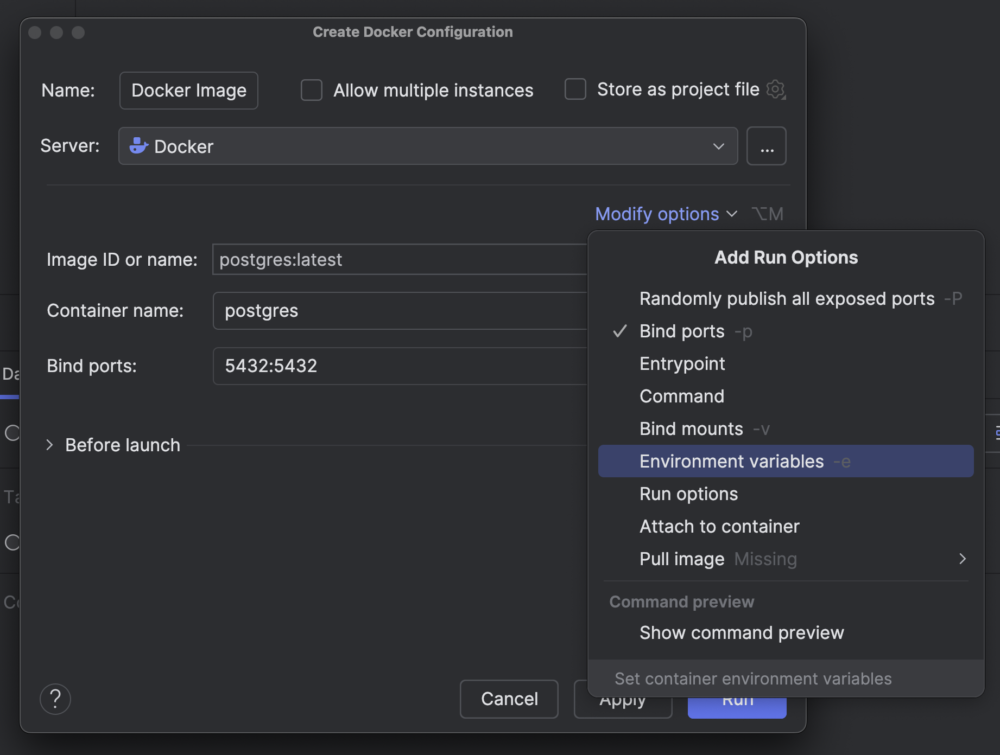
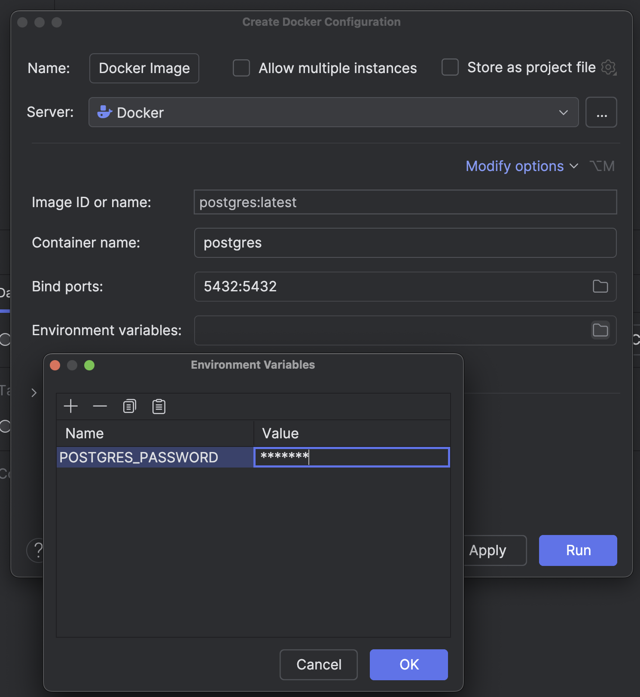
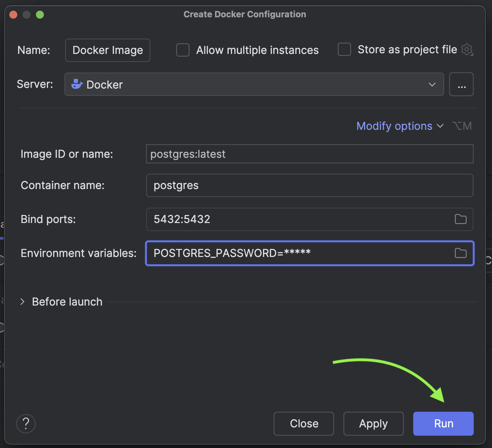
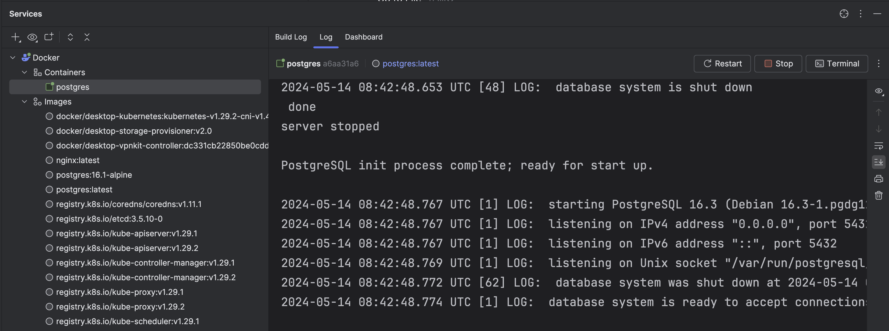

Once you've completed your prerequisites, it's time to configure your database on your local machine.

## PostgreSQL

For this tutorial, I will be using Postgres as my preferred database.
Postgres has become the dominant open source database with well maintained drivers for Go.

When developing and deploying an application, you want to make sure all software and configuration matches expectations and can be reproduced.
Containers solve this problem for us. I will use Docker Desktop to spin up a container.

Let's use Docker to get a postgres-enabled image for our container.
This saves us a ton of work: we don't have to download/install/configure a local postgres server.

Open Terminal <kbd>(⌥Opt F12)</kbd>, and type the following command.

```bash
docker run --name bookstore -p 5432:5432 -e POSTGRES_PASSWORD=******** -d postgres
```

Or you can directly search for the "postgres" image in Docker Desktop.


Once the database is up and running, you will see it appearing in the list of containers.


The postgres container runs on default port **5432**. Next, get inside the container and create a new db.


## Trying with GoLand

Starting a Postgres container is also quite straightforward with GoLand.

Access your project in GoLand and select the three dots located on your left, then click _Services_.



You'll notice Docker appearing. You can also explore all the containers, images, volumes, etc.



Click _Images_ and then provide the image name to pull from docker registry.



After the image has been successfully pulled, right-click on the "postgres" image and select **Create Container**.



Under **Modify options** provide bind ports and environment variables.









Once you have supplied all the necessary information, click **Run**.


You can see the container is up and running.



We've successfully configured our database. Next, our attention will turn to setting up the new project and installing necessary dependencies.
