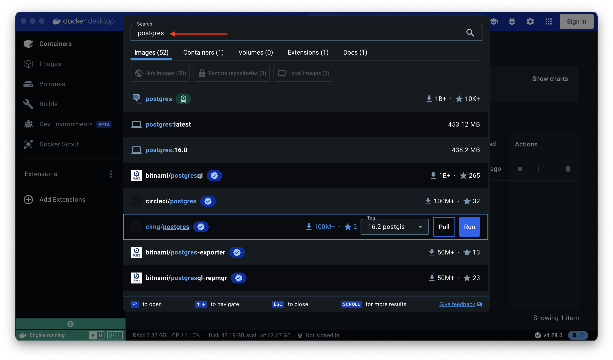
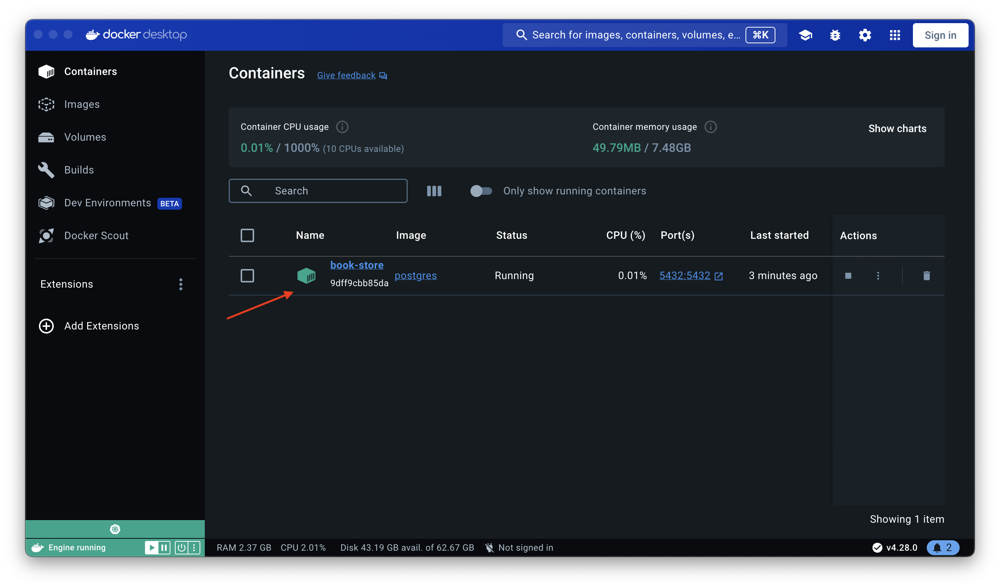
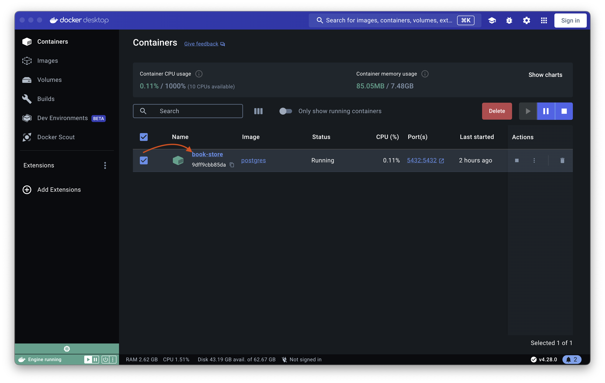
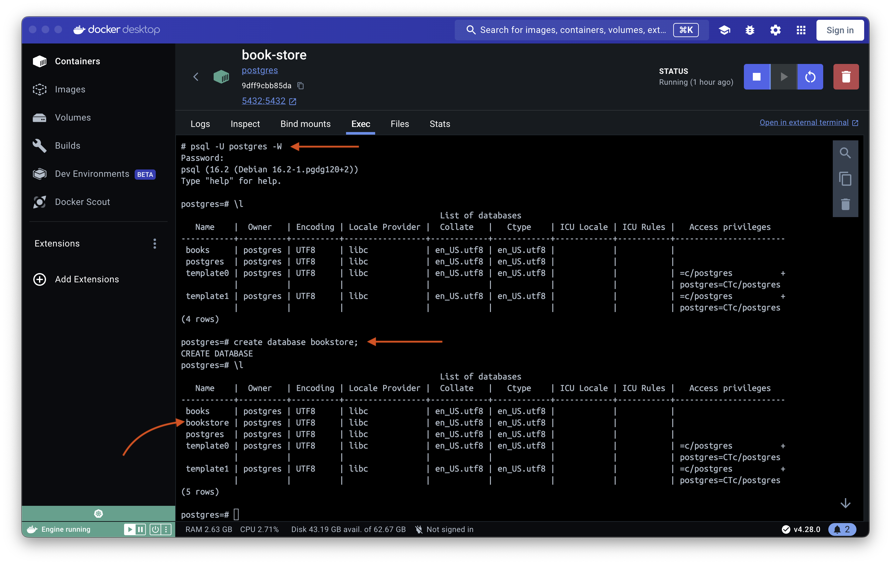

Once you've completed your prerequisites, it's time to configure your database on your local machine.

## PostgreSQL

For this tutorial, I will be using postgres as my preferred database.
Postgres has become the dominant open source database with very good and maintained drivers for Go.

When developing and deploying, you want to make sure all software and configuration matches expectations and can be reproduced.
Containers solve this problem for us.
I will use Docker Desktop to spin up a container, which will be quite easy and straightforward.

Let's use Docker to get a postgres-enabled image for our container.
This saves us a ton of work: we don't have to download/install/configure a local postgres server.

Open Terminal, and type the following command.

```bash
docker run --name bookstore -p 5432:5432 -e POSTGRES_PASSWORD=******** -d postgres
```

Or you can directly search for the postgres image in Docker Desktop.



Once the database is up and running, you will see it appearing in the list of containers.



The postgres container runs on default port 5432. Next, get inside the container and create a new db.




