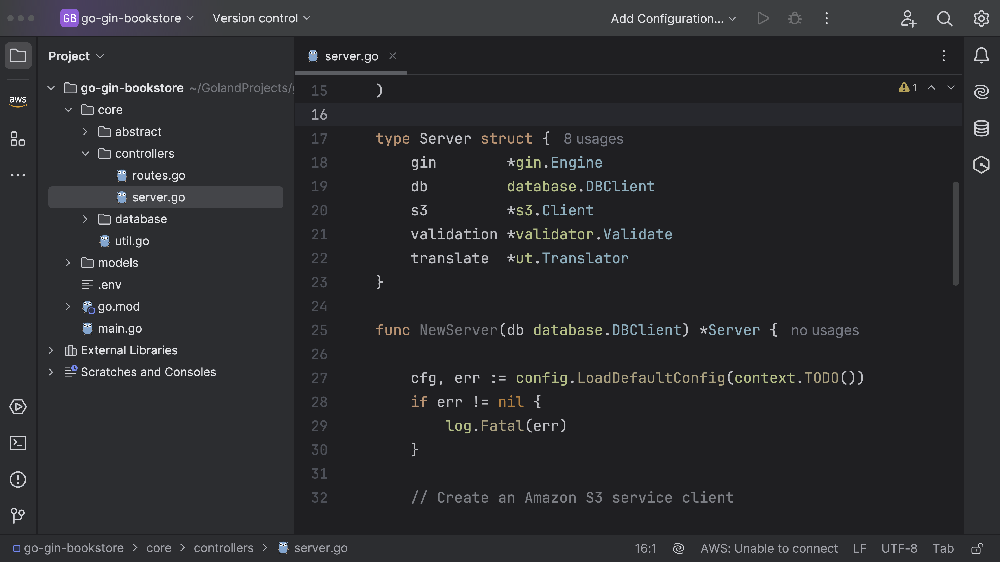
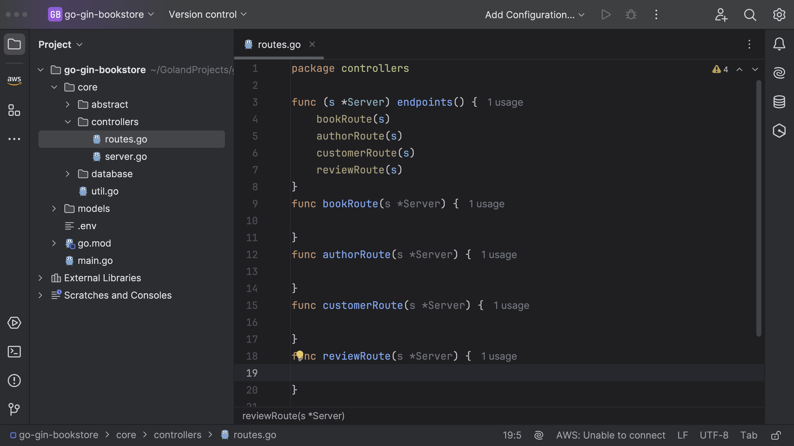
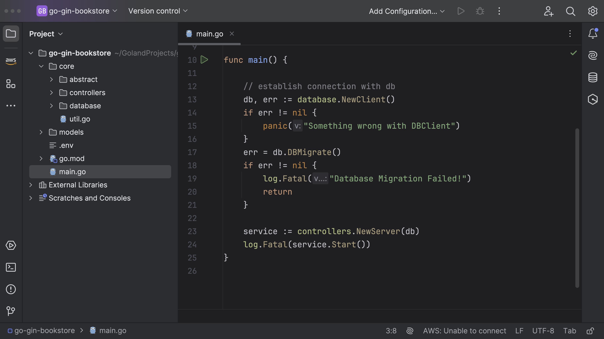
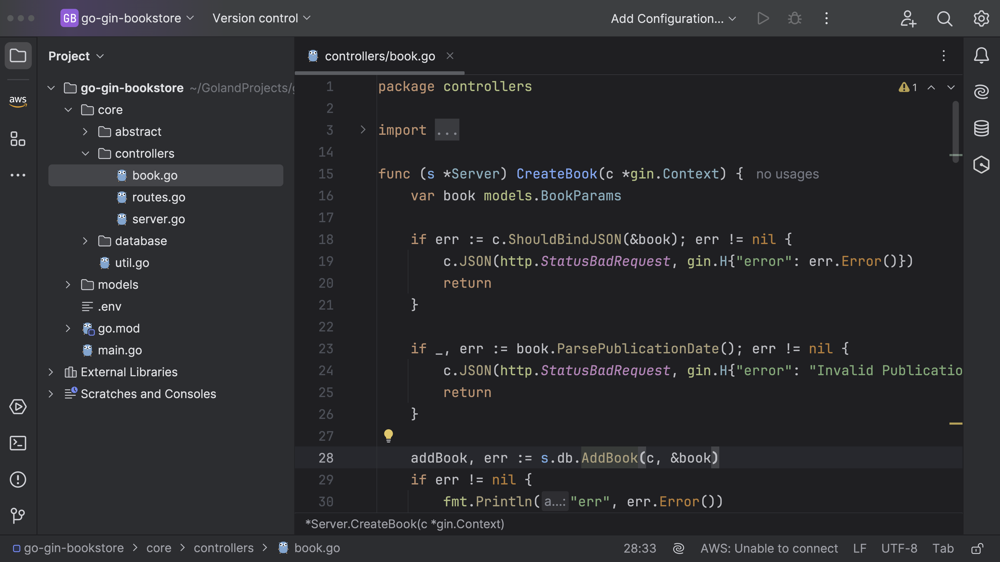
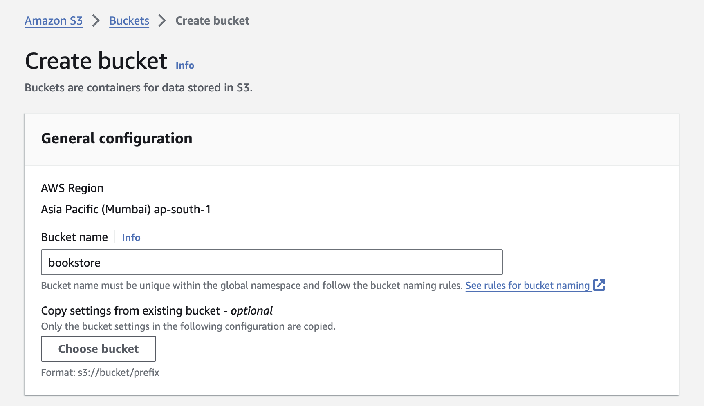
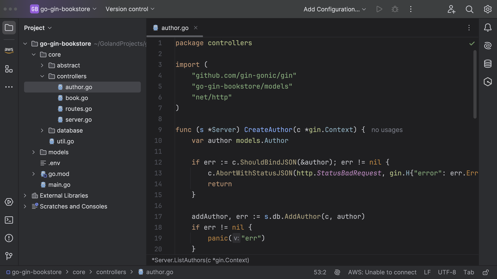
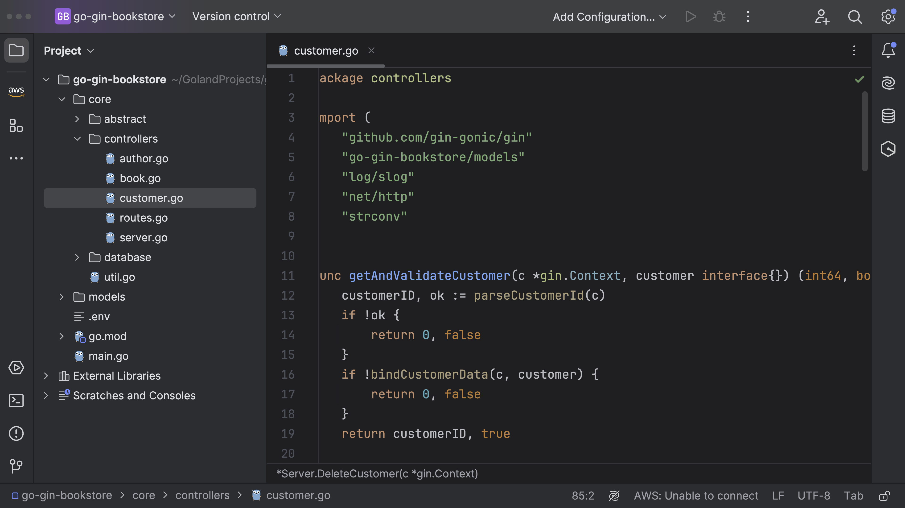

## Creating Server

We will be creating a new server.



```go


type Server struct {
	gin        *gin.Engine
	db         database.DBClient
	s3         *s3.Client
	validation *validator.Validate
	translate  *ut.Translator
}

func NewServer(db database.DBClient) *Server {

	cfg, err := config.LoadDefaultConfig(context.TODO())
	if err != nil {
		log.Fatal(err)
	}

	// Create an Amazon S3 service client
	client := s3.NewFromConfig(cfg)
	newValidator := validator.New()
	server := &Server{
		gin:        gin.Default(),
		db:         db,
		s3:         client,
		validation: newValidator,
		translate:  registerTranslation(newValidator),
	}
	server.endpoints()
	return server
}

func (s *Server) Start() error {
	slog.Info("serving at port 8080")
	err := s.gin.Run(":8080")
	if err != nil {
		log.Fatalf("Server Issue: %s", err)
		return err
	}
	return nil
}

func registerTranslation(validation *validator.Validate) *ut.Translator {
	// Create a new instance of the universal translator
	uni := ut.New(en.New())
	trans, _ := uni.GetTranslator("en")
	// Register translations for English
	if err := entranslations.RegisterDefaultTranslations(validation, trans); err != nil {
		panic(err)
	}
	return &trans
}

```

Let me first breakdown the `Server` struct.

- gin for HTTP services.
- db package for handling database operations.
- s3 which is a client for interacting with Amazon S3.
- validator for data validation tasks.
- ut (which seems to be universal-translator package) for localization.

Firstly, a `Server` struct is defined that encapsulates services and clients needed by the server.

Then, a `NewServer` function is provided to bootstrap a new instance of Server.
It loads default configuration, creates an S3 client, sets a default gin engine,
and a new validator. It also registers translations and attaches endpoints to the server.
`Start` method on the server is for starting the gin server at specified port
(8080 in this case). If there is an error when running the server, it will log
the error and return it.

`registerTranslation` function generates a translator for a given validator. Here, english translations are registered.

`endpoints` is a method on server which calls helper functions (`bookRoute`, `authorRoute`, `customerRoute`, `reviewRoute`) to attach various routes (endpoints) to the server.
Each of these routing functions likely configures a series of HTTP endpoints
pertaining to individual topics (like books, authors, customers, reviews). For example,
bookRoute might configure endpoints for creating, listing, updating, and deleting
books as well as uploading book cover.

## Routes



Next, we will create a common route, and name it _routes.go_.

```go
package controllers

func (s *Server) endpoints() {
	bookRoute(s)
	authorRoute(s)
	customerRoute(s)
	reviewRoute(s)
}
func bookRoute(s *Server) {

}
func authorRoute(s *Server) {

}
func customerRoute(s *Server) {

}
func reviewRoute(s *Server) {

}

```

This function is method of `Server` type that seemingly initialize the
HTTP routes or endpoints for the web server. Each function (bookRoute,
authorRoute, etc.) is passed a pointer to the Server instance and presumably
sets up routes related to a specific entity (e.g., books, authors, customers,
reviews). Currently, the function is empty, we will come back to this later to
update it. Once we start working on the controllers.

## Update main.go

Lets comeback to `main.go` and update the functionality.


Within the main function, the initial lines are creating a new connection
to a database using a function `NewClient()` that belongs to a package named database.
The `NewClient()` function returns two values, db which is the initialized database
client, and err which is an error object in case any error occurs during the execution
of the `NewClient()` function.

```go
db, err := database.NewClient()
	if err != nil {
		panic("Something wrong with DBClient")
	}
```

Next, the script tries to perform a database migration using a method
called `DBMigrate()`. If you remember, we haven't implemented this function. Let's do it.

```go
err = db.DBMigrate()
	if err != nil {
		log.Fatal("Database Migration Failed!")
		return
	}
```

Move to _database/db.go_

Update the function.


```go
func (c Client) DBMigrate() error {
	err := c.db.AutoMigrate(&models.Author{},
		&models.Book{},
		&models.Customer{},
		&models.Review{},
	)
	if err != nil {
		return err
	}
	return nil

}
```

The `AutoMigrate` function takes pointers to model structures as parameters. In this case, pointers to Author, Book, Customer and Review are passed.

It updates the database schema automatically with matching the tables to the provided models (Author, Book, Customer, Review). This is typically used when models are added or modified in the program, to keep the database in synchronization.
This function utilizes the AutoMigrate method from the gorm library which is a popular ORM (Object-Relational Mapper) tool in Go.

Post migration, the code sets up a new server (presumably with some form of routing, etc., defined within controllers.NewServer(db)), passing our database client db to this new server.

```go
service := controllers.NewServer(db)
log.Fatal(service.Start())
```

Finally, it attempts to start this server with `service.Start()`. If there's an error in starting the service, it logs a fatal error, indicating service start failure.

## Controllers

### Book



```go
package database

import (
	"context"
	"errors"
	"fmt"
	"go-gin-bookstore/models"
	"gorm.io/gorm"
	"log/slog"
)

func (c Client) AddBook(ctx context.Context, bookParams models.DateParser) (*models.BookParams, error) {
	var maxID int
	if result := c.db.Model(&models.Book{}).Select("COALESCE(MAX(id), 0)").Scan(&maxID); result.Error != nil {
		return nil, errors.New("something went wrong")
	}
	var Book models.Book
	switch params := bookParams.(type) {
	case *models.BookParams:
		Book.ID = uint(maxID) + 1
		Book.Title = params.Title
		Book.ISBN = params.ISBN
		Book.PublicationDate, _ = bookParams.ParsePublicationDate()

		params.Id = int64(Book.ID)
		result := c.db.WithContext(ctx).Create(&Book)
		if result.Error != nil {
			slog.Error(result.Error.Error())
			return nil, errors.New("unable to register book")
		}
		return params, nil
	default:
		fmt.Printf("Type of bookParams: %T\n", bookParams)
		return nil, errors.New("unsupported Type")

	}
}

func (c Client) ListBooks(ctx context.Context) ([]models.Book, error) {
	var books []models.Book
	result := c.db.WithContext(ctx).Find(&books)
	return books, result.Error
}

func (c Client) UpdateBook(_ context.Context, updateBookParams models.DateParser, bookId int64) (bool, error) {
	var bookInfo = models.Book{Id: bookId}
	if err := c.db.First(&bookInfo).Error; err != nil {
		if errors.Is(err, gorm.ErrRecordNotFound) {
			return false, errors.New("there is no book associated with this ID")
		}
	}
	switch params := updateBookParams.(type) {
	case models.UpdateBookParams:
		parsedDate, _ := params.ParsePublicationDate()
		c.db.Save(&models.Book{Id: bookId, Title: params.Title, ISBN: params.ISBN, PublicationDate: parsedDate})
	}
	return true, nil
}

func (c Client) DeleteBook(_ context.Context, bookId int64) error {
	var bookInfo = models.Book{Id: bookId}
	if err := c.db.First(&bookInfo).Error; err != nil {
		if errors.Is(err, gorm.ErrRecordNotFound) {
			return errors.New("there is no book associated with this ID")
		}
	}
	// Delete Book (Hard delete)
	c.db.Unscoped().Delete(&bookInfo)
	return nil
}

func (c Client) UpdateBookCover(_ context.Context, bookId int64, bookImageURL string) (bool, error) {
	var bookInfo = models.Book{Id: bookId}
	if err := c.db.First(&bookInfo).Error; err != nil {
		if errors.Is(err, gorm.ErrRecordNotFound) {
			return false, errors.New("there is no book associated with this ID")
		}
	}
	//Update ImageURL
	c.db.Model(&bookInfo).Updates(models.Book{Image: bookImageURL})
	return true, nil

}
```

Let's break it down.

**Create a new book**

The `CreateBook` function is an HTTP handler that creates a new book record in a database. It uses the Gin web framework for handling HTTP requests.

Briefly, it works as follows:

- CreateBook attempts to parse incoming JSON data into a BookParams structure. If it fails, an HTTP 400 (Bad Request) error is returned, identifying an error in request format.
  <br><br>
- The function then validates whether the PublicationDate inside the BookParams can be parsed without error. If there is an error, it responds with a HTTP 400 error, indicating that the provided PublicationDate is invalid.
  <br><br>
- Assuming that all information is valid, it attempts to add the new book record to the database using the AddBook method. If a problem arises during this process, it triggers a panic, effectively halting the server.
  <br><br>
- On successful creation of the book record, the function responds with a HTTP 200 status code and the newly created book record in JSON format.

```go
func (s *Server) CreateBook(c *gin.Context) {
	var book models.BookParams

	if err := c.ShouldBindJSON(&book); err != nil {
		c.JSON(http.StatusBadRequest, gin.H{"error": err.Error()})
		return
	}

	if _, err := book.ParsePublicationDate(); err != nil {
		c.JSON(http.StatusBadRequest, gin.H{"error": "Invalid PublicationDate"})
		return
	}

	addBook, err := s.db.AddBook(c, &book)
	if err != nil {
		fmt.Println("err", err.Error())
	}
	c.JSON(http.StatusOK, addBook)
}
```

**Listing books**

This function tries to list all the books and if successful,
it returns the list as JSON in the response, otherwise it returns
an error in JSON format with HTTP status 400.

```go
func (s *Server) ListBook(c *gin.Context) {
	listBooks, err := s.db.ListBooks(c)
	if err != nil {
		c.JSON(http.StatusBadRequest, gin.H{"error": err.Error()})
		return
	}
	c.JSON(http.StatusOK, listBooks)
}
```

**Updating a book**

The `UpdateBook` function is used to update a particular book based on book id. It performs several operations
including retrieving the book's id from the URL parameters, parsing and validating
the JSON body of the incoming request, checking the validity of the publication date,
and updating the book's details in the database.

```go
func (s *Server) UpdateBook(c *gin.Context) {
	var book models.UpdateBookParams
	bookId := c.Param("id")
	parseBookId, err := strconv.ParseInt(bookId, 10, 64)
	if err != nil {
		c.JSON(http.StatusBadRequest, gin.H{"error": "bookId is invalid"})
		return
	}

	if err := c.ShouldBindJSON(&book); err != nil {
		c.AbortWithStatusJSON(http.StatusBadRequest, gin.H{"error": "Check the data you are passing."})
		return
	}

	if _, err := book.ParsePublicationDate(); err != nil {
		c.AbortWithStatusJSON(http.StatusBadRequest, gin.H{"error": "Invalid PublicationDate"})
		return
	}

	updateBook, err := s.db.UpdateBook(c, book, parseBookId)
	if err != nil {
		c.AbortWithStatusJSON(http.StatusBadRequest, gin.H{"error": err.Error()})
		return
	}
	if updateBook {
		c.JSON(http.StatusOK, gin.H{"status": true, "message": "Book Updated!"})
		return
	}
	c.AbortWithStatusJSON(http.StatusInternalServerError, gin.H{"status": false, "message": "Something went wrong."})
}
```

**Deleting a book**

The `DeleteBook` function is going to delete a book from the database. It fetches
the `id` parameter from the URL, and attempts to delete the corresponding book. Depending
on the success of these operations, it sends appropriate HTTP responses.

```go
func (s *Server) DeleteBook(c *gin.Context) {
	bookId := c.Param("id")
	parseBookId, err := strconv.ParseInt(bookId, 10, 64)
	if err != nil {
		c.JSON(http.StatusBadRequest, gin.H{"error": "bookId is invalid"})
		return
	}

	if err = s.db.DeleteBook(c, parseBookId); err != nil {
		c.AbortWithStatusJSON(http.StatusBadRequest, gin.H{"error": err.Error()})
		return

	}

	c.JSON(http.StatusOK, gin.H{"status": true, "message": "book deleted"})
}
```

**Updating Book Cover**

This function `UploadBookCover` is responsible for uploading the cover image of the book and updating
its reference URL in the database.

```go
func (s *Server) UploadBookCover(c *gin.Context) {
	bookId := c.Param("id")
	parseBookId, err := strconv.ParseInt(bookId, 10, 64)
	if err != nil {
		c.AbortWithStatusJSON(http.StatusBadRequest, gin.H{"error": "bookId is invalid"})
		return
	}

	fileHeader, err := c.FormFile("file")
	if err != nil {
		c.String(http.StatusBadRequest, fmt.Sprintf("Error while getting file: %s", err.Error()))
		return
	}

	file, err := fileHeader.Open()
	if err != nil {
		c.AbortWithStatusJSON(http.StatusBadRequest, fmt.Sprintf("Error opening file: %s", err.Error()))
		return
	}
	defer file.Close()
	// Create an uploader passing it the client
	uploader := manager.NewUploader(s.s3)

	uploadResult, err := uploader.Upload(c, &s3.PutObjectInput{
		Bucket: aws.String(os.Getenv("S3_BUCKET")),
		Key:    aws.String(fileHeader.Filename),
		Body:   file,
		//ACL:    "public-read",
	})

	if err != nil {
		c.AbortWithStatusJSON(http.StatusInternalServerError, gin.H{"error": err.Error()})
		return
	}

	//Update URL in DB
	_, err = s.db.UpdateBookCover(c, parseBookId, uploadResult.Location)
	if err != nil {
		c.AbortWithStatusJSON(http.StatusInternalServerError, gin.H{"error": "Something went wrong."})
	}

	c.JSON(200, gin.H{"status": true, "message": "Image Updated Successfully!"})
}
```

NOTE: Make sure you have an AWS account. Make sure to
update **access key ID** and **secret access key**.



You need to create an S3 Bucket in AWS and make sure to update
`S3_BUCKET` environment variable in `.env` file.

### Author



```go
package controllers

import (
	"github.com/gin-gonic/gin"
	"go-gin-bookstore/models"
	"net/http"
)

func (s *Server) CreateAuthor(c *gin.Context) {
	var author models.Author

	if err := c.ShouldBindJSON(&author); err != nil {
		c.AbortWithStatusJSON(http.StatusBadRequest, gin.H{"error": err.Error()})
		return
	}

	addAuthor, err := s.db.AddAuthor(c, author)
	if err != nil {
		panic("err")
	}
	c.JSON(http.StatusOK, addAuthor)
}

func (s *Server) LinkBook(c *gin.Context) {

	var authorBook models.AuthorBook

	if err := c.ShouldBindJSON(&authorBook); err != nil {
		c.AbortWithStatusJSON(http.StatusBadRequest, gin.H{"error": err.Error()})
		return
	}

	linkBook, err := s.db.LinkAuthorBook(c, authorBook)
	if err != nil {
		c.AbortWithStatusJSON(http.StatusBadRequest, gin.H{"error": err.Error()})
	}
	if linkBook {
		c.JSON(http.StatusOK, gin.H{"status": true, "message": "Book has been successfully linked!"})
		return
	} else {
		c.AbortWithStatusJSON(http.StatusInternalServerError, gin.H{"status": false, "message": "Something went wrong."})
	}

}

func (s *Server) ListAuthors(c *gin.Context) {
	listAuthors, err := s.db.ListAuthors(c)
	if err != nil {
		c.JSON(http.StatusBadRequest, gin.H{"error": err.Error()})
		return
	}
	c.JSON(http.StatusOK, listAuthors)
}

```

Let's break it down.

**Create Author**

The `CreateAuthor` function is an HTTP handler that creates a new author in the database.

```go
func (s *Server) CreateAuthor(c *gin.Context) {
	var author models.Author

	if err := c.ShouldBindJSON(&author); err != nil {
		c.AbortWithStatusJSON(http.StatusBadRequest, gin.H{"error": err.Error()})
		return
	}

	addAuthor, err := s.db.AddAuthor(c, author)
	if err != nil {
		panic("err")
	}
	c.JSON(http.StatusOK, addAuthor)
}
```

**Linking Book**

This function is trying to create relationship between Author and Book.

```go
func (s *Server) LinkBook(c *gin.Context) {

	var authorBook models.AuthorBook

	if err := c.ShouldBindJSON(&authorBook); err != nil {
		c.AbortWithStatusJSON(http.StatusBadRequest, gin.H{"error": err.Error()})
		return
	}

	linkBook, err := s.db.LinkAuthorBook(c, authorBook)
	if err != nil {
		c.AbortWithStatusJSON(http.StatusBadRequest, gin.H{"error": err.Error()})
	}
	if linkBook {
		c.JSON(http.StatusOK, gin.H{"status": true, "message": "Book has been successfully linked!"})
		return
	} else {
		c.AbortWithStatusJSON(http.StatusInternalServerError, gin.H{"status": false, "message": "Something went wrong."})
	}

}
```

**Listing Authors**

In this function we are trying to list down all the authors present in the database.

```go
func (s *Server) ListAuthors(c *gin.Context) {
	listAuthors, err := s.db.ListAuthors(c)
	if err != nil {
		c.JSON(http.StatusBadRequest, gin.H{"error": err.Error()})
		return
	}
	c.JSON(http.StatusOK, listAuthors)
}

```

### Customer



```go
package controllers

import (
	"github.com/gin-gonic/gin"
	"go-gin-bookstore/models"
	"log/slog"
	"net/http"
	"strconv"
)

func getAndValidateCustomer(c *gin.Context, customer interface{}) (int64, bool) {
	customerID, ok := parseCustomerId(c)
	if !ok {
		return 0, false
	}
	if !bindCustomerData(c, customer) {
		return 0, false
	}
	return customerID, true
}

func parseCustomerId(c *gin.Context) (int64, bool) {
	customerId := c.Param("id")
	parseCusId, err := strconv.ParseInt(customerId, 10, 64)
	if err != nil {
		c.JSON(http.StatusBadRequest, gin.H{"error": "customerId is invalid"})
	}
	return parseCusId, err == nil
}

func bindCustomerData(c *gin.Context, customer interface{}) bool {
	if err := c.ShouldBindJSON(customer); err != nil {
		c.AbortWithStatusJSON(http.StatusBadRequest, gin.H{"error": "Check the data you are passing."})
		return false
	}
	return true
}

func (s *Server) CreateCustomer(c *gin.Context) {
	customer := models.Customer{}

	if !bindCustomerData(c, &customer) {
		return
	}
	addCustomer, err := s.db.AddCustomer(c, customer)
	if err != nil {
		slog.Error(err.Error())
		c.AbortWithStatusJSON(http.StatusInternalServerError, gin.H{"error": "Something went wrong"})
	}
	c.JSON(http.StatusOK, addCustomer)
}

func (s *Server) UpdateCustomer(c *gin.Context) {
	customer := models.CustomerParams{}
	customerID, ok := getAndValidateCustomer(c, &customer)
	if !ok {
		return
	}

	updateCustomer, err := s.db.UpdateCustomer(c, customer, customerID)
	if err != nil {
		c.AbortWithStatusJSON(http.StatusBadRequest, gin.H{"error": err.Error()})
		return
	}
	if updateCustomer {
		c.JSON(http.StatusOK, gin.H{"status": true, "message": "Customer Information Updated!"})
		return
	}
	c.AbortWithStatusJSON(http.StatusInternalServerError, gin.H{"status": false, "message": "Something went wrong."})
}

func (s *Server) DeleteCustomer(c *gin.Context) {
	customerID, ok := parseCustomerId(c)
	if !ok {
		return
	}

	if err := s.db.DeleteCustomer(c, customerID); err != nil {
		c.AbortWithStatusJSON(http.StatusBadRequest, gin.H{"error": err.Error()})
		return

	}

	c.JSON(http.StatusOK, gin.H{"status": true, "message": "customer deleted"})
}

```
