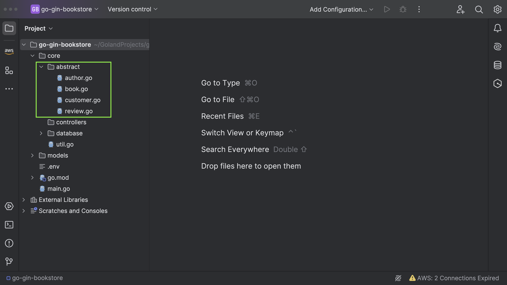
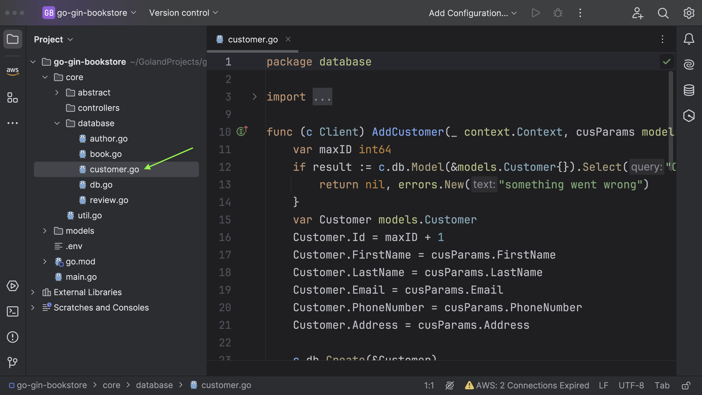
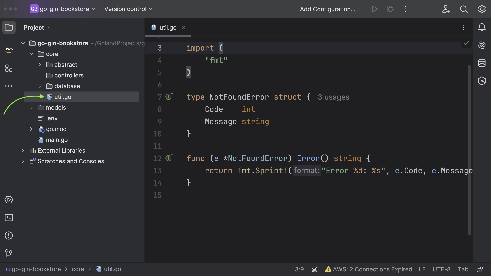
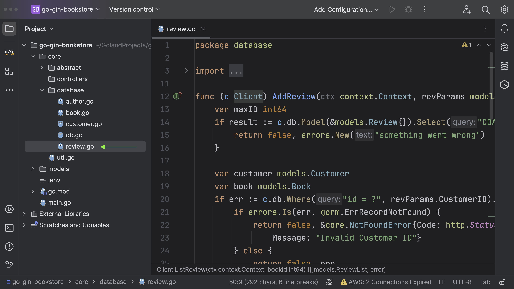

## Interfaces

Following this, we are going to establish several interfaces that define method signatures.



Author interface with methods for adding an author, linking an author and a book, and listing all authors. There are also Author, AuthorBook, and Book structs which represent their respective entities, and the many-to-many relation between Author and Book is modeled using the AuthorBook struct and the Books field on the Author struct.

_author.go_

```go
package abstract

import (
	"context"
	"go-gin-bookstore/models"
)

type Author interface {
	AddAuthor(ctx context.Context, author models.Author) (*models.Author, error)
	LinkAuthorBook(ctx context.Context, params models.AuthorBook) (bool, error)
	ListAuthors(_ context.Context) ([]models.Author, error)
}

```

The Book interface provides an abstraction for operations on a book database,
which includes adding, listing, updating, and deleting books.

_book.go_

```go
package abstract

import (
	"context"
	"go-gin-bookstore/models"
)

type Book interface {
	AddBook(ctx context.Context, bookParams models.DateParser) (*models.BookParams, error)
	ListBooks(ctx context.Context) ([]models.Book, error)
	UpdateBook(ctx context.Context, updateBookParams models.DateParser, bookId int64) (bool, error)
	DeleteBook(ctx context.Context, bookId int64) error
	UpdateBookCover(ctx context.Context, bookId int64, bookImageURL string) (bool, error)
}

```

_customer.go_

The Customer interface defines three methods for adding, updating, and deleting customers. These methods are expected to be implemented by any structs that satisfy this interface.
The Customer struct represents a customer object with fields like `Id`, `FirstName`, `LastName`, `Email`, `PhoneNumber`, and `Address`. This struct is used to store customer information in the database.
The `CustomerParams` struct is used to hold parameters to update customer information, with fields `FirstName`, `LastName`, and `Address`. It's used in the `UpdateCustomer` method of the `Customer` interface.

```go
package abstract

import (
	"context"
	"go-gin-bookstore/models"
)

type Customer interface {
	AddCustomer(ctx context.Context, cusParams models.Customer) (*models.Customer, error)
	UpdateCustomer(ctx context.Context, updateCusParams models.CustomerParams, customerId int64) (bool, error)
	DeleteCustomer(ctx context.Context, customerId int64) error
}

```

_review.go_

- `AddReview`: Takes a context and `ReviewParams` (with `customer ID`, `book ID`, `rating`, and `comment`). It returns a boolean and an error. This method could be used to add a review.
- `ListReview`: Takes a context and a book ID, and returns a list of `ReviewList` (with `review ID`, `rating`, `comment`) and an error. This method could list all reviews for a specific book.

```go
package abstract

import (
	"context"
	"go-gin-bookstore/models"
)

type Review interface {
	AddReview(ctx context.Context, revParams models.ReviewParams) (bool, error)
	ListReview(ctx context.Context, bookId int64) ([]models.ReviewList, error)
}

```

## CRUD(Create, Read, Update, Delete) Operations

Now, let's begin implementing the interfaces.

### Book


_book.go_

```go
package database

import (
	"context"
	"errors"
	"fmt"
	"go-gin-bookstore/models"
	"gorm.io/gorm"
	"log/slog"
)

func (c Client) AddBook(ctx context.Context, bookParams models.DateParser) (*models.BookParams, error) {
	var maxID int
	if result := c.db.Model(&models.Book{}).Select("COALESCE(MAX(id), 0)").Scan(&maxID); result.Error != nil {
		return nil, errors.New("something went wrong")
	}
	var Book models.Book
	switch params := bookParams.(type) {
	case *models.BookParams:
		Book.ID = uint(maxID) + 1
		Book.Title = params.Title
		Book.ISBN = params.ISBN
		Book.PublicationDate, _ = bookParams.ParsePublicationDate()

		params.Id = int64(Book.ID)
		result := c.db.WithContext(ctx).Create(&Book)
		if result.Error != nil {
			slog.Error(result.Error.Error())
			return nil, errors.New("unable to register book")
		}
		return params, nil
	default:
		fmt.Printf("Type of bookParams: %T\n", bookParams)
		return nil, errors.New("unsupported Type")

	}
}

func (c Client) ListBooks(ctx context.Context) ([]models.Book, error) {
	var books []models.Book
	result := c.db.WithContext(ctx).Find(&books)
	return books, result.Error
}

func (c Client) UpdateBook(_ context.Context, updateBookParams models.DateParser, bookId int64) (bool, error) {
	var bookInfo = models.Book{Id: bookId}
	if err := c.db.First(&bookInfo).Error; err != nil {
		if errors.Is(err, gorm.ErrRecordNotFound) {
			return false, errors.New("there is no book associated with this ID")
		}
	}
	switch params := updateBookParams.(type) {
	case models.UpdateBookParams:
		parsedDate, _ := params.ParsePublicationDate()
		c.db.Save(&models.Book{Id: bookId, Title: params.Title, ISBN: params.ISBN, PublicationDate: parsedDate})
	}
	return true, nil
}

func (c Client) DeleteBook(_ context.Context, bookId int64) error {
	var bookInfo = models.Book{Id: bookId}
	if err := c.db.First(&bookInfo).Error; err != nil {
		if errors.Is(err, gorm.ErrRecordNotFound) {
			return errors.New("there is no book associated with this ID")
		}
	}
	// Delete Book (Hard delete)
	c.db.Unscoped().Delete(&bookInfo)
	return nil
}

func (c Client) UpdateBookCover(_ context.Context, bookId int64, bookImageURL string) (bool, error) {
	var bookInfo = models.Book{Id: bookId}
	if err := c.db.First(&bookInfo).Error; err != nil {
		if errors.Is(err, gorm.ErrRecordNotFound) {
			return false, errors.New("there is no book associated with this ID")
		}
	}
	//Update ImageURL
	c.db.Model(&bookInfo).Updates(models.Book{Image: bookImageURL})
	return true, nil

}

```

Let's break it down

**Add Book**

The function accepts two parameters:

1. A `context.Context`, typically employed for request-scoping, carrying deadlines, and cancellation signals.
2. An instance of the structure `models.DateParser`, assumed to contain parsing methods and properties necessary for book addition.

Upon successful execution, it yields either a pointer to a `models.BookParams` structure or an error.

Initially, the function retrieves the maximum `Id` presently utilized in the Book table of the database. Subsequently, it uses this value to increment the `bookId`, ensuring uniqueness. It also sets the `Title` and `ISBN` from the parameters and parses the `PublicationDate` from `bookParams`.

Following this, the function endeavors to create a new record in the database using the instantiated Book. In case of an error during this creation process, it logs the error and returns an error. If the operation succeeds, it returns the updated parameters (containing the `Id` of the new Book).

```go
func (c Client) AddBook(ctx context.Context, bookParams models.DateParser) (*models.BookParams, error) {
	var maxID int
	if result := c.db.Model(&models.Book{}).Select("COALESCE(MAX(id), 0)").Scan(&maxID); result.Error != nil {
		return nil, errors.New("something went wrong")
	}
	var Book models.Book
	switch params := bookParams.(type) {
	case *models.BookParams:
		Book.ID = uint(maxID) + 1
		Book.Title = params.Title
		Book.ISBN = params.ISBN
		Book.PublicationDate, _ = bookParams.ParsePublicationDate()

		params.Id = int64(Book.ID)
		result := c.db.WithContext(ctx).Create(&Book)
		if result.Error != nil {
			slog.Error(result.Error.Error())
			return nil, errors.New("unable to register book")
		}
		return params, nil
	default:
		fmt.Printf("Type of bookParams: %T\n", bookParams)
		return nil, errors.New("unsupported Type")

	}
}

```

**List Book**

The `ListBooks` function is employed to retrieve all book entries from a database. When
invoked, it gathers all book records stored in the database and places them into a slice
of `models.Book`. Subsequently, it returns this slice along with any errors that may have
occurred during the database operation.

```go
func (c Client) ListBooks(ctx context.Context) ([]models.Book, error) {
	var books []models.Book
	result := c.db.WithContext(ctx).Find(&books)
	return books, result.Error
}

```

**Update Book**

The function takes a `context.Context`, a `models.DateParser` interface, and a `bookId` as its arguments.
Initially, it tries to find a book record in the database that matches the provided `bookId`. If no record is found, it returns false and an error message.
If the book record is found, it proceeds to check the type of `updateBookParams` object. If it matches `models.UpdateBookParams` type, it parses the `PublicationDate` and updates the book record in the database using the provided new values.
Finally, the function returns `true` and `nil` indicating the successful update of the book record.

```go
func (c Client) UpdateBook(_ context.Context, updateBookParams models.DateParser, bookId int64) (bool, error) {
	var bookInfo = models.Book{Id: bookId}
	if err := c.db.First(&bookInfo).Error; err != nil {
		if errors.Is(err, gorm.ErrRecordNotFound) {
			return false, errors.New("there is no book associated with this ID")
		}
	}
	switch params := updateBookParams.(type) {
	case models.UpdateBookParams:
		parsedDate, _ := params.ParsePublicationDate()
		c.db.Save(&models.Book{Id: bookId, Title: params.Title, ISBN: params.ISBN, PublicationDate: parsedDate})
	}
	return true, nil
}

```

**Delete Book**

The function takes a `context.Context` and a `bookId` as arguments. It starts by attempting to find a book record in the database associated with the given `bookId`.
If no book record is found, it returns an error indicating no book is associated with the provided ID.
If a book record is found, the function proceeds to delete this record using GORM Delete method. The Unscoped call ensures a hard delete, which means the record is removed from the database entirely, not just marked as deleted.

```go
func (c Client) DeleteBook(_ context.Context, bookId int64) error {
	var bookInfo = models.Book{Id: bookId}
	if err := c.db.First(&bookInfo).Error; err != nil {
		if errors.Is(err, gorm.ErrRecordNotFound) {
			return errors.New("there is no book associated with this ID")
		}
	}
	// Delete Book (Hard delete)
	c.db.Unscoped().Delete(&bookInfo)
	return nil
}

```

**Update Book Cover**

The function starts by trying to find a book record in the database that matches the provided `bookId`. If no matching book is found, it returns an error message.
If a matching book record is found, the function proceeds to update the `Image` field of the book record with the new `bookImageURL` provided.
Finally, the function returns true and nil, indicating that the book's cover information was updated successfully.

I'll be addressing the topic of uploading the book cover within the HTTP handler section.

```go
func (c Client) UpdateBookCover(_ context.Context, bookId int64, bookImageURL string) (bool, error) {
	var bookInfo = models.Book{Id: bookId}
	if err := c.db.First(&bookInfo).Error; err != nil {
		if errors.Is(err, gorm.ErrRecordNotFound) {
			return false, errors.New("there is no book associated with this ID")
		}
	}
	//Update ImageURL
	c.db.Model(&bookInfo).Updates(models.Book{Image: bookImageURL})
	return true, nil

}

```

### Author


```go
package database

import (
	"context"
	"errors"
	"go-gin-bookstore/models"
	"log/slog"
)

func (c Client) AddAuthor(ctx context.Context, author models.Author) (*models.Author, error) {
	var maxID int
	if result := c.db.Model(&models.Author{}).Select("COALESCE(MAX(id), 0)").Scan(&maxID); result.Error != nil {
		return nil, errors.New("something went wrong")
	}
	var AuthorModel models.Author
	AuthorModel.ID = uint(maxID) + 1
	AuthorModel.Name = author.Name
	result := c.db.WithContext(ctx).Create(&AuthorModel)
	if result.Error != nil {
		slog.Error(result.Error.Error())
		return nil, errors.New("unable to register author")
	}
	return &AuthorModel, nil
}

func (c Client) LinkAuthorBook(_ context.Context, params models.AuthorBook) (bool, error) {
	author := models.Author{Id: params.AuthorID}
	book := models.Book{Id: params.BookID}
	err := c.db.Model(&author).Association("Books").Append(&book)
	if err != nil {
		return false, err
	}
	return true, nil
}

func (c Client) ListAuthors(_ context.Context) ([]models.Author, error) {
	var authors []models.Author
	result := c.db.Preload("Books").Find(&authors)

	if result.Error != nil {
		return nil, result.Error
	}
	return authors, nil
}

```

Let's break it down

Add Author

```go
func (c Client) AddAuthor(ctx context.Context, author models.Author) (*models.Author, error) {
	var maxID int
	if result := c.db.Model(&models.Author{}).Select("COALESCE(MAX(id), 0)").Scan(&maxID); result.Error != nil {
		return nil, errors.New("something went wrong")
	}
	var AuthorModel models.Author
	AuthorModel.ID = uint(maxID) + 1
	AuthorModel.Name = author.Name
	result := c.db.WithContext(ctx).Create(&AuthorModel)
	if result.Error != nil {
		slog.Error(result.Error.Error())
		return nil, errors.New("unable to register author")
	}
	return &AuthorModel, nil
}

```

Linking Author & Book

```go
func (c Client) LinkAuthorBook(_ context.Context, params models.AuthorBook) (bool, error) {
	author := models.Author{Id: params.AuthorID}
	book := models.Book{Id: params.BookID}
	err := c.db.Model(&author).Association("Books").Append(&book)
	if err != nil {
		return false, err
	}
	return true, nil
}

```

List Authors

```go
func (c Client) ListAuthors(_ context.Context) ([]models.Author, error) {
	var authors []models.Author
	result := c.db.Preload("Books").Find(&authors)

	if result.Error != nil {
		return nil, result.Error
	}
	return authors, nil
}

```

### Customer



customer.go

```go
package database

import (
	"context"
	"errors"
	"go-gin-bookstore/models"
	"gorm.io/gorm"
)

func (c Client) AddCustomer(_ context.Context, cusParams models.Customer) (*models.Customer, error) {
	var maxID int64
	if result := c.db.Model(&models.Customer{}).Select("COALESCE(MAX(id), 0)").Scan(&maxID); result.Error != nil {
		return nil, errors.New("something went wrong")
	}
	var Customer models.Customer
	Customer.Id = maxID + 1
	Customer.FirstName = cusParams.FirstName
	Customer.LastName = cusParams.LastName
	Customer.Email = cusParams.Email
	Customer.PhoneNumber = cusParams.PhoneNumber
	Customer.Address = cusParams.Address

	c.db.Create(&Customer)
	return &Customer, nil
}

func (c Client) DeleteCustomer(_ context.Context, customerId int64) error {
	var CustomerInfo = models.Customer{Id: customerId}

	if err := c.db.First(&CustomerInfo).Error; err != nil {
		if errors.Is(err, gorm.ErrRecordNotFound) {
			return errors.New("there is no customer associated with this ID")
		}
	}
	c.db.Delete(&CustomerInfo)
	return nil
}

func (c Client) UpdateCustomer(_ context.Context, updateCusParams models.CustomerParams, customerId int64) (bool, error) {
	var cusInfo = models.Customer{Id: customerId}
	if err := c.db.First(&cusInfo).Error; err != nil {
		if errors.Is(err, gorm.ErrRecordNotFound) {
			return false, errors.New("there is no customer associated with this ID")
		}
	}
	c.db.Model(&cusInfo).Updates(models.Customer{
		FirstName: updateCusParams.FirstName,
		LastName:  updateCusParams.LastName,
		Address:   updateCusParams.Address})
	return true, nil
}

```

Let's break it down

Add Customer

```go
func (c Client) AddCustomer(_ context.Context, cusParams models.Customer) (*models.Customer, error) {
	var maxID int64
	if result := c.db.Model(&models.Customer{}).Select("COALESCE(MAX(id), 0)").Scan(&maxID); result.Error != nil {
		return nil, errors.New("something went wrong")
	}
	var Customer models.Customer
	Customer.Id = maxID + 1
	Customer.FirstName = cusParams.FirstName
	Customer.LastName = cusParams.LastName
	Customer.Email = cusParams.Email
	Customer.PhoneNumber = cusParams.PhoneNumber
	Customer.Address = cusParams.Address

	c.db.Create(&Customer)
	return &Customer, nil
}

```

Update Customer

```go
func (c Client) UpdateCustomer(_ context.Context, updateCusParams models.CustomerParams, customerId int64) (bool, error) {
	var cusInfo = models.Customer{Id: customerId}
	if err := c.db.First(&cusInfo).Error; err != nil {
		if errors.Is(err, gorm.ErrRecordNotFound) {
			return false, errors.New("there is no customer associated with this ID")
		}
	}
	c.db.Model(&cusInfo).Updates(models.Customer{
		FirstName: updateCusParams.FirstName,
		LastName:  updateCusParams.LastName,
		Address:   updateCusParams.Address})
	return true, nil
}

```

Delete Customer

```go
func (c Client) DeleteCustomer(_ context.Context, customerId int64) error {
	var CustomerInfo = models.Customer{Id: customerId}

	if err := c.db.First(&CustomerInfo).Error; err != nil {
		if errors.Is(err, gorm.ErrRecordNotFound) {
			return errors.New("there is no customer associated with this ID")
		}
	}
	c.db.Delete(&CustomerInfo)
	return nil
}

```

### Review

Before going ahead

utils.go



```go
package core

import (
	"fmt"
)

type NotFoundError struct {
	Code    int
	Message string
}

func (e *NotFoundError) Error() string {
	return fmt.Sprintf("Error %d: %s", e.Code, e.Message)
}
```

Next Review



```go
package database

import (
	"context"
	"errors"
	"go-gin-bookstore/core"
	"go-gin-bookstore/models"
	"gorm.io/gorm"
	"net/http"
)

func (c Client) AddReview(ctx context.Context, revParams models.ReviewParams) (bool, error) {
	var maxID int64
	if result := c.db.Model(&models.Review{}).Select("COALESCE(MAX(id), 0)").Scan(&maxID); result.Error != nil {
		return false, errors.New("something went wrong")
	}

	var customer models.Customer
	var book models.Book
	if err := c.db.Where("id = ?", revParams.CustomerID).Take(&customer).Error; err != nil {
		if errors.Is(err, gorm.ErrRecordNotFound) {
			return false, &core.NotFoundError{Code: http.StatusNotFound,
				Message: "Invalid Customer ID"}
		} else {
			return false, err
		}
	}

	if err := c.db.Where("id = ?", revParams.BookID).Take(&book).Error; err != nil {
		if errors.Is(err, gorm.ErrRecordNotFound) {
			return false, &core.NotFoundError{Code: http.StatusNotFound,
				Message: "Invalid Book ID"}
		} else {
			return false, err
		}
	}

	var Review models.Review
	Review.ID = uint(maxID + 1)
	Review.Rating = revParams.Rating
	Review.Comment = revParams.Comment
	Review.CustomerID = revParams.CustomerID
	Review.BookID = revParams.BookID

	c.db.Create(&Review)
	return true, nil

}

func (c Client) ListReview(ctx context.Context, bookId int64) ([]models.ReviewList, error) {
	var reviewList []models.ReviewList
	c.db.WithContext(ctx).Model(models.Review{}).Select("id", "rating", "comment").Where(&models.Review{BookID: bookId}).Find(&reviewList)

	return reviewList, nil
}

```

Let's break it down

Add Review

```go
func (c Client) AddReview(ctx context.Context, revParams models.ReviewParams) (bool, error) {
	var maxID int64
	if result := c.db.Model(&models.Review{}).Select("COALESCE(MAX(id), 0)").Scan(&maxID); result.Error != nil {
		return false, errors.New("something went wrong")
	}

	var customer models.Customer
	var book models.Book
	if err := c.db.Where("id = ?", revParams.CustomerID).Take(&customer).Error; err != nil {
		if errors.Is(err, gorm.ErrRecordNotFound) {
			return false, &core.NotFoundError{Code: http.StatusNotFound,
				Message: "Invalid Customer ID"}
		} else {
			return false, err
		}
	}

	if err := c.db.Where("id = ?", revParams.BookID).Take(&book).Error; err != nil {
		if errors.Is(err, gorm.ErrRecordNotFound) {
			return false, &core.NotFoundError{Code: http.StatusNotFound,
				Message: "Invalid Book ID"}
		} else {
			return false, err
		}
	}

	var Review models.Review
	Review.ID = uint(maxID + 1)
	Review.Rating = revParams.Rating
	Review.Comment = revParams.Comment
	Review.CustomerID = revParams.CustomerID
	Review.BookID = revParams.BookID

	c.db.Create(&Review)
	return true, nil

}

```

List Review

```go
func (c Client) ListReview(ctx context.Context, bookId int64) ([]models.ReviewList, error) {
	var reviewList []models.ReviewList
	c.db.WithContext(ctx).Model(models.Review{}).Select("id", "rating", "comment").Where(&models.Review{BookID: bookId}).Find(&reviewList)

	return reviewList, nil
}

```
