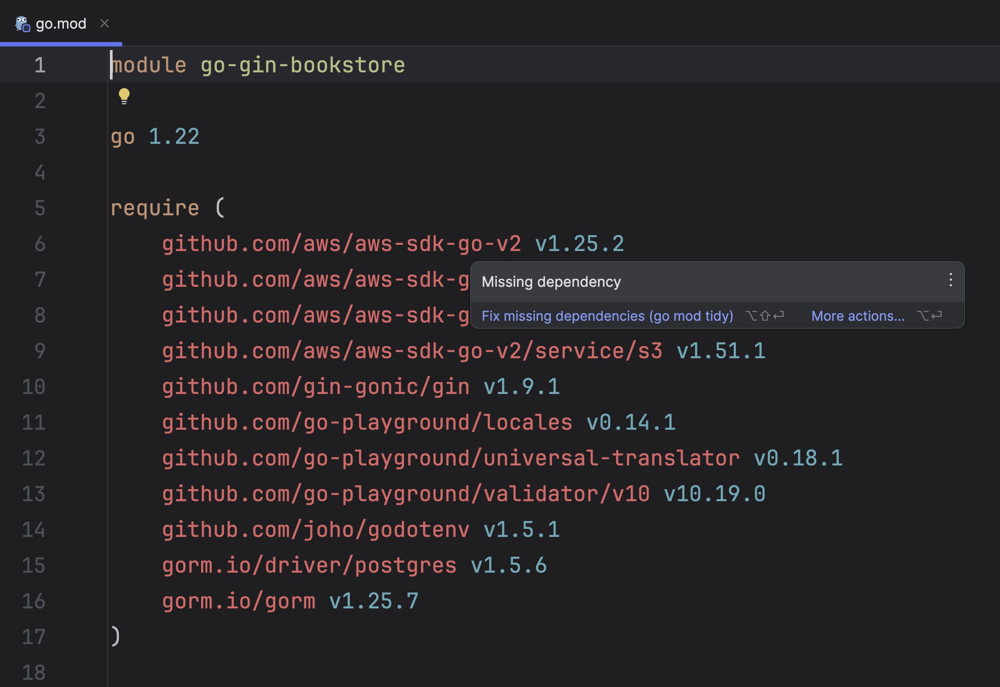

We now have our database setup and running in a reproducible container.
Time to head to our IDE -- GoLand of course -- and start a project for this sample application.

Let's start by creating a _New Project_ in [GoLand](https://www.jetbrains.com/go/).

Next, provide a project name. I will go for **go-gin-bookstore**, and click **Create**.

Once you have successfully initialized the project, create two folders in the project root.

- `core` - Contains the core business logic of the application.
- `models` - Contains database models.

## Go Dependencies

Next, we need to add the dependencies which are required for the application to run properly: Gin, GORM, and more.

I highly recommend installing the dependencies from `go.mod` file which you can
find from the source code available in [GitHub](https://github.com/mukulmantosh/go-gin-bookstore).

To install the packages specified in the `go.mod` file
in a Go project, you would typically use the `go mod tidy` command.

If you're not interested in typing, then GoLand will help you to automatically download the packages.

To configure [project settings](https://www.jetbrains.com/help/go/configure-project-settings.html), select GoLand | _Settings_ on macOS or File | _Settings_ on Windows and Linux from the main menu.

In the _Go menu_, navigate to the _Go Modules_.

Alternatively, while in the `go.mod` file, you can hover over the names of the missing packages highlighted in red. This action will trigger a prompt to install dependencies, or you can utilize the keyboard shortcut <kbd>Alt+Enter</kbd>.

