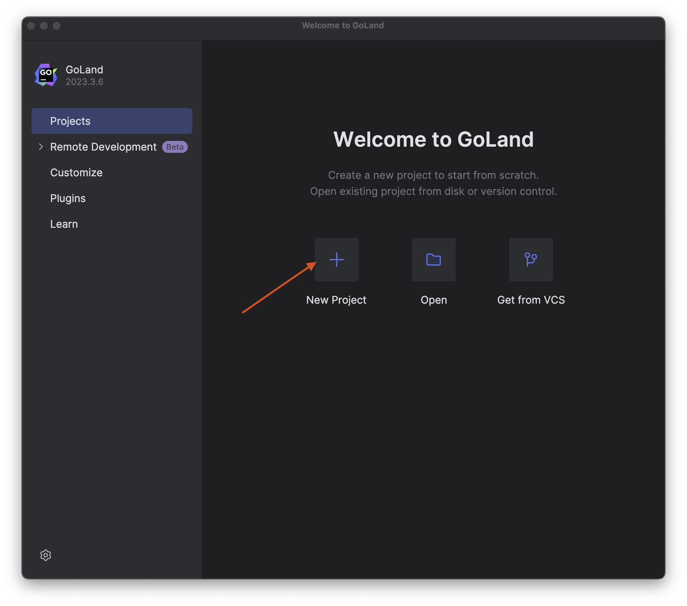
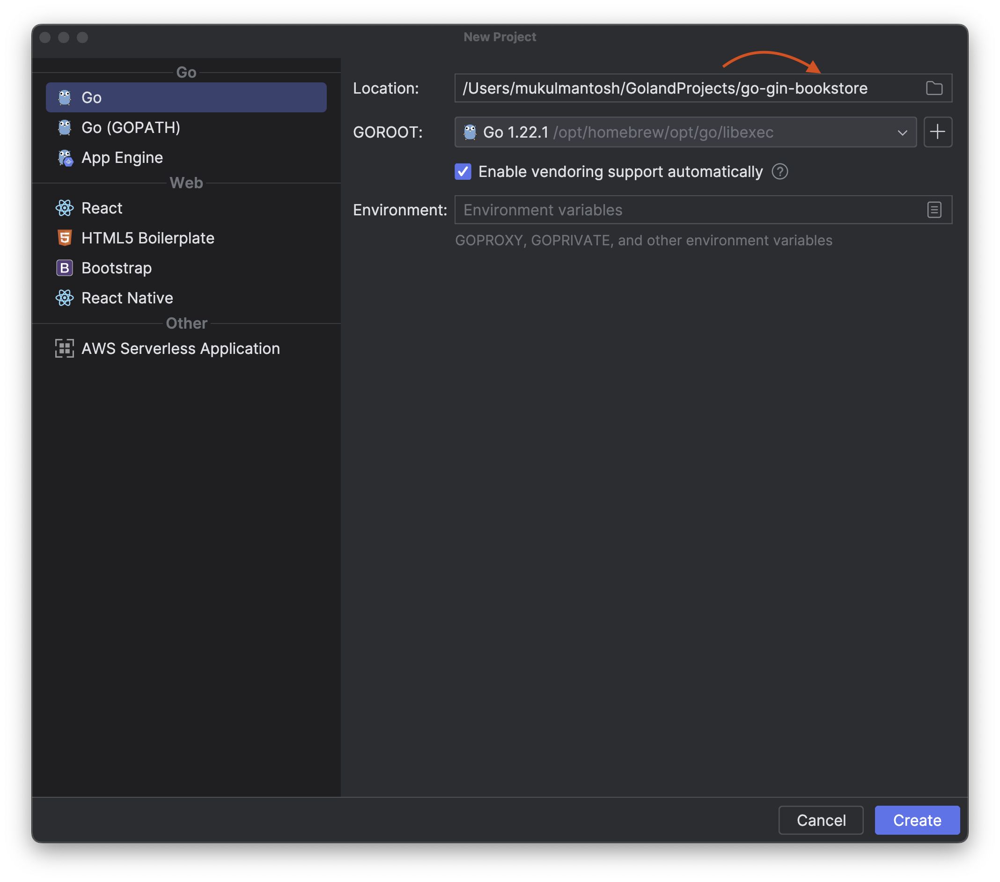
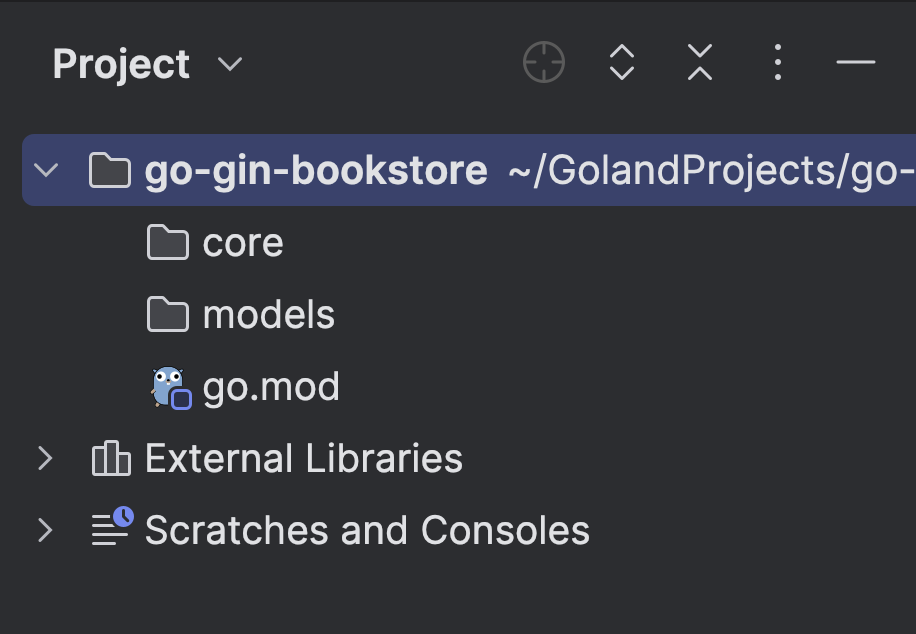
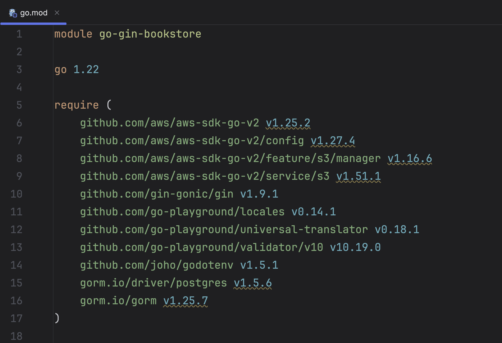

We now have our database setup and running in a reproducible container.
Time to head to our IDE -- GoLand of course -- and start a project for this sample application.

Let's start by creating a new project in [GoLand](https://www.jetbrains.com/go/).



Next, provide a project name. I will go for **go-gin-bookstore**, and click **Create**.



Once you have successfully initialized the project, create two folders in the project root.

- `core` - Contains the core business logic of the application.
- `models` - Contains database models.



## Go Dependencies

Next, we need to add the dependencies which are required for the application to run properly: Gin, GORM, and more.

### Gin

Gin is an HTTP web framework written in Go (Golang).
Since Gin is a Go package, you can install it with `go get`:

```bash
go get -u github.com/gin-gonic/gin
```

### GORM

[GORM](https://gorm.io/) (Go Object-Relational Mapping) is a developer-friendly ORM library for handling
relational databases in the Go language. It supports a variety of databases like MySQL,
PostgreSQL, SQLite, and SQL Server.

Run the following command to install.

```bash
go get -u gorm.io/gorm
go get gorm.io/driver/postgres
```

### Validator

Validation of Go Structs and Fields, inclusive of Cross Field,
Cross Struct evaluations, and in-depth analysis of Maps, Slices, and Arrays.

```bash
go get github.com/go-playground/validator/v10
```

### AWS SDK

The AWS [SDK](https://aws.amazon.com/sdk-for-go/) for Go enhances the usage of AWS services by offering a collection
of libraries that are coherent and user-friendly for Go programmers.

Run the following command to install.

```bash
go get github.com/aws/aws-sdk-go-v2
go get github.com/aws/aws-sdk-go-v2/config
go get github.com/aws/aws-sdk-go-v2/service/s3
```

### GoDotEnv

Loading environment variables from `.env` file.

Run the following command to install.

```bash
go get github.com/joho/godotenv
```

## Recommendation

I highly recommend installing the dependencies from `go.mod` file which you can
find from the source code available in [GitHub](https://github.com/mukulmantosh/go-gin-bookstore).



To install the packages specified in the `go.mod` file
in a Go project, you would typically use the `go mod tidy` command.

If you're not interested in typing, then GoLand will help you to automatically download the packages.

To configure [project settings](https://www.jetbrains.com/help/go/configure-project-settings.html), select GoLand | _Settings_ on macOS or File | _Settings_ on Windows and Linux from the main menu.


In the _Go menu_, navigate to the _Go Modules_.
