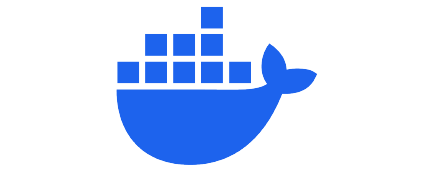

## Project Setup

Before proceeding ahead, make sure to install the below dependencies.

### Go

Go is an open source programming language that makes it simple to build secure, scalable systems.

### Docker

Docker helps developers bring their ideas to life by conquering the complexity of app development.

### Postgres

The World's Most Advanced Open Source Relational Database

### AWS CLI

The AWS Command Line Interface (CLI) is a unified tool to manage AWS services directly from the command line.
