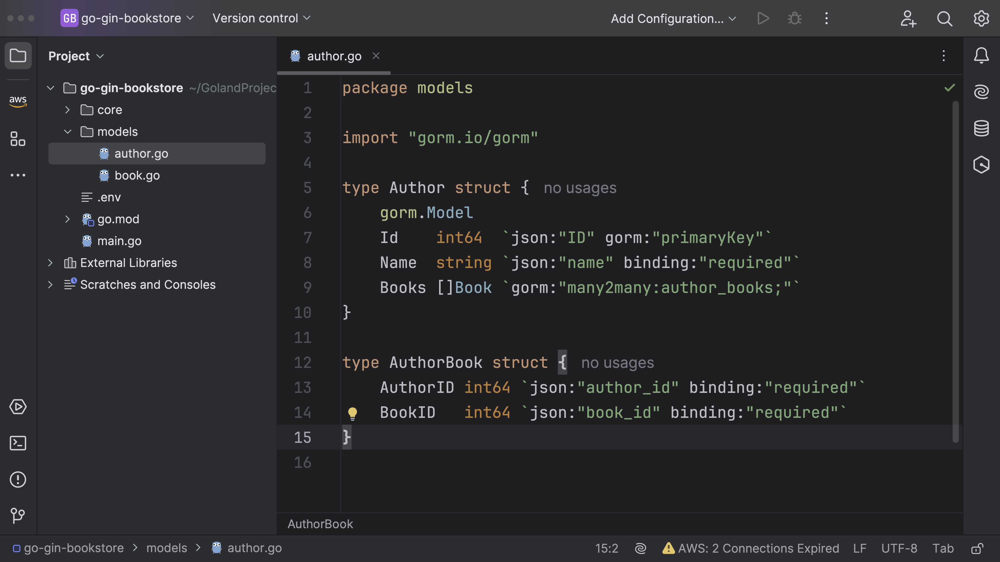

## Database Connection

Let's first create a database connection.
But before that you need to create
additional directories under the `core`.


- `abstract` - Contains interface, part of the interaction layer in a database-oriented application,
  often in combination with an ORM library like gorm.
- `controllers` - Stores all the HTTP handlers and routes.
- `database` - Initializing db connection and GORM models.
- `util.go` - re-usable code shared across the application.

Create `db.go` file under `database` directory.


_db.go_

```go
package database

import (
	"fmt"
	"gorm.io/driver/postgres"
	"gorm.io/gorm"
	"log"
	"os"
	"strconv"
)

type DBClient interface {
	DBMigrate() error
}

type Client struct {
	db *gorm.DB
}

func NewClient() (DBClient, error) {
	databaseHost := os.Getenv("DB_HOST")
	databaseUsername := os.Getenv("DB_USERNAME")
	databasePassword := os.Getenv("DB_PASSWORD")
	databaseName := os.Getenv("DB_NAME")
	databasePort := os.Getenv("DB_PORT")
	dbPort, err := strconv.Atoi(databasePort)
	if err != nil {
		log.Fatal("Invalid DB Port")
	}

	dsn := fmt.Sprintf("host=%s user=%s password=%s dbname=%s port=%d sslmode=%s",
		databaseHost, databaseUsername, databasePassword, databaseName, dbPort, "disable")

	dbInfo, err := gorm.Open(postgres.Open(dsn), &gorm.Config{})
	if err != nil {
		return nil, err
	}

	client := Client{db: dbInfo}
	return client, nil
}

func (c Client) DBMigrate() error {
	return nil

}

func (c Client) CloseDBConnection() {
	db, err := c.db.DB()
	if err != nil {
		panic("Failed to close connection from database")
	}
	db.Close()
}

```

1. `type DBClient` interface - This interface defines what methods a DBClient should have. In this case, it is DBMigrate() error, which is a method for migrating the database. The exact implementation of DBMigrate() is left to the structs that implement the DBClient interface.
   <br><br>
2. `type Client` struct - This struct contains a pointer to a GORM DB object. This is the main object that the application will use to interact with the database.
   <br><br>
3. `func NewClient() (DBClient, error)` - This function initializes a new Client object. It reads environment variables to get the database connection details (host, username, password, database name, and port). It then uses these details to open a new connection to the Postgres database. If successful, it returns a client that implements the DBClient interface (since Client struct implements DBMigrate() method from DBClient interface). If not successful, it returns an error.
   <br><br>
4. `func (c Client) DBMigrate() error` - This is a "placeholder" method for the database migration operation. In this structure, it just returns nil signifying no error. However, in a real application, you would put the code to migrate your database here.
   <br><br>
5. `func (c Client) CloseDBConnection()` - This method is closing the database connection. It attempted to access the general SQL database handle and then close it off. If it fails to get the handle, it panics with an error message.

Next, make sure to update the environment variables.

```go
databaseHost := os.Getenv("DB_HOST")
databaseUsername := os.Getenv("DB_USERNAME")
databasePassword := os.Getenv("DB_PASSWORD")
databaseName := os.Getenv("DB_NAME")
databasePort := os.Getenv("DB_PORT")
```


Now, create `main.go` under project root.


The `main()` is the program entry point. We are going to initialize the database, migrate db tables etc.

```go
package main

import (
	_ "github.com/joho/godotenv/autoload"
	"go-gin-bookstore/core/database"
	"log"
)

func main() {

	// establish connection with db
	db, err := database.NewClient()
	if err != nil {
		panic("Something wrong with DBClient")
	}
	err = db.DBMigrate()
	if err != nil {
		log.Fatal("Database Migration Failed!")
		return
	}

}
```

Once our models are prepared, we'll proceed to implement `db.DBMigrate()`. This will occur shortly.

## Defining Models

### Book Model

Let's begin by creating our `Book` model.


_models/book.go_

```go
package models

import (
	"gorm.io/gorm"
	"time"
)

// DateParser interface wraps the ParsePublicationDate method
type DateParser interface {
	ParsePublicationDate() (time.Time, error)
}

type Book struct {
	gorm.Model
	Id              int64     `json:"ID" gorm:"primaryKey"`
	Title           string    `json:"title" binding:"required"`
	ISBN            string    `json:"isbn" binding:"required"`
	Image           string    `json:"image,omitempty"`
	PublicationDate time.Time `json:"publication_date" binding:"required"`
}

type BookParams struct {
	Id              int64  `json:"id"`
	Title           string `json:"title"`
	ISBN            string `json:"isbn"`
	PublicationDate string `json:"publication_date"`
}

// ParsePublicationDate Implementing the DateParser interface
func (params BookParams) ParsePublicationDate() (time.Time, error) {
	return ValidateDate(params.PublicationDate)
}

type UpdateBookParams struct {
	Title           string `json:"title" binding:"required"`
	ISBN            string `json:"isbn" binding:"required"`
	PublicationDate string `json:"publication_date" binding:"required"`
}

// ParsePublicationDate Implementing the DateParser interface
func (params UpdateBookParams) ParsePublicationDate() (time.Time, error) {
	return ValidateDate(params.PublicationDate)
}

func ValidateDate(pubDate string) (time.Time, error) {
	standardFormat := "2006-01-02" // This layout represents the date format "YYYY-MM-DD"
	date, err := time.Parse(standardFormat, pubDate)
	if err != nil {
		return time.Time{}, err
	}
	return date, nil
}

```

In this Go struct, we have the following fields:

- `gorm.Model` - this is an embedded field. It means that the Book struct includes all the fields defined in gorm.
- `Id` - This is an integer (int64) field that represents the unique identifier of a book.
- `Title` - This is a string field representing the title of a book.
- `ISBN` - This is another string field which stands for International Standard Book Number.
- `Image` - This is a string that might contain a link or path to the image of the book cover.
- `PublicationDate` - This is of type time.Time, storing the book's publication date.

```go
type BookParams struct {
	Id              int64  `json:"id"`
	Title           string `json:"title"`
	ISBN            string `json:"isbn"`
	PublicationDate string `json:"publication_date"`
}
```

The following structs will be used specifically for creating/updating book.

```go
type BookParams struct {
	Id              int64  `json:"id"`
	Title           string `json:"title"`
	ISBN            string `json:"isbn"`
	PublicationDate string `json:"publication_date"`
}
```

```go
type UpdateBookParams struct {
	Title           string `json:"title" binding:"required"`
	ISBN            string `json:"isbn" binding:"required"`
	PublicationDate string `json:"publication_date" binding:"required"`
}
```

This is an interface that declares the `ParsePublicationDate` method. Any type that defines
this method is said to satisfy the `DateParser` interface. This method returns a `time.Time` type and an error.

```go
type DateParser interface {
	ParsePublicationDate() (time.Time, error)
}
```

- `ParsePublicationDate`: This function, defined for both `BookParams` and `UpdateBookParams`,
  uses the `ValidateDate` function to attempt to parse the `PublicationDate` string
  property and convert it to a `time.Time` type.
  <br><br>
- `ValidateDate`: This function takes a string argument representing a date and attempts
  to parse it into a time.Time type using the standard date format "2006-01-02"
  (which represents "YYYY-MM-DD"). If successful, the parsed date and a nil error are
  returned; if unsuccessful, the zero value for `time.Time` and the error are returned.

```go
// ParsePublicationDate Implementing the DateParser interface
func (params UpdateBookParams) ParsePublicationDate() (time.Time, error) {
	return ValidateDate(params.PublicationDate)
}

func ValidateDate(pubDate string) (time.Time, error) {
	standardFormat := "2006-01-02" // This layout represents the date format "YYYY-MM-DD"
	date, err := time.Parse(standardFormat, pubDate)
	if err != nil {
		return time.Time{}, err
	}
	return date, nil
}
```

### Author Model

- The `Author` struct: The `Id` and `Name` fields represent the unique identifier and name of an author, respectively.
  <br>
  The Books field is of type `[]Book`, which suggests that an author can have multiple books associated with them. The tag `gorm:"many2many:author_books;"` specifies a many-to-many relationship between books and authors.
  <br><br>
- The `AuthorBook` struct: This is used to model the many-to-many relationship between authors and books. It includes fields AuthorID and BookID, and the `binding:"required"` tag indicates that these fields are mandatory.



```go
package models

import "gorm.io/gorm"

type Author struct {
	gorm.Model
	Id    int64  `json:"ID" gorm:"primaryKey"`
	Name  string `json:"name" binding:"required"`
	Books []Book `gorm:"many2many:author_books;"`
}

type AuthorBook struct {
	AuthorID int64 `json:"author_id" binding:"required"`
	BookID   int64 `json:"book_id" binding:"required"`
}
```
