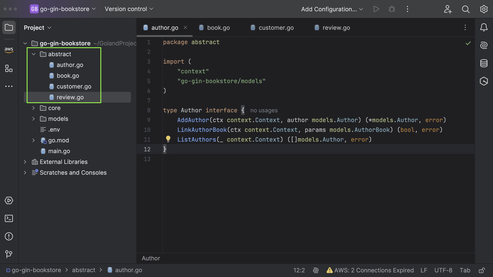

## Interfaces

Following this, we are going to establish several interfaces that define method signatures.



Author interface with methods for adding an author, linking an author and a book, and listing all authors. There are also Author, AuthorBook, and Book structs which represent their respective entities, and the many-to-many relation between Author and Book is modeled using the AuthorBook struct and the Books field on the Author struct.

_author.go_

```go
package abstract

import (
	"context"
	"go-gin-bookstore/models"
)

type Author interface {
	AddAuthor(ctx context.Context, author models.Author) (*models.Author, error)
	LinkAuthorBook(ctx context.Context, params models.AuthorBook) (bool, error)
	ListAuthors(_ context.Context) ([]models.Author, error)
}

```

The Book interface provides an abstraction for operations on a book database,
which includes adding, listing, updating, and deleting books.

_book.go_

```go
package abstract

import (
	"context"
	"go-gin-bookstore/models"
)

type Book interface {
	AddBook(ctx context.Context, bookParams models.DateParser) (*models.BookParams, error)
	ListBooks(ctx context.Context) ([]models.Book, error)
	UpdateBook(ctx context.Context, updateBookParams models.DateParser, bookId int64) (bool, error)
	DeleteBook(ctx context.Context, bookId int64) error
	UpdateBookCover(ctx context.Context, bookId int64, bookImageURL string) (bool, error)
}

```

_customer.go_

The Customer interface defines three methods for adding, updating, and deleting customers. These methods are expected to be implemented by any structs that satisfy this interface.
The Customer struct represents a customer object with fields like `Id`, `FirstName`, `LastName`, `Email`, `PhoneNumber`, and `Address`. This struct is used to store customer information in the database.
The `CustomerParams` struct is used to hold parameters to update customer information, with fields `FirstName`, `LastName`, and `Address`. It's used in the `UpdateCustomer` method of the `Customer` interface.

```go
package abstract

import (
	"context"
	"go-gin-bookstore/models"
)

type Customer interface {
	AddCustomer(ctx context.Context, cusParams models.Customer) (*models.Customer, error)
	UpdateCustomer(ctx context.Context, updateCusParams models.CustomerParams, customerId int64) (bool, error)
	DeleteCustomer(ctx context.Context, customerId int64) error
}

```

_review.go_

- `AddReview`: Takes a context and `ReviewParams` (with `customer ID`, `book ID`, `rating`, and `comment`). It returns a boolean and an error. This method could be used to add a review.
- `ListReview`: Takes a context and a book ID, and returns a list of `ReviewList` (with `review ID`, `rating`, `comment`) and an error. This method could list all reviews for a specific book.

```go
package abstract

import (
	"context"
	"go-gin-bookstore/models"
)

type Review interface {
	AddReview(ctx context.Context, revParams models.ReviewParams) (bool, error)
	ListReview(ctx context.Context, bookId int64) ([]models.ReviewList, error)
}

```
