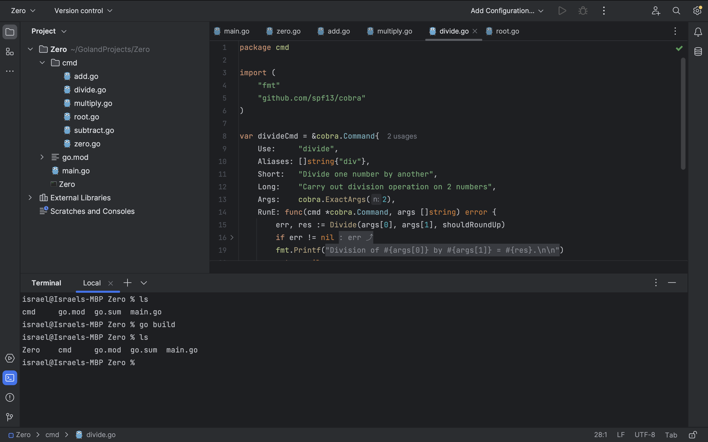
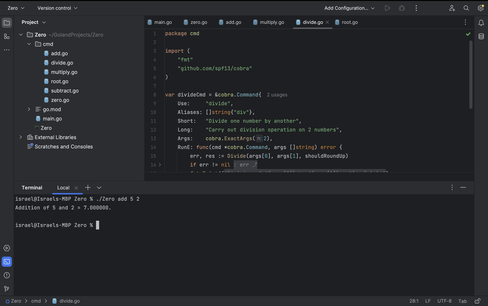
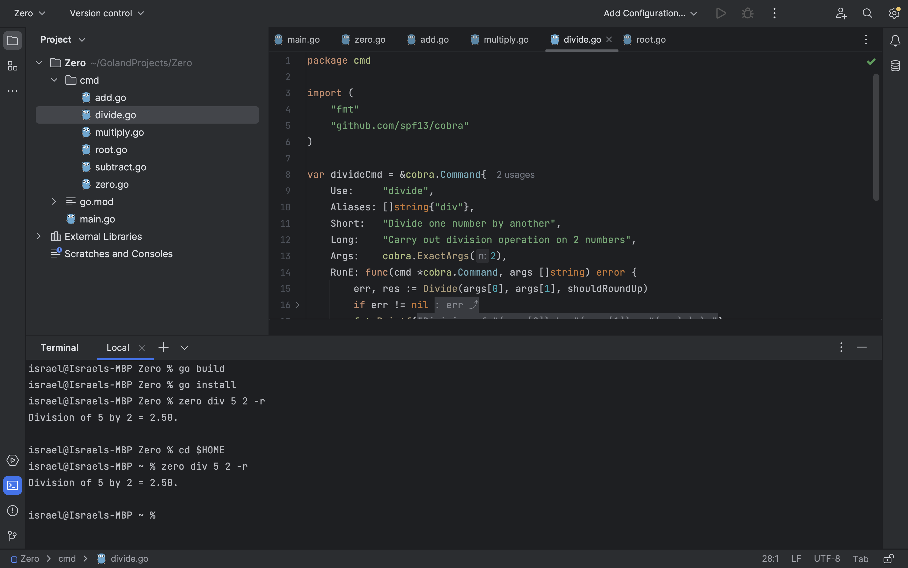

The next step involves generating an executable binary for your application that can then be run, deployed, and distributed conveniently across various environments as needed.

To proceed, launch your GoLand terminal and run the `ls` command to view the files in your project directory. Then, run the `go build` command to build the binary executable file.

To confirm the generation of your executable file, execute the `ls` command once more in your GoLand terminal. You should see a new file with the name of your project in your project directory:



By default, the generated binary file matches the specifications of the current system: a `Zero.exe` file for Windows and a Unix executable file named `Zero` for Mac and Linux systems.

To test your command line application, run the following command in your GoLand terminal:

```shell
./Zero add 5 2
```

You should get the appropriate result printed in the console, as shown below:



You've successfully generated a binary executable version of your command line application that can now be deployed and distributed. However, it cannot yet be executed outside the file directory. To change that, you need to install the application on your system.

To do that, run the `go install` command in your GoLand terminal and then execute the division operation using the `zero div 5 2 -r` command. The appropriate result will be displayed in the terminal, confirming that the installation was successful:



For further confirmation, you can also switch back to the home directory in your GoLand terminal using the `cd $HOME` command and then run the `zero` command once more. The appropriate result should also be displayed.
