Now that you know the basics of command line interfaces and their underlying principles, let's look at the process of building one using the Go programming language and Cobra. [Cobra](https://github.com/spf13/cobra) is a simple and powerful open source library released under the [Apache License 2.0](https://github.com/spf13/cobra/blob/main/LICENSE.txt) for creating modern command line applications in Go. With a broad userbase, including notable projects like Kubernetes, Cosmos SDK, and GitHub CLI, Cobra is highly regarded for its extensive capabilities. Among its notable features are intelligent suggestions, command aliases, and support for nested commands, making it an ideal choice for crafting sophisticated and user-friendly CLI tools in the Go ecosystem.

In this tutorial, you'll use the Cobra package to create Zero, a command line application to perform basic mathematical operations like addition, subtraction, multiplication, and division.

### Prerequisites

To complete this tutorial, you'll need the following:

1. Familiarity with the Go programming language and the Go package installed on your local machine. The [Go documentation](https://go.dev/doc/install) provides steps on how to set up Go on your device.
2. [GoLand](https://www.jetbrains.com/go/) (or another editor or IDE with support for Go).

### Creating a Go Application

Launch your GoLand IDE and initiate a new Go project. Specify your desired project name and location on your device:

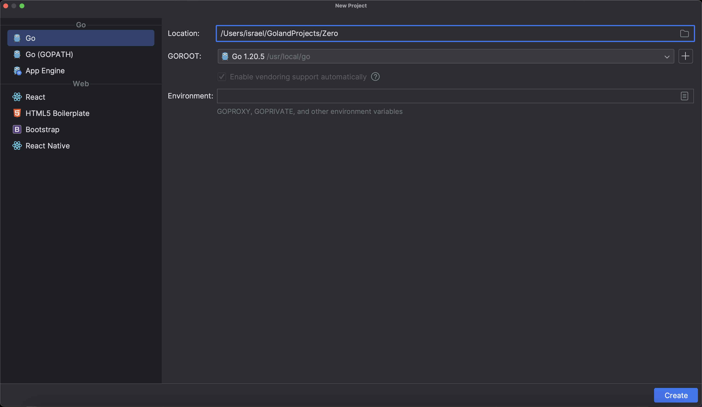

Create a `main.go` file within the project directory. This file will act as the central hub for your project's codebase:

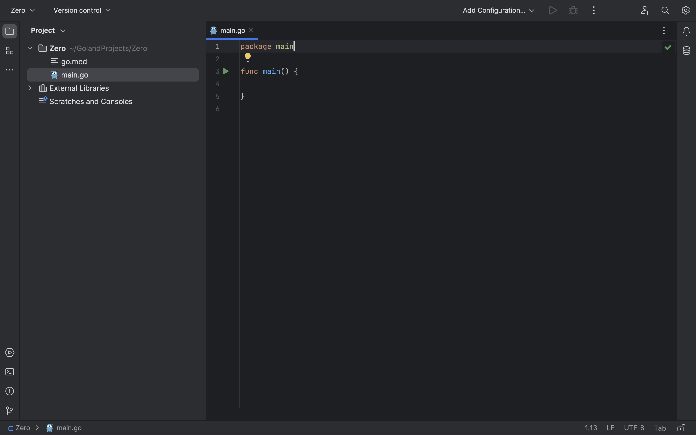

### Creating a Command

First, create a folder called `cmd` in the same directory as your `main.go` file and then create a `root.go` file in the newly created `cmd` folder.

The `root.go` file uses the Cobra package to create the root command and an accessor function to execute the command. Paste in the code below:

```go
package cmd

import (
    "fmt"
    "github.com/spf13/cobra"
    "os"
)

var rootCmd = &cobra.Command{
    Use:   "zero",
    Short: "zero is a cli tool for performing basic mathematical operations",
    Long:  "zero is a cli tool for performing basic mathematical operations - addition, multiplication, division and subtraction.",
    Run: func(cmd *cobra.Command, args []string) {

    },
}

func Execute() {
    if err := rootCmd.Execute(); err != nil {
        fmt.Fprintf(os.Stderr, "Oops. An error while executing Zero '%s'\n", err)
        os.Exit(1)
    }
}
```

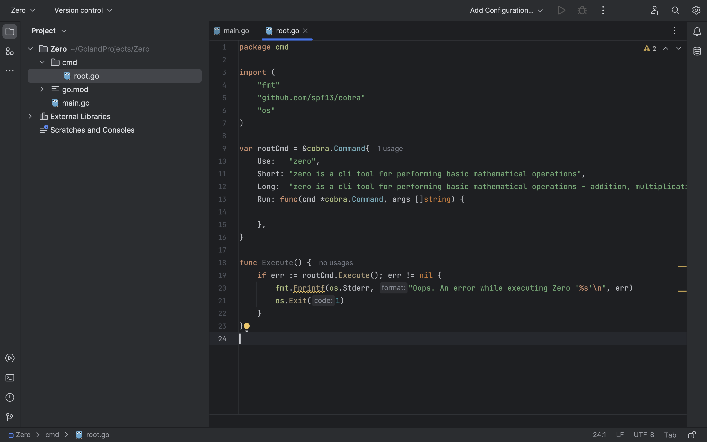

Here, `cobra.Command` is used to define a new command with several properties:

- `Use` holds the text used to invoke usage of the command.
- `Short` represents a short description of the command. This is shown in the CLI help output.
- `Long` is similar to `Short` but holds a longer description of the command.
- `Run` holds the function to be executed on the invocation of the command.

The `Execute()` function handles the execution of the root command and handles possible errors by printing the error messages to the console.

Having created the root command `rootCmd`, which is the main entry point and the root of your command tree, you may encounter a few errors associated with the `cobra` package. To address these issues, simply position your cursor over the `import` statement for Cobra and click the bulb icon that appears. Select the **Sync dependencies** option to trigger the GoLand IDE to automatically acquire and set up the Cobra package:

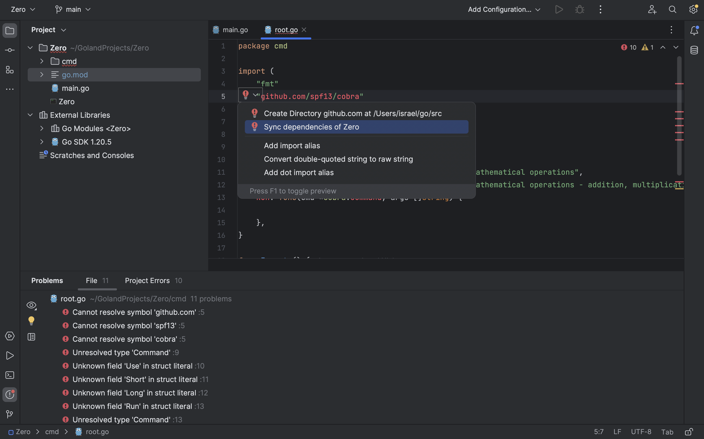

Alternatively, you can execute the following command in your GoLand terminal to install Cobra:

```go
go get -u github.com/spf13/cobra@latest
```

The following result should print to your console, showing the successful installation of the `cobra` package:

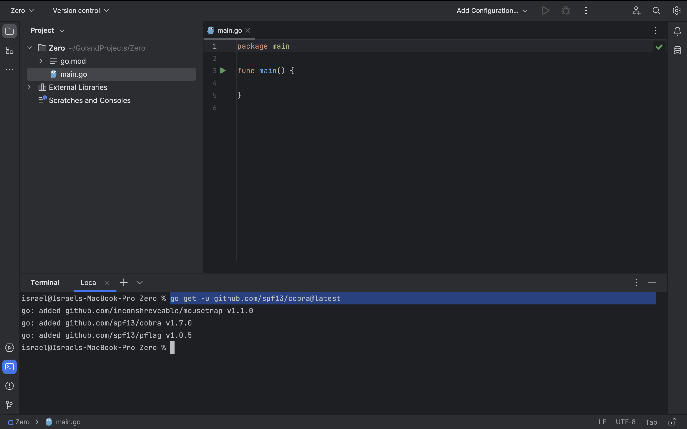

You can now utilize the root command's `Execute()` function in your `main.go` file:

```go
package main

import "Zero/cmd"

func main() {
    cmd.Execute()
}
```

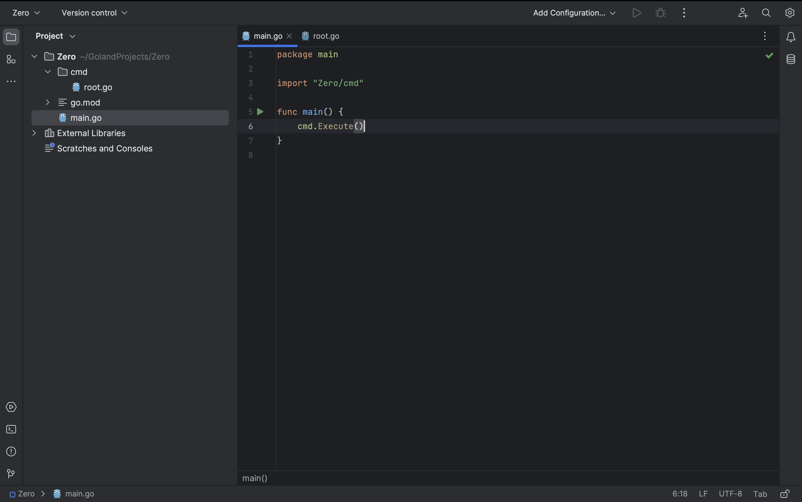

At this stage, you can test out your command line application by running `go run main.go --help` in your GoLand terminal. You should get the following help result:

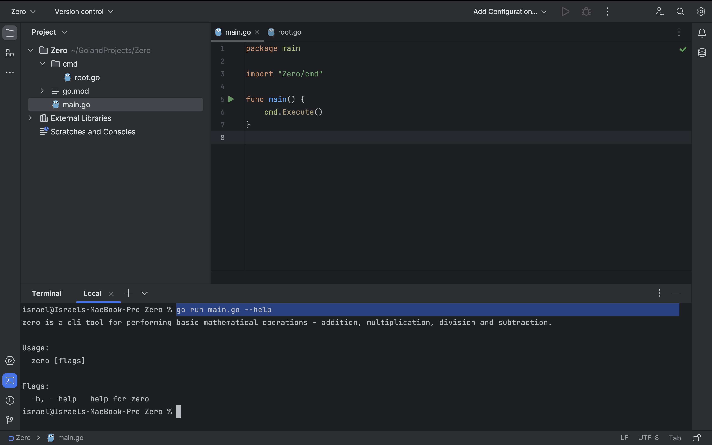

### Adding Subcommands

Create a `zero.go` file in the `cmd` directory to hold the logic for your mathematical operations. Save it with the following code:

```go
package cmd

import (
    "fmt"
    "strconv"
)

func Add(first string, second string) (result string) {
    num1, err := strconv.ParseFloat(first, 64)
    if err != nil {
        fmt.Println("Error: First value is invalid")
        return
    }
    num2, err := strconv.ParseFloat(second, 64)
    if err != nil {
        fmt.Println("Error: Second value is invalid")
        return
    }
    return fmt.Sprintf("%f", num1+num2)
}

func Subtract(from string, subtract string) (result string) {
    num1, err := strconv.ParseFloat(from, 64)
    if err != nil {
        fmt.Println("Error: First value is invalid")
        return
    }
    num2, err := strconv.ParseFloat(subtract, 64)
    if err != nil {
        fmt.Println("Error: Second value is invalid")
        return
    }
    return fmt.Sprintf("%f", num1-num2)
}
```

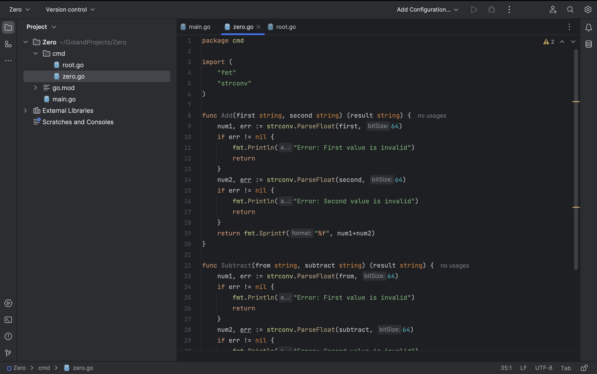

Next, you'll create the add and subtract commands to leverage these functional logics. Start by creating two new files in the `cmd` directory: `add.go` to hold the command for the addition operation and `subtract.go` to hold the command for subtraction.

First, for the addition operation, the `add.go` file should contain the following lines of code:

```go
package cmd

import (
    "fmt"
    "github.com/spf13/cobra"
)

var addCmd = &cobra.Command{
    Use:     "add",
    Aliases: []string{"addition"},
    Short:   "Add 2 numbers",
    Long:    "Carry out addition operation on 2 numbers",
    Args:    cobra.ExactArgs(2),
    Run: func(cmd *cobra.Command, args []string) {
        fmt.Printf("Addition of %s and %s = %s.\n\n", args[0], args[1], Add(args[0], args[1]))
    },
}

func init() {
    rootCmd.AddCommand(addCmd)
}
```

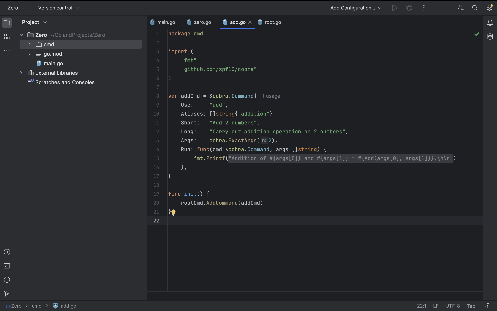

You'll notice that two new properties are introduced in `cobra.Command` that were not used in the `rootCmd` definition:

- `Aliases` holds an array of alternative texts that can be used to invoke the command.
- `Args`, short for arguments, defines the constraints for arguments required by this command. In this case, `cobra.ExactArgs(2)` specifies that exactly two arguments are needed to perform basic mathematical operations. You can find more argument specifications and constraints in the [Cobra usage documentation](https://github.com/spf13/cobra/blob/v1.7.0/user_guide.md#positional-and-custom-arguments).

The add command (`addCmd`) is then added as a subcommand to the root command in the `init()` function.

Proceed to implement the subtract command by saving the following code in the `subtract.go` file:

```go
package cmd

import (
    "fmt"
    "github.com/spf13/cobra"
)

var subtractCmd = &cobra.Command{
    Use:     "subtract",
    Aliases: []string{"sub"},
    Short:   "Subtract a number from another",
    Long:    "Carry out subtraction operation on 2 integers",
    Args:    cobra.ExactArgs(2),
    Run: func(cmd *cobra.Command, args []string) {
        fmt.Printf("Subtraction of %s from %s = %s.\n\n", args[1], args[0], Subtract(args[0], args[1]))
    },
}

func init() {
    rootCmd.AddCommand(subtractCmd)
}
```


The subtract command is also added as a subcommand to `rootCmd` in the `init()` function.

You can now run basic addition and subtraction operations using Zero, your command line application. Launch your GoLand terminal and execute the following commands:

```go
go run main.go add 5 2
go run main.go sub 5.4 2
go run main.go sub 5.4 2d
```

Observe the error printed to the terminal when `2d`, which is not a valid number, is passed as an argument to the command line application:


You've now created a command line application with both commands and subcommands.

### Adding Command Flags

In the following section, you'll use the multiplication operation to implement flags in commands so that you can see how flags modify the behavior of commands. You'll implement a flag to round up the multiplication result of the numbers provided as arguments to two decimal places.

First, add the following logic functions for the multiplication operation to the bottom of the `zero.go` file:

```go
func Multiply(first string, second string, shouldRoundUp bool) (result string) {
    num1, err := strconv.ParseFloat(first, 64)
    if err != nil {
        fmt.Println("Error: First value is not a decimal")
        return
    }
    num2, err := strconv.ParseFloat(second, 64)
    if err != nil {
        fmt.Println("Error: Second value is not a decimal")
        return
    }
    if shouldRoundUp {
        return fmt.Sprintf("%.2f", num1*num2)
    }
    return fmt.Sprintf("%f", num1*num2)
}
```

Then, create a `multiply.go` file in the `cmd` folder. The file will contain the implementation of the multiplication command and `init()` function, as shown below:

```go
package cmd

import (
    "fmt"
    "github.com/spf13/cobra"
)

var shouldRoundUp bool
var multiplyCmd = &cobra.Command{
    Use:     "multiply",
    Aliases: []string{"mul", "multiple", "multi"},
    Short:   "Multiply 2 numbers",
    Long:    "Carry out multiplication operation on 2 numbers",
    Args:    cobra.ExactArgs(2),
    Run: func(cmd *cobra.Command, args []string) {
        fmt.Printf("Multiplication of %s and %s = %s.\n\n", args[0], args[1], Multiply(args[0], args[1], shouldRoundUp))
    },
}

func init() {
    multiplyCmd.Flags().BoolVarP(&shouldRoundUp, "round", "r", false, "Round results up to 2 decimal places")
    rootCmd.AddCommand(multiplyCmd)
}
```

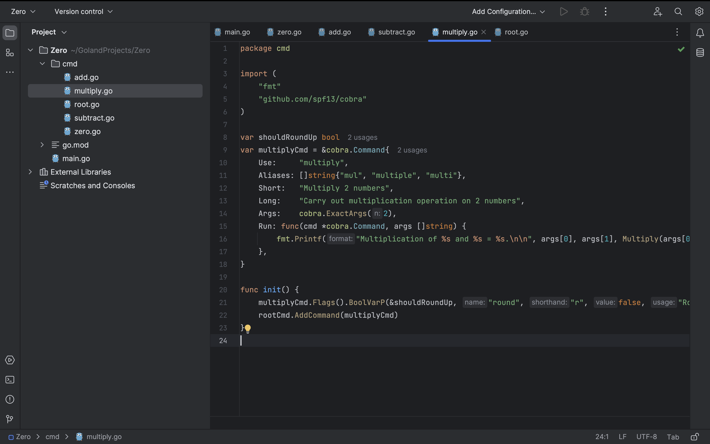

In the `init()` function, `multiplyCmd.Flags().BoolVarP` adds a Boolean flag with the name `round` and the shorthand `r` to the multiply command. String flags can also be used as shown in the [Cobra documentation](https://github.com/spf13/cobra/blob/v1.7.0/user_guide.md#flag-groups).

Next, execute the `go run main.go multiply 5.4 2 --round` command with the `round` flag in your GoLand terminal. Alternatively, you can also use the flag shorthand by running `go run main.go multiply 5.4 2 -r` . You should get the following result:

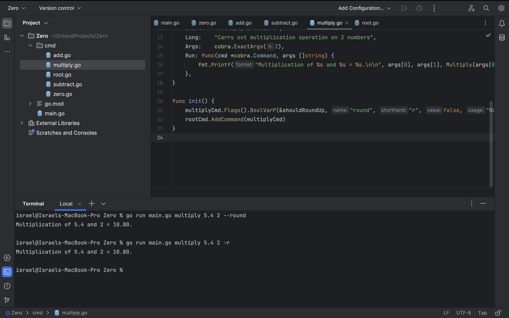
