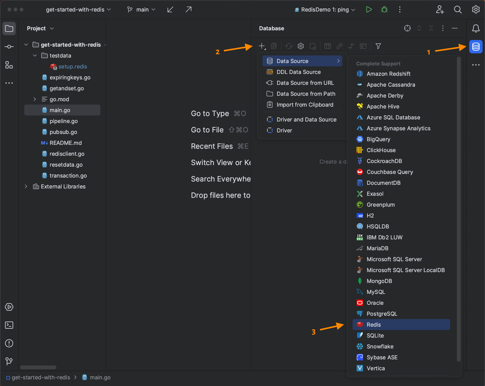
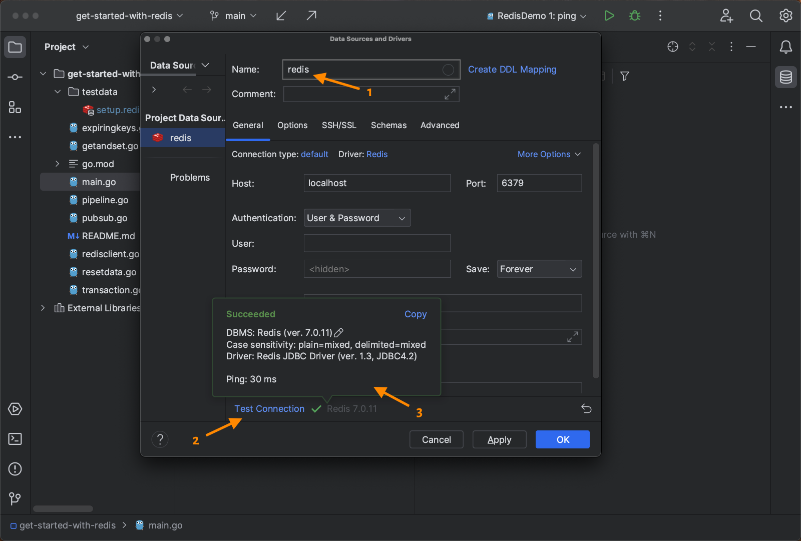
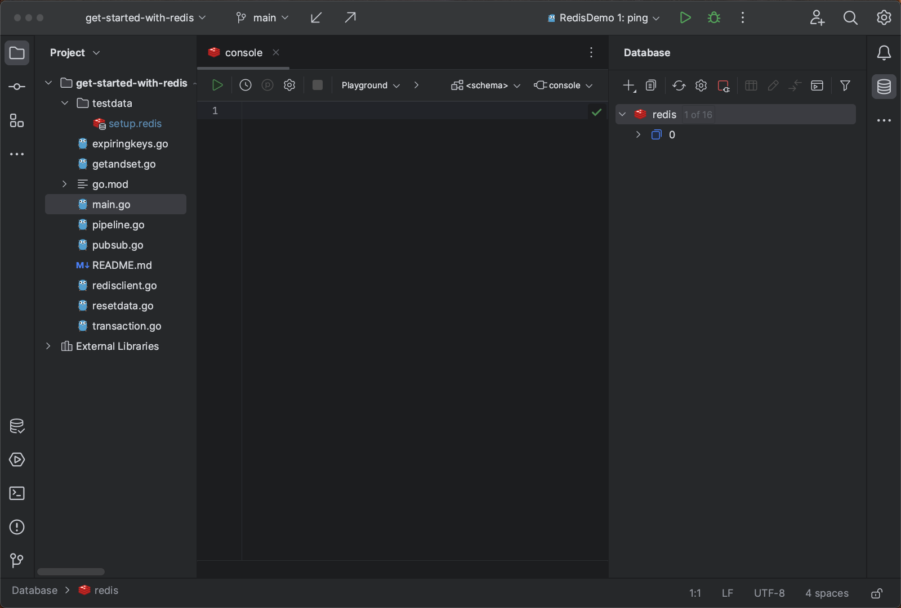
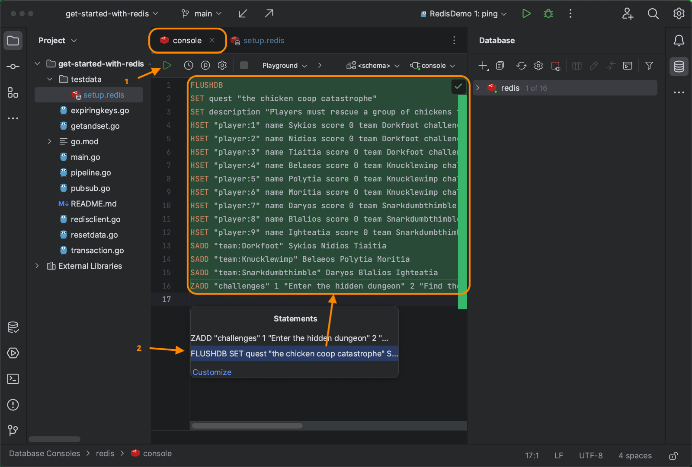
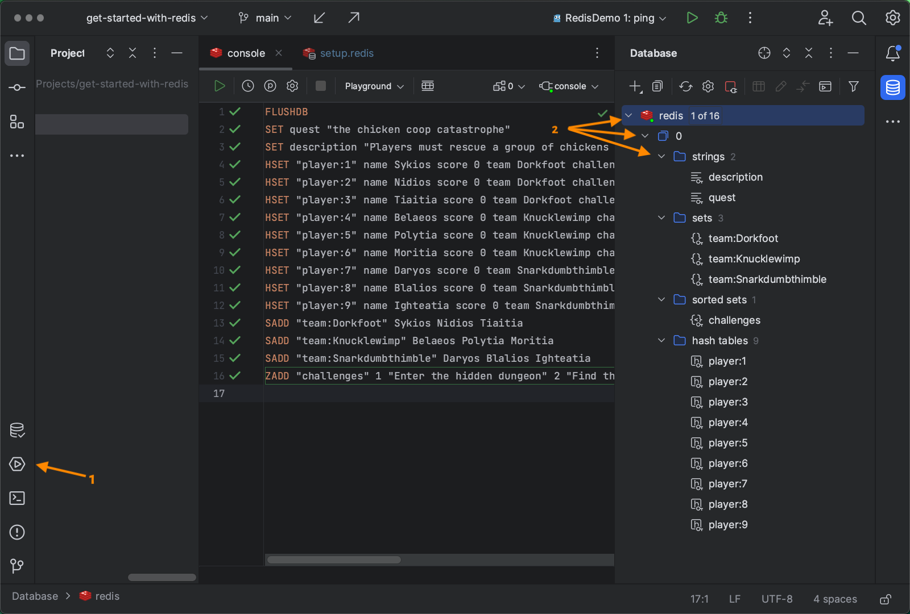
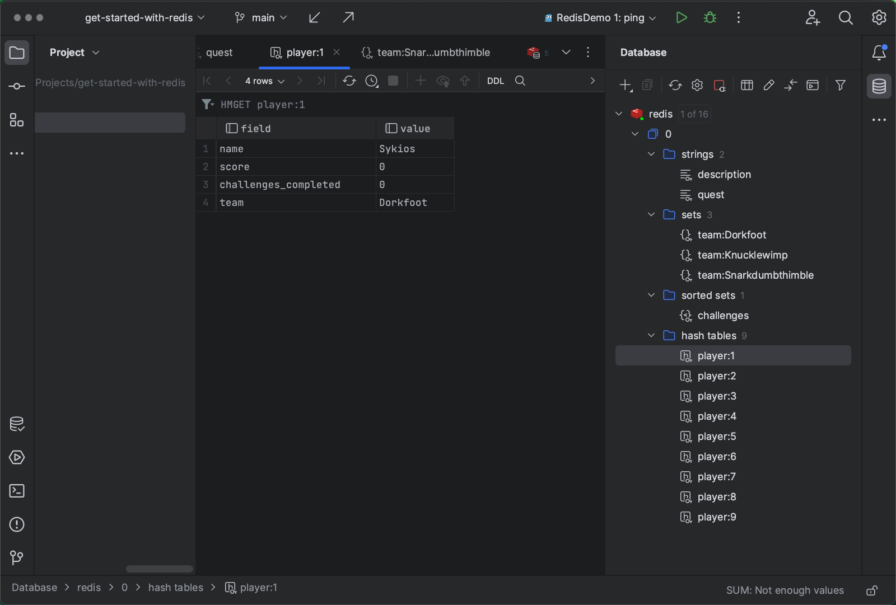
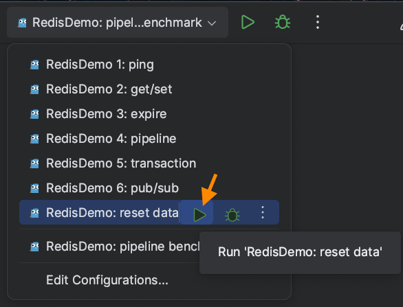

### Connecting GoLand to Redis

GoLand's database tool supports a wide range of databases. After connecting the IDE to a database, you can explore the data on the fly.

To connect to your Redis instance, click the **Database** icon in the toolbar on the right to open the database tool (1), then click the **+** icon (2) to create a new data source. Finally, in the menu that opens, open the **Data Source** submenu and select **Redis** (3):

The data source configuration form will open. If you like, you can change the default name (`0@localhost`) to `redis` (1). If your Redis instance runs on your local machine on the default port 6379, no further adjustments are required. Otherwise, adjust the host and port settings to point to your Redis instance.

If all settings look fine, click **Test Connection** (2). You should get a success message (3):

Click **OK**. You'll see the connection listed on the right and a database console in the center. In the console, you can run database statements and inspect their output:

### Adding Demo Data

Let's test the console by filling the database with initial data for the demo.

Open the file `testdata/setup.redis` and copy all lines:

Switch to the console window and paste the lines there. Click the **Execute** button, which is a green triangle at the top left of the console window (1). A dialog box will open that allows you to select the current statement or all statements.

Move your mouse cursor over the line that starts with `FLUSHDB`. All statements in the console should turn green. Click that line (2) to run the statements:

GoLand will execute all the statements and mark each statement with a green check mark. At the bottom of the window, sixteen result windows should appear, one per statement, showing the return values of the Redis statements. They will either show "OK" or the number of inserted or updated items:

Right-click one of the result tabs and select **Close All** to close the result windows.

Click the **Services** icon in the toolbar on the left (1) to close the console output. Then, turn to the database tool and expand the Redis database by clicking the carets until all elements are open (2):

What you see here is the structure of the demo database. It contains strings, sets, a sorted set, and hash tables.

Double-click each item to inspect its contents:

### Resetting the Data

In case you inadvertently change the data so that one of the demos does not run successfully, you can reset the database contents by selecting the run configuration `RedisDemo: reset data`:

This run configuration reads the `setup.redis` file and executes the statements as you did manually before. This way, whenever the data seems to be screwed up, you can get back to a clean status.
