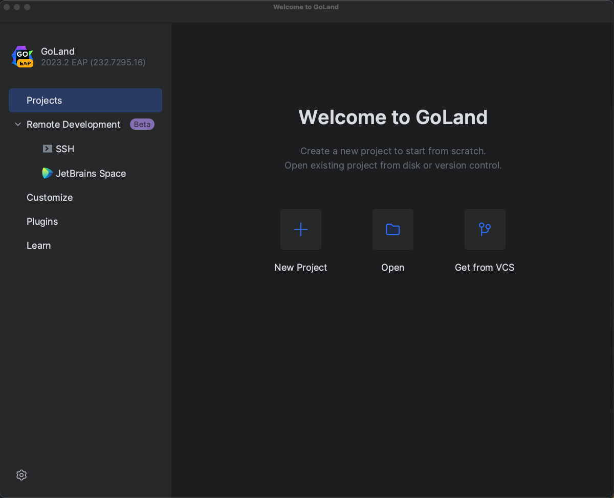
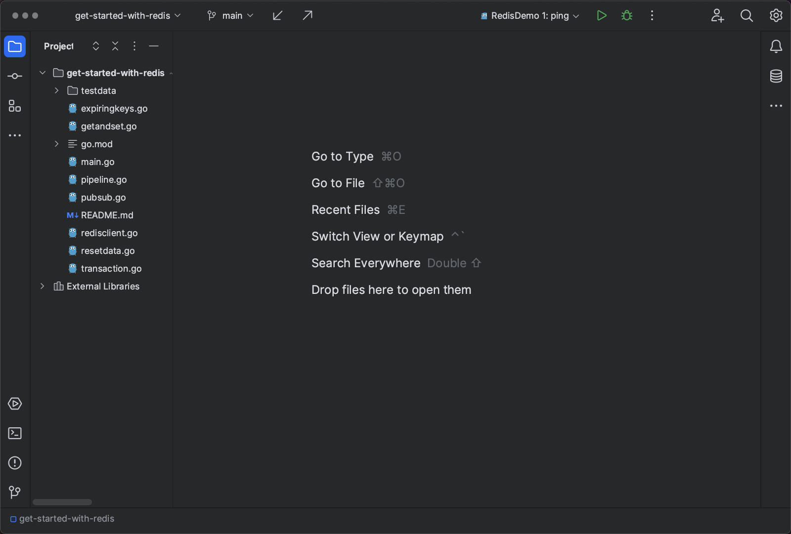
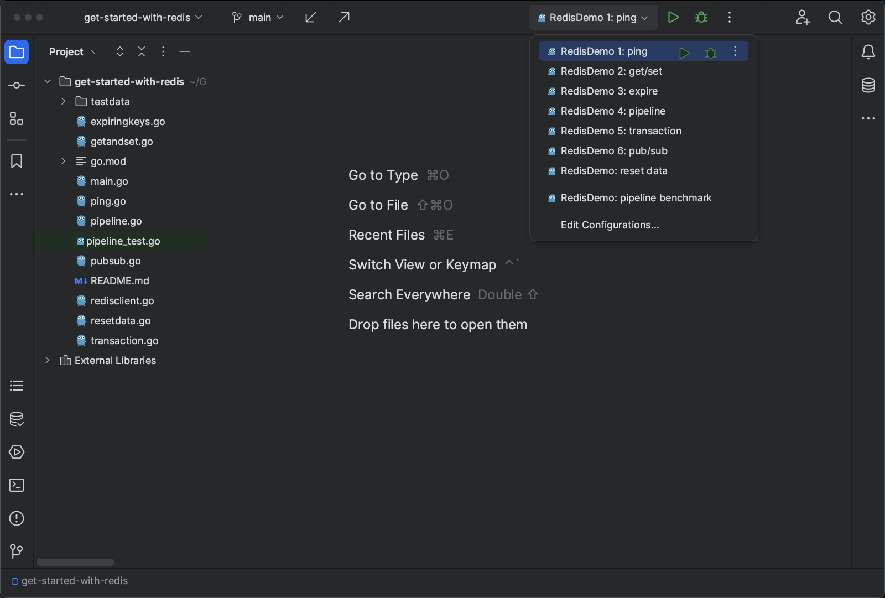

### Creating a Project in GoLand

Start your GoLand IDE. If it's a fresh installation, you'll be prompted with a welcome screen.

Click **Open**.

In the file selector dialog that opens, select the folder `get-started-with-redis` inside the downloaded tutorial repository and click **Open**. You should see a screen like this:

This project demonstrates several features of Redis. You can run each demo by selecting the appropriate run configuration from the drop-down menu at the top:

Each run configuration builds the project and runs the demo app with the name of the demo as the argument.

Before going through the code, let's connect GoLand to the Redis instance.
