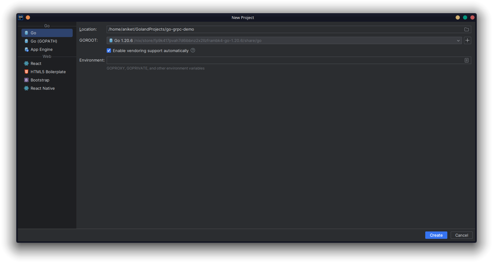
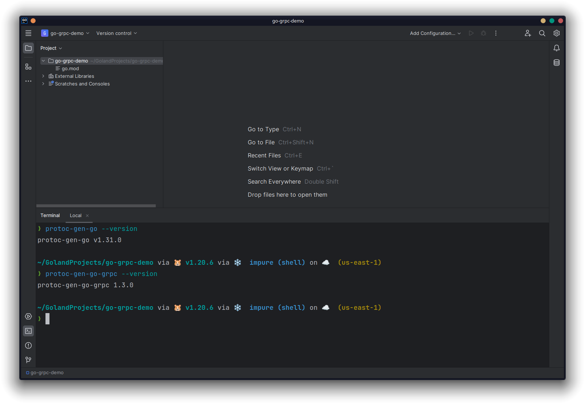
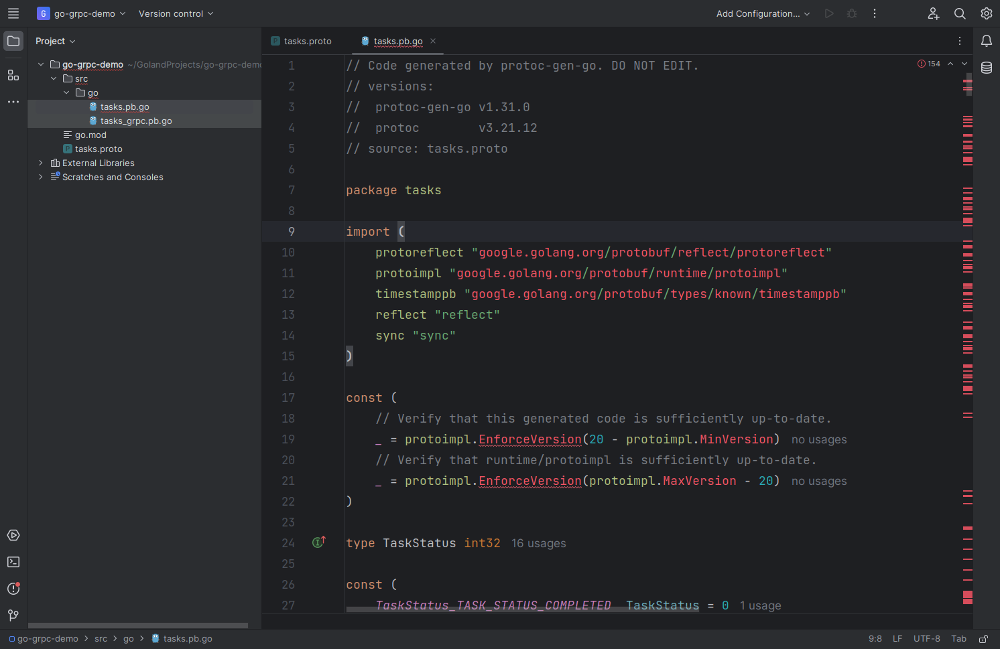
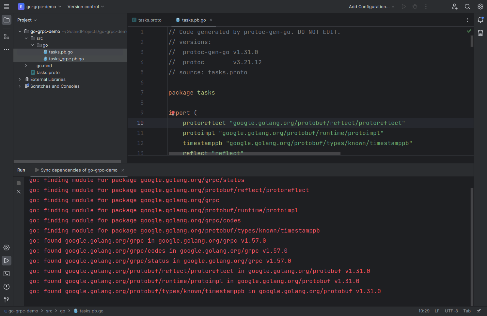

## gRPC in Go: Let's Go

Fire up GoLand and click **New Project**. Name the project `go-grpc-demo` and click **Create**:



To generate Go code from Protobuf definitions, you'll need to install two plugins for `protoc`:

1. [`protoc-gen-go`](https://pkg.go.dev/github.com/golang/protobuf/protoc-gen-go), which generates Go code containing the messages defined in the Protobuf files.
2. [`protoc-gen-go-grpc`](https://pkg.go.dev/google.golang.org/grpc/cmd/protoc-gen-go-grpc), which generates Go bindings for services defined in the Protobuf files.

Open GoLand's integrated [terminal](https://www.jetbrains.com/help/go/terminal-emulator.html) and run the following commands to install `protoc-gen-go` and `protoc-gen-go-grpc`:

```bash
go install google.golang.org/protobuf/cmd/protoc-gen-go@latest
go install google.golang.org/grpc/cmd/protoc-gen-go-grpc@latest
```


To make sure the tools are correctly installed, run the following command, which should print the version of the installed `protoc-gen-go` binary:

```bash
protoc-gen-go --version
```

Do the same for `protoc-gen-go-grpc`:

```bash
protoc-gen-go-grpc --version
```



### Writing the Protobuf Definitions

Create a new file called `tasks.proto` in the project's root. In this file, you'll define the messages and methods. Start by configuring the options:

```proto
syntax = 'proto3';

option go_package="src/go/tasks";

import "google/protobuf/timestamp.proto";

package tasks;
```

The `go_package` option specifies the full Go package name. Then, the [Timestamp](https://protobuf.dev/reference/protobuf/google.protobuf/#timestamp) type is imported, which will be used in the Protobuf definitions. Finally, the line `package tasks` sets the package name for the generated code.

#### Defining Task

Start by defining `Task`, which is the fundamental unit for the task management app. A `Task` will have an ID, a description, an ID for the user who owns the task, a task status (complete, incomplete, or started), a deadline, and a creation date. Write the following code in `tasks.proto`:

```proto
enum TaskStatus {
  TASK_STATUS_COMPLETED = 0;
  TASK_STATUS_INCOMPLETE = 1;
  TASK_STATUS_STARTED = 2;
}

message Task {
  string id = 1;
  string description = 3;
  string user_id = 4;
  TaskStatus status = 5;
  google.protobuf.Timestamp deadline = 6;
  google.protobuf.Timestamp created_at = 7;
}
```

First, you define an [enum](https://protobuf.dev/reference/protobuf/google.protobuf/#enum) named `TaskStatus`. The three values `TASK_STATUS_COMPLETED`, `TASK_STATUS_INCOMPLETE`, and `TASK_STATUS_STARTED` represent the three possible statuses a `Task` can have. The enum is then used in the `Task` definition for the `status` field. The `created_at` and `deadline` fields have the `google.protobuf.Timestamp` type from the `timestamp.proto` file that was imported earlier. The Timestamp type facilitates the conversion of timestamps from strings and the handling of timestamps.

#### Defining the gRPC Methods

The app will have five gRPC methods:

1. A `CreateTask` method that will create a task.
2. A `GetTask` method that will return a task given its ID.
3. A `ListTasks` method that will return all tasks for a given user within a given deadline. This will be a unidirectional [server-side streaming](https://grpc.io/docs/what-is-grpc/core-concepts/#server-streaming-rpc) endpoint.
4. A `RecordTasks` method, which will create a bunch of tasks. This will be a unidirectional [client-side streaming](https://grpc.io/docs/what-is-grpc/core-concepts/#client-streaming-rpc) endpoint.
5. A `TaskChat` method where multiple users can add comments to a task. This will be a [bidirectional streaming](https://grpc.io/docs/what-is-grpc/core-concepts/#bidirectional-streaming-rpc) endpoint.

To create RPC methods, you must define a [service](https://grpc.io/docs/what-is-grpc/core-concepts/#service-definition). Start by defining a `TaskService`:

```proto
service TaskService {

}
```

##### The CreateTask Method

The `CreateTask` method receives a task's description, user ID, and deadline and creates the task. After the task is created, the newly created task is returned as a response:

```proto
service TaskService {
  rpc CreateTask(CreateTaskRequest) returns (Task);
}

message CreateTaskRequest {
  string description = 1;
  string user_id = 2;
  google.protobuf.Timestamp deadline = 3;
}
```

Here, a new message named `CreateTaskRequest` is defined, which works as the request type of the `CreateTask` method. The method returns a `Task`, as discussed earlier.

##### The GetTask Method

For the `GetTask` method, the request only contains the task ID, and the return type is once again `Task`:

```proto
service TaskService {
  ...
  rpc GetTask(GetTaskRequest) returns (Task);
}

...

message GetTaskRequest {
  string task_id = 1;
}
```

##### The ListTasks Method

The `ListTasks` method is slightly different because it's a streaming endpoint. Instead of sending the entire list of tasks at once, it will send the data in a stream that can be consumed by the client. Thankfully, with gRPC, creating a streaming endpoint is as easy as specifying the `stream` keyword before the request type, the response type, or both, depending on the direction of the stream. Since this one is a server-to-client stream, the `stream` keyword is placed before the return type, indicating that the client will receive a stream:

```proto
service TaskService {
  ...
  rpc ListTasks(ListTasksRequest) returns (stream Task);
}

...

message ListTasksRequest {
  string user_id = 1;
  google.protobuf.Timestamp deadline = 2;
}
```

As before, a new message is defined for the request type. The `ListTasksRequest` message contains only the user ID and the deadline.

##### The RecordTasks Method

Like `ListTasks`, this one is also a streaming endpoint. However, this time, it's a client-to-server stream. So, the `stream` keyword is placed before the request type, indicating that the server will receive a stream:

```proto
service TaskService {
  ...
  rpc RecordTasks(stream CreateTaskRequest) returns (TaskSummary);
}

...

message TaskSummary {
  string no_of_tasks_created = 1;
}
```

The method returns a message named `TaskSummary`, which contains the number of tasks created by the server.

##### The TaskChat Method

The `TaskChat` method is a bidirectional streaming endpoint, so both the request and response types have the `stream` keyword. This means that both the server and the client will receive a stream. They can both read from the streams as well as write to them:

```proto
service TaskService {
  ...
  rpc TaskChat(stream TaskComment) returns (stream TaskComment);
}

...

message TaskComment {
  string task_id = 1;
  string user_id = 2;
  string comment = 3;
  google.protobuf.Timestamp created_at = 4;
}
```

The entire `tasks.proto` file should look like the following:

```proto
syntax = 'proto3';

option go_package="src/go/tasks";

import "google/protobuf/timestamp.proto";

package tasks;

service TaskService {
  rpc CreateTask(CreateTaskRequest) returns (Task);
  rpc GetTask(GetTaskRequest) returns (Task);
  rpc ListTasks(ListTasksRequest) returns (stream Task);
  rpc RecordTasks(stream CreateTaskRequest) returns (TaskSummary);
  rpc TaskChat(stream TaskComment) returns (stream TaskComment);
}

enum TaskStatus {
  TASK_STATUS_COMPLETED = 0;
  TASK_STATUS_INCOMPLETE = 1;
  TASK_STATUS_STARTED = 2;
}

message Task {
  string id = 1;
  string description = 3;
  string user_id = 4;
  TaskStatus status = 5;
  google.protobuf.Timestamp deadline = 6;
  google.protobuf.Timestamp created_at = 7;
}

message CreateTaskRequest {
  string description = 1;
  string user_id = 2;
  google.protobuf.Timestamp deadline = 3;
}

message GetTaskRequest {
  string task_id = 1;
}

message ListTasksRequest {
  string user_id = 1;
  google.protobuf.Timestamp deadline = 2;
}

message TaskSummary {
  string no_of_tasks_created = 1;
}

message TaskComment {
  string task_id = 1;
  string user_id = 2;
  string comment = 3;
  google.protobuf.Timestamp created_at = 4;
}
```

### Generating the gRPC Stub

Once the Protobuf definitions are ready, generating the gRPC stub is as easy as running the `protoc` command with the appropriate options. But first, create the directory where the Go code will be stored:

```bash
mkdir -p src/go
```

Run the following code to compile the definitions from `tasks.proto`:

```bash
protoc --go_out=./src/go/ --go_opt=paths=source_relative --go-grpc_out=./src/go/ --go-grpc_opt=paths=source_relative tasks.proto
```

This will create two files, `tasks.pb.go` and `tasks_grpc.pb.go`, in the `src/go` directory.

If you open `tasks.pb.go`, you'll see that GoLand shows errors because the dependencies are not installed:



Thanks to GoLand, installing dependencies is super easy. Hover over any red line and click **Sync dependencies of go-grpc-demo** or press **Alt+Shift+Enter (⌥+⇧+↩)** . Once the dependencies are downloaded, the lines will turn green:


