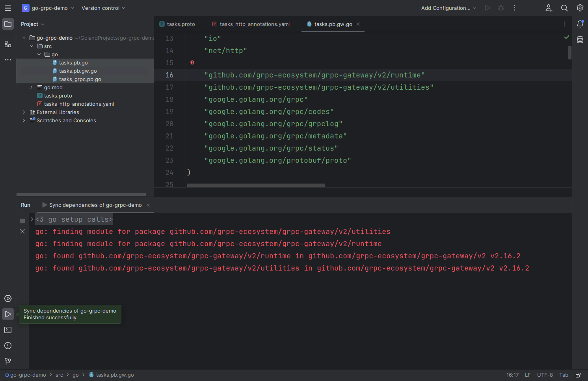
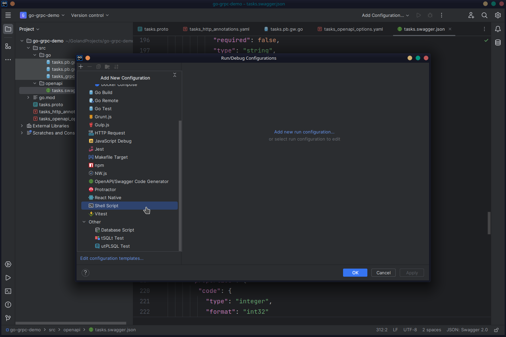
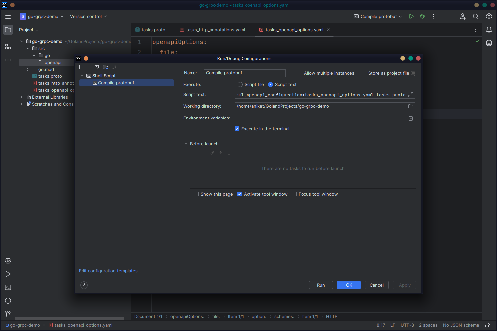
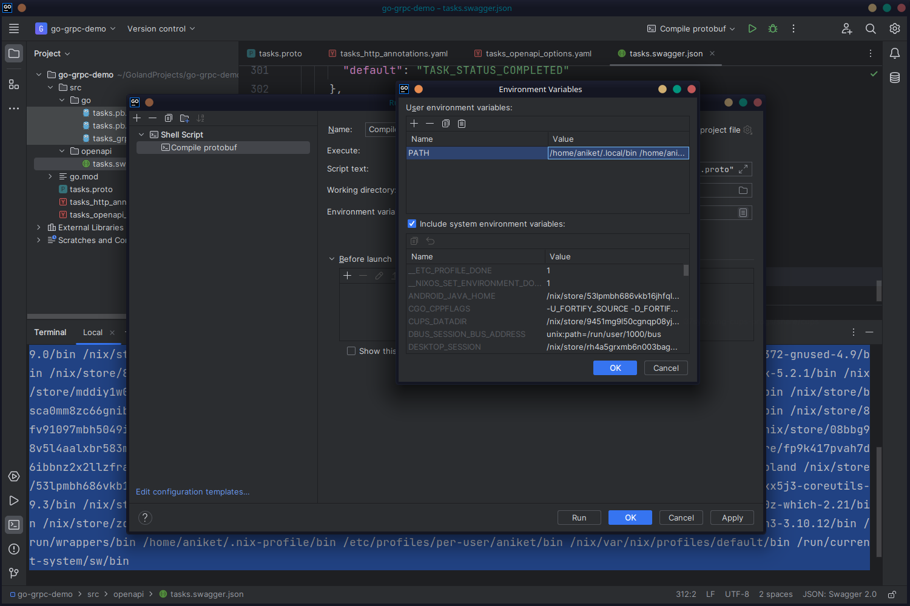

One downside of gRPC APIs is that you need special gRPC clients to communicate with gRPC servers. In other words, if you have an existing REST client and want to switch to gRPC, you must rewrite the client to use gRPC. This may not always be feasible. There are situations where you want to preserve backward compatibility with REST clients while you move the architecture to gRPC, or you may want to have a simultaneous REST API to allow legacy REST clients to keep using your API.

It's possible to generate a reverse proxy for your gRPC API to act as a gateway between the gRPC server and a REST client. The REST client can make requests to the reverse proxy, which will relay the messages to the gRPC server after converting them into appropriate gRPC requests. The gRPC response from the server will be converted back to REST responses and sent to the client, thus mimicking a REST API.

To generate the code for the reverse proxy, you need to install the [`grpc-gateway`](https://github.com/grpc-ecosystem/grpc-gateway) plugin for `protoc`:

```bash
go install github.com/grpc-ecosystem/grpc-gateway/v2/protoc-gen-grpc-gateway@latest
```

The code generator needs to know the URLs to which each RPC method will be mapped. The README file of the plugin outlines [three methods](https://github.com/grpc-ecosystem/grpc-gateway#4-generate-reverse-proxy-using-protoc-gen-grpc-gateway) of annotating your Protobuf definitions. The third option (external configuration) is used in this article. You'll leave the Protobuf definitions as is and create a YAML file named `tasks_http_annotations.yaml` in the root of the project:

```yaml
type: google.api.Service
config_version: 3

http:
  rules:
    - selector: tasks.TaskService.CreateTask
      post: "/api/v1/tasks"
      body: "*"
    - selector: tasks.TaskService.GetTask
      get: "/api/v1/tasks/{task_id}"
    - selector: tasks.TaskService.ListTasks
      get: "/api/v1/users/{user_id}/tasks"
    - selector: tasks.TaskService.RecordTasks
      post: "/api/v1/tasks/record"
      body: "*"
    - selector: tasks.TaskService.TaskChat
      post: "/api/v1/tasks/chat"
      body: "*"
```

In this file, you map each of the five RPC methods to URLs under the `/api/v1/` namespace. For each API, you need to provide the HTTP verb (`get`, `post`, `put`, etc.) as well as the parameters and body; the `selector` key specifies the RPC method the URL will be mapped to.

Modify the previous `protoc` command to include options for generating the reverse-proxy stubs:

```bash
protoc --go_out=./src/go/ \
--go_opt=paths=source_relative \
--go-grpc_out=./src/go/ \
--go-grpc_opt=paths=source_relative \
--grpc-gateway_out=./src/go \
--grpc-gateway_opt=logtostderr=true,paths=source_relative,grpc_api_configuration=tasks_http_annotations.yaml \
tasks.proto
```

This will create a new `tasks.pb.gw.go` file in `src/go`. Open the file and download the dependencies, as shown before:



#### Generating an OpenAPI Definition

The `grpc-gateway` plugin can also generate an OpenAPI v2 (Swagger) file for your REST API.

First, create a directory named `openapi` inside `src` where the Swagger file will be stored. Then, install the `protoc-gen-openapiv2` binary by running the following command:

```bash
go install github.com/grpc-ecosystem/grpc-gateway/v2/protoc-gen-openapiv2@latest
```

The `tasks_http_annotations.yaml` file is enough to generate an OpenAPI definition file. However, if you want to customize the properties of the OpenAPI file itself, such as setting a title, schemes, a URL, and so on, you need to create a separate YAML file. Create `tasks_openapi_options.yaml` with the following code:

```yaml
openapiOptions:
  file:
    - file: "tasks.proto"
      option:
        info:
          title: "Tasks API"
        schemes:
          - HTTP
        host: "localhost:8081"
```

Here, you set the title of the API to "Tasks API," the scheme to HTTP, and the host to `localhost:8081` (the URL where the reverse proxy will run).

Finally, amend the `protoc` command to include options for the OpenAPI generator:

```bash
protoc --go_out=./src/go \
--go_opt=paths=source_relative --go-grpc_out=./src/go/ \
--go-grpc_opt=paths=source_relative \
--grpc-gateway_out=./src/go \
--grpc-gateway_opt=logtostderr=true,paths=source_relative,grpc_api_configuration=tasks_http_annotations.yaml \
--openapiv2_out=./src/openapi \
--openapiv2_opt=logtostderr=true,grpc_api_configuration=tasks_http_annotations.yaml,openapi_configuration=tasks_openapi_options.yaml \
tasks.proto
```

This will create a `tasks.swagger.json` file in the `src/openapi` directory with the following code:

```json
{
	"swagger": "2.0",
	"info": {
		"title": "Tasks API",
		"version": "version not set"
	},
	"tags": [
		{
			"name": "TaskService"
		}
	],
	"host": "localhost:8081",
	"schemes": ["http"],
	"consumes": ["application/json"],
	"produces": ["application/json"],
	"paths": {
		"/api/v1/tasks": {
			"post": {
				"operationId": "TaskService_CreateTask",
				"responses": {
					"200": {
						"description": "A successful response.",
						"schema": {
							"$ref": "#/definitions/tasksTask"
						}
					},
					"default": {
						"description": "An unexpected error response.",
						"schema": {
							"$ref": "#/definitions/rpcStatus"
						}
					}
				},
				"parameters": [
					{
						"name": "body",
						"in": "body",
						"required": true,
						"schema": {
							"$ref": "#/definitions/tasksCreateTaskRequest"
						}
					}
				],
				"tags": ["TaskService"]
			}
		},
		"/api/v1/tasks/chat": {
			"post": {
				"operationId": "TaskService_TaskChat",
				"responses": {
					"200": {
						"description": "A successful response.(streaming responses)",
						"schema": {
							"type": "object",
							"properties": {
								"result": {
									"$ref": "#/definitions/tasksTaskComment"
								},
								"error": {
									"$ref": "#/definitions/rpcStatus"
								}
							},
							"title": "Stream result of tasksTaskComment"
						}
					},
					"default": {
						"description": "An unexpected error response.",
						"schema": {
							"$ref": "#/definitions/rpcStatus"
						}
					}
				},
				"parameters": [
					{
						"name": "body",
						"description": " (streaming inputs)",
						"in": "body",
						"required": true,
						"schema": {
							"$ref": "#/definitions/tasksTaskComment"
						}
					}
				],
				"tags": ["TaskService"]
			}
		},
		"/api/v1/tasks/record": {
			"post": {
				"operationId": "TaskService_RecordTasks",
				"responses": {
					"200": {
						"description": "A successful response.",
						"schema": {
							"$ref": "#/definitions/tasksTaskSummary"
						}
					},
					"default": {
						"description": "An unexpected error response.",
						"schema": {
							"$ref": "#/definitions/rpcStatus"
						}
					}
				},
				"parameters": [
					{
						"name": "body",
						"description": " (streaming inputs)",
						"in": "body",
						"required": true,
						"schema": {
							"$ref": "#/definitions/tasksCreateTaskRequest"
						}
					}
				],
				"tags": ["TaskService"]
			}
		},
		"/api/v1/tasks/{taskId}": {
			"get": {
				"operationId": "TaskService_GetTask",
				"responses": {
					"200": {
						"description": "A successful response.",
						"schema": {
							"$ref": "#/definitions/tasksTask"
						}
					},
					"default": {
						"description": "An unexpected error response.",
						"schema": {
							"$ref": "#/definitions/rpcStatus"
						}
					}
				},
				"parameters": [
					{
						"name": "taskId",
						"in": "path",
						"required": true,
						"type": "string"
					}
				],
				"tags": ["TaskService"]
			}
		},
		"/api/v1/users/{userId}/tasks": {
			"get": {
				"operationId": "TaskService_ListTasks",
				"responses": {
					"200": {
						"description": "A successful response.(streaming responses)",
						"schema": {
							"type": "object",
							"properties": {
								"result": {
									"$ref": "#/definitions/tasksTask"
								},
								"error": {
									"$ref": "#/definitions/rpcStatus"
								}
							},
							"title": "Stream result of tasksTask"
						}
					},
					"default": {
						"description": "An unexpected error response.",
						"schema": {
							"$ref": "#/definitions/rpcStatus"
						}
					}
				},
				"parameters": [
					{
						"name": "userId",
						"in": "path",
						"required": true,
						"type": "string"
					},
					{
						"name": "deadline",
						"in": "query",
						"required": false,
						"type": "string",
						"format": "date-time"
					}
				],
				"tags": ["TaskService"]
			}
		}
	},
	"definitions": {
		"protobufAny": {
			"type": "object",
			"properties": {
				"@type": {
					"type": "string"
				}
			},
			"additionalProperties": {}
		},
		"rpcStatus": {
			"type": "object",
			"properties": {
				"code": {
					"type": "integer",
					"format": "int32"
				},
				"message": {
					"type": "string"
				},
				"details": {
					"type": "array",
					"items": {
						"type": "object",
						"$ref": "#/definitions/protobufAny"
					}
				}
			}
		},
		"tasksCreateTaskRequest": {
			"type": "object",
			"properties": {
				"description": {
					"type": "string"
				},
				"userId": {
					"type": "string"
				},
				"deadline": {
					"type": "string",
					"format": "date-time"
				}
			}
		},
		"tasksTask": {
			"type": "object",
			"properties": {
				"id": {
					"type": "string"
				},
				"description": {
					"type": "string"
				},
				"userId": {
					"type": "string"
				},
				"status": {
					"$ref": "#/definitions/tasksTaskStatus"
				},
				"deadline": {
					"type": "string",
					"format": "date-time"
				},
				"createdAt": {
					"type": "string",
					"format": "date-time"
				}
			}
		},
		"tasksTaskComment": {
			"type": "object",
			"properties": {
				"taskId": {
					"type": "string"
				},
				"userId": {
					"type": "string"
				},
				"comment": {
					"type": "string"
				},
				"createdAt": {
					"type": "string",
					"format": "date-time"
				}
			}
		},
		"tasksTaskStatus": {
			"type": "string",
			"enum": [
				"TASK_STATUS_COMPLETED",
				"TASK_STATUS_INCOMPLETE",
				"TASK_STATUS_STARTED"
			],
			"default": "TASK_STATUS_COMPLETED"
		},
		"tasksTaskSummary": {
			"type": "object",
			"properties": {
				"noOfTasksCreated": {
					"type": "string"
				}
			}
		}
	}
}
```

You may have noticed that the command to generate all these files has gotten large and complicated. It's difficult to memorize and rerun this command manually every time one of the `.proto` or YAML files changes. Let's take a slight detour and add a configuration in JetBrains so you don't have to remember the command.

Click the **Add Configuration** button. In the window that pops up, click the **+** button and select **Shell Script**:



In the new window, you need to define the shell script that will run as part of the configuration. Provide `Compile protobuf` as the name, then choose **Script text** and paste the following command in the **Script text** box:

```bash
protoc --go_out=./src/go --go_opt=paths=source_relative --go-grpc_out=./src/go/ --go-grpc_opt=paths=source_relative --grpc-gateway_out=./src/go --grpc-gateway_opt=logtostderr=true,paths=source_relative,grpc_api_configuration=tasks_http_annotations.yaml --openapiv2_out=./src/openapi --openapiv2_opt=logtostderr=true,grpc_api_configuration=tasks_http_annotations.yaml,openapi_configuration=tasks_openapi_options.yaml tasks.proto
```



Click **OK** and save the configuration. You can now test whether this was set up correctly or not. Delete the files in the `src/go` and `src/openapi` directories. Then, run the **Compile protobuf** configuration from the top of the window. This should recreate the four files once again!

If you get an error saying command is not found, it can be because the `protoc` command must find the binaries installed with `go install` commands. They are usually installed in `$GOBIN`, which needs to be added to the `$PATH` environment variable for JetBrains.

Run `echo $GOBIN` in the terminal and copy the output.

Back in the **Run/Debug Configurations** window, click the little icon in the **Environment variables** field. This will open a new dialog box. In the list of system environment variables, scroll down until you find the `PATH` variable. Copy its value.

Next, add a new environment variable with the name `PATH` and the value `<YOUR_GOBIN_VALUE_HERE>:<YOUR_PATH_VALUE_HERE>`. Replace `YOUR_GOBIN_VALUE_HERE` with the output of the `echo $GOBIN` command and `YOUR_PATH_VALUE_HERE` with the value of the `PATH` variable:



### Writing the Reverse Proxy Entry Point

The final task for the reverse proxy is to write an HTTP entry point. This is where the REST clients will send requests, which will then be passed to the actual gRPC server.

Create a new directory named `proxy` in the project root and create a file called `proxy.go` inside it. Import the required modules and sync the dependencies in GoLand to download any unavailable modules:

```go
package main

import (
  "context"
  "flag"
  "net/http"
  "strings"

  "github.com/golang/glog"
  "github.com/grpc-ecosystem/grpc-gateway/v2/runtime"
  "google.golang.org/grpc"
  "google.golang.org/grpc/credentials/insecure"

  gw "go-grpc-demo/src/go"
)
```

In the last line, note that you're importing the gRPC gateway generated by the `grpc-gateway` plugin.

Define a flag to set the address of the actual gRPC server:

```go
var (
  grpcServerEndpoint = flag.String("grpc-server-endpoint", "localhost:9090", "gRPC server endpoint")
)
```

The following two functions help enable CORS, which is necessary because you'll make requests to the proxy server from GoLand's HTTP client in part four of this series:

```go
func allowCORS(h http.Handler) http.Handler {
  return http.HandlerFunc(func(w http.ResponseWriter, r *http.Request) {
    if origin := r.Header.Get("Origin"); origin != "" {
      w.Header().Set("Access-Control-Allow-Origin", origin)
      if r.Method == "OPTIONS" && r.Header.Get("Access-Control-Request-Method") != "" {
        preflightHandler(w, r)
        return
      }
    }
    h.ServeHTTP(w, r)
  })
}

func preflightHandler(w http.ResponseWriter, r *http.Request) {
  headers := []string{"Content-Type", "Accept", "Authorization"}
  w.Header().Set("Access-Control-Allow-Headers", strings.Join(headers, ","))
  methods := []string{"GET", "HEAD", "POST", "PUT", "DELETE"}
  w.Header().Set("Access-Control-Allow-Methods", strings.Join(methods, ","))
  glog.Infof("preflight request for %s", r.URL.Path)
}
```

Define a `run` function that creates an HTTP server and uses the `RegisterTaskServiceHandlerFromEndpoint` function of the gateway to register the HTTP server and the gRPC server:

```go
func run() error {
  ctx := context.Background()
  ctx, cancel := context.WithCancel(ctx)
  defer cancel()

  mux := runtime.NewServeMux(runtime.WithMarshalerOption(runtime.MIMEWildcard, &runtime.JSONPb{}))
  opts := []grpc.DialOption{grpc.WithTransportCredentials(insecure.NewCredentials())}
  err := gw.RegisterTaskServiceHandlerFromEndpoint(ctx, mux, *grpcServerEndpoint, opts)
  if err != nil {
    return err
  }

  return http.ListenAndServe(":8081", allowCORS(mux))
}
```

Note that `TaskService` in the name of the function corresponds to the `TaskService` name in the `tasks.proto` file. If you use a different name for the service, the function name will also change appropriately.

Finally, the `main` function sets up the flags and calls the `run` function:

```go
func main() {
  flag.Parse()
  defer glog.Flush()

  if err := run(); err != nil {
    glog.Fatal(err)
  }
}
```

The entire file looks like this:

```go
package main

import (
  "context"
  "flag"
  "net/http"
  "strings"

  "github.com/golang/glog"
  "github.com/grpc-ecosystem/grpc-gateway/v2/runtime"
  "google.golang.org/grpc"
  "google.golang.org/grpc/credentials/insecure"

  gw "go-grpc-demo/src/go"
)

var (
  grpcServerEndpoint = flag.String("grpc-server-endpoint", "localhost:9090", "gRPC server endpoint")
)

func allowCORS(h http.Handler) http.Handler {
  return http.HandlerFunc(func(w http.ResponseWriter, r *http.Request) {
    if origin := r.Header.Get("Origin"); origin != "" {
      w.Header().Set("Access-Control-Allow-Origin", origin)
      if r.Method == "OPTIONS" && r.Header.Get("Access-Control-Request-Method") != "" {
        preflightHandler(w, r)
        return
      }
    }
    h.ServeHTTP(w, r)
  })
}

func preflightHandler(w http.ResponseWriter, r *http.Request) {
  headers := []string{"Content-Type", "Accept", "Authorization"}
  w.Header().Set("Access-Control-Allow-Headers", strings.Join(headers, ","))
  methods := []string{"GET", "HEAD", "POST", "PUT", "DELETE"}
  w.Header().Set("Access-Control-Allow-Methods", strings.Join(methods, ","))
  glog.Infof("preflight request for %s", r.URL.Path)
}

func run() error {
  ctx := context.Background()
  ctx, cancel := context.WithCancel(ctx)
  defer cancel()

  mux := runtime.NewServeMux(runtime.WithMarshalerOption(runtime.MIMEWildcard, &runtime.JSONPb{}))
  opts := []grpc.DialOption{grpc.WithTransportCredentials(insecure.NewCredentials())}
  err := gw.RegisterTaskServiceHandlerFromEndpoint(ctx, mux, *grpcServerEndpoint, opts)
  if err != nil {
    return err
  }

  return http.ListenAndServe(":8081", allowCORS(mux))
}

func main() {
  flag.Parse()
  defer glog.Flush()

  if err := run(); err != nil {
    glog.Fatal(err)
  }
}
```

You can find the code so far in the `part1` branch of [this GitHub repo](https://github.com/heraldofsolace/go-grpc-demo/tree/part1).
