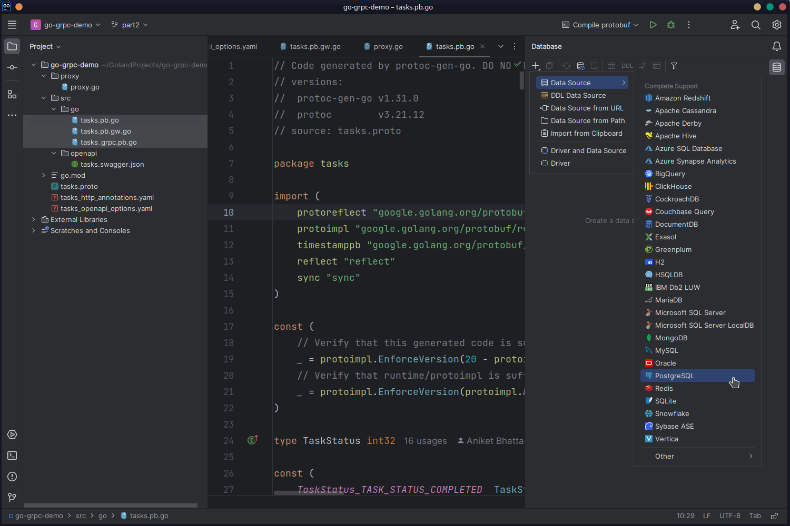
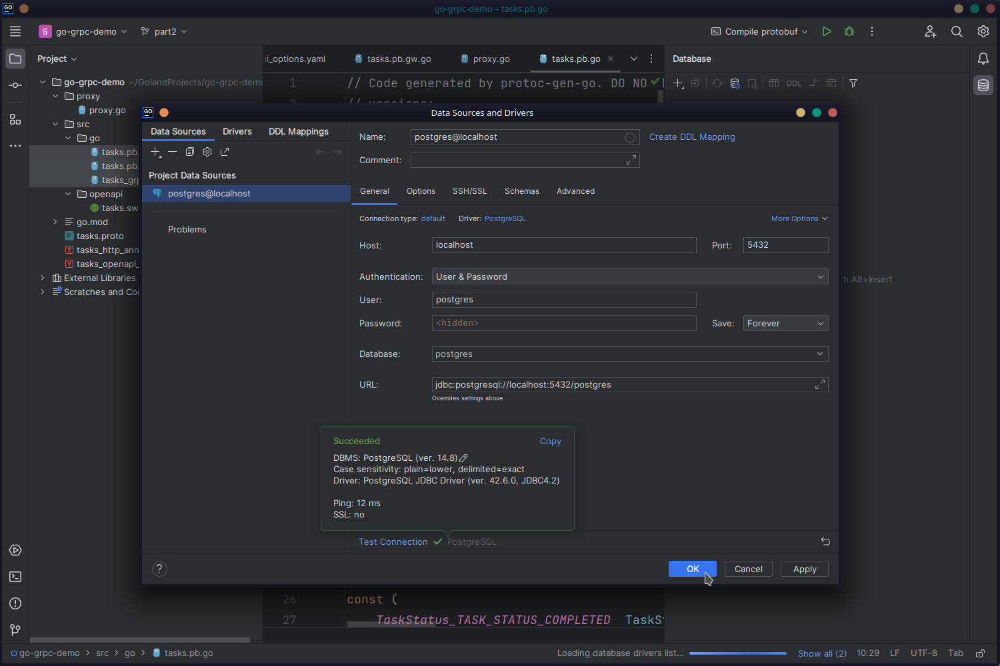
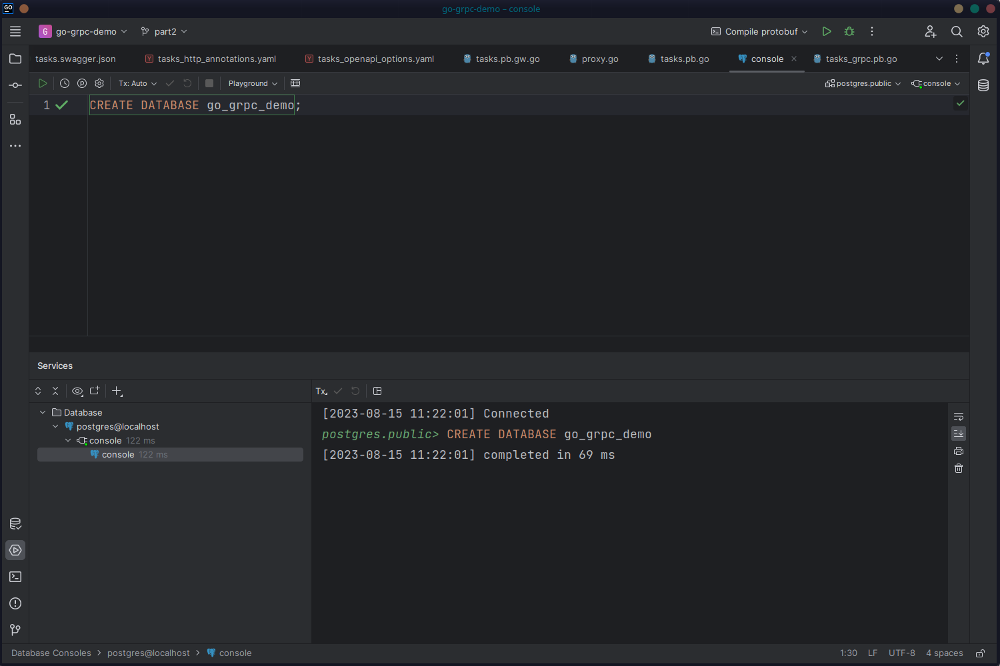
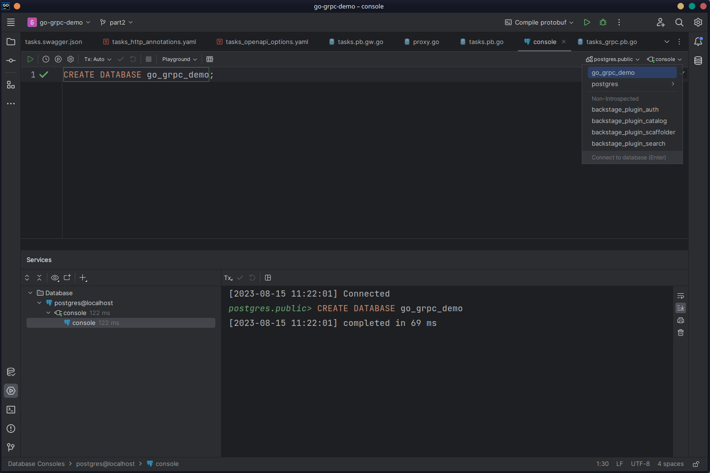
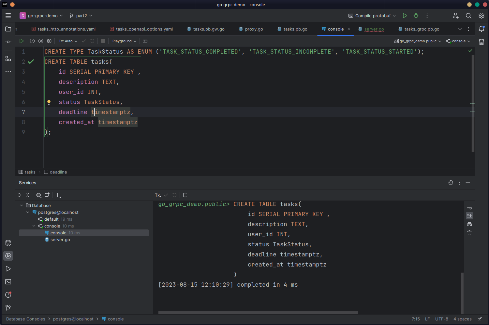

You must install and configure a database to follow along with the rest of the article. This article uses [PostgreSQL](https://www.postgresql.org/). You can run a [local PostgreSQL server](https://www.postgresql.org/download/) or use a database-as-a-service tool such as [ElephantSQL](https://www.elephantsql.com/). Either way, you must have the connection details (host, port, username, password, database name, or connection string) for the database server. If you're using a remote PostgreSQL server, you must also allowlist your device's IP address so that you can connect to the database server.

GoLand has a robust set of [database tools](https://www.jetbrains.com/help/go/relational-databases.html) that let you connect to and work with database servers from within GoLand.

Open the **Database** panel from the right gutter. Click the **+** button, and from **Data Source**, choose **PostgreSQL**:



In the configuration window, fill in the details of your database connection. If you have never used PostgreSQL with GoLand before, you'll also need to download the database drivers. Once the details are filled in and the drivers are downloaded, click **Test Connection** and verify that GoLand can connect to your database:



Click **OK**. GoLand will connect to your database and open a new console tab where you can execute SQL queries. Let's start by creating a new database. Write the following SQL query in the console and execute it by clicking the "play" icon in the gutter:

```sql
CREATE DATABASE go_grpc_demo;
```



Connect to the newly created `go_grpc_demo` database by selecting it from the dropdown menu in the top-right corner of the console window:



You'll need to define a `tasks` table to store the tasks. The structure will be exactly the same as the definition of `Task` in `tasks.proto`. Write the following queries in the console:

```sql
CREATE TYPE TaskStatus AS ENUM ('TASK_STATUS_COMPLETED', 'TASK_STATUS_INCOMPLETE', 'TASK_STATUS_STARTED');
CREATE TABLE tasks(
    id SERIAL PRIMARY KEY ,
    description TEXT,
    user_id INT,
    status TaskStatus,
    deadline timestamptz,
    created_at timestamptz
);
```

The first query creates a new [enum](https://www.postgresql.org/docs/current/datatype-enum.html) named `TaskStatus`, which reflects the `TaskStatus` enum in `tasks.proto`. Defining an enum at the database level ensures that the statuses can't be anything outside the three possible values. The second query creates the `tasks` table and uses the `TaskStatus` enum as the `status` column type.

Execute the queries to create the table:


