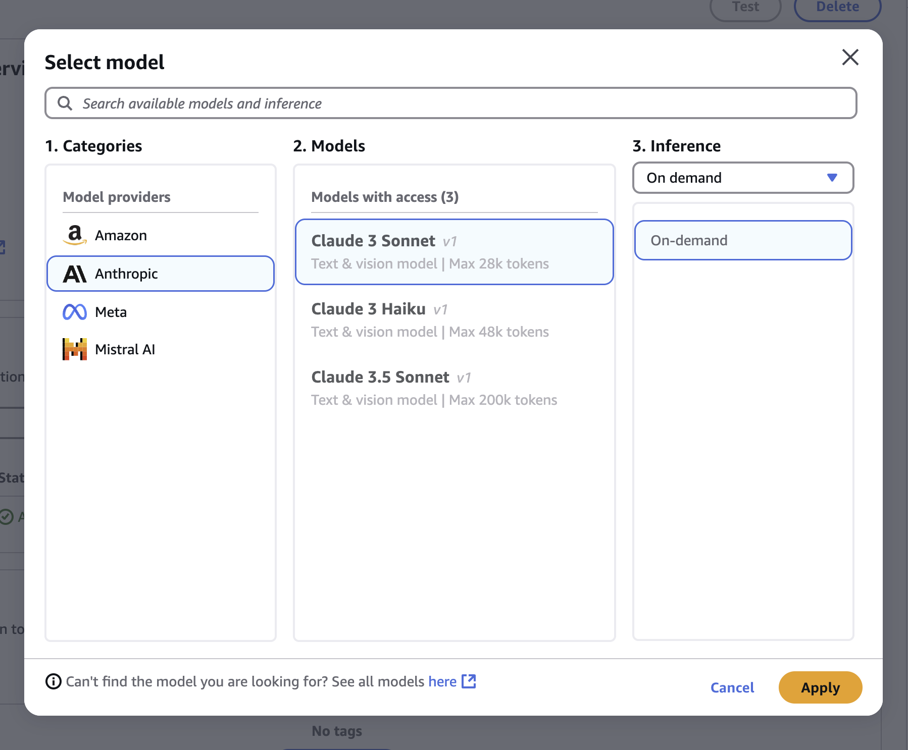

## Knowledge Base

We will be using AWS Bedrock [Knowledge Bases](https://aws.amazon.com/bedrock/knowledge-bases/) to provide additional information to the LLM, so they can understand the context and deliver relevant information, enabling more accurate and contextual responses for the specific needs of our application.

## Enable Models

To work with the Knowledge Base, it's essential to enable the foundational models. I've already covered this in a previous [tutorial](../../bedrock_with_go/model_access/), so you can refer to that for guidance.

## What are we going to create?

We have a food menu from the restaurant, which we are going to feed into the knowledge base and use to directly interact with the LLM model to retrieve relevant information.


So, we got a sample restaurant menu of what they normally serve to their customers. This information will be fed into the LLM, so next time, we won’t need to check the menu—instead, we can simply ask the AI, “What’s special on the menu today?”

Create a file named `food.txt` and store the information below. You can see that there are many varieties, and you can come up with your own innovative ideas.

```text

**Breakfast**
- **Vegetarian Options:**
  - Paneer Paratha with Yogurt
  - Masala Dosa with Sambar and Coconut Chutney
  - Aloo Tikki with Toast and Fresh Juice
  - Poha with Pomegranate and Coriander
  - Avocado Toast with Eggs

- **Non-Vegetarian Options:**
  - Scrambled Eggs with Bacon and Toast
  - Chicken Sausage with Eggs and Hash Browns
  - Smoked Salmon on Bagel with Cream Cheese
  - Omelette (Cheese, Mushroom, and Bell Peppers)
  - English Breakfast: Sausages, Bacon, Grilled Tomato, Mushrooms, Beans, Toast

---

**Lunch**
- **Vegetarian Options:**
  - Vegetable Biryani with Raita
  - Paneer Tikka Masala with Naan or Rice
  - Spaghetti Aglio e Olio (Garlic & Olive Oil) with Parmesan
  - Grilled Vegetable Wrap with Hummus and Tabbouleh
  - Chickpea Salad with Feta, Olives, and Lemon Dressing

- **Non-Vegetarian Options:**
  - Chicken Shawarma with Garlic Sauce and Pita Bread
  - Grilled Fish with Couscous and Steamed Vegetables
  - Lamb Rogan Josh with Rice
  - BBQ Chicken Wrap with Coleslaw
  - Prawn Alfredo Pasta

---

**Dinner**
- **Vegetarian Options:**
  - Vegetable Lasagna
  - Tofu Stir-Fry with Bell Peppers and Broccoli
  - Dal Tadka with Jeera Rice
  - Vegetable Stuffed Bell Peppers with Quinoa
  - Spinach and Ricotta Stuffed Ravioli

- **Non-Vegetarian Options:**
  - Grilled Chicken Breast with Garlic Mashed Potatoes and Veggies
  - Butter Chicken with Naan or Rice
  - Seafood Paella with Mussels, Prawns, and Clams
  - Grilled Salmon with Asparagus and Lemon Butter Sauce
  - Roast Duck with Orange Glaze and Roasted Vegetables

---

**Pastries & Cakes**
- **Pastries:**
  - Chocolate Croissant
  - Apple Cinnamon Danish
  - Almond and Raspberry Danish
  - Blueberry Muffins
  - Pistachio Eclair

- **Cakes:**
  - Classic Vanilla Sponge Cake
  - Chocolate Fudge Cake
  - Red Velvet Cake with Cream Cheese Frosting
  - Lemon Drizzle Cake
  - Carrot Cake with Walnuts
  - Tiramisu

---
```

Now, we need to upload this data to S3, which will be acting as the Data Source.

Navigate to S3.


Click Create Bucket


Provide the bucket name, and make it should be unique.


After the bucket is created, make sure to upload the `food.txt` file which we created earlier.


Head back to IAM again, and make sure to enable the console access.


You can provide your own custom password or autogenerate.


Now, let's resume back to BedRock console.

Click Knowledge Bases.


Click Create.


Now, choose Knowledge Base with vector store.

_A [vector database](https://www.cloudflare.com/en-gb/learning/ai/what-is-vector-database/) is a collection of data stored as mathematical representations. Vector databases make it easier for machine learning models to remember previous inputs, allowing machine learning to be used to power search, recommendations, and text generation use-cases._


Image Source: _[Pinecone](https://www.pinecone.io/learn/vector-database/)_


Provide the name of the Knowledge Base along-with the name of the service role. The service role is going to attach policies like listing S3 bucket, invoking bedrock model and accessing the OpenSearch.


Next, the data source is going to be Amazon S3, where we have uploaded the `food.txt` file.


Moving forward, we will be selecting the newly created S3 bucket.


Choose the default parser, and chunking strategy set to default.


Next, we will select the model and vector store as Amazon OpenSearch Serverless.


Choose Titan Text Embeddings v2


Review all the changes, and click Create Knowledge Base.


It will take a couple of minutes.


Once, the KnowledgeBase is created. You need to sync the data. After sync is done, test the knowledge base.


Select the model.


And start interacting with the knowledge base.


