## Prerequisites

To get started, make sure you have a valid AWS [account](https://aws.amazon.com/), and you have installed [AWS CLI](https://aws.amazon.com/cli/) on your machine.

> NOTE: AWS Bedrock is not free. Make sure you check the [pricing](https://aws.amazon.com/bedrock/pricing/) before going ahead.

Let's begin to set up the process step by step.

Login to AWS Management Console and search for IAM.

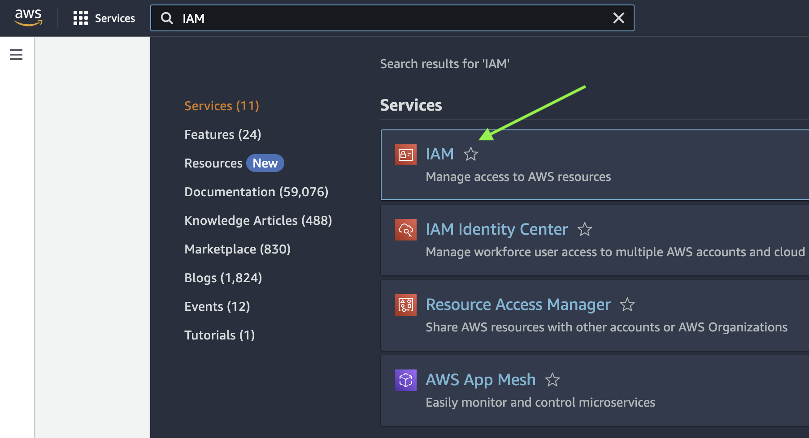

Click **Users**.

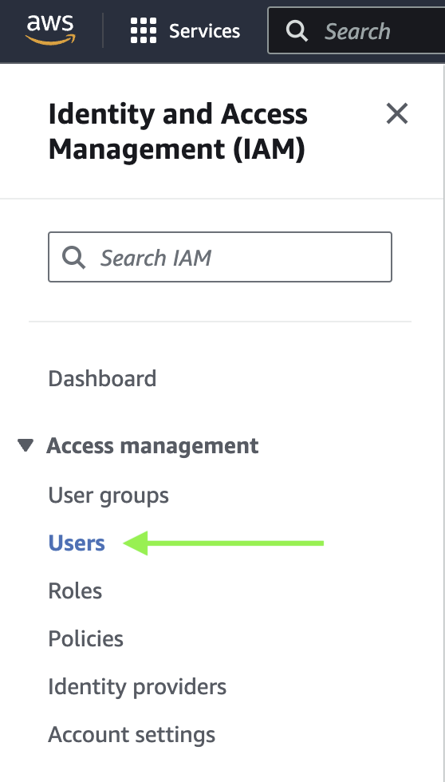

Click **Create user**.

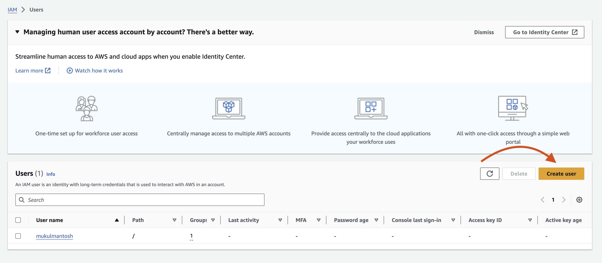

Provide a name. I am using "bedrock_user" you can choose any name that suits you and then move forward.

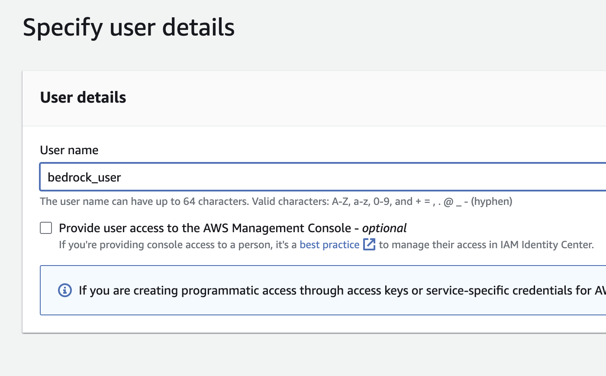

Next, click **Attach policies directly** and check **AdministratorAccess** and move forward.

> Always use strict policies based on your organization rules. For this tutorial, it's fine to use full access, but we would normally prohibit it.

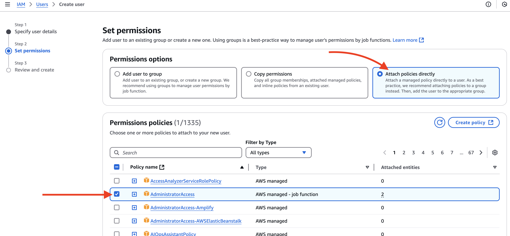

Review everything is done correctly and then click **Create user**.

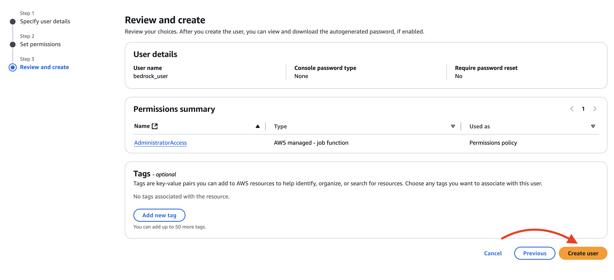

Once the user is created successfully, you will be redirected to the "users" page. Click the newly created user.

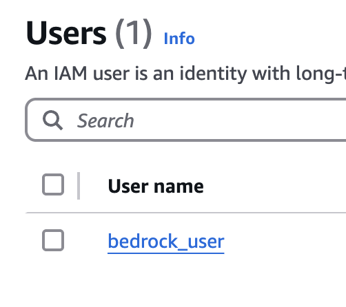

Next, click **Security credentials** -- **Create access key**.

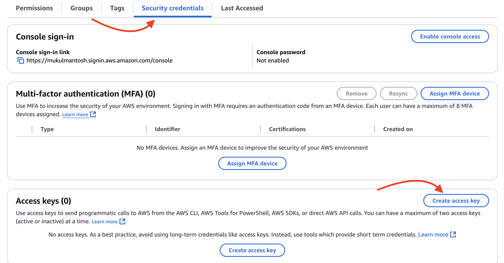

Next, choose use-case as **Other** and move forward.

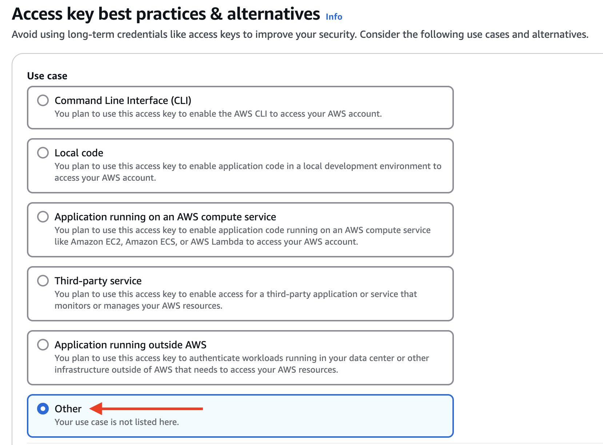

Provide a tag if you wish to. But it's completely optional. Go ahead and click **Create access key**.

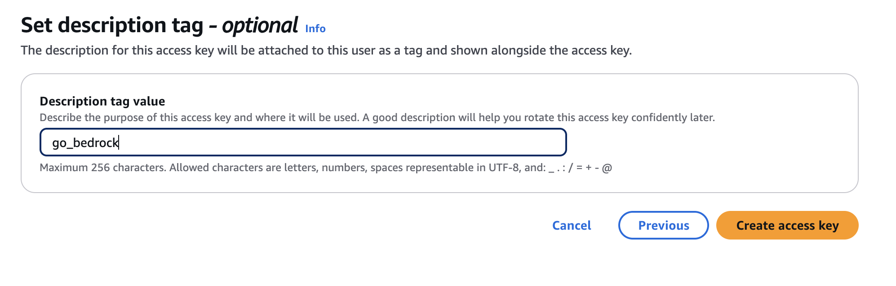

You can see the below image, access key and secret access key have been generated for us.

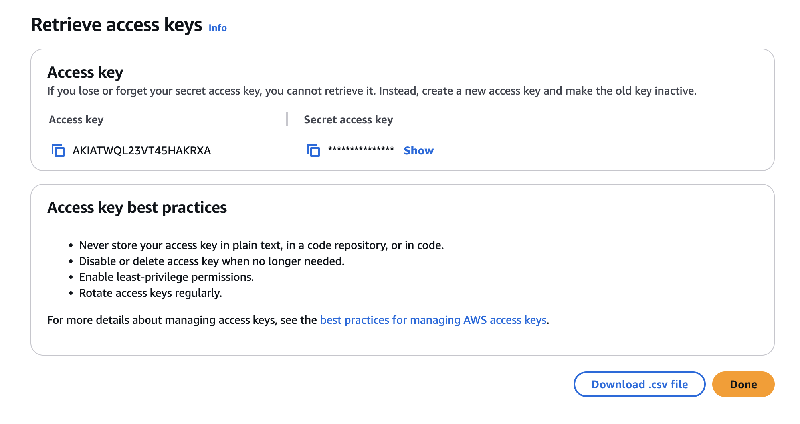

Now, we need to configure AWS CLI to use the access keys, which will be helpful when we are interacting our Go application with AWS SDK.

Open the Terminal and then type **aws configure**. After that, provide your access key id and secret access key.

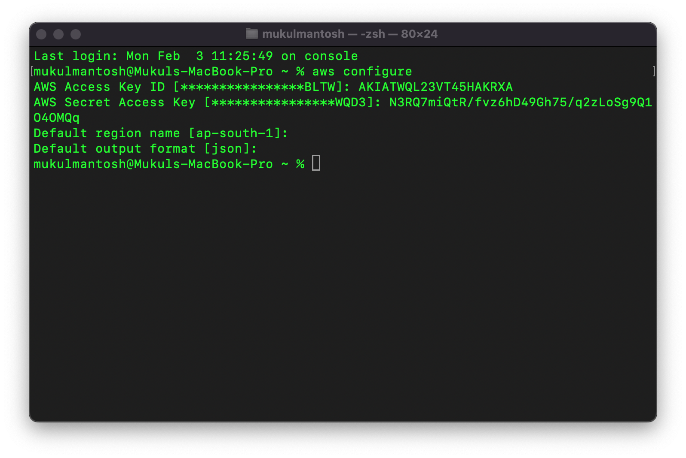

> Avoid copying the AWS access keys you see on the screen, as they will become invalid after a few days. Instead, ensure you use your own access keys and secret key.

The AWS CLI has been successfully configured. Next, let's proceed to the section where we'll focus on the Knowledge Base.
