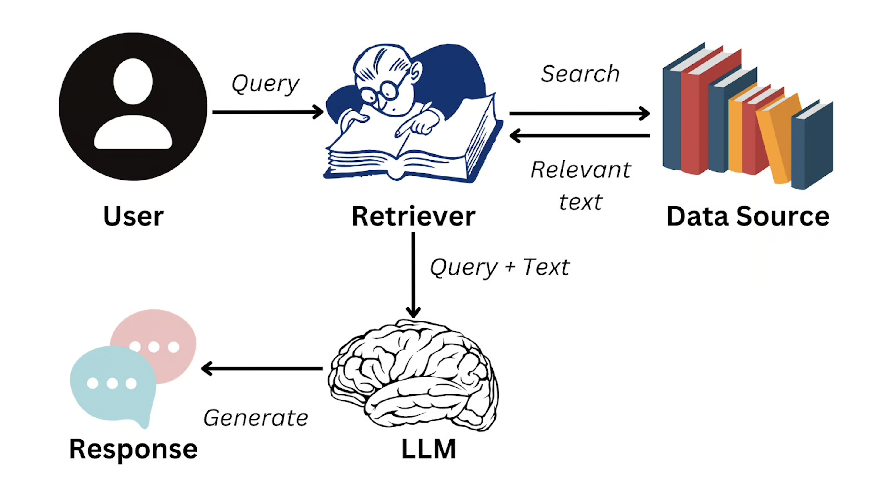

## RAG

[RAG](https://www.ibm.com/think/topics/retrieval-augmented-generation) stands for Retrieval-Augmented Generation. The benefit of RAG is that you can point it to your internal database, allowing the LLM to find answers from that database without the need to retrain or fine-tune the model.

The RAG framework consists of two main parts.

- Retrieval
- Generation

The goal of the **retrieval** phase is to pull in documents that may contain information the language model doesn't already know or not been trained on, giving it access to most up-to-date information. These documents can come from an external database or a company's internal private data store.

Once relevant documents are retrieved, the model moves to the **generation** phase. In this phase, the retrieved information is fed into a generative model, which uses it to generate a response. The generative model combines the information from these documents with its own pre-trained knowledge to produce a coherent and contextually relevant answer.

Source: DataCamp

### Benefits of using RAG

- **Outdated Information**: They lack access to real-time or specialized data beyond their training.
- **Hallucinations**: They might produce answers that sound reasonable but are actually inaccurate or made up.
- **Costly**: Updating knowledge by retraining large models requires significant computational resources.

### Why Use RAG?

- **Improved Accuracy**: RAG helps overcome the limitations of traditional LLMs, which rely entirely on the knowledge encoded during training. Since retrieval is dynamic, it can pull in up-to-date or specialized information that the model itself might not have learned.

- **Scalability**: Rather than training a massive model on every conceivable piece of knowledge, RAG enables the system to tap into an extensive knowledge base (such as a large collection of documents) without having to embed all that information directly into the model's parameters.

- **Better handling of rare or specific queries**: When a model encounters a query about a niche topic it was not specifically trained on, RAG can retrieve relevant content from external sources, enabling it to answer more accurately.

### Example Use Case

When you pose a question such as, "What are the latest prices of the BMW M5 in 2025?", a system based on RAG would initially gather the most pertinent articles or papers regarding BMW car prices from a vast database. Subsequently, the generative model uses that retrieved information to formulate a response that reflects the most current prices.

## Amazon Bedrock

If you love AWS, then you will definitely enjoy exploring Amazon [Bedrock](https://aws.amazon.com/bedrock/). It is a fully managed service from AWS that helps you interact with foundational models from leading AI companies like AI21 Labs, Anthropic, Cohere, Meta, StabilityAI, and Amazon itself. This service offers many features to build Generative AI applications.
