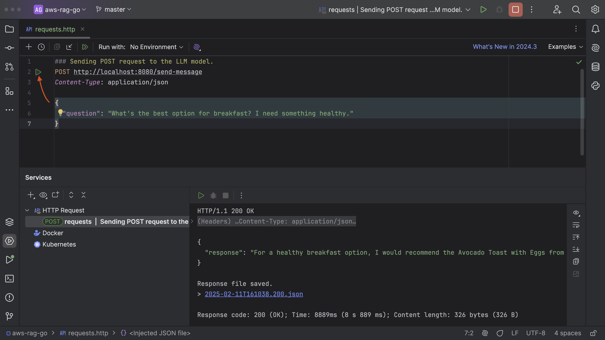

In the previous section, we completed the entire process of creating the knowledge base, interacted with it, and successfully tested it. Now, it's time to integrate with the AWS SDK and interact with the LLM using Go.

Just so you know, you can clone the [repository](https://github.com/mukulmantosh/aws-rag-go) and begin working right away.


Once you open the project in GoLand, the dependencies will be automatically synced. But there is one more approach.

- Open the `go.mod` file and click **Update all dependencies**.


main.go


The following code sets up a simple HTTP server on port 8080 to handle requests received from users at the `/send-message` endpoint. The request is then forwarded to the LLM function, which processes it and returns a response. I will get into more detail about how this works.

```go
package main

import (
	"log"
	"net/http"
)

func main() {
	bedrockAgent := NewBedrock()
	http.HandleFunc("/send-message", ProcessLLMModel(bedrockAgent))
	log.Println("Server started, listening on port 8080")
	log.Fatal(http.ListenAndServe(":8080", nil))
}

```

constants.go


In this file, we declare two constants: `ModelArn` and `KnowledgeBaseId`. You can obtain the knowledge base ID from the KnowledgeBase dashboard.

For `ModelArn`, you can refer to the list of supported foundation [models](https://docs.aws.amazon.com/bedrock/latest/userguide/models-supported.html). In our case, we have chosen Claude 3 Sonnet.

- Note: If you're choosing a different model, make sure it is already enabled in your account.


model.go


Let me break down the code in `model.go` step-by-step.

The code defines a `BedrockAgent` struct that interacts with AWS bedrock agent runtime. It has two main components:

1. **`NewBedrock`**: Sets up the bedrock agent client using AWS credentials.
2. **`RetrieveResponseFromKnowledgeBase`**: Queries the knowledge base to retrieve and generate a response for a given question, which we receive from the POST request.

```go
package main

import (
	"context"
	"github.com/aws/aws-sdk-go-v2/aws"
	"github.com/aws/aws-sdk-go-v2/config"
	"github.com/aws/aws-sdk-go-v2/service/bedrockagentruntime"
	"github.com/aws/aws-sdk-go-v2/service/bedrockagentruntime/types"
	"log"
)

type BedrockAgent struct {
	Client bedrockagentruntime.Client
}

func NewBedrock() *BedrockAgent {
	ctx := context.Background()
	var BedrockAgentRuntimeClient *bedrockagentruntime.Client

	// Load AWS Credentials
	awsConfig, err := config.LoadDefaultConfig(ctx, config.WithRegion("ap-south-1"))
	if err != nil {
		log.Fatal("Failed to load AWS credentials", err)
	}

	// create BedrockAgentClient
	BedrockAgentRuntimeClient = bedrockagentruntime.NewFromConfig(awsConfig)

	return &BedrockAgent{
		Client: *BedrockAgentRuntimeClient,
	}
}
```

- `RetrieveResponseFromKnowledgeBase` - In this function we are querying the knowledge base from a user-provided question. It uses a specific knowledge base ID and a vector search strategy to retrieve related results.

  - The `RetrieveResponseFromKnowledgeBase` function uses the Bedrock runtime client to:
  - Send a **question** to a configured knowledge base.
  - Retrieve a response using the `RetrieveAndGenerate` function, which:

    - Specifies the knowledge base ID.
    - Configures a vector search (e.g., searching for results with related vectors) with 6 results.
    - Uses a specific `ModelArn` for processing the input.

  - Returns the generated response (`output.Output.Text`).

You can even customize queries and response generation, follow this [link](https://docs.aws.amazon.com/bedrock/latest/userguide/kb-test-config.html) for more details.

```go
func (bedrockAgent *BedrockAgent) RetrieveResponseFromKnowledgeBase(question string) string {
	// invoke bedrock agent runtime to retrieve and generate
	output, err := bedrockAgent.Client.RetrieveAndGenerate(
		context.TODO(),
		&bedrockagentruntime.RetrieveAndGenerateInput{
			Input: &types.RetrieveAndGenerateInput{
				Text: aws.String(question),
			},
			RetrieveAndGenerateConfiguration: &types.RetrieveAndGenerateConfiguration{
				Type: types.RetrieveAndGenerateTypeKnowledgeBase,
				KnowledgeBaseConfiguration: &types.KnowledgeBaseRetrieveAndGenerateConfiguration{
					KnowledgeBaseId: aws.String(KnowledgeBaseId),
					ModelArn:        aws.String(ModelArn),
					RetrievalConfiguration: &types.KnowledgeBaseRetrievalConfiguration{
						VectorSearchConfiguration: &types.KnowledgeBaseVectorSearchConfiguration{
							NumberOfResults: aws.Int32(6),
						},
					},
				},
			},
		},
	)

	if err != nil {
		log.Fatal("RetrieveResponseFromKnowledgeBase::", err)
	}
	result := output.Output.Text
	return *result
}

```

controller.go

Let's move to the `controller.go` file where we define the HTTP handler function `ProcessLLMModel`. It processes the POST requests to query the knowledge base.


It also includes a request struct `LLMRequest` that expects a JSON object with a `question` field, and a response struct `LLMResponse` that contains the result.

When the `ProcessLLMModel` function is invoked:

1. It first verifies that the HTTP method is POST; otherwise, it responds with a 405 error.
2. It reads the request body and ensures it is valid JSON, deserializing it into an `LLMRequest`.
3. It trims whitespace and validates that the `question` field is not empty; if empty, it responds with a 400 error.
4. If valid, the question is passed to the knowledge base and waits to receive a response.
5. The final response is wrapped in a JSON object (`LLMResponse`) and sent back to the client.

```go
package main

import (
	"encoding/json"
	"io"
	"net/http"
	"strings"
)

type LLMRequest struct {
	Question string `json:"question"`
}

type LLMResponse struct {
	Response string `json:"response"`
}

func ProcessLLMModel(bedrockAgent *BedrockAgent) http.HandlerFunc {
	return func(w http.ResponseWriter, r *http.Request) {
		if r.Method != http.MethodPost {
			http.Error(w, "Method should be POST!", http.StatusMethodNotAllowed)
			return
		}

		// Read the request body
		body, err := io.ReadAll(r.Body)
		if err != nil {
			http.Error(w, "Failed to read request body", http.StatusBadRequest)
			return
		}
		defer r.Body.Close()

		// Parse the request body as JSON
		var req LLMRequest
		err = json.Unmarshal(body, &req)
		if err != nil {
			http.Error(w, "Invalid JSON format", http.StatusBadRequest)
			return
		}

		question := strings.TrimSpace(req.Question)

		// Check if the question field is empty.
		if question == "" {
			http.Error(w, "The 'question' field is required", http.StatusBadRequest)
			return
		}

		// Pass the question to Knowledge Base and return back the response.
		response := bedrockAgent.RetrieveResponseFromKnowledgeBase(question)
		var llmResponse LLMResponse
		llmResponse.Response = response

		w.Header().Set("Content-Type", "application/json")
		w.WriteHeader(http.StatusOK)
		json.NewEncoder(w).Encode(llmResponse)
	}
}

```

Next, we will proceed to start the application.


You can find a file in the project root named `requests.http`, which you can use to play around with APIs.

You can see in the image that we are receiving a successful response.



Since our APIs are functioning perfectly, we will now focus on building the UI, utilizing Python for assistance.

To install the plugin, we need to [configure](https://www.jetbrains.com/help/go/configuring-project-and-ide-settings.html) the IDE by selecting _GoLand | Settings_ on macOS or _File | Settings_ on Windows and Linux.

Head over to **Plugins** and install **Python Community Edition**.

> Note: You might need to restart the IDE after installing this plugin.


To run Python code, you need to set up the interpreter. You can find the **Add Interpreter** option under _Settings > Build, Execution, Deployment > Python Interpreter_.

Click **Add Interpreter**.


Click **Add Local Interpreter**.


Create a new virtual environment and click **OK**.


Once the virtual environment is created, you need to install the Python dependencies. They are already stored in the `requirements.txt` file, which you can find in the repository.

Run the following command:

```shell
pip install -r requirements.txt
```

or

```shell
pip install streamlit
pip install requests
```


### What is Streamlit?

[Streamlit](https://streamlit.io/) is a popular open-source Python framework for building interactive and data-driven web applications with minimal effort. Here are some key benefits of using Streamlit:

Simple, Pythonic syntax that allows you to create web apps with just a few lines of code.
No need for HTML, CSS, or JavaScript—everything is written in Python.

### Running Frontend

Once the dependencies have been installed successfully, create a new python file and name it `frontend.py`.


I won't go into too much detail, but at a high level:

- We are creating a UI that takes user input.
- Sends the information to the Go backend.
- Waits for a response from the knowledge base and displays it in the UI.

```python
import streamlit as st
import requests

def get_api_response(request_question: str):
    api_url = "http://localhost:8080/send-message"
    headers = {
        "Content-Type": "application/json",
    }
    payload = {
        "question": request_question
    }

    try:
        response = requests.post(api_url, json=payload, headers=headers)
        if response.status_code == 200:
            return response.json()["response"]
        else:
            return {"error": "Failed Response!"}
    except Exception as e:
        return "Error::Something went wrong! " + str(e)


st.title("AWS Knowledge Base with Go")

question = st.text_input("Ask a question:")

if st.button("Submit"):
    if question:
        with st.spinner("Getting the answer..."):
            answer = get_api_response(question)
            if "Error" in answer:
                st.error(answer)
            else:
                st.write(answer)
    else:
        st.warning("Please enter the question before submitting.")

```

After completing the setup, run the following command in the terminal. You may receive a local URL with a different port number.

```shell
streamlit run frontend.py
```

Open the URL in your browser.


And here is the final result.

<video width="1366" height="768" controls loop autoplay>
  <source src="./images/video_aws_rag.webm" type="video/webm">
  Your browser does not support the video tag.
</video>

I hope you enjoyed going through this tutorial. If you're interested in GenAI with Go and AWS, feel free to check out their [repository](https://github.com/aws-samples/building-genai-applications-with-golang).
