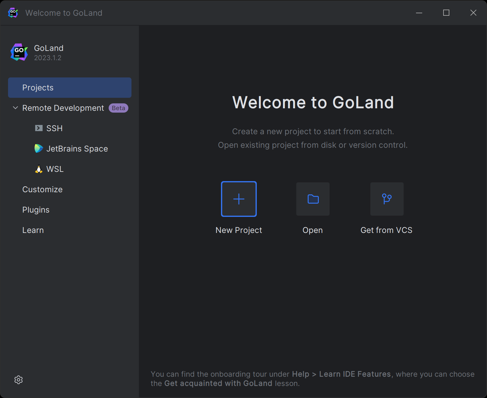
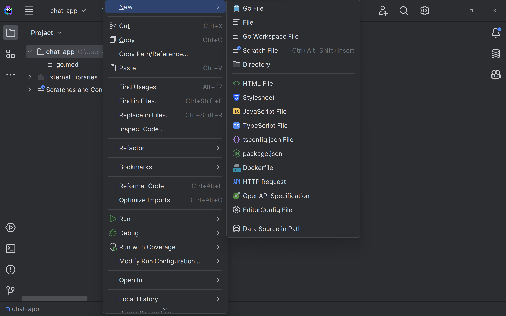
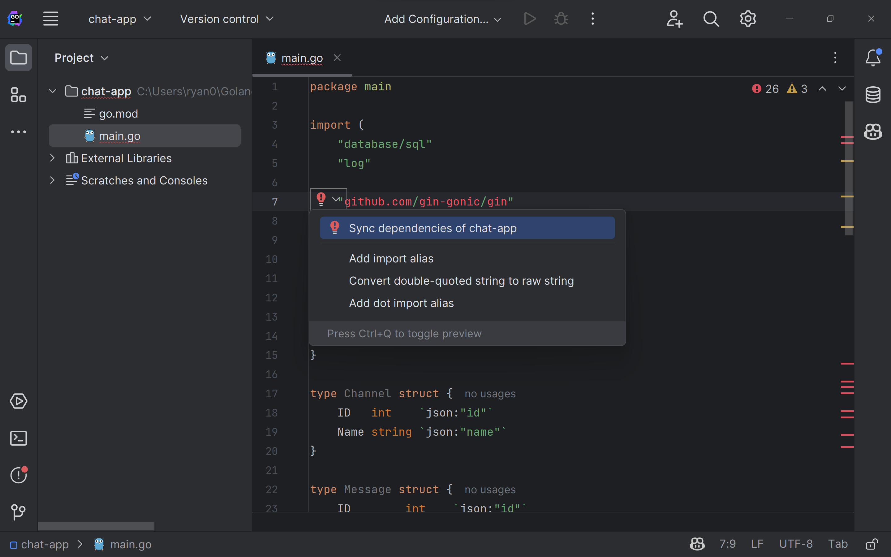
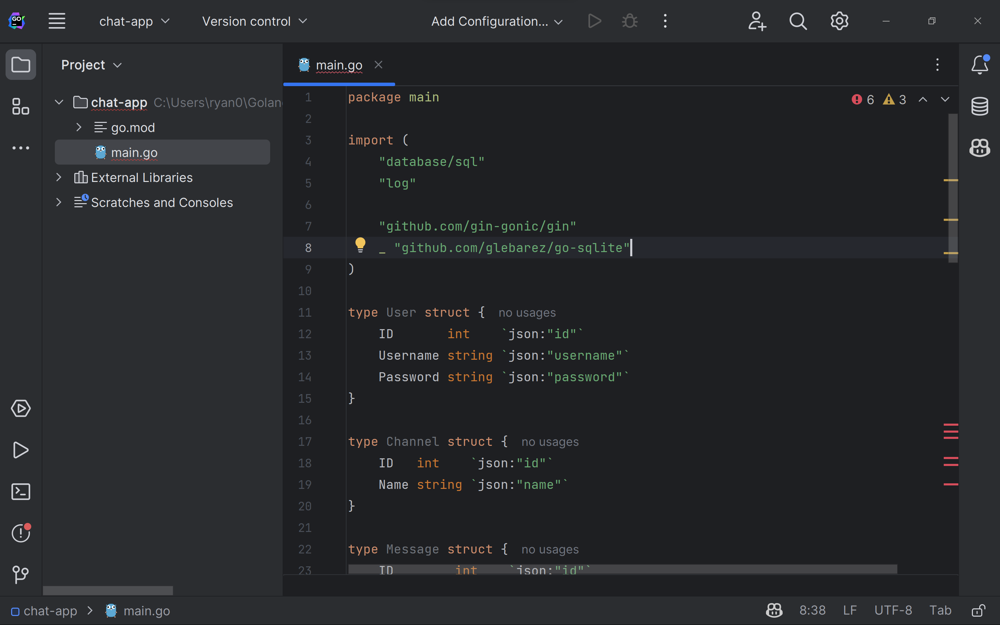
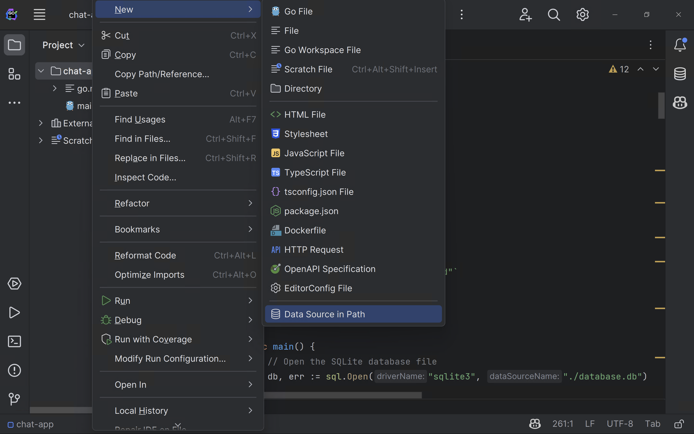
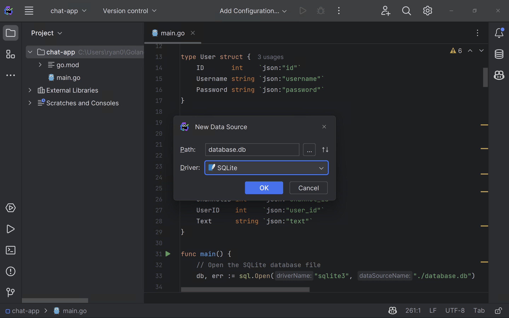
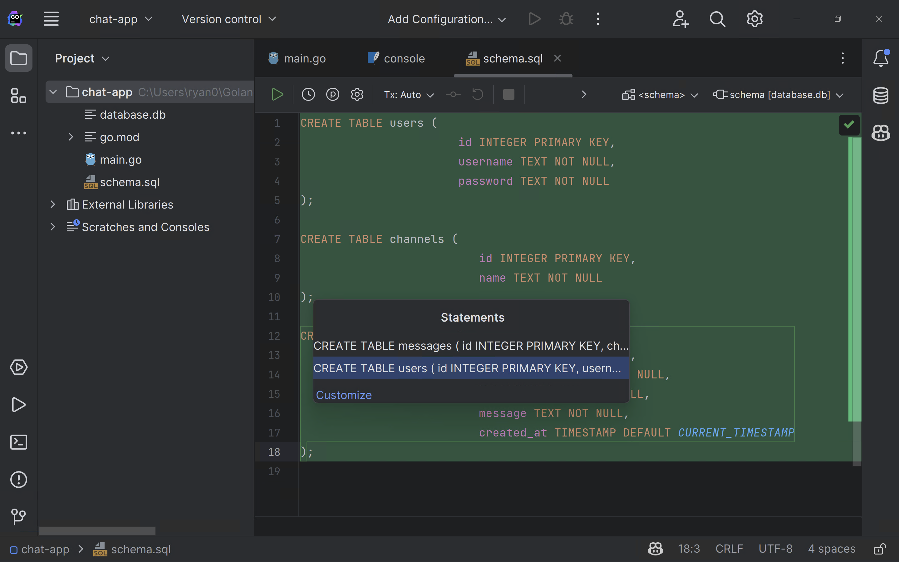

With the prerequisites installed, it's time to build the chat app's Go backend. Visit the backend's [GitHub repository](https://github.com/rpeden/go-gin-react-part1) if you'd like a preview of the final backend.

GoLand simplifies the process of developing Go applications using a code-first approach. Start by opening GoLand and clicking **New Project** on the welcome screen:



Choose **Go** from the list of application types. You can enter any location you wish, but note that the rest of the tutorial assumes your application is in the `chat-app` directory.

You now need to install the dependencies required for the chat app. Normally, you'd use the Go CLI to install the modules you want to use. But since you're using GoLand, you can just add the module import in your code and let GoLand install it for you.

Add a new file named `main.go` to your app by right-clicking the project and selecting **New | Go File**:



Name the file `main.go` and add the following code to create a minimal Gin application:

```go
package main

import (
	"database/sql"
	"log"

	"github.com/gin-gonic/gin"
	_ "github.com/glebarez/go-sqlite"
)

type User struct {
	ID       int    `json:"id"`
	Username string `json:"username"`
	Password string `json:"password"`
}

type Channel struct {
	ID   int    `json:"id"`
	Name string `json:"name"`
}

type Message struct {
	ID        int    `json:"id"`
	ChannelID int    `json:"channel_id"`
	UserID    int    `json:"user_id"`
	UserName  string `json:"user_name"`
	Text      string `json:"text"`
}

func main() {
	// Get the working directory
	wd, err := os.Getwd()
	if err != nil {
		log.Fatal(err)
	}
	// Print the working directory
	fmt.Println("Working directory:", wd)

	// Open the SQLite database file
	db, err := sql.Open("sqlite", wd+"/database.db")

	defer func(db *sql.DB) {
		err := db.Close()
		if err != nil {
			log.Fatal(err)
		}
	}(db)

	// Create the Gin router
	r := gin.Default()

	if err != nil {
		log.Fatal(err)
	}

	// Creation endpoints
	r.POST("/users", func(c *gin.Context) { createUser(c, db) })
	r.POST("/channels", func(c *gin.Context) { createChannel(c, db) })
	r.POST("/messages", func(c *gin.Context) { createMessage(c, db) })

	// Listing endpoints
	r.GET("/channels", func(c *gin.Context) { listChannels(c, db) })
	r.GET("/messages", func(c *gin.Context) { listMessages(c, db) })

	// Login endpoint
	r.POST("/login", func(c *gin.Context) { login(c, db) })

	err = r.Run(":8080")
	if err != nil {
		log.Fatal(err)
	}
}
```

Notice that GoLand highlights `github.com/gin-gonic/gin` in red because Gin is not yet installed in the module cache. Click the dropdown arrow next to the red exclamation, then click **Sync dependencies of chat-app**:



It may take a few minutes for GoLand to install and index Gin and its dependencies, depending on the speed of your computer and internet connection. When it's done, you'll see the dependencies are no longer red:



Now that you've installed the dependencies, let's briefly review the code.

It first creates structs to represent the chat application's data types: users, channels, and messages. Then, it defines a `main` function that opens a SQLite database, creates a minimal Gin router, and adds endpoints to the router. Note that the endpoint functions aren't implemented yet. You'll do that in the next step.

While the endpoint code is too extensive to discuss it all in detail, all the endpoints follow a common pattern, where they:

- Read query parameters from the URL (for GET requests) or JSON from the request body (for POST requests)
- Read from or write to the SQLite database
- Return a JSON response

To keep the tutorial simple, none of the endpoints authenticate incoming requests. In production, consider using [Gin middleware](https://gin-gonic.com/docs/examples/using-middleware/) to add an authentication layer to your API.

With that in mind, you'll next implement the endpoints referred to in the `main` function.

Add the following blocks of code to the bottom of `main.go`, and GoLand will automatically import more dependencies from Go's standard library.

Start with a function that creates new users with a given username and password:

```go
// User creation endpoint
func createUser(c *gin.Context, db *sql.DB) {
	// Parse JSON request body into User struct
	var user User
	if err := c.ShouldBindJSON(&user); err != nil {
		c.JSON(http.StatusBadRequest, gin.H{"error": err.Error()})
		return
	}

	// Insert user into database
	result, err := db.Exec("INSERT INTO users (username, password) VALUES (?, ?)", user.Username, user.Password)
	if err != nil {
		c.JSON(http.StatusInternalServerError, gin.H{"error": err.Error()})
		return
	}

	// Get ID of newly inserted user
	id, err := result.LastInsertId()
	if err != nil {
		c.JSON(http.StatusInternalServerError, gin.H{"error": err.Error()})
		return
	}

	// Return ID of newly inserted user
	c.JSON(http.StatusOK, gin.H{"id": id})
}
```

Next, add a function the React frontend can call to log in to the chat app:

```go
// Login endpoint
func login(c *gin.Context, db *sql.DB) {
	// Parse JSON request body into User struct
	var user User
	if err := c.ShouldBindJSON(&user); err != nil {
		c.JSON(http.StatusBadRequest, gin.H{"error": err.Error()})
		return
	}

	// Query database for user
	row := db.QueryRow("SELECT id FROM users WHERE username = ? AND password = ?", user.Username, user.Password)

	// Get ID of user
	var id int
	err := row.Scan(&id)
	if err != nil {
		// Check if user was not found
		if err == sql.ErrNoRows {
			c.JSON(http.StatusUnauthorized, gin.H{"error": "invalid username or password"})
			return
		}
		// Return error if other error occurred
		c.JSON(http.StatusInternalServerError, gin.H{"error": err.Error()})
	}

	// Return ID of user
	c.JSON(http.StatusOK, gin.H{"id": id})
}
```

Then, a function that create a new chat channel with a given name:

```go
// Channel creation endpoint
func createChannel(c *gin.Context, db *sql.DB) {
	// Parse JSON request body into Channel struct
	var channel Channel
	if err := c.ShouldBindJSON(&channel); err != nil {
		c.JSON(http.StatusBadRequest, gin.H{"error": err.Error()})
		return
	}

	// Insert channel into database
	result, err := db.Exec("INSERT INTO channels (name) VALUES (?)", channel.Name)
	if err != nil {
		c.JSON(http.StatusInternalServerError, gin.H{"error": err.Error()})
		return
	}

	// Get ID of newly inserted channel
	id, err := result.LastInsertId()
	if err != nil {
		c.JSON(http.StatusInternalServerError, gin.H{"error": err.Error()})
		return
	}

	// Return ID of newly inserted channel
	c.JSON(http.StatusOK, gin.H{"id": id})
}
```

And a function that returns a list of all chat channels for the frontend to display:

```go
// Channel listing endpoint
func listChannels(c *gin.Context, db *sql.DB) {
	// Query database for channels
	rows, err := db.Query("SELECT id, name FROM channels")
	if err != nil {
		c.JSON(http.StatusInternalServerError, gin.H{"error": err.Error()})
		return
	}

	// Create slice of channels
	var channels []Channel

	// Iterate over rows
	for rows.Next() {
		// Create new channel
		var channel Channel

		// Scan row into channel
		err := rows.Scan(&channel.ID, &channel.Name)
		if err != nil {
			c.JSON(http.StatusInternalServerError, gin.H{"error": err.Error()})
			return
		}

		// Append channel to slice
		channels = append(channels, channel)
	}

	// Return slice of channels
	c.JSON(http.StatusOK, channels)
}
```

Next, add a function that lets users create new messages in a chat channel:

```go
// Message creation endpoint
func createMessage(c *gin.Context, db *sql.DB) {
	// Parse JSON request body into Message struct
	var message Message
	if err := c.ShouldBindJSON(&message); err != nil {
		c.JSON(http.StatusBadRequest, gin.H{"error": err.Error()})
		return
	}

	// Insert message into database
	result, err := db.Exec("INSERT INTO messages (channel_id, user_id, message) VALUES (?, ?, ?)", message.ChannelID, message.UserID, message.Text)
	if err != nil {
		c.JSON(http.StatusInternalServerError, gin.H{"error": err.Error()})
		return
	}

	// Get ID of newly inserted message
	id, err := result.LastInsertId()
	if err != nil {
		c.JSON(http.StatusInternalServerError, gin.H{"error": err.Error()})
		return
	}

	// Return ID of newly inserted message
	c.JSON(http.StatusOK, gin.H{"id": id})
}
```

The final function lists messages in a chat channel. By default, it returns the last 100 messages posted to the channel, but it also accepts query parameters that let the frontend request a different number of messages or ask for all messages newer than a given message's ID:

```go
// Message listing endpoint
func listMessages(c *gin.Context, db *sql.DB) {
	// Parse channel ID from URL
	channelID, err := strconv.Atoi(c.Query("channelID"))
	if err != nil {
		c.JSON(http.StatusBadRequest, gin.H{"error": err.Error()})
		return
	}

	// Parse optional limit query parameter from URL
	limit, err := strconv.Atoi(c.Query("limit"))
	if err != nil {
		// Set limit to 100 if not provided
		limit = 100
	}

	// Parse last message ID query parameter from URL. This is used to get messages after a certain message.
	lastMessageID, err := strconv.Atoi(c.Query("lastMessageID"))
	if err != nil {
		// Set last message ID to 0 if not provided
		lastMessageID = 0
	}

	// Query database for messages
	rows, err := db.Query("SELECT m.id, channel_id, user_id, u.username AS user_name, message FROM messages m LEFT JOIN users u ON u.id = m.user_id WHERE channel_id = ? AND m.id > ? ORDER BY m.id ASC LIMIT ?", channelID, lastMessageID, limit)
	if err != nil {
		c.JSON(http.StatusInternalServerError, gin.H{"error": err.Error()})
		return
	}

	// Create slice of messages
	var messages []Message

	// Iterate over rows
	for rows.Next() {
		// Create new message
		var message Message

		// Scan row into message
		err := rows.Scan(&message.ID, &message.ChannelID, &message.UserID, &message.UserName, &message.Text)
		if err != nil {
			c.JSON(http.StatusInternalServerError, gin.H{"error": err.Error()})
			return
		}

		// Append message to slice
		messages = append(messages, message)
	}

	// Return slice of messages
	c.JSON(http.StatusOK, messages)
}
```

And that's all the code needed for the chat app backend! Now, it's time to create the database.

### Creating the Database

GoLand's built-in database support means you can create a SQLite database for your chat app with just a few clicks.

Start by right-clicking the `chat-app` project and choosing **New | Data Source in Path**:



Enter `database.db` as the path and choose the SQLite driver:



This will create a database file for the chat application.

Next, add a new file to the project named `schema.sql` with the following contents:

```sql
CREATE TABLE users (
                       id INTEGER PRIMARY KEY,
                       username TEXT NOT NULL,
                       password TEXT NOT NULL
);

CREATE TABLE channels (
                          id INTEGER PRIMARY KEY,
                          name TEXT NOT NULL
);

CREATE TABLE messages (
                          id INTEGER PRIMARY KEY,
                          channel_id INTEGER NOT NULL,
                          user_id INTEGER NOT NULL,
                          message TEXT NOT NULL,
                          created_at TIMESTAMP DEFAULT CURRENT_TIMESTAMP
);
```

Then, press <kbd>Ctrl+Enter</kbd> (⌘ ↩ on Mac) and choose **New Session** when GoLand prompts you. If the IDE asks you to choose between `console` or `database.db`, choose `database.db` and **New Session**. In the **Statements** pop-up, scroll down until all the `CREATE TABLE` statements are highlighted in green, then press **Enter** to create the database tables:



Test that the app builds and runs by right-clicking `main.go` in the _Project_ window and clicking **Run 'go build main.go'**. The app should build and run without any errors.
