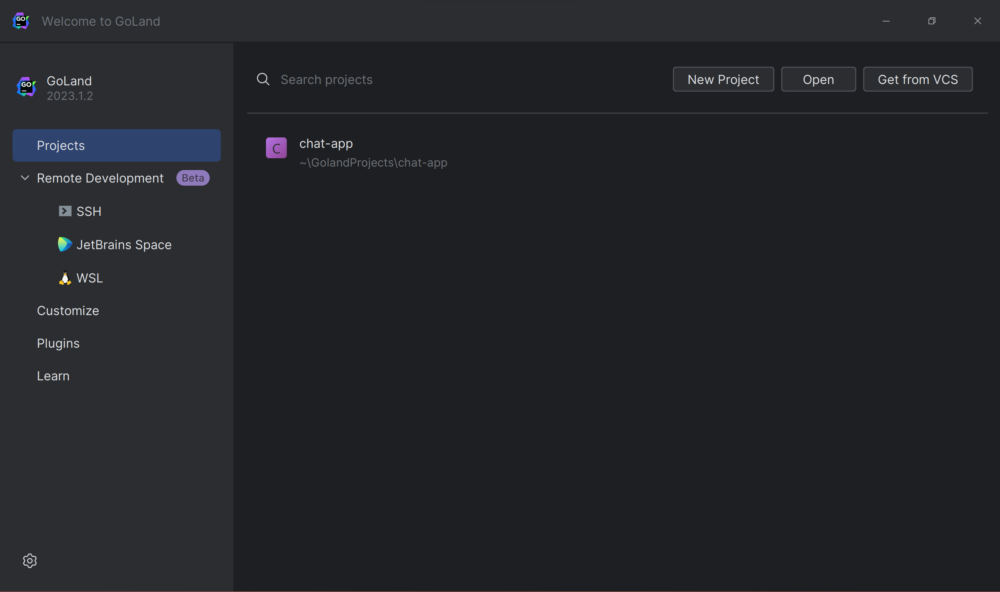
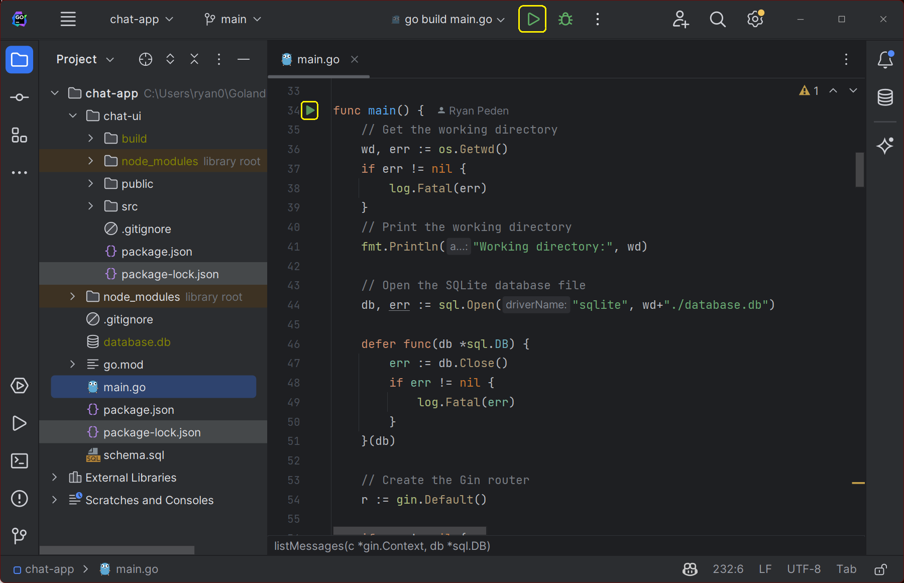
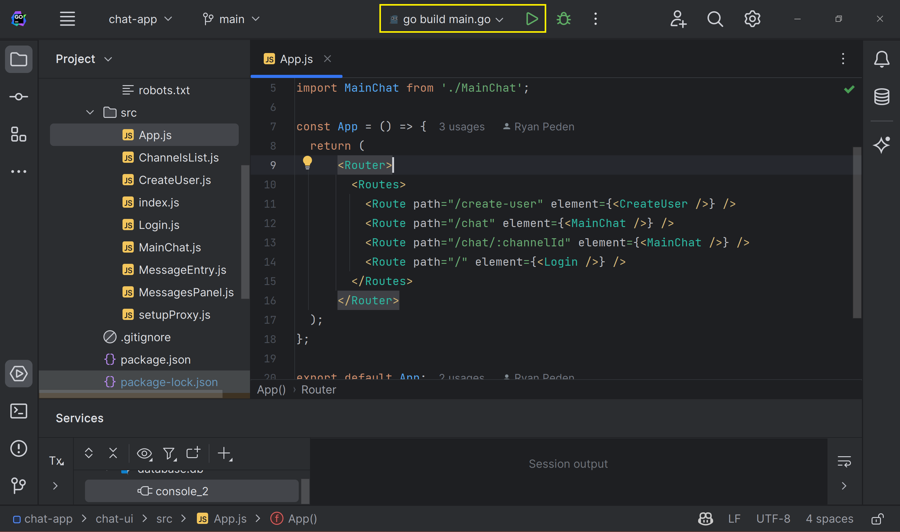
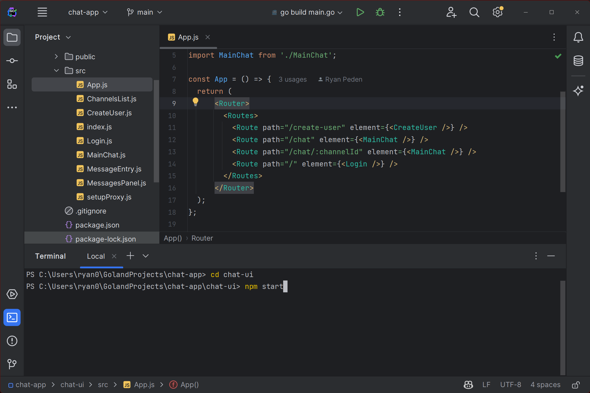
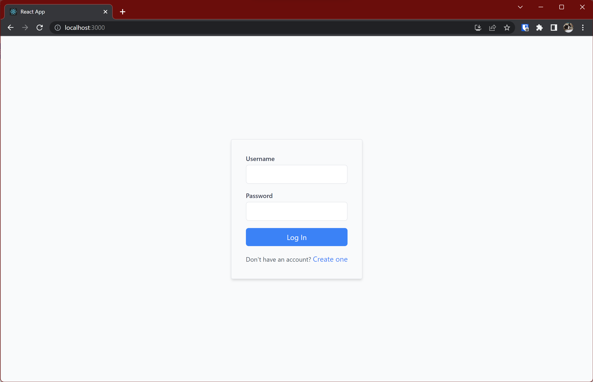
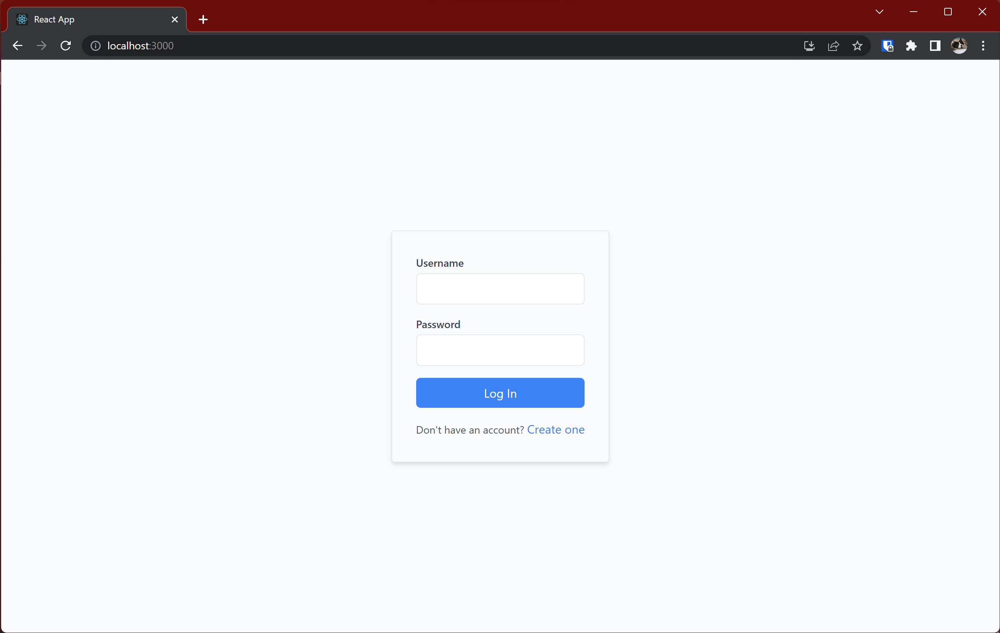
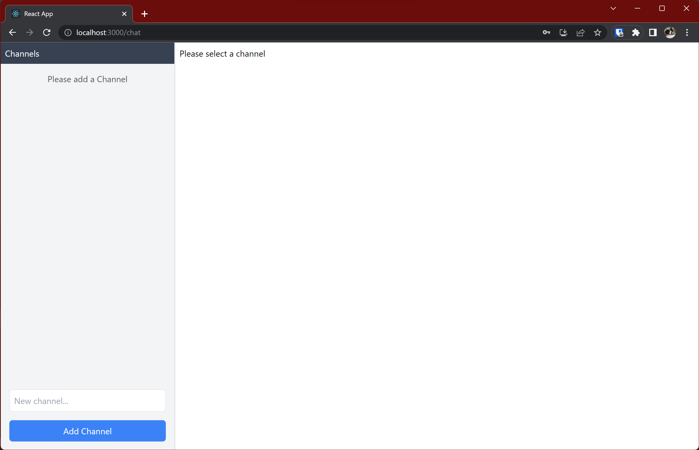
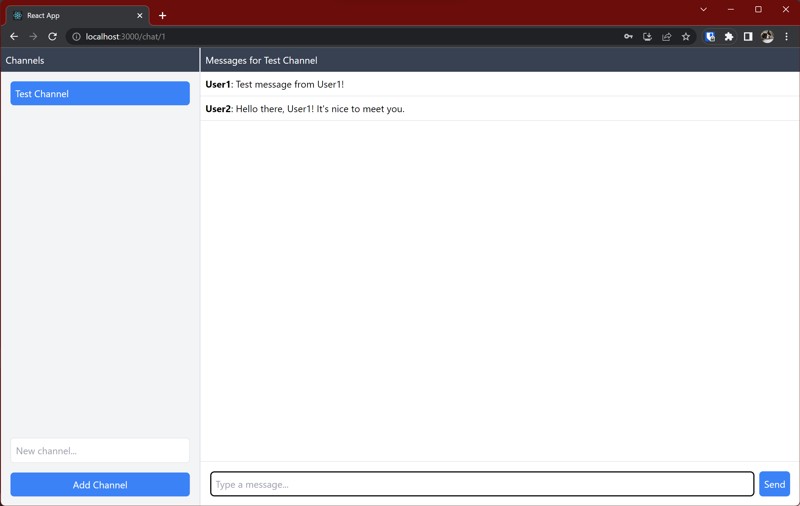

In this last installment, you'll connect the dots. You'll start by setting up a proxy to let your React frontend communicate with the Go and Gin backend during development. Then, you'll run the app and explore various user flows such as account creation, login, channel creation, and messaging. Finally, you'll gear up for deployment by creating production builds and configuring the Gin backend to serve your app's UI.

Time to put the finishing touches on your full-stack web app!

## Getting the Code

If you've worked your way through the first two parts of the series, you can use the code you already created. Otherwise, you can use the [code from part two](https://github.com/rpeden/go-gin-react-part2) as a starting point.

You can also find the final, complete chat app in [this repository](https://github.com/rpeden/go-gin-react-part3).

If you choose to clone one of the repositories, open it in GoLand by clicking the **Open** button on the welcome screen:



Then, open the directory where you cloned the GitHub repository.

Before connecting the backend and frontend of the app, it's a good idea to test the backend to verify that it responds to HTTP requests as expected.

Fortunately, GoLand has a built-in HTTP client that makes this kind of test easy.

Click the hamburger icon in the app's title bar to open the menu, then choose **Tools | HTTP Client | Create Request in HTTP Client**:


GoLand will open its HTTP client and populate it with a GET request. Change the text to make a POST request to `http://localhost:8080/users` that creates a user, like so:


Next, click the large green play icon at the top of the screen to run the app's backend to launch the backend's run configuration. If you don't have a run configuration in your project yet, you can run the backend by clicking the green triangle next to the `main` function in `main.go`:


Wait a few seconds for the backend to start. Then, click the small play icon beside your POST request. GoLand will send the request to the backend API, which should create the user and return a JSON object with the new user's ID:


Now that you've tested and verified the backend is responding to HTTP requests, you're ready to connect the two parts of the app and see it in action.

## Setting Up a Create React App Proxy

Before proceeding, it's a good idea to set up a proxy to help your React app communicate with your Go backend when running in development mode.

### Why Set Up a Proxy in Development Mode?

During development, you'll typically have your React app running on a development server (usually on port 3000) and your Go and Gin backend on another server (in this case, port 8080).

If your React app tried to make requests to your backend, it would face issues due to cross-origin restrictions since the frontend and backend of the app are running on different ports.

By setting up a proxy, you're essentially telling your React development server to forward any API requests to your Go and Gin backend server. This not only circumvents the cross-origin issues but also allows you to develop more seamlessly, as if your frontend and backend were already united in production.

### Setting Up a React Development Proxy

To instruct the React development server to proxy your API requests to the Go backend, install `http-proxy-middleware` by running the following in your app's `chat-ui` subdirectory:

```sh
npm install http-proxy-middleware --save
```

Then, in the `chat-ui/src` directory, create a file named `setupProxy.js` and add the following code:

```javascript
const { createProxyMiddleware } = require("http-proxy-middleware");

module.exports = function (app) {
	app.use(
		["/users", "/login", "/channels", "/messages"],
		createProxyMiddleware({
			target: "http://localhost:8080",
			changeOrigin: true,
		}),
	);
};
```

You're now ready to run your app in development mode.

First, run the app's backend by clicking the run button at the top of your GoLand window:



Then, open a GoLand terminal, type `cd chat-ui` to switch to the chat app's subdirectory, and run `npm start`:



With that, both the backend and frontend of your app are running, so it's time to see it in action.

## Testing the Chat App

Open a web browser and navigate to [http://localhost:3000](http://localhost:3000). You'll see the chat app's login page:



Since you don't have a user account yet, click the link to create one:



The app will create your user and return you to the login page. Sign in with the account credentials you just created, and you'll land on the main page of the app:



Since you don't have any chat channels yet, the app asks you to create one. Enter a channel name in the input box, then click **Add Channel** button to add a new channel. You'll see it appear in the list of channels.

Click the name of the channel to open it:


Enter a message, and it will appear in the channel:


Since talking to yourself isn't much fun, it's time to add another user. Keep your existing chat window open, then open a private browser window. Navigate to [http://localhost:3000](http://localhost:3000) and follow the same steps as before to create another user with a different username. Sign in, open the channel you created earlier, and enter a new message. You'll see it appear in the channel:



If you switch back to your original chat window, you'll see the new message has appeared there, too. You now have a functional, multiuser group chat app!
