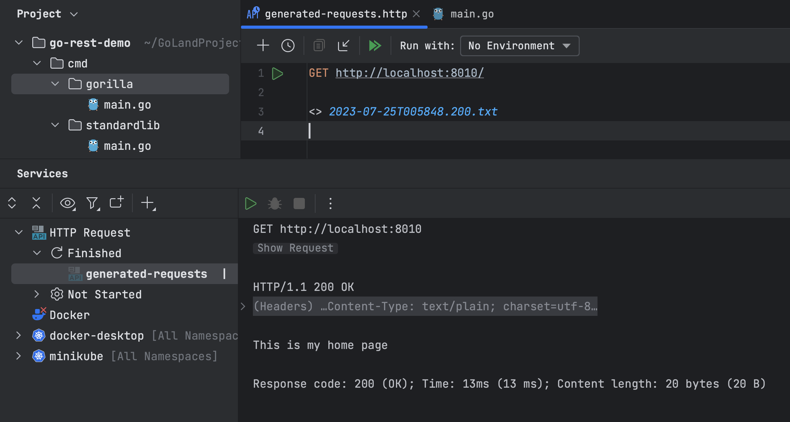

_This tutorial was created by an external contributor, <a href="https://github.com/xNok" target="_blank">Alexandre Couëdelo</a>_.

# Go REST Guide. gorilla/mux Router

This is the second article in a three-part series dedicated to different methods of building a Golang REST API. Part one focused on creating a simple REST API using the `net/http` package from the standard library. This second installment demonstrates how to use a router for improved handling of requests when building REST APIs. The router matches URLs to handler functions and calls them accordingly, which helps reduce the code you need to write compared to using the standard library.

This common pattern in web development reduces code duplication and allows for more modular code. There are many routers available for Go, but this article focuses on [`gorilla/mux`](https://github.com/gorilla/mux), one of the most popular routers in the Go community.

In this article, you'll write a simple REST API with `gorilla/mux`. You'll mainly learn about routers and discover some of the `gorilla/mux` library's features, such as its ability to define subrouters for better decoupling of large APIs managing many resources and its use of middleware that can apply reusable features to a given handler.

## What is a router?

A router is a component responsible for dispatching HTTP requests to specific functions called handlers based on the HTTP request path. A routing package is useful in several ways. It saves you from having to implement a custom multiplexer that dispatches requests to other handlers based on the HTTP verb and URL pattern. If you're continuing from part one, you'll recognise the code below as the custom multiplexer you previously implemented:

```go
func (h *RecipesHandler) ServeHTTP(w http.ResponseWriter, r *http.Request) {
    switch {
    case r.Method == http.MethodPost && RecipeRe.MatchString(r.URL.Path):
        h.CreateRecipe(w, r)
        return
    case r.Method == http.MethodGet && RecipeRe.MatchString(r.URL.Path):
        h.ListRecipes(w, r)
        return
    case r.Method == http.MethodGet && RecipeReWithID.MatchString(r.URL.Path):
        h.GetRecipe(w, r)
        return
    case r.Method == http.MethodPut && RecipeReWithID.MatchString(r.URL.Path):
        h.UpdateRecipe(w, r)
        return
    case r.Method == http.MethodDelete && RecipeReWithID.MatchString(r.URL.Path):
        h.DeleteRecipe(w, r)
        return
    default:
        NotFoundHandler(w, r)
        return
    }
}
```

The code is quite straightforward. However, you need to write similar code for each resource, which can become tedious. So, it's more practical to have one component that replaces that piece of code.


The difference between using a router package and a custom multiplexer might not be noticeable if you're implementing a small-scale application; however, the repetitive development can be frustrating when the application grows bigger.

Particularly when building a REST API, a good router should require minimal configuration by following its convention. Therefore, configuring a router for a REST API should be similar to defining an endpoint table. In the previous tutorial, you were able to summarize the list of endpoints in this table:

| Action | Verb   | Path            | Description                                      |
| ------ | ------ | --------------- | ------------------------------------------------ |
| Create | POST   | `/recipes`      | Create an entity represented by the JSON payload |
| List   | GET    | `/recipes`      | Get all entities from the resource               |
| Read   | GET    | `/recipes/<id>` | Get a single entity                              |
| Update | PUT    | `/recipes/<id>` | Update an entity with the JSON payload           |
| Delete | DELETE | `/recipes/<id>` | Delete an entity                                 |

You'll be implementing the same application in this tutorial, and you can use the above table as a reference.

## Building a REST API with gorilla/mux

The code for this tutorial and the code from the previous tutorial are available on [GitHub](https://github.com/JetBrains/go-code-samples/tree/main/go-rest-demo/cmd). The `store` code used for the same recipes will be shared between both tutorials. So, if you haven't completed the first one, just grab all the code under `/pkg` that contains the shared business logic (in [`/pkg/recipes/`](https://github.com/JetBrains/go-code-samples/tree/main/go-rest-demo/pkg/recipes)).

### Getting started with gorilla/mux

First, you need to install `gorilla/mux` using the `go get` command:

```go
go get -u github.com/gorilla/mux
```

Create a new file at `./cmd/gorilla/main.go`; for those who followed the first tutorial, you'll have both examples side by side, one in the `/cmd/standardlib` folder, one in the `/cmd/gorilla` folder. Here is what the directory tree should look like:

```
├── cmd
│   ├── gorilla
│   │   └── main.go
│   └── standardlib
│       └── main.go
└──pkg
   └── recipes
       ├── models.go
       └── recipeMemStore.go
```

Next, implement a simple home page:

```go
type homeHandler struct{}

func (h *homeHandler) ServeHTTP(w http.ResponseWriter, r *http.Request) {
    w.Write([]byte("This is my home page"))
}
```

In the above code, you define a handler function ([`HandleFunc`](https://pkg.go.dev/net/http#HandleFunc)) that takes two parameters, `w http.ResponseWriter` and `r *http.Request`. The handler function is defined as a `struct` method to enable dependency injection. It's the same home handler we defined in the first tutorial.

Next, define the `main` function:

```go
func main() {

    // create the router
    router := mux.NewRouter()

    // Register the route
    home := homeHandler{}

    router.HandleFunc("/", home.ServeHTTP)

    // Start the server
    http.ListenAndServe(":8010", router)
}
```

In the above code, you create a new router by calling `mux.NewRouter()`, followed by the home handler `home := homeHandler{}`, and register `/` to call `home.ServeHTTP` using `HandleFunc`. Finally, you start the server on port 8010. By choosing a different port, you can have both tutorials running simultaneously.

Start the application using the green triangle in the gutter next to `func main()`. You can test the application directly in GoLand using .http files.

Create a new file called `main_test.http` with the following request:

```text
###
GET http://localhost:8010/
```

Hit the **Run** button and confirm that everything is working properly:



So far, nothing has really changed compared to the example in the previous article. By design, `gorilla/mux` mimics the standard library but adds extra routing capabilities, such as specifying the HTTP verb and defining URL parameters.

You can specify the HTTP verb as follows:

```go
router.HandleFunc("/", home.ServeHTTP).Methods("POST")
```

You can define URL parameters using the format `{name:regex}`. Note that the regex part is optional; if omitted, the router will match until the next `/`:

```bash
router.HandleFunc("/resource/{slug:}", home.ServeHTTP)
```

The following sections demonstrate how these differences work in practice through building the sample application.

### Router configuration

Now that you've learned a bit about how using a router package differs from the standard library approach from the first article, it's time to move on to the core point of this tutorial: building a REST API with `gorilla/mux`.

First, define a `recipeStore` interface that describes the methods a storage/database integration needs to implement to be used with your REST API:

```go
type recipeStore interface {
    Add(name string, recipe recipes.Recipe) error
    Get(name string) (recipes.Recipe, error)
    List() (map[string]recipes.Recipe, error)
    Update(name string, recipe recipes.Recipe) error
    Remove(name string) error
}
```

Next, define the `RecipesHandler` struct and a constructor for this object so you can inject the implementation of `recipeStore`:

```go
type RecipesHandler struct {
    store recipeStore
}

func NewRecipesHandler(s recipeStore) *RecipesHandler {
    return &RecipesHandler{
        store: s,
    }
}
```

Next, define the handler functions, which you'll implement later:

```go
func (h RecipesHandler) CreateRecipe(w http.ResponseWriter, r *http.Request) {}
func (h RecipesHandler) ListRecipes(w http.ResponseWriter, r *http.Request) {}
func (h RecipesHandler) GetRecipe(w http.ResponseWriter, r *http.Request) {}
func (h RecipesHandler) UpdateRecipe(w http.ResponseWriter, r *http.Request) {}
func (h RecipesHandler) DeleteRecipe(w http.ResponseWriter, r *http.Request) {}
```

Finally, define the routing logic in the `main` function:

```go
func main() {
    // Create the Store and Recipe Handler
    store := recipes.NewMemStore()
    recipesHandler := NewRecipesHandler(store)
    home := homeHandler{}


    // Create the router
    router := mux.NewRouter()

    // Register the routes
    router.HandleFunc("/", home.ServeHTTP)
    router.HandleFunc("/recipes", recipesHandler.ListRecipes).Methods("GET")
    router.HandleFunc("/recipes", recipesHandler.CreateRecipe).Methods("POST")
    router.HandleFunc("/recipes/{id}", recipesHandler.GetRecipe).Methods("GET")
    router.HandleFunc("/recipes/{id}", recipesHandler.UpdateRecipe).Methods("PUT")
    router.HandleFunc("/recipes/{id}", recipesHandler.DeleteRecipe).Methods("DELETE")

    // Start the server
    http.ListenAndServe(":8010", router)
}
```

In the above code, you use `HandleFunc` to define each endpoint, map the path to the correct handler, and specify the methods.

Compared to using the standard library, you should notice that a router gives you a clearer picture of your REST endpoint; you have a one-to-one mapping with the table defined at the beginning of this article.

That's it for the router. As you can see, setting up and configuring a router is easy using `gorilla/mux`.

### Implementing handlers

Now that you're finished with the router, the next task is to implement the handlers themselves. The code for this section is almost identical to the code used to implement the handlers in part one. So, let's review what you need to know to build those methods.

Start by defining two generic handlers to deal with `InternalServer` errors (which return HTTP code 500) and `NotFound` errors (which return HTTP code 404):

```go
func InternalServerErrorHandler(w http.ResponseWriter, r *http.Request) {
    w.WriteHeader(http.StatusInternalServerError)
    w.Write([]byte("500 Internal Server Error"))
}

func NotFoundHandler(w http.ResponseWriter, r *http.Request) {
    w.WriteHeader(http.StatusNotFound)
    w.Write([]byte("404 Not Found"))
}
```

To create a URL-friendly recipe name to use as an ID, ["slugify"](https://en.wikipedia.org/wiki/Clean_URL#Slug) the name using [`gosimple/slug`](https://github.com/gosimple/slug):

```go
resourceID := slug.Make(recipe.Name)
```

When the recipe ID (slug) is passed as a parameter, use the `mux.Vars()` function with the request as a parameter:

```go
id := mux.Vars(r)["id"]
```

This function returns a map of parameters matched from the URL pattern defined in the router (in this case, `id` from `/recipes/{id}`). You'll need to use this in `UpdateRecipe`, `GetRecipe`, and `DeleteRecipe`.

In the `CreateRecipe` and `UpdateRecipe` handlers, you need to parse the incoming JSON into a `recipes.Recipe`. This can be achieved with the JSON decoder:

```go
// Recipe object that will be populated from JSON payload
var recipe recipes.Recipe

if err := json.NewDecoder(r.Body).Decode(&recipe); err != nil {
    InternalServerErrorHandler(w, r)
    return
}
```

In `GetRecipe` and `ListRecipes`, you need to do the opposite and convert the `Recipe` object into JSON. You can achieve this with the `json.Marshal` function:

```go
jsonBytes, err := json.Marshal(recipe)
if err != nil {
    InternalServerErrorHandler(w, r)
    return
}
```

Finally, you need to add the status code and body to the HTTP response in each handler:

```go
w.WriteHeader(http.StatusOK)
w.Write(jsonBytes)
```

These five snippets of code cover all you need to implement the five handler functions. Try to implement them by yourself, and consult the [solution](https://github.com/JetBrains/go-code-samples/blob/main/go-rest-demo/cmd/gorilla/main.go) if you get stuck.

Once you are done with your implementation, you can test it using either `httptest` as demonstrated in the first tutorial or the [GoLand HTTP file tests](https://blog.jetbrains.com/go/2022/02/17/goland-2022-1-eap-3-is-out-with-new-features-for-working-with-microservices/#tests-in-http-files). You can find the test script [here](https://github.com/JetBrains/go-code-samples/blob/main/go-rest-demo/cmd/gorilla/main_test.http).


## Advanced routing with subrouters and middleware

The following sections demonstrate two advanced features of `gorilla/mux` that are very useful for larger applications and that improve both code readability and reusability.

### Subrouters

As your application grows, you may realize that the list of all the paths in your `main` function is becoming quite long and impractical. With `Subrouter`, you can decompose the path using prefixes like `/recipes`. This helps organize the code and also improves the performance of the router.

The code below illustrates the use of a subrouter, which attaches to `/recipes` and prevents you from repeating `/recipes` in every path:

```go
s := router.PathPrefix("/recipes").Subrouter()

s.HandleFunc("/", recipesHandler.ListRecipes).Methods("GET")
s.HandleFunc("/", recipesHandler.CreateRecipe).Methods("POST")
s.HandleFunc("/{id}", recipesHandler.GetRecipe).Methods("GET")
s.HandleFunc("/{id}", recipesHandler.UpdateRecipe).Methods("UPDATE")
s.HandleFunc("/{id}", recipesHandler.DeleteRecipe).Methods("DELETE")
```

To decompose the code, you could delegate endpoint registration to the `RecipesHandler` handler constructor or create and initialize method:

```go
func main() {
    // Create the Store and Recipe Handler
    store := recipes.NewMemStore()
    router := mux.NewRouter()

    // Define all the routers/the subrouter
    s := router.PathPrefix("/recipes").Subrouter()

    // Initialize the handler
    NewRecipesHandler(store, s)

    // Start the server
    http.ListenAndServe(":8010", router)
}

// NewRecipesHandler registers endpoints and returns a new RecipesHandler
func NewRecipesHandler(s recipeStore, router *mux.Router) *RecipesHandler {

    handler := &RecipesHandler{
        store: s,
    }

    router.HandleFunc("/", handler.ListRecipes).Methods("GET")
    router.HandleFunc("/", handler.CreateRecipe).Methods("POST")
    router.HandleFunc("/{id}", handler.GetRecipe).Methods("GET")
    router.HandleFunc("/{id}", handler.UpdateRecipe).Methods("PUT")
    router.HandleFunc("/{id}", handler.DeleteRecipe).Methods("DELETE")

    return handler
}
```

### Middleware

Middleware functions come between the router and a handler function. Middleware is used to add behaviors like authentication or login to a handler while also improving code reuse.


Middleware comes as a Go function that takes an `http.Handler` as input and returns an `http.Handler`:

```go
type MiddlewareFunc func(http.Handler) http.Handler
```

Middleware is not specific to `gorilla/mux`, as you also use it with the standard library. However, in the standard library, you have to wrap the middleware around each handler. Imagine you have three or four pieces of middleware that you want to apply to every endpoint:

```go
mux := http.NewServeMux()
mux.Handle("/", loggingMiddleware(&home{}))
```

`gorilla/mux` solves the problem with the `Use()` function, which lets you register middleware for all handler registers on the router:

```go
r := mux.NewRouter()
r.HandleFunc("/", &home{})
r.Use(loggingMiddleware)
```

As you can see, it's a much cleaner and more elegant solution.

## Conclusion

Routing packages can be useful in several ways. A router is a component responsible for dispatching HTTP requests by defining a clear and concise function responsible for handling a request. Routers like [`gorilla/mux`](https://github.com/gorilla/mux) are especially useful when writing REST APIs, reducing code duplication and allowing for more modular code with features like subrouters.

In the next part, you'll learn how to build a REST API with the [gin-gonic/gin](https://github.com/gin-gonic/gin) web framework. Web frameworks offer more functionality than routing, proposing an opinionated approach to web application development.
