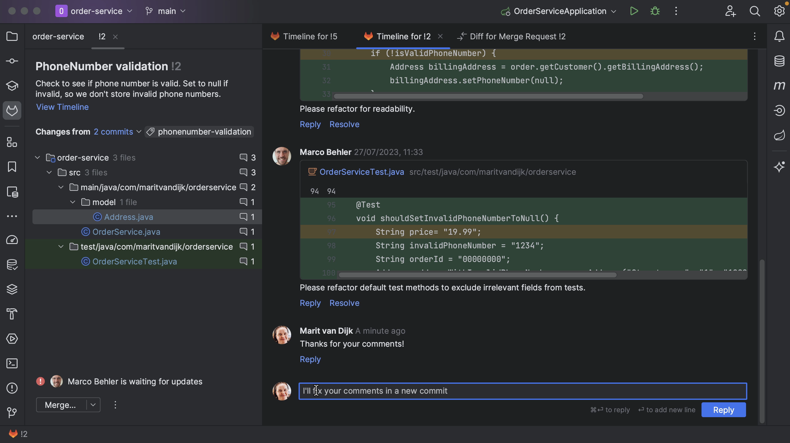
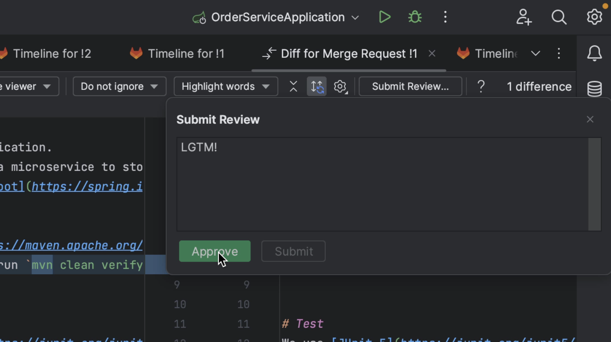

Let’s look at comments on our Merge Request.

We can add comments to the GitLab conversation. Comments on this page are comments that apply to the Merge Request as a whole, and not a specific piece of code. We can see these comments inside IntelliJ IDEA too. We might need to refresh our Merge Request window, either using the shortcut to **Refresh Reviews** (**⌘R** on macOS | **Ctrl+F5** on Windows/Linux) or by right-clicking the Merge Request window and selecting **Refresh Merge Request**.

We can also add comments from inside IntelliJ IDEA. We can place high-level comments, like the comment we just placed from GitLab.

We might also want to add comments on particular parts of the code. We can do so from inside IntelliJ IDEA by clicking on the plus in the gutter of the diff viewer. For example, let's add a comment to the current Merge Request.

We can edit or delete comments. We can also reply to comments or resolve a comment that is no longer relevant, for example, if the code has been updated in line with the comment.

From the diff viewer, we can submit our review and approve the Merge Request if we think it’s ready to be merged.

