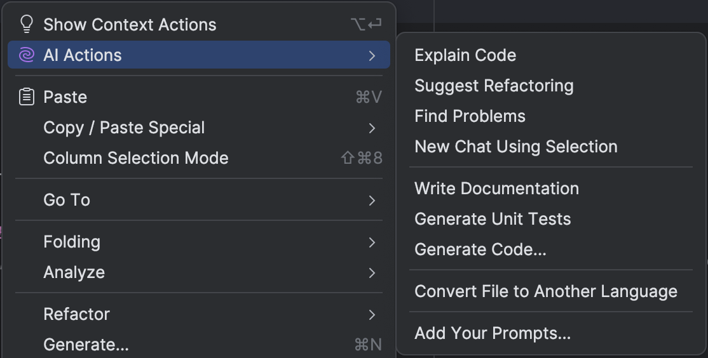
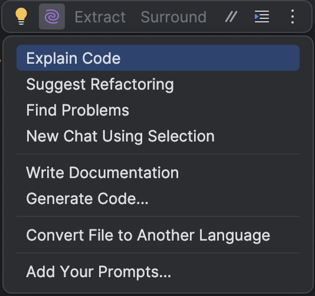

With JetBrains AI Assistant, you can use _AI Actions_ inside your IDE. Right-click in the editor pane to open the context menu and see the predefined options, or create your own prompt.

Alternatively, you can open _AI Actions_ by clicking the AI Assistant icon in the floating toolbar.


