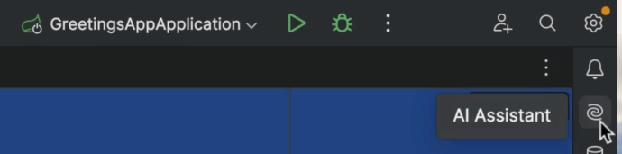

Need help? Ask JetBrains AI Assistant for help with your code right inside your IDE. Open the AI Assistant chat window by clicking the AI Assistant icon on the right, ask your question and get a response.


