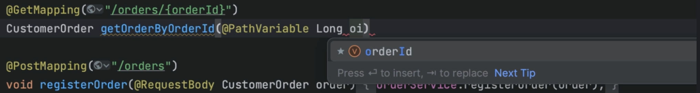

Did you know that IntelliJ IDEA code completion supports camel case? This means we don't have to type the whole method name, or even the exact start of a method name, to get relevant code suggestions. In this example, when we type 'oi', IntelliJ IDEA suggests the variable name 'orderId'.

