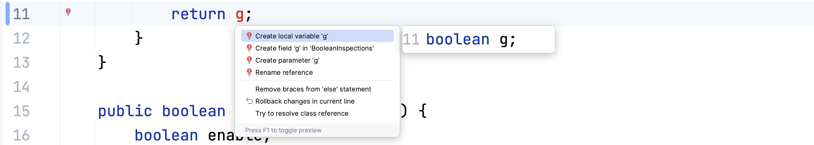

Also known as Fix anything, <kbd>⌥⏎</kbd> (macOS) / <kbd>Alt+Enter</kbd> (Windows/Linux) is a great shortcut to know by heart. Invoke **Context Actions** <kbd>⌥⏎</kbd> (macOS) / <kbd>Alt+Enter</kbd> (Windows/Linux) on any piece of code to see suggestions to improve or change your code.

IntelliJ IDEA offers intelligent suggestions most places in the code. It can offer fixes for compiler errors and inspection warnings. It can even use intentions to suggest other ways in which you could write code even if there's no warning or error.

IntelliJ IDEA lets you know that it has suggestions for you with a light-bulb on the left-hand side of the code. This light-bulb is red for errors, and yellow for other suggestions.

If there's an error in the code, pressing <kbd>⌥⏎</kbd> (macOS) / <kbd>Alt+Enter</kbd> (Windows/Linux), can suggest options that will make the code compile.

If there's a warning, IntelliJ IDEA will show you what the warning is, and may offer one or more suggestions on how to fix that warning. These warnings are often from [inspections](/tags/inspections/) running on the code.

Even if the code is working perfectly well, pressing <kbd>⌘⌥⏎</kbd> (macOS) / <kbd>Ctrl+Alt+Enter</kbd> (Windows/Linux), will often show suggestions on other ways to express this code. These suggestions can help us to reshape the code, for example to make it more readable, or as part of a larger refactoring towards some other pattern. These suggestions can often be configured via [intentions](https://www.jetbrains.com/help/idea/intention-actions.html).

Use <kbd>F2</kbd> (macOS) / <kbd>F2</kbd> (Windows/Linux) to navigate to the next suggestion, or <kbd>⇧F2</kbd> (macOS) / <kbd>Shift+F2</kbd> (Windows/Linux) to navigate to the previous suggestion in the file.
