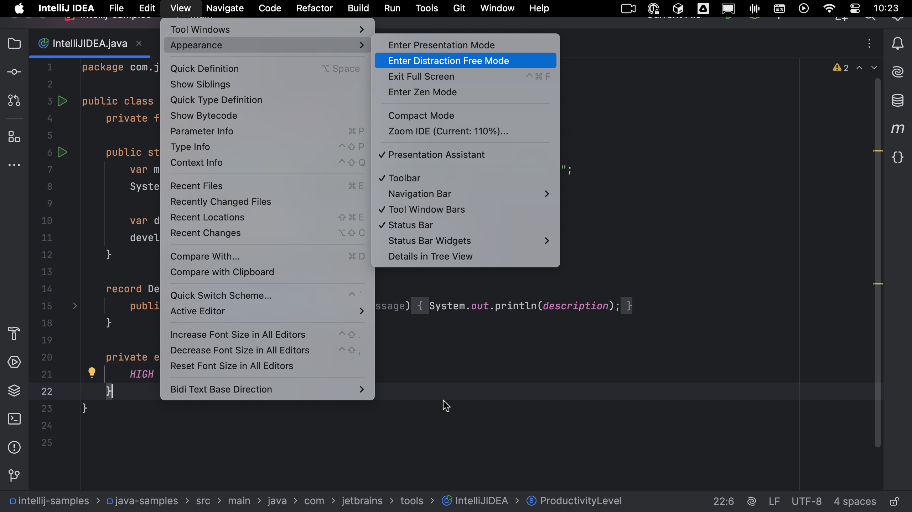
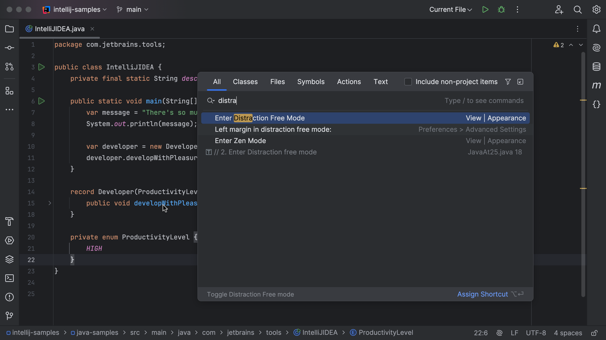

Use <kbd>⌃\`</kbd> (macOS) / <kbd>Ctrl+\`</kbd> (Windows/Linux), to bring up the **Quick Switch Scheme** dialog.

You can now press **4** or use the arrow keys to scroll to **4** and select **View Mode** to see list of view modes available. Now press **2** or click on **Enter Distraction Free Mode** to display just your editor window and focus on coding.

## Alternative Ways of Entering Distraction Free Mode

### Using View Toolbar Options

You can use the menu **View | Appearance | Enter Distraction Free Mode**.

### Using Search Everywhere

Use <kbd>⇧⇧</kbd> (macOS) / <kbd>Shift+Shift</kbd> (Windows/Linux), to bring up the Search Everywhere dialog. You can now search for _Distraction_ and select **Enter Distraction Free Mode**.

## Exiting Distraction Free Mode

You can follow anyone of the above-mentioned ways to exit Distraction Free Mode.

### Using the Quick Switch Scheme

You can use the same shortcuts as above, <kbd>⌃\`</kbd> (macOS) / <kbd>Ctrl+\`</kbd> (Windows/Linux), to bring up the **Quick Switch Scheme** dialog, then select **4** followed by **2** to exit distraction free mode.

### Using View Toolbar Options

Alternately, you can also use the menu **View | Appearance | Exit Distraction Free Mode**.

### Using Search Everywhere

Use <kbd>⇧⇧</kbd> (macOS) / <kbd>Shift+Shift</kbd> (Windows/Linux), to bring up the Search Everywhere dialog. You can now search for _Distraction_ and select **Exit Distraction Free Mode**.

Alternatively, you can use <kbd>⌘⇧A</kbd> (macOS) / <kbd>Ctrl+Shift+A</kbd>, to bring up the Find Actions dialog which will filter the Search Everywhere dialog to just Actions.
