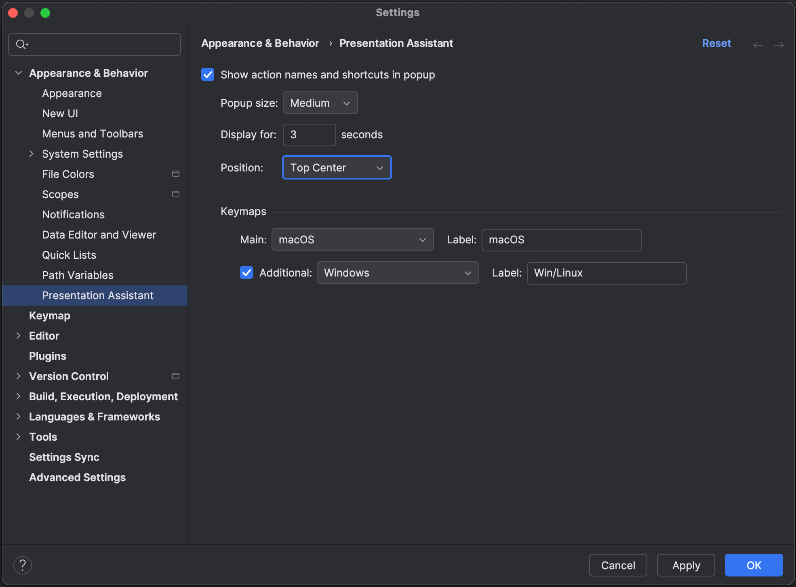

Presentation Assistant allows you to show action names and shortcuts for actions you are using during a presentation, demo or recording.
You can configure which keymap(s) to show and for how long the pop-up should show.

To enable Presentation Assistant, Open **Settings | Appearance & Behavior | Presentation Assistant** and check the option **Show action names and shortcuts in popup**.
You can configure how big the popup should be, how long it should be displayed and where in the screen it should be. Finally, you can select which keymap to use. Check the option **Additional** to select an additional keymap to show when displaying the shortcut for an action.


