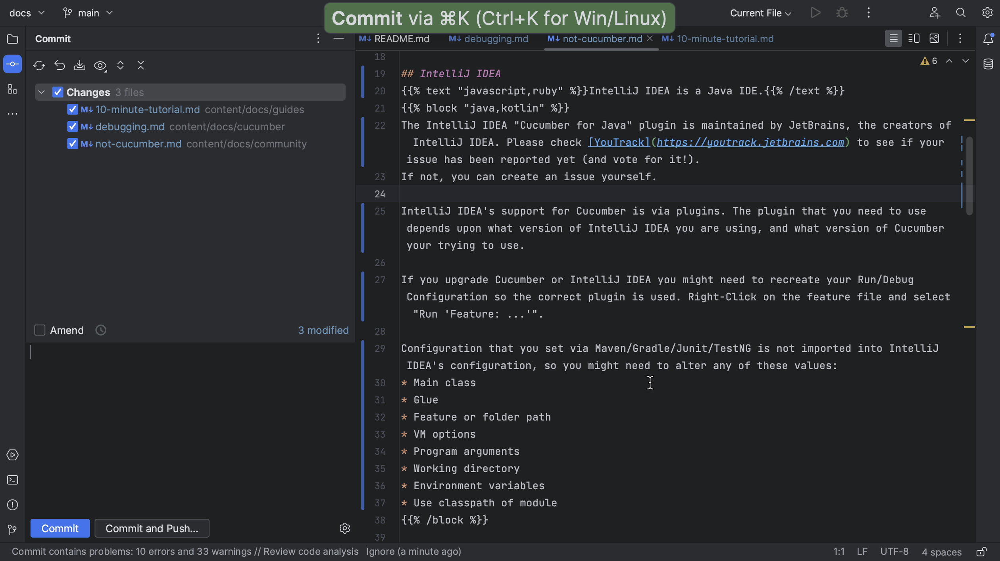
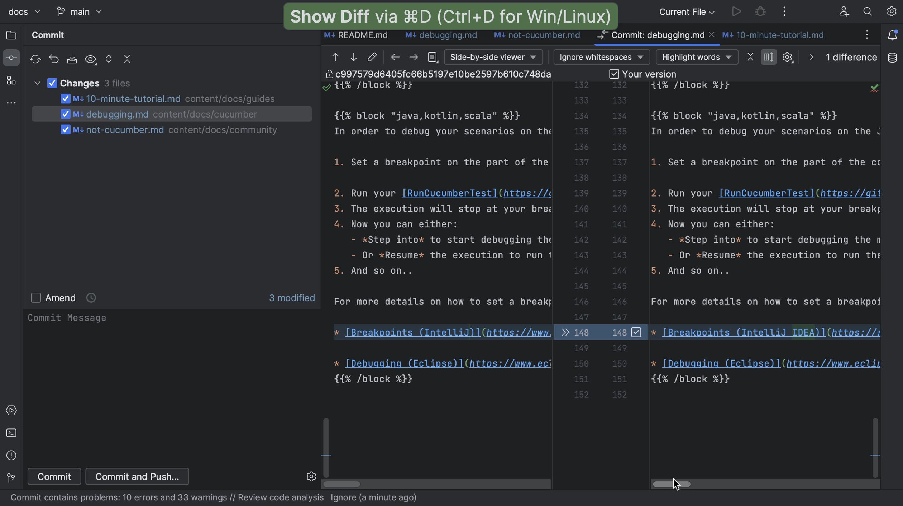

Before making any changes, we'll want to make sure that we can build the project. Hopefully, how to build the project will be described in the **README**, as it is for this example. Let’s open the terminal and build the project as described. In this example, we need Docker, which is already installed and running.

Now that we know we can build the project, we can start making changes. First, we need to look for the right place to make the change. We might navigate the project in the _Project_ tool window <kbd>⌘1</kbd> (macOS) / <kbd>Alt+1</kbd> (Windows/Linux), or look for a specific file or code snippet using Find in Files <kbd>⌘⇧F</kbd> (macOS) / <kbd>Ctrl+Shift+F</kbd> (Windows/Linux).

We might want to create a specific branch for our changes.

Once we are done making our changes and the project still builds, we can **commit our changes** <kbd>⌘K</kbd> (macOS) / <kbd>Ctrl+K</kbd> (Windows/Linux). We can check our changes in the _Commit_ tool window <kbd>⌘1</kbd> (macOS) / <kbd>Alt+1</kbd> (Windows/Linux) to see if these are the right files and use Show Diff <kbd>⌘D</kbd> (macOS) / <kbd>Ctrl+D</kbd> (Windows/Linux) to see if the changes are correct.

If we don’t have access to the original project, we need to push our code to our fork.

