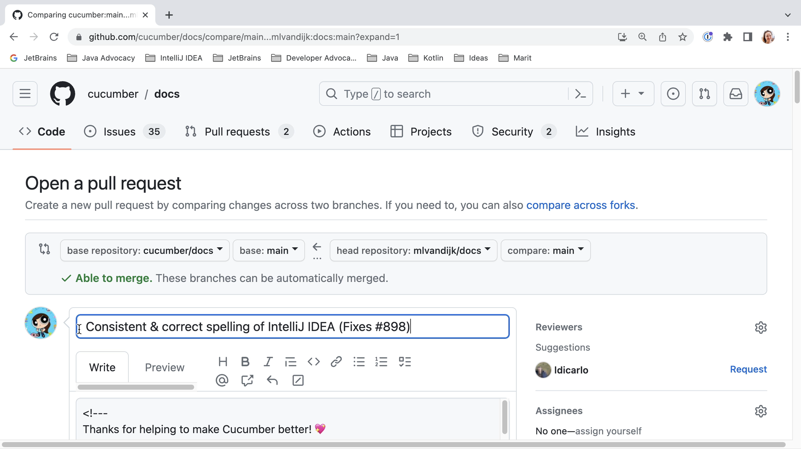

Once we are happy with our changes, we can create a pull request.

We go back to our GitHub profile and create a pull request from there. After we have pushed our changes, we can see that our fork is _1 commit ahead_. We can start creating our pull request by clicking **Contribute**.

We need to provide a title and description for our pull request. Make sure the title is a good description of the changes you want to contribute. If your PR fixes an issue, you can add “fixed #x” (where x is the issue number) to the title; this will automatically close the linked issue when the PR is merged. Once you are happy with the title and description, click **Create pull request** to open your pull request.

