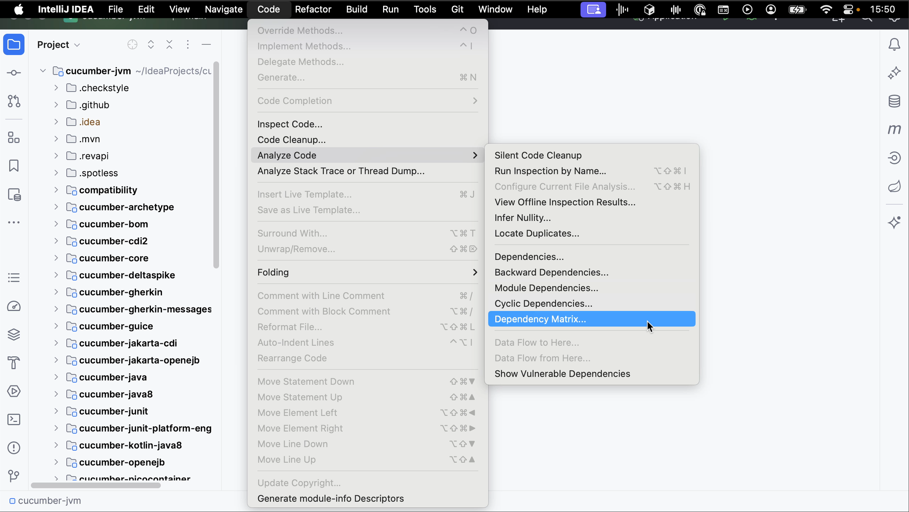
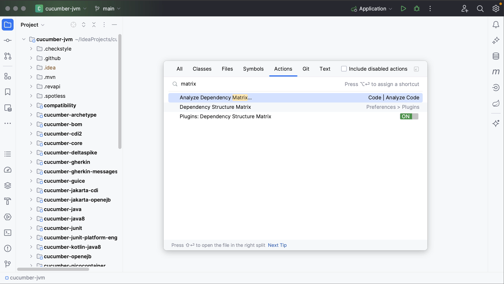
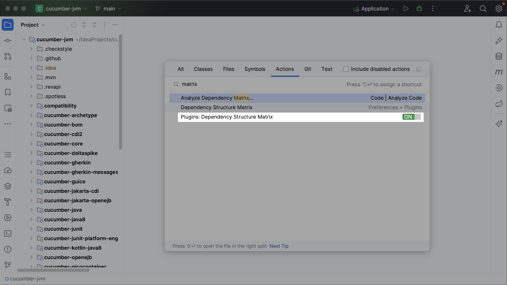
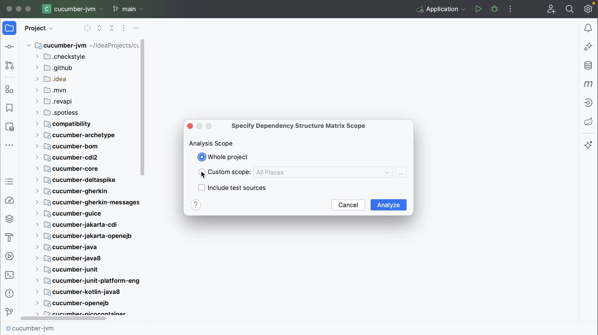
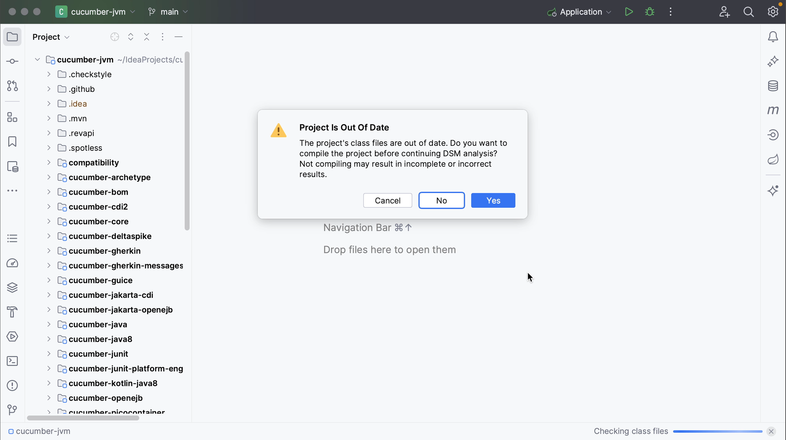

You can open the Dependency Matrix from the main menu by going to **Code | Analyze Code | Dependency Matrix**.

Alternatively, use **Find Action** <kbd>⌘⇧A</kbd> (macOS) / <kbd>Ctrl+Shift+A</kbd> (Windows/Linux) and search for “matrix”.

To use this feature, the **Dependency Matrix plugin** needs to be enabled.

When opening the Dependency Matrix, specify the scope you want to analyze. You can select the **Whole project** or specify a **Custom scope**, and whether to include test sources or not.

After defining the scope, click **Analyze**.

If the project’s class files are out of date, the analysis may result in incomplete or incorrect data. To avoid this, IntelliJ IDEA will prompt you to compile the project before continuing the DSM analysis. Click **Yes** to build the project and make sure everything is up-to-date.

The **DSM tool window** will open in a popup, showing a matrix of your project’s components.
