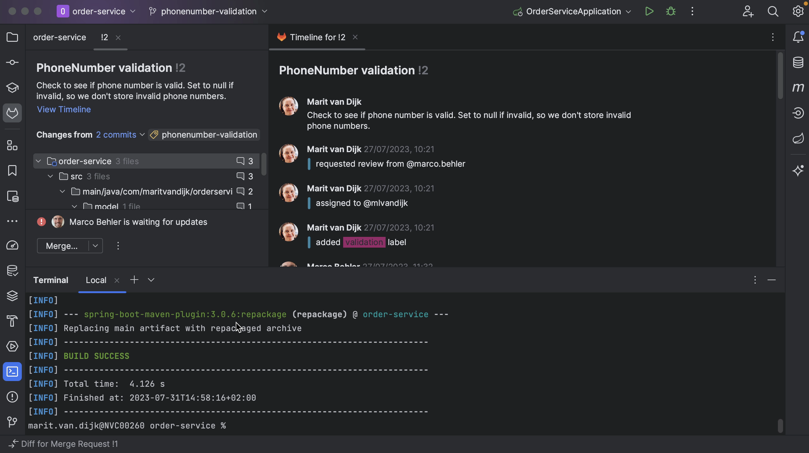
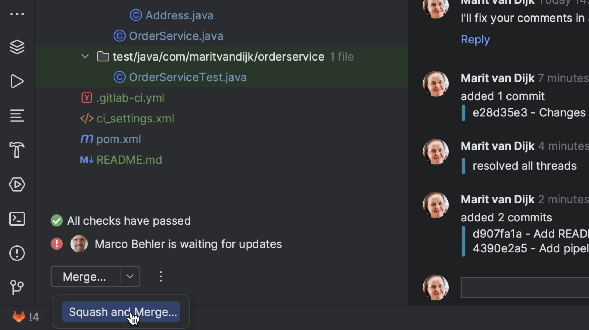
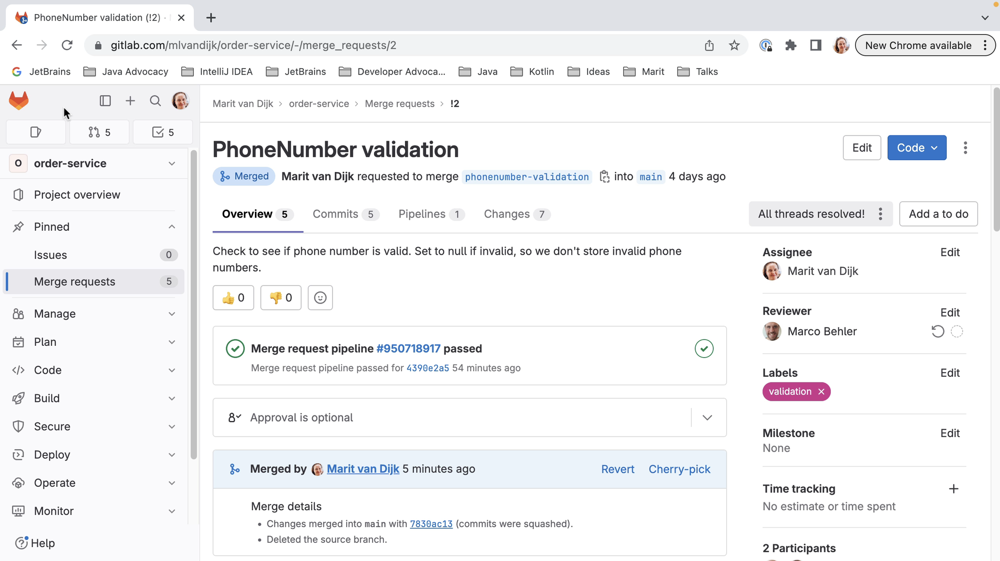

One feature that's really helpful when we're reviewing a Merge Request is that we can check out the code that is in the Merge Request. In this project, I'm currently on the `main` branch. Let's check out the branch for this Merge Request.

With the branch checked out locally, we can navigate the code related to this Merge Request. This lets us not only look at the code, but also make sure that the project still builds and tests pass. We can potentially make changes too.

Finally, let's look at how to finish off the Merge Request.

If a Merge Request is no longer relevant, and we’re not going to take the changes that went into the Merge Request, we can close it. We can do so by clicking the three dots at the bottom left of the Merge Request tool window and selecting **Close Merge Request**.

If the Merge Request is ready, meaning all the checks have passed, questions have been answered and requested changes to the code have been made, we can merge it. We can do so by clicking **Merge** at the bottom left of the Merge Request window. We also have the option to **Squash and Merge**, meaning all commits will be combined into a single commit when merging. We can add our own commit message for the merge, or edit the default one if we want to.

The Merge Request will be merged, and if we do a _Fetch_ we can see the updated branches for this repository.

We can see in our browser that the Merge Request has been closed.

