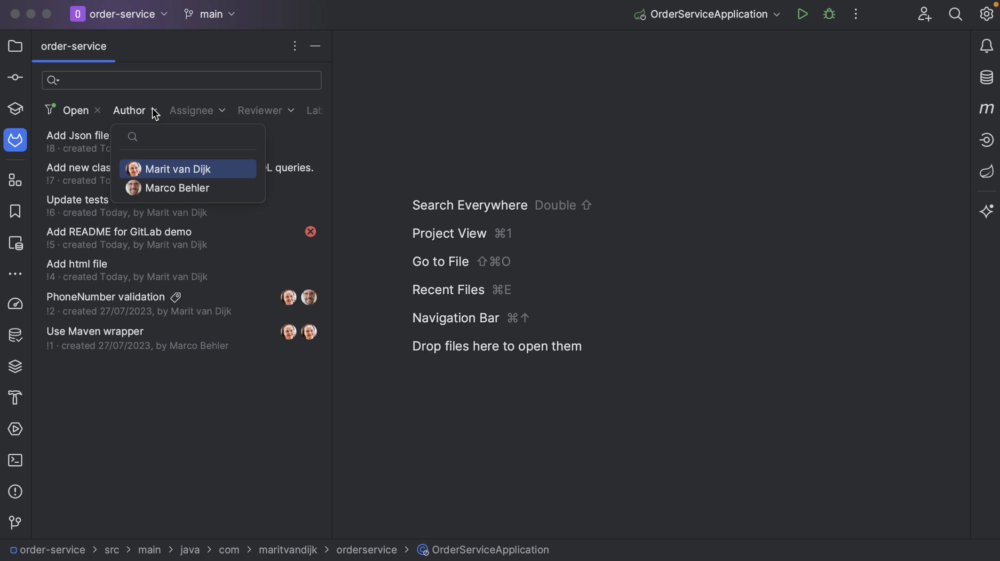
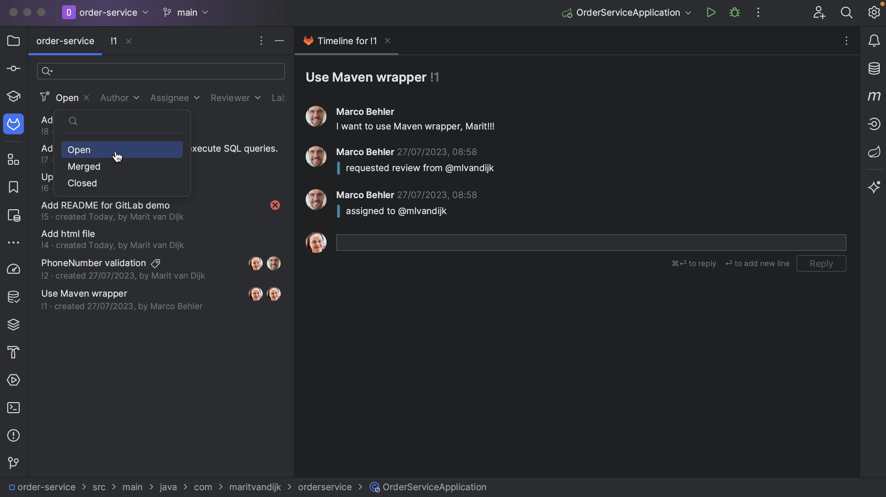

Once we’re logged in, the GitLab Merge Requests tool window will show all open Merge Requests for the GitLab repository.

We can change the search criteria to look for specific Merge Requests. We can use predefined filters, or search for something more specific.

If the Merge Request has assignees and/or reviewers assigned, we can see them here.

We can see the details of a specific Merge Request by double-clicking on it.

We can go back to the list of search results by clicking the project name in the top left of the Merge Requests tool window. We can see that the Merge Request we just looked at still has a tab open here, in case we want to go back.

Usually, you’ll want to look for open Merge Requests, since these are the ones that need attention. Let's double-click, or press **Enter**, on one of these Merge Requests.

