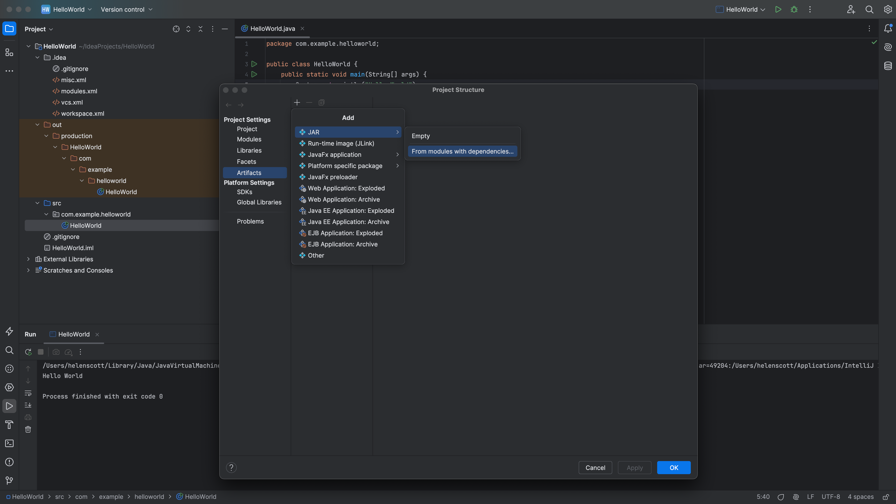
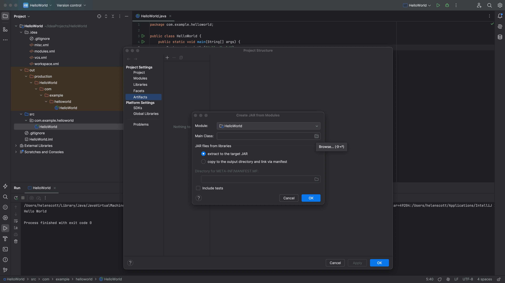
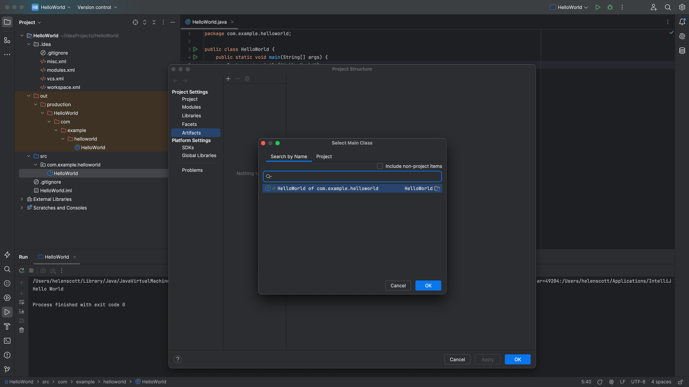
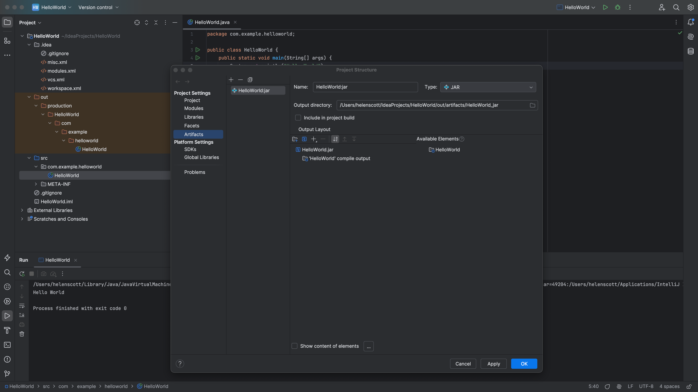
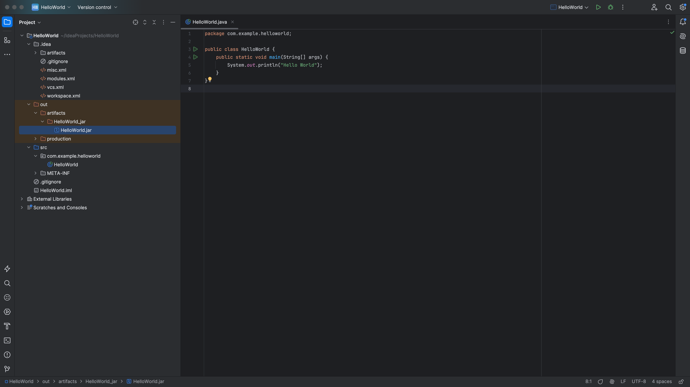

When the code is ready, we can [package our application in a JAR](https://www.jetbrains.com/help/idea/compiling-applications.html#package_into_jar). JAR files are often used to deploy an application to the production server. Once a JAR file has been built, it is called an artifact. Let's take look at how to create artifacts in IntelliJ IDEA.

### Creating an Artifact

1. Press <kbd>⌘;</kbd> (macOS) / <kbd>Ctrl+Alt+Shift+S</kbd> (Windows/Linux) to bring up the [Project Structure](https://www.jetbrains.com/help/idea/project-structure-dialog.html) dialog.

2. Select **Artifacts** from the left-hand menu and then press <kbd>+</kbd> (macOS) / <kbd>Plus</kbd> (Windows/Linux). Select **JAR** and then **From modules with dependencies**.

Click the browse button for the **Main Class** to navigate to your `main` method.

IntelliJ IDEA will show you a list of classes in your project, you only have one so press **OK** or double click to select it.

3. All the other defaults are fine for this tutorial, press **OK**. Now you can see your new JAR file defined in the Project Structure dialog.

4. If it matches the above screenshot, press **OK**. You have now defined how to build the JAR file, but you haven't actually built it yet. You need to build it with your build artifacts.

5. Go to **Build | Build Artifacts**. You will only have one to choose from which is the one that we just defined.

6. You can now build your artifact by going to **Build** > **Build Artifacts...** and choose your new JAR artifact from the list. The JAR file is located in your `out` folder called `HelloWorld.jar`.

To make sure that this JAR file was created correctly you will want to run it. We'll do this in the next step of this tutorial by using a [run configuration](https://www.jetbrains.com/help/idea/run-debug-configuration.html).

---
