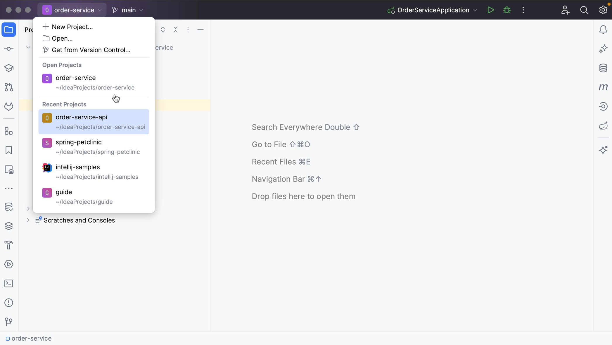
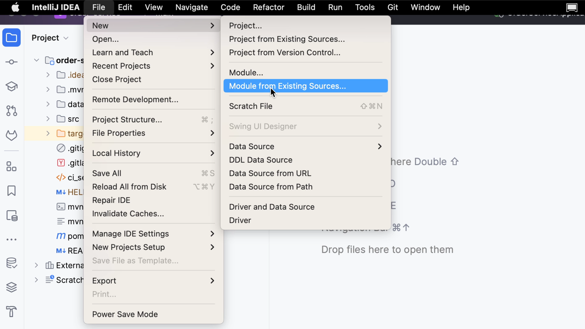
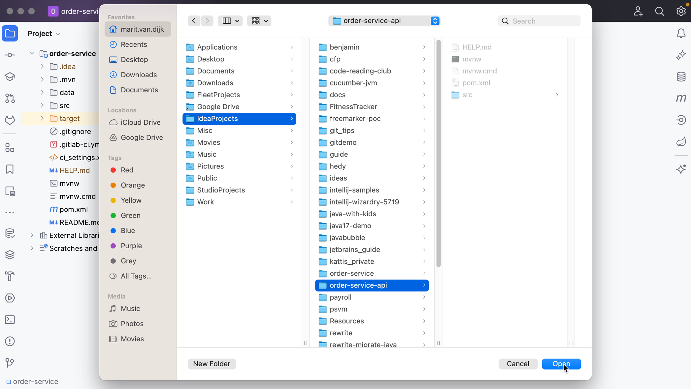
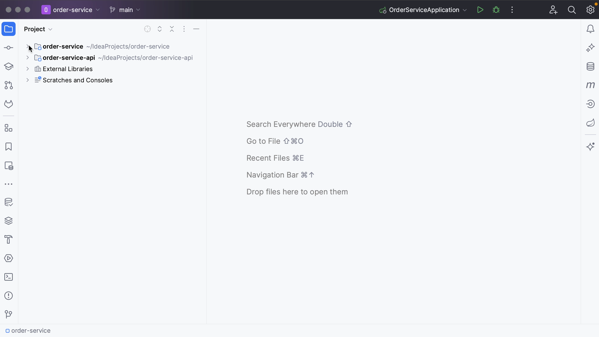

While IntelliJ IDEA does not allow you to open multiple _projects_ in the same window, it does allow you to have multiple _modules_ in one project. This can come in handy when your application consists of a client side and a server side.

Let’s take a look at this example. Here, you have the server side project open and want to add the client side to the same project. You can import the client side into this server side project as a module.

You can do so from the menu by going to **File | New | Module from Existing Sources** or, alternatively, use **Find Action** (**⌘⇧A** on macOS, or **Ctrl+Shift+A** on Windows/Linux).

Select the directory where the project is located, select the project you want to open and click **Open**.

In the dialog that opens, select **Create module from existing sources** if you want to create a new module from the existing source code, or select **Import module from external model**, and select the external model that the project uses. In this example, the projects are Maven projects; select Maven from the list. Click **Create**.

As you can see, you now have both repositories in the same project.

To remove the module from the project, right-click the module and select **Remove module**, or click **Delete**.

