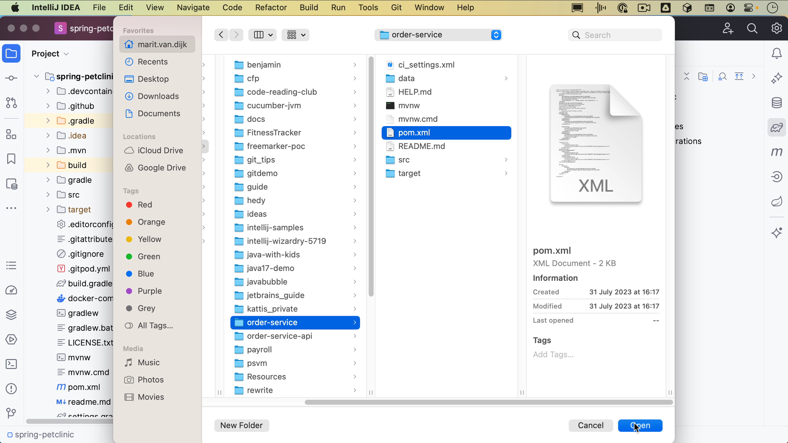
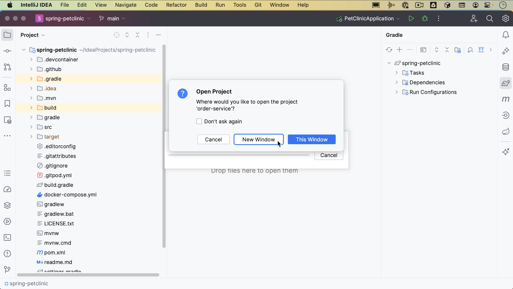

Let’s take a look at opening existing projects.
From the Welcome Screen, you can click **Open** to open an existing project. Alternatively, you can open a project from the menu by going to **File | Open**.

In the dialog that opens, select the directory where your projects are located. For example, the default IdeaProjects folder. Select the project you want to open and click **Open**.

When you open an existing project, the project will be opened with that project’s existing configuration. All preferences are stored in a configuration folder.

If you already have a project open, you can open a project either from the menu **File | Open** or you can use **Find Action** <kbd>⌘⇧A</kbd> (macOS) / <kbd>Ctrl+Shift+A</kbd> (Windows/Linux) to find any action. This is a handy shortcut for when you can’t remember where to find a particular action in the menu, or what the shortcut for that action is. If you search for “open”, you'll see the option **Open File**. Let’s click that.

If the project you want to open is a Maven project, you also open that project by selecting the pom.xml.

In the dialog that opens, select **Open as Project**. IntelliJ IDEA will ask whether you want to open this project in the same window or a new window. Let’s select **New Window**.

