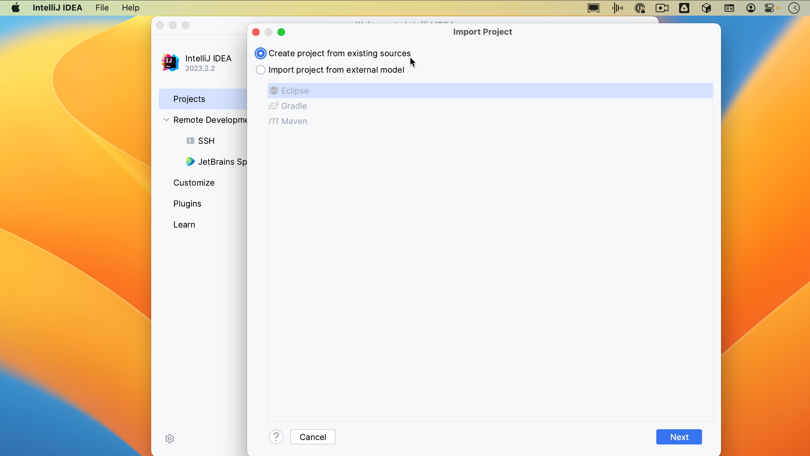
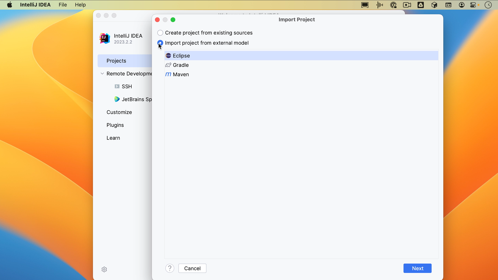
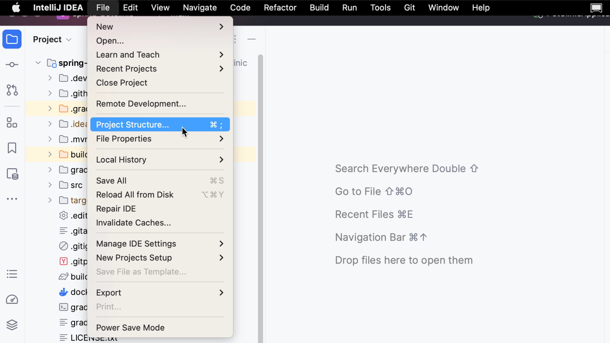

From the Welcome Screen, you can create a project from existing sources by going to **File | New | Project from Existing Sources**, or you can use Find Action <kbd>⌘⇧F</kbd> (macOS) / <kbd>Ctrl+Shift+F</kbd> (Windows/Linux) to find “project from existing sources” and click the **Import project from existing sources** action in the popup.

IntelliJ IDEA will open the file system on your machine. Select the directory where you keep your projects, sources, etc. and select the project you want to import.

In the **Import project** popup, the option **Create project from existing sources** is selected by default. You can use this type of import to create an IntelliJ IDEA project from the existing source code that isn’t necessarily an exported project from somewhere else.

If you have a project that uses an external model, like Maven, Gradle or Eclipse, and you want to import it as a whole, you can select the option to **Import project from an external model**. When you select this option, IntelliJ IDEA will interpret the project files.

If the project that you are importing uses a build tool, like Maven or Gradle, we recommend that you select the build tool configuration. The example project here uses Gradle, so we’ll select that. Click **Create**.

If you have an Eclipse project that doesn’t use a build tool, you can select Eclipse to migrate your Eclipse project to IntelliJ IDEA. For Maven and Gradle projects, IntelliJ IDEA configures the settings automatically. We’ll be able to adjust them after the project is imported.

To see and change the settings for our project, you can go to our **Project Structure**. You can open the **Project Structure** from the menu by going to **File | Project Structure**, by using the shortcut <kbd>⌘;</kbd> (macOS) / <kbd>Ctrl+Alt+Shift+S</kbd> (Windows/Linux) or by using **Find Action** <kbd>⌘⇧A</kbd> (macOS) / <kbd>Ctrl+Shift+A</kbd> (Windows/Linux). Here you can see and change the **Project Settings**.

