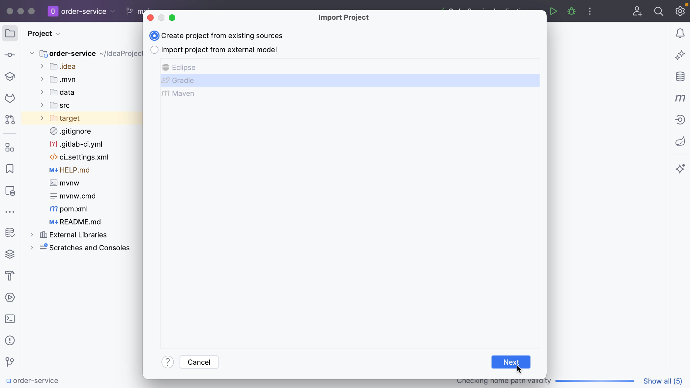
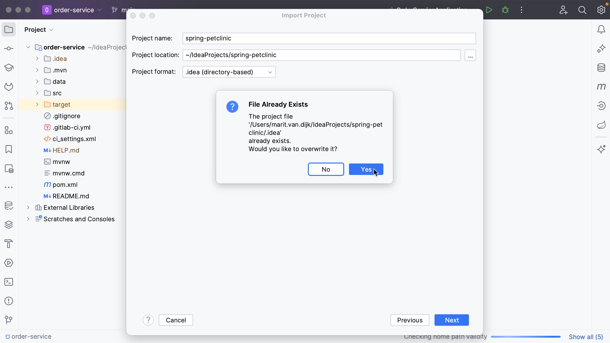
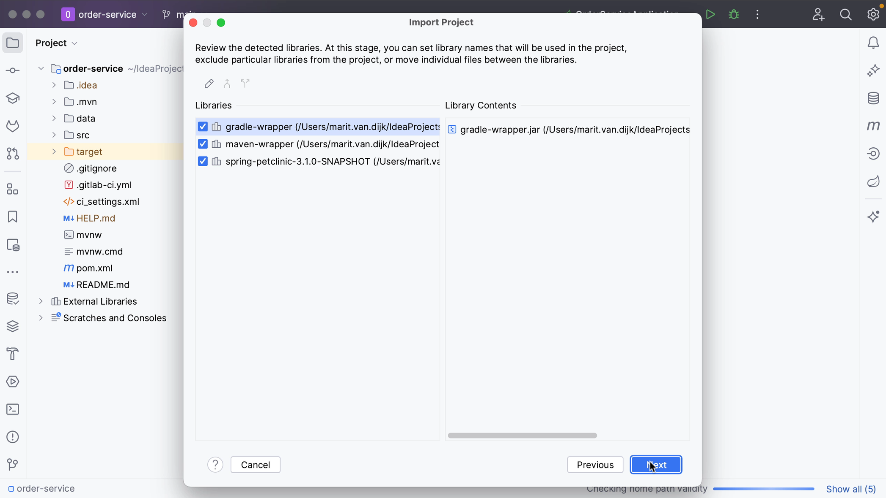
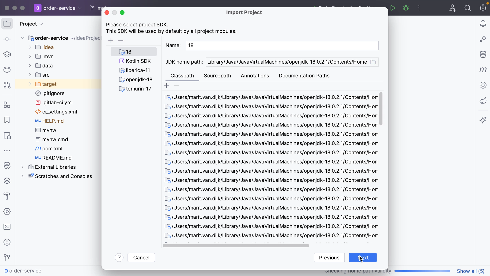

As mentioned, if you have a project that isn’t an exported project or doesn’t use an existing model like Maven, Gradle or Eclipse, you can create a new project from existing sources. For example, if you are importing a project that was created in a different IDE, like NetBeans.

To do so, go to **Import project from existing sources**, either from the menu **File | New | Project from Existing Sources** or by using Find Action <kbd>⌘⇧A</kbd> (macOS) / <kbd>Ctrl+Shift+A</kbd> (Windows/Linux). Select the directory where you keep your projects and select the project you want to import. This time, select**Create project from existing sources**and click **Next**.

In the **Import Project** dialog, you can specify the name and location and select a format for the new project. It's recommended that you use the directory-based format, as is selected by default.

If you have already opened this project in IntelliJ IDEA before, IntelliJ IDEA will ask you whether you want to overwrite the existing project. If this is not what you want, you can click **No** and **Cancel** importing the project. If you click **Yes**, IntelliJ IDEA will overwrite the files in the .idea directory and the .iml files. Your source files will remain intact!

Once your configuration file has been overwritten, you can see that it recognizes all the same sources. Here you can select the directories that you want to use as source root directories, essentially the folders in our project that contain the source code. If you don’t want to add them all, you can **Unmark All** and select only the ones you want. Once you've selected the ones you want, click **Next**.

Next, you can review the detected libraries. Select the libraries that you want to add to the new project, or unselect the ones you don’t want, and click **Next**.

You can review the suggested module structure for the project. Here you can select the modules that you want to include in our project. Click **Next**.

You can specify the SDK that you want to use. You can select an SDK that is already defined in IntelliJ IDEA from the list on the left, or click the **Add** button to add a new SDK. Click **Next**.

Finally, you can enable support for the detected frameworks and technologies. In this example no frameworks have been found. Click **Create**.

