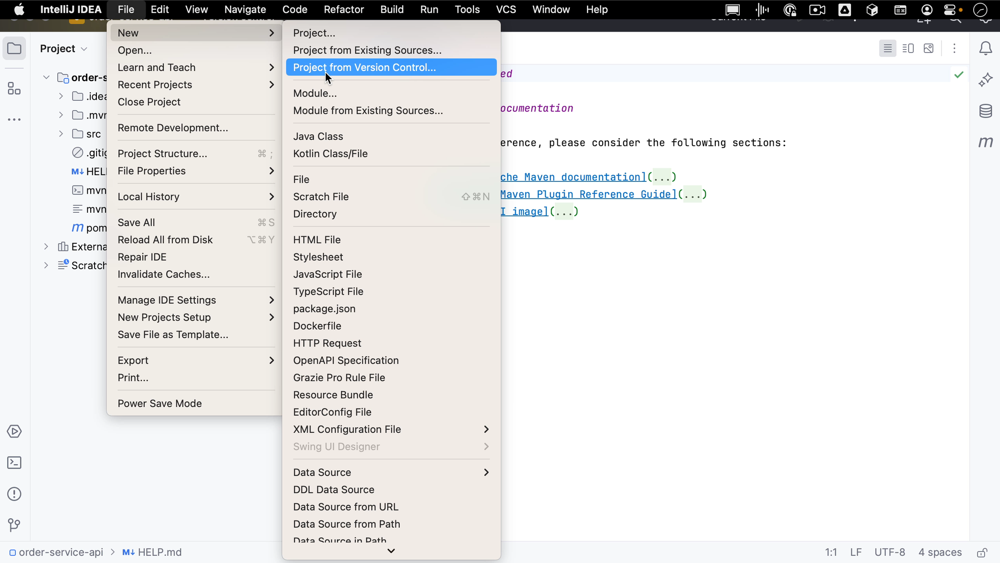
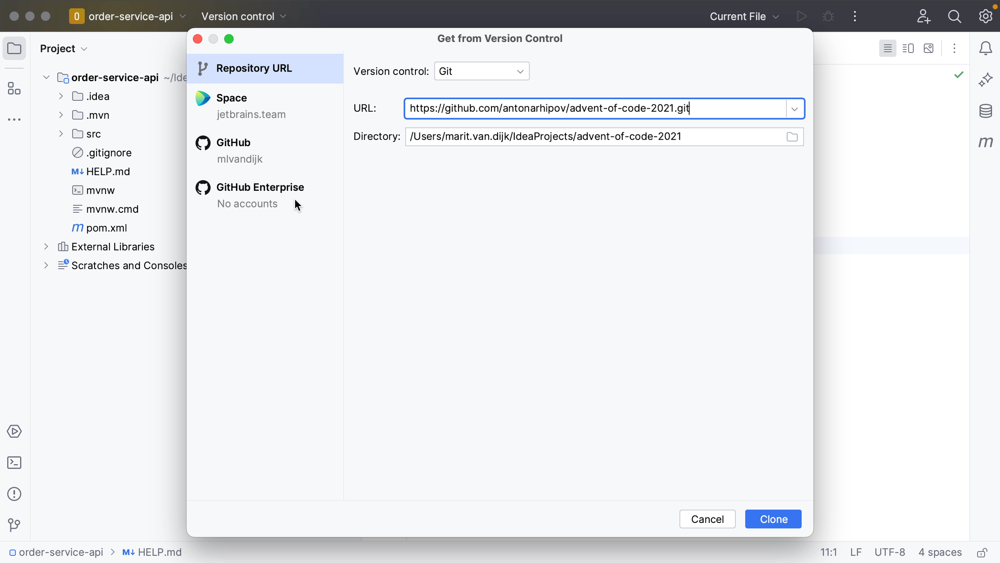
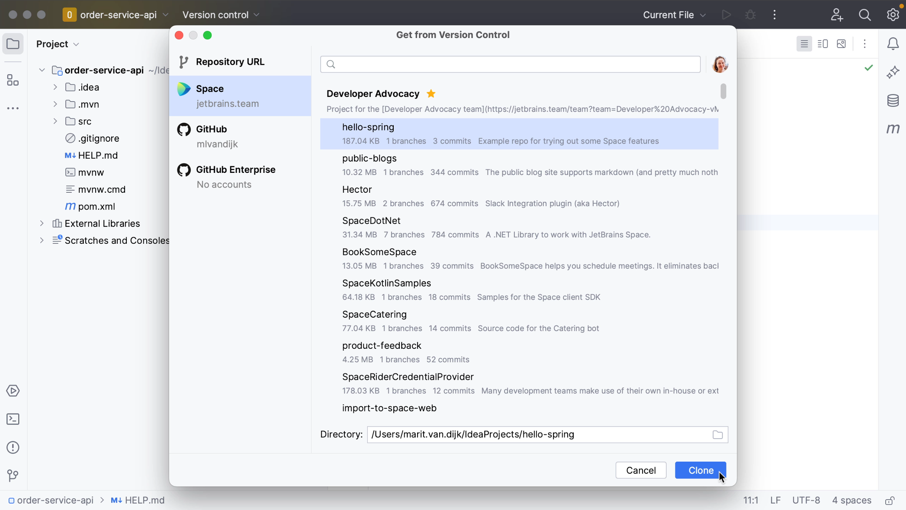
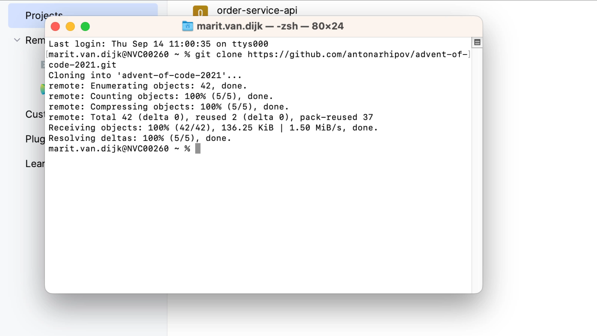
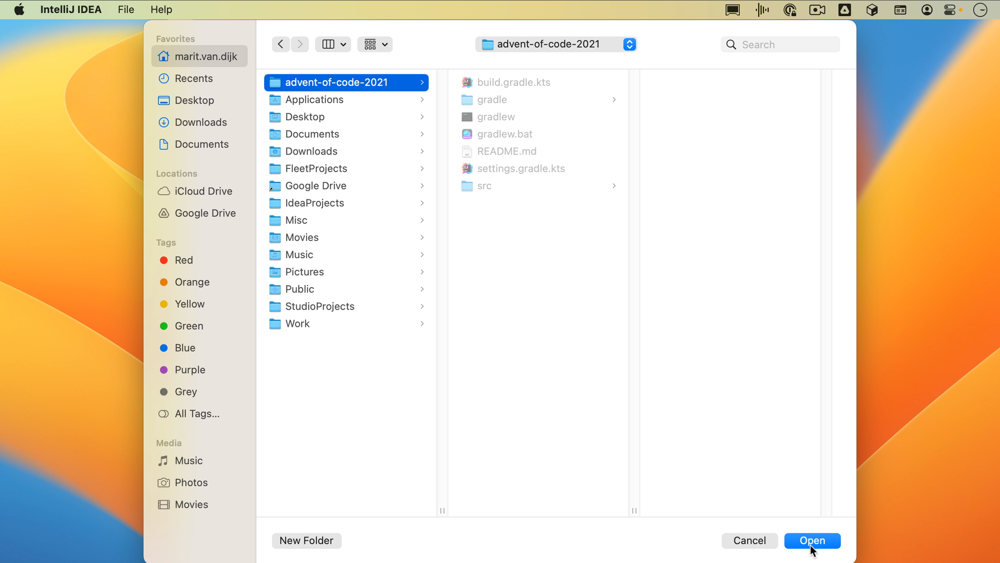

From the Welcome Screen, you can create a project from existing sources by going to **File | New | Project from Existing Sources**, or you can use **Find Action** <kbd>⌘⇧A</kbd> (macOS) / <kbd>Ctrl+Shift+A</kbd> (Windows/Linux) to find this action.

There are several ways to clone a project from version control.

If the version control integration is already enabled, go to **Git | Clone**.

If the version control integration is not enabled yet, go to **VCS | Get from Version Control**.

Alternatively, go to **File | New | Project from Version Control**, or use **Find Action** <kbd>⌘⇧A</kbd> (macOS) / <kbd>Ctrl+Shift+A</kbd> (Windows/Linux) to find this action. Both of these options will work regardless of whether version control is enabled yet.

In the **Get from Version Control** dialog, you can select which version control system to use. This example will use Git. You'll need to add the URL to the project in this field, which you can copy from our version control system. Select the directory to clone the project to and click **Clone**.

As you can see, IntelliJ IDEA currently has integration with Space, GitHub and GitHub Enterprise, which means that if you are using any of these and are logged in with your account, like for Space and GitHub in this example, you can clone projects directly from there. Let’s use the Space integration to clone a project.

As you may remember, if no project is currently open, you can click **Get from VCS** on the Welcome Screen.

Of course, you can also use the command line to clone the project. Once you’ve cloned the project to your machine, you can open the project as you’ve seen at the start of this tutorial, by going to **File | Open** and selecting the directory where you cloned the project.

